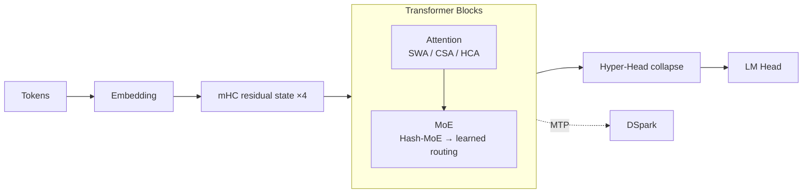

# 00. DeepSeek-V4 계보와 학습 지도

작성일: 2026-08-25

## 1. V4를 이해하는 가장 좋은 출발점

DeepSeek-V4는 하나의 단일 innovation으로 설명되지 않는다. 다음 연구선이 V4에서 합쳐진 결과다.

```text
DeepSeekMoE / auxiliary-loss-free routing ───────┐
DeepSeek-V3 MLA + MTP ──────────────────────────┤
DeepSeek-V3.2 DSA / sparse retrieval ───────────┤
Hyper-Connections → mHC ────────────────────────┤──→ DeepSeek-V4
Muon optimizer ─────────────────────────────────┤
FP4 QAT / fused MoE / TileLang systems ─────────┤
MTP → DSpark speculative decoding ──────────────┘
```

즉 V4를 `V3 + sparse attention`이라고만 보면 절반 이상을 놓친다.

---

## 2. V3에서 물려받은 것

### 2.1 DeepSeekMoE

V4는 sparse MoE를 버리지 않았다.

계속 유지되는 핵심:

- routed experts + shared expert
- token-wise sparse activation
- auxiliary-loss-free load balancing
- expert parallelism을 중심으로 한 training/serving system design

하지만 V4는 여기서 다음을 바꾼다.

- 초기 3개 MoE layer: learned top-k가 아니라 **Hash routing bootstrap**
- router affinity: Sigmoid → `sqrt(softplus(x))`
- routed expert SwiGLU pre-activation clamp
- expert weight FP4
- training optimizer에 Muon 적용

즉 MoE의 기본 철학은 유지하면서 extreme-scale 안정성과 시스템 효율을 다시 튜닝했다.

### 2.2 MTP

V4 technical report는 Multi-Token Prediction 설정을 V3와 동일하게 유지한다고 명시한다.

MTP는 training objective이면서 production serving에서는 speculative decoding의 기반으로 이어진다.

최신 0731/0813 checkpoint에서는 이 계보가 **DSpark**로 확장된다.

---

## 3. V3.2에서 이어지는 sparse-attention 계보

V3.2의 DeepSeek Sparse Attention(DSA)은 long-context에서 모든 과거 token을 실제 attention compute에 넣지 않는 방향을 검증했다.

V4에서는 이 아이디어를 그대로 쓰는 것이 아니라 **compression과 결합**한다.

```text
V3.2:
full/token-level history
    ↓
indexer
    ↓
top-k token attention

V4 CSA:
raw history
    ↓
4:1-ish compressed entries
    ↓
Lightning Indexer
    ↓
top-k compressed entries
```

즉 sparse selection의 granularity가 raw token이 아니라 compressed memory entry로 이동한다.

---

## 4. V4에서 새로 중심이 된 세 축

### 4.1 Sequence axis — SWA + CSA + HCA

V4는 1M context의 비용을 줄이기 위해 attention memory를 세 방식으로 나눈다.

- SWA: 최근 128 token을 exact/local하게 읽음
- CSA: moderate compression + sparse retrieval
- HCA: aggressive compression + broad/global memory

핵심은 어느 하나가 다른 것을 완전히 대체하지 않는다는 점이다.

### 4.2 Depth axis — mHC

기존 residual stream 하나를 `hc_mult=4` 개의 parallel residual copy로 확장한다.

각 sublayer 앞뒤에서 content-dependent mixing을 수행하되, residual mapping matrix는 Sinkhorn-Knopp 반복으로 doubly-stochastic manifold에 가깝게 projection한다.

목표는:

- residual expressivity 확대
- deep stack에서 signal amplification 억제
- stable signal propagation

이다.

### 4.3 Width axis — Sparse MoE

Flash:

- 256 routed experts
- top-6
- shared expert 1

Pro:

- 384 routed experts
- top-6
- shared expert 1

따라서 V4는 sequence/depth/width를 각각 다른 mechanism으로 scale한다.

---

## 5. V4를 한 장으로 보면



---

## 6. V4와 GLM-5.2의 long-context 철학 차이

둘 다 1M context를 싸게 다루지만 memory reduction 방식은 다르다.

### GLM-5.2

```text
MLA
→ DSA top-k
→ IndexShare
```

핵심은 `무엇을 읽을지 sparse selection`과 그 index 재사용이다.

### DeepSeek-V4

```text
raw KV
→ multiple compression scales
→ CSA sparse retrieval + HCA global coarse memory
→ local SWA always retained
```

핵심은 **memory 자체를 multi-resolution representation으로 바꾸는 것**이다.

이 차이는 KV cache layout과 kernel 구조를 완전히 다르게 만든다.

---

## 7. 학습할 때 반드시 구분할 것

1. **CSA/HCA는 MLA가 아니다.** V4의 attention backbone은 MQA + compression pool + local branch 구조다.
2. **DSA는 CSA의 일부다.** CSA에서 compressed entry를 고르는 indexer 역할을 한다.
3. **mHC는 attention이 아니다.** depth/residual routing mechanism이다.
4. **MTP와 DSpark는 동일하지 않다.** MTP는 base model training lineage, DSpark는 production speculative generation framework다.
5. **0731/0813의 큰 성능 향상은 backbone 변경과 동일시하면 안 된다.** 공식 설명상 최신 release는 기존 V4 구조 위 post-training 및 DSpark를 강화한 checkpoint다.

---

## 8. 핵심 출처

- DeepSeek-V4 Technical Report: https://arxiv.org/abs/2606.19348
- DeepSeek V4 official announcement: https://deepseek.com/en/news/v4-preview/
- Transformers DeepSeek-V4 architecture docs: https://huggingface.co/docs/transformers/en/model_doc/deepseek_v4
- vLLM DeepSeek-V4 long-context implementation note: https://vllm-project.github.io/2026/04/24/deepseek-v4.html
- DSpark: https://arxiv.org/abs/2607.05147
