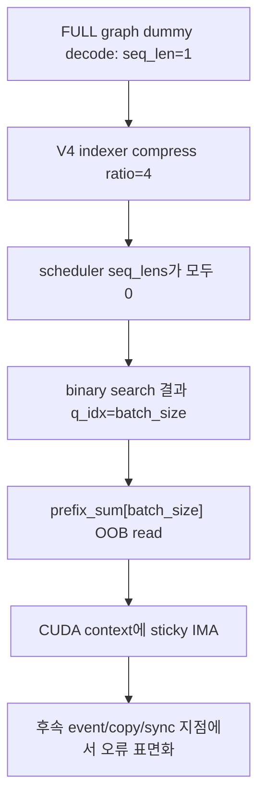

# DeepSeek-V4 + vLLM 0.27.x: DeepGEMM SM90 CUDA IMA 분석

작성일: 2026-08-18
관측 환경: NVIDIA H100 4 GPU, DP/EP, DeepSeek-V4-Flash-0731 + DSpark
증상: 같은 배포 옵션에서 vLLM `0.26.0`은 정상, `0.27.0`과 `0.27.1`은 CUDA illegal memory access(IMA)로 기동 실패

관련 구조는 [DeepSeek-V4 DSpark checkpoint와 vLLM 구현](2026-08-18-dspark-checkpoint-and-vllm-implementation.md)을 참고한다.

---

## 1. 결론

이 현상은 H100 수량이나 동일한 배포 옵션 자체보다 **vLLM 0.27 계열에 들어간 DeepGEMM SM90 paged-MQA metadata scheduler의 regression**으로 설명된다.

DeepSeek-V4 full CUDA graph capture가 만드는 dummy decode input은 indexer compression 뒤 모든 sequence length가 0이 된다. vLLM 0.27.x가 pin한 DeepGEMM의 SM90 scheduler는 이 all-zero 입력을 처리하지 못해 shared-memory 범위를 벗어난다.



따라서 현재 판단은 다음과 같다.

- H100×4 운영 baseline: 실제 정상 동작을 확인한 vLLM `0.26.0`
- 사용 보류: 공식 `0.27.0`, `0.27.1`
- `0.27.2rc0`도 동일한 문제 DeepGEMM pin을 유지하므로 이 장애의 해결판으로 간주하지 않음
- 후속 build: DeepGEMM pin 수정과 DeepSeek-V4 sparse MLA 후속 수정이 모두 포함됐는지 commit 기준으로 확인

---

## 2. 버전 사이에서 바뀐 핵심

| vLLM | DeepGEMM source/pin | 관련 scheduler 동작 | 결과 |
|---|---|---|---|
| `0.26.0` | upstream `deepseek-ai/DeepGEMM` `a6b593d...` | generic path에서 query index를 batch 범위로 clamp | 사용자 H100×4 정상 |
| `0.27.0` | `vllm-project/DeepGEMM` fork `e21c821...` | 새 SM90 paged-MQA scheduler의 all-zero guard 누락 | IMA |
| `0.27.1` | 동일 계열 pin | 같은 취약 경로 | IMA |
| `0.27.2rc0` | 조사 시점에 동일 문제 pin | DSpark의 다른 기능 추가와 무관하게 kernel 문제 잔존 | 해결판으로 사용 불가 |
| 수정된 main 계열 | upstream `8b1392b...`로 갱신 | `total == 0` guard와 index clamp 포함 | 해당 IMA의 kernel-side 수정 |

핵심 차이를 단순화하면 다음과 같다.

```cpp
// 이전 generic scheduler의 방어적 index 선택
q_idx = min(lo, batch_size - 1);

// 문제가 된 SM90 variant
q_idx = lo;
```

all-zero prefix sum에서는 binary search의 `lo`가 `batch_size`까지 진행할 수 있다. 이 값을 그대로 index로 사용하면 allocation의 끝을 한 칸 넘어간다.

---

## 3. 정확한 실패 조건

### 3.1 왜 dummy graph capture에서 모든 길이가 0인가

DeepSeek-V4의 full CUDA graph capture는 실제 요청 대신 shape를 고정하기 위한 dummy decode batch를 실행한다.

1. dummy request의 sequence length는 1이다.
2. V4 indexer의 compression ratio는 4인 layer가 있다.
3. scheduler metadata용 길이는 integer division을 거친다.

```math
\left\lfloor\frac{1}{4}\right\rfloor=0
```

따라서 batch 전체의 scheduler sequence length가 0이 되고 segment prefix sum도 전부 0이 된다. 실제 attention semantics를 위한 context가 사라진다는 뜻이 아니라, **work scheduling hint를 만드는 별도 metadata input**에서 생기는 corner case다.

### 3.2 왜 batch size가 32의 배수일 때 특히 실패하는가

SM90 kernel은 batch prefix sum을 shared memory에 32 단위로 정렬해 둔다. all-zero 입력에서 `q_idx == batch_size`가 되면 다음 형태의 읽기가 발생한다.

```cpp
num_segs_q = prefix_sum[q_idx] - prefix_sum[q_idx - 1];
```

batch size가 32, 64, 256처럼 32의 배수이면 allocation도 정확히 그 경계에서 끝난다. `prefix_sum[batch_size]`는 한 개의 `int`만큼 실제 shared-memory 범위를 벗어난다.

공개 최소 재현 결과도 이 패턴과 일치한다.

| batch / fill | 결과 |
|---|---|
| 32, 64, 256 / zero | 실패 |
| 8, 33, 250 / zero | 통과 |
| 256 / non-zero | 통과 |

CUDA graph capture size가 흔히 32/64/256이므로 production startup에서 재현성이 높다.

### 3.3 왜 stack trace가 다른 곳을 가리키는가

CUDA kernel launch는 비동기다. 잘못된 memory access가 발생한 호출 직후 CPU로 예외가 반환되지 않을 수 있다. CUDA context에 sticky error가 남았다가 다음 동기화 지점에서 나타난다.

그래서 stack trace가 다음과 같은 후속 지점을 가리킬 수 있다.

- `start_event.record()`
- DeepGEMM `handle.hpp`
- `copy_event.synchronize()`
- unrelated stream/event wrapper

이 지점들은 원인이라기보다 이전 kernel failure를 관측한 장소일 가능성이 높다. `CUDA_LAUNCH_BLOCKING=1`을 사용하면 실제 실패 호출인 `get_paged_mqa_logits_metadata` 가까이 stack을 이동시킬 수 있다.

---

## 4. 왜 `DeepGEMM` 옵션을 바꿔도 해결되지 않을 수 있는가

이 장애에서 DeepGEMM은 MoE expert GEMM만 의미하지 않는다. DeepSeek-V4의 sparse attention indexer도 DeepGEMM의 paged-MQA metadata helper를 사용한다.

따라서 다음 변경은 신뢰할 수 있는 근본 해결이 아니다.

- `--moe-backend`만 다른 backend로 변경
- `VLLM_USE_DEEP_GEMM=0`만 설정
- expert parallel을 해제한 뒤 원인이 사라졌다고 결론

이런 변경이 실행 path나 graph shape를 우연히 바꿔 증상을 숨길 수는 있지만, 문제의 kernel-side zero-length guard를 고치지는 않는다.

`--enforce-eager`도 같은 성격이다. CUDA graph capture를 우회해 기동 여부를 확인하는 **진단 수단**이지, graph mode production 설정의 수정이 아니다.

---

## 5. 공개 이슈와 관측의 대응

| 자료 | 환경/증상 | 이번 관측과의 관계 |
|---|---|---|
| [#51970](https://github.com/vllm-project/vllm/issues/51970) | GH200 SM90, full graph capture, all-zero indexer lengths, paged-MQA OOB | kernel root cause와 최소 재현을 제시 |
| [#52065](https://github.com/vllm-project/vllm/issues/52065) | H100, DeepSeek-V4-Flash-0731 + DSpark, 0.26 정상/0.27 실패 | hardware·version 증상이 직접 일치 |
| [#51822](https://github.com/vllm-project/vllm/issues/51822) | H200 TP4+EP, 0.27 실행 오류 | async IMA가 다른 stack에서 보일 수 있음을 보강 |
| [#50660](https://github.com/vllm-project/vllm/issues/50660) | 0.26, FlashMLA sparse prefill, long context/prefix cache | 별개의 prefill 문제이므로 이번 decode metadata IMA와 분리해야 함 |

비슷한 `illegal memory access` 문자열만으로 이슈를 합치면 안 된다. 이번 원인을 식별하는 fingerprint는 다음 조합이다.

- SM90/Hopper
- DeepSeek-V4 sparse indexer
- full decode CUDA graph capture 시점
- compressed dummy `seq_lens`가 all-zero
- 32의 배수 capture batch
- `get_paged_mqa_logits_metadata` 경로

---

## 6. 수정 상태

### 6.1 근본 kernel 수정

vLLM PR [#52035](https://github.com/vllm-project/vllm/pull/52035), commit [`025d56a11e8f`](https://github.com/vllm-project/vllm/commit/025d56a11e8f9bdf614af26e5386cdd8d322aaef)은 DeepGEMM pin을 upstream `8b1392b978f5a03c828dd1711090d7fb50958b8a`로 갱신했다.

수정된 scheduler는 전체 work가 0일 때 sentinel metadata를 반환하는 guard를 두고, query index도 유효 범위로 제한한다. input을 만든 framework와 관계없이 kernel 자체가 invalid index를 생성하지 않도록 하는 근본 수정이다.

### 6.2 Python-side clamp

vLLM PR [#51972](https://github.com/vllm-project/vllm/pull/51972)는 scheduler metadata에 전달하는 길이만 다음처럼 clamp한다.

```python
safe_seq_lens = torch.clamp(seq_lens, min=1)
```

실제 logits kernel은 true context length를 다시 사용하고, 이 값은 work-distribution hint에만 쓰이므로 semantics를 유지하는 방어책이다. GH200 DP4+EP에서 83개 full graph capture, OSL=1, 10분 idle 검증이 공개됐다.

두 방법 중 kernel fix가 더 근본적이다. Python clamp는 이미 배포된 wheel을 긴급 patch해야 할 때 유효한 우회책이지만, 로컬 patch 상태를 명확히 기록해야 한다.

### 6.3 DeepSeek-V4 후속 수정까지 포함해야 하는 이유

PR [#51538](https://github.com/vllm-project/vllm/pull/51538), merge commit [`97388c44f9c6`](https://github.com/vllm-project/vllm/commit/97388c44f9c608f83318e0c9540a536cd7de3e0d)은 plain decode, MTP, DSpark의 sparse MLA 경로를 함께 보강했다.

이 PR은 이번 SM90 all-zero OOB 하나만 고친 것이 아니라 다음과 같은 DeepSeek-V4 end-to-end 문제도 다룬다.

- draft CUDA graph workspace와 KV lifetime
- padded speculative slot의 negative indexer length
- sparse top-k kernel의 out-of-range length 방어
- batch drain 뒤 hang
- DSpark/SM120 backend 경로의 여러 shape와 dispatch 문제

따라서 새 build를 선택할 때 `#52035만 포함`보다 **`97388c44f9c6` 또는 그 이후 main을 기준으로 hardware별 회귀 test**하는 편이 안전하다. 단, main commit은 stable release가 아니므로 production 승격 전에 별도 qualification이 필요하다.

---

## 7. 권장 대응

### 즉시 운영

1. H100×4의 검증된 vLLM `0.26.0`을 유지한다.
2. official `0.27.0`/`0.27.1`로 재승격하지 않는다.
3. container tag만 기록하지 말고 vLLM과 DeepGEMM commit, CUDA/driver, attention/MoE backend를 함께 고정한다.

### 수정판 qualification

다음 후보 중 하나를 별도 환경에서 검증한다.

- `97388c44f9c6` 이후 vLLM main/nightly/source build
- #52035와 #51538이 모두 포함된 다음 stable release
- 불가피한 경우 0.27.1 + #51972 local patch

`0.27.2rc0`처럼 버전 숫자가 더 높다는 이유만으로 수정됐다고 가정하지 않는다. 실제 DeepGEMM pin과 merge commit 포함 여부를 확인한다.

---

## 8. 재현·진단 절차

### 8.1 먼저 고정할 정보

```text
vLLM version + git SHA
DeepGEMM package/source SHA
PyTorch / CUDA runtime / NVIDIA driver
GPU model과 compute capability
CUDA graph mode와 capture sizes
DP / TP / EP topology
attention backend / MoE backend
model revision과 config hash
DSpark method와 K
```

### 8.2 안전한 진단 순서

1. 실패한 production worker와 별도 process에서 재현한다. IMA 뒤 CUDA context는 오염되므로 같은 process에서 다음 case를 신뢰하지 않는다.
2. `CUDA_LAUNCH_BLOCKING=1`로 실제 failing call을 좁힌다.
3. `--enforce-eager`로 graph capture 관련성만 확인한다.
4. DSpark off/on을 비교하되, target-only 통과를 kernel 수정의 증거로 간주하지 않는다.
5. zero/non-zero length와 batch 32/64/256의 metadata-only 최소 재현을 실행한다.
6. 수정 build에서는 full graph capture가 모두 완료되는지 확인한다.

---

## 9. 승격 전 test matrix

| 축 | 최소 case |
|---|---|
| startup | cold start 3회 이상, 모든 DP rank graph capture 완료 |
| batch shape | 1, 8, 32, 64, 128, 256 seq |
| request lifecycle | OSL=1, 10분 idle, 재요청, drain/refill 반복 |
| context | 4K, 64K, 128K, 운영 최대 길이 |
| prefix cache | off/on, 긴 shared prefix |
| reasoning | low/high/max 또는 운영 사용 mode |
| speculative | target-only, DSpark K=5, K=7, adaptive 사용 시 별도 |
| concurrency | 1, 저부하, 목표 steady-state, overload 직전 |
| output | 짧은 output과 장문 reasoning |

수집할 지표:

- graph capture 성공 수와 worker별 error
- drafted/accepted token, 위치별 acceptance
- draft와 verify latency
- per-user/aggregate output tok/s
- p50/p99 ITL, queue latency
- GPU HBM, SM utilization, active sequences
- idle 후 첫 요청과 drain/refill 시 hang 여부

---

## 10. 운영 판단 요약

| 질문 | 답 |
|---|---|
| 같은 옵션인데 왜 0.26만 되는가? | 0.27의 DeepGEMM SM90 scheduler regression 때문 |
| DSpark Markov weight 문제인가? | 아니며, full graph용 sparse indexer metadata의 all-zero handling 문제 |
| MoE DeepGEMM backend를 끄면 해결인가? | 보장되지 않음. 문제 helper는 attention indexer에서도 사용됨 |
| eager mode면 해결인가? | graph capture를 우회하는 진단/임시 회피일 뿐 근본 수정 아님 |
| 현재 최소 운영 버전은? | 이 H100×4 구성에서는 실측된 `0.26.0` |
| 0.27 계열을 언제 올릴 수 있나? | #52035와 #51538 포함 build가 전체 matrix를 통과한 뒤 |

---

## 11. 근거 자료

- vLLM [issue #51970: all-zero indexer seq_lens OOB](https://github.com/vllm-project/vllm/issues/51970)
- vLLM [issue #52065: H100, 0.26 works / 0.27 fails](https://github.com/vllm-project/vllm/issues/52065)
- vLLM [issue #51822: H200 TP4+EP failure](https://github.com/vllm-project/vllm/issues/51822)
- vLLM [PR #51972: scheduler metadata clamp](https://github.com/vllm-project/vllm/pull/51972)
- vLLM [PR #52035: update DeepGEMM pin](https://github.com/vllm-project/vllm/pull/52035)
- vLLM [PR #51538: DSV4 sparse MLA end-to-end fixes](https://github.com/vllm-project/vllm/pull/51538)
- DeepGEMM [`8b1392b978f5`: zero-work scheduler guard](https://github.com/deepseek-ai/DeepGEMM/commit/8b1392b978f5a03c828dd1711090d7fb50958b8a)
