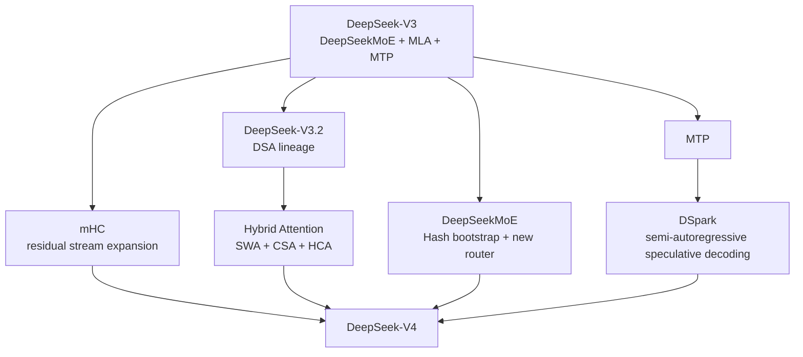

# DeepSeek-V4 — Architecture, Training & Serving Deep Dive

작성일: 2026-08-25 KST  
분류: `models/deepseek-v4`  
상태: Active study track

## 1. 목적

이 디렉터리는 DeepSeek-V4를 단순 checkpoint / 배포 기록이 아니라 **모델이 왜 현재 구조가 되었는지 architecture → training → decoding → inference engine까지 연결해서 이해하기 위한 deep-dive**다.

DeepSeek-V4는 V3/V3.2의 MLA를 조금 수정한 모델이 아니다. 크게 보면 다음 다섯 축이 동시에 바뀐다.

1. **Sequence / long context** — MLA 중심 구조에서 `SWA + CSA + HCA` hybrid attention으로 전환
2. **Residual / depth** — residual connection을 `mHC(Manifold-Constrained Hyper-Connections)`로 확장
3. **Width / MoE** — DeepSeekMoE를 유지하되 Hash-MoE bootstrap, `sqrt(softplus)` affinity, clipped SwiGLU, FP4 expert로 조정
4. **Optimization / training** — Muon 도입, 32T+ token pretraining, long-context/agentic data 강화
5. **Generation / serving** — MTP lineage를 유지하면서 최신 checkpoint에서는 **DSpark speculative decoding**을 결합



---

## 2. 현재 최신 공개 checkpoint 기준

2026-08-25 기준 공식 공개 계열은 다음을 기준으로 본다.

| 계열 | 최신 checkpoint | 구조적 의미 |
|---|---|---|
| Flash | `DeepSeek-V4-Flash-0731` | Flash Preview와 backbone 크기/구조는 동일, post-training 대폭 재수행, DSpark module 포함 |
| Pro | `DeepSeek-V4-Pro-0813` | Pro Preview 구조를 유지한 공식 release, agentic post-training 강화 + DSpark module 포함 |

중요한 구분:

> **0731 / 0813은 새로운 V4 backbone generation이라기보다, 동일 V4 architecture 위의 최신 post-trained production checkpoint다.**

따라서 architecture 공부는 Preview technical report와 open inference implementation을 기반으로 하고, 최신 checkpoint 차이는 별도 문서에서 post-training / DSpark / serving 관점으로 비교한다.

공식 근거:

- DeepSeek V4 release: https://deepseek.com/en/news/v4-preview/
- DeepSeek API updates: https://api-docs.deepseek.com/zh-cn/updates/
- Flash-0731: https://huggingface.co/deepseek-ai/DeepSeek-V4-Flash-0731
- Pro-0813: https://huggingface.co/deepseek-ai/DeepSeek-V4-Pro-0813
- V4 technical report: https://arxiv.org/abs/2606.19348
- DSpark paper: https://arxiv.org/abs/2607.05147

---

## 3. 권장 학습 순서

| 순서 | 문서 | 핵심 질문 |
|---:|---|---|
| 0 | [00-lineage-and-study-map.md](00-lineage-and-study-map.md) | V3/V3.2의 어떤 연구선이 V4에서 합쳐졌는가? |
| 1 | [01-family-and-latest-checkpoints.md](01-family-and-latest-checkpoints.md) | Flash / Pro / 0731 / 0813의 차이는 architecture인가 weights/post-training인가? |
| 2 | [02-hybrid-attention-csa-hca-dsa.md](02-hybrid-attention-csa-hca-dsa.md) | 1M context를 위해 왜 CSA와 HCA를 interleave하는가? |
| 3 | [03-mhc-residual-routing.md](03-mhc-residual-routing.md) | residual stream을 왜 4-copy로 확장하고 Sinkhorn manifold로 제약하는가? |
| 4 | [04-moe-hash-routing-and-optimization.md](04-moe-hash-routing-and-optimization.md) | DeepSeekMoE가 V4에서 어떻게 달라졌고 Hash-MoE/Muon/FP4는 왜 필요한가? |
| 5 | [05-mtp-dspark-and-speculative-decoding.md](05-mtp-dspark-and-speculative-decoding.md) | MTP와 DSpark는 어떤 관계이고 Markov module은 어디에 들어가는가? |
| 6 | [06-pretraining-posttraining-and-agentic.md](06-pretraining-posttraining-and-agentic.md) | 32T+ pretraining과 최신 agentic post-training은 architecture와 어떻게 결합되는가? |
| 7 | [07-source-code-architecture-reconstruction.md](07-source-code-architecture-reconstruction.md) | 실제 config/model.py/vLLM source에서 forward path는 어떻게 구현되는가? |
| 8 | [08-systems-and-serving.md](08-systems-and-serving.md) | CSA/HCA/mHC/MoE/DSpark가 KV cache, kernels, parallelism, CUDA graph에 어떤 영향을 주는가? |
| 9 | [09-flash-vs-pro-runtime-profile.md](09-flash-vs-pro-runtime-profile.md) | Flash와 Pro를 실제 GPU serving 관점에서 어떻게 다르게 봐야 하는가? |
| 99 | [99-papers-code-and-glossary.md](99-papers-code-and-glossary.md) | 원 논문/공식 코드/용어를 어디서 다시 확인하는가? |

---

## 4. 기존 운영 분석 문서

아래 문서는 architecture deep-dive와 별개로 실제 runtime 장애/호환성 기록으로 유지한다.

- [DSpark checkpoint와 vLLM 구현 차이](notes/2026-08-18-dspark-checkpoint-and-vllm-implementation.md)
- [vLLM 0.27.x DeepGEMM SM90 CUDA IMA 분석](notes/2026-08-18-vllm-0.27-deepgemm-sm90-cuda-ima.md)

배포 판단에서는 항상 아래 층을 분리한다.

```text
checkpoint metadata
        ↓
model architecture
        ↓
inference-engine implementation
        ↓
kernel / quantization backend
        ↓
GPU architecture / CUDA runtime
```

한 층의 문제를 다른 층의 문제로 해석하지 않는 것이 이 디렉터리의 기본 원칙이다.
