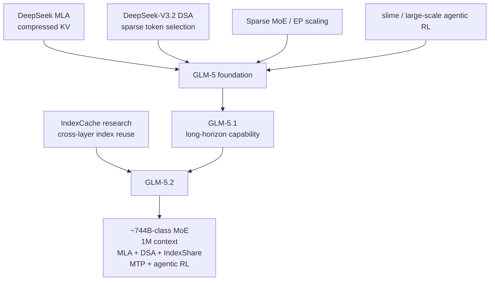

# 00. GLM-5.2 계보와 학습 지도

작성일: 2026-08-25  
상위 문서: [GLM-5.2 Architecture Study Guide](README.md)

## 1. GLM-5.2를 출시 순서만으로 보면 놓치는 것

GLM-5.2는 `GLM-5 → 5.1 → 5.2`라는 제품 버전 계보만으로는 충분히 설명되지 않는다. 적어도 네 연구선이 합쳐진다.



핵심은 다음 네 줄이다.

1. **MLA lineage** — KV cache를 low-rank latent로 줄인다.
2. **DSA lineage** — 긴 history 전체가 아니라 top-k token만 실제 attention한다.
3. **IndexCache/IndexShare lineage** — sparse attention의 indexer조차 매 layer 계산하지 않는다.
4. **Agentic RL/system lineage** — 긴 tool trajectory를 실제로 끝까지 수행하도록 학습·inference runtime을 같이 최적화한다.

---

## 2. GLM-5 — 현재 backbone의 직접적인 foundation

GLM-5 technical report가 현재 GLM-5.2를 이해하는 가장 중요한 architecture 원문이다.

GLM-5의 공개 architecture scale:

- ~744B total parameters
- ~40B activated parameters
- hidden size 6144
- 3 dense layers + 75 MoE layers
- 256 routed experts
- top-8 routed experts/token
- 1 shared expert
- 64 attention heads
- Q LoRA rank 2048
- KV LoRA rank 512
- DSA indexer: 32 heads × 128 dimension
- MTP

GLM-5.2의 current config가 이 shape를 대부분 유지하고 있으므로, **GLM-5 report는 GLM-5.2 architecture의 foundation paper**로 읽어야 한다.

### GLM-5가 해결하려던 scaling problem

MoE를 크게 키울 때 단순히 expert 수만 늘리면:

- expert weight memory 증가
- expert parallel(EP) communication 증가
- token routing imbalance 증가
- cross-node all-to-all 증가

한다.

GLM-5는 256 experts를 쓰되 layer 수를 극단적으로 늘리지 않고, active compute를 약 40B 수준으로 유지한다. technical report는 layer count를 줄이는 이유 중 하나로 EP communication minimization을 명시한다.

즉 GLM-5 scale-up은:

```text
더 많은 dense FLOPs
        X

large expert capacity
+ sparse activation
+ communication-aware layer design
```

에 가깝다.

---

## 3. DeepSeek MLA lineage — memory problem

Standard MHA에서는 각 token의 K/V를 head별로 cache한다. context가 길어지면 KV cache가 선형으로 커진다.

MLA(Multi-head Latent Attention)는 K/V를 먼저 작은 latent representation으로 압축해 cache하고 필요할 때 projection한다.

GLM-5.2 current config에서 중요한 숫자:

```text
hidden             = 6144
q_lora_rank        = 2048
kv_lora_rank       = 512
qk_nope_head_dim   = 192
qk_rope_head_dim   = 64
v_head_dim         = 256
num_heads          = 64
```

개념적으로:

```text
h_t
 ├─ Q low-rank path: 6144 → 2048 → 64 × 256
 │                          └─ 192 content + 64 RoPE
 │
 └─ KV compressed path: 6144 → [512 latent + 64 RoPE key]
                              │
                              └─ expansion → K_noPE + V
```

따라서 MLA의 핵심 질문은:

> **모든 과거 token의 full per-head K/V를 그대로 저장하지 않고도 attention 정보를 보존할 수 있는가?**

이다.

---

## 4. DeepSeek-V3.2 DSA lineage — compute problem

MLA가 KV memory를 줄여도 query가 1M개의 과거 token을 전부 읽으면 attention compute는 여전히 매우 크다.

DSA(DeepSeek Sparse Attention)는 lightweight indexer를 두고 query마다 중요한 token position을 고른다.

GLM-5.2:

```text
context length L ≤ 1,048,576
index_topk = 2048
```

1M context에서 selected-token 비율은 대략:

```math
\frac{2048}{1,048,576} \approx 0.195\%
```

즉 attention 본체 입장에서는 history의 약 0.2%만 선택하는 극단적 sparsity다.

하지만 여기서 새로운 문제가 생긴다.

```text
Sparse attention core: O(L · k)
Indexer scan:          여전히 full history를 보고 ranking
```

attention 본체만 sparse해졌다고 long-context cost가 끝난 것이 아니다.

---

## 5. IndexCache → GLM-5.2 IndexShare — indexer problem

IndexCache 연구의 핵심 관찰은 **인접 DSA layer의 top-k token selection이 상당히 겹친다**는 것이다.

그렇다면:

```text
Layer n   : full indexer → {token positions}
Layer n+1 : 같은 positions reuse
Layer n+2 : 같은 positions reuse
Layer n+3 : 같은 positions reuse
```

가 가능하다.

GLM-5.2에서는 이를 product architecture로 가져와 **IndexShare**라고 부른다.

공식 GLM-5.2 설명:

- 4개 transformer layer가 하나의 lightweight indexer를 공유
- indexer dot-product + top-k operation을 3/4 layer에서 제거
- 128K mid-training부터 IndexShare를 포함해 학습
- 1M context에서 GLM-5.1 대비 per-token FLOPs를 2.9× 절감했다고 보고

여기서 중요한 점은 **inference-only hack이 아니라 training-aware architecture**라는 것이다.

---

## 6. MTP lineage — decode problem

long-horizon agent는 prompt가 길 뿐 아니라 output도 길다.

MTP(Multi-Token Prediction)는 backbone의 다음 token 하나만 보는 대신 추가 prediction head/layer를 학습해 여러 future token candidate를 빠르게 draft한다.

GLM 계보에서 MTP는 단순 auxiliary loss를 넘어 speculative decoding mechanism으로 사용된다.

GLM-5.2는 MTP에 다음을 결합한다.

- parameter sharing across MTP steps
- IndexShare across MTP iterations
- KVShare
- rejection sampling
- end-to-end TV loss

공식 coding ablation의 acceptance length:

| 단계 | Acceptance length |
|---|---:|
| baseline | 4.56 |
| + IndexShare + KVShare | 5.10 |
| + rejection sampling | 5.29 |
| + end-to-end TV loss | 5.47 |

즉 최대 +20% acceptance-length 개선을 보고한다.

---

## 7. slime / Agentic RL lineage — architecture만으로 설명할 수 없는 부분

GLM-5 technical report는 large-scale post-training infrastructure로 **slime**을 설명한다.

핵심은 agent training을 단순 `prompt → answer → reward`로 보지 않는 것이다.

agent trajectory에는:

- tool call
- external environment
- very long rollout
- variable-length interaction
- failed/retried action
- sandbox state
- code/test feedback

가 포함된다.

GLM-5.2에서는 long-horizon RL 범위를 더 넓히고:

- white-box rollout
- black-box rollout
- compact trajectory
- sub-agent workflow
- critic-based PPO
- online tool-call monitoring / anti-hacking
- parallel on-policy distillation(OPD)

등을 사용한다.

따라서 GLM-5.2의 agent 성능은:

```text
architecture
+ long-context pre/mid-training
+ agentic trajectory data
+ RL
+ tool/runtime infrastructure
```

의 결합 결과로 봐야 한다.

---

## 8. 왜 chip/EDA agent 연구에서 자주 보이는가

2026년 공개 RTL/EDA-agent 연구에서는 GLM-5.2가 자주 비교 backend로 등장한다.

가능한 기술적 이유는 분명하다.

- strong coding capability
- 1M context
- long-horizon task tuning
- tool-use/agent training
- open weights + MIT license
- self-hosting 가능
- reasoning effort 조절

특히 chip workflow는 자연스럽게 agentic하다.

```text
spec
 → RTL generation
 → compile / lint
 → simulation
 → waveform / error analysis
 → patch
 → synthesis
 → timing/PPA analysis
 → ECO
 → repeat
```

이 과정은 긴 상태와 반복 tool feedback을 요구하므로 GLM-5.2의 target workload와 잘 맞는다.

다만 현재 공개 evidence로 **“칩 설계 현업의 표준/메인 모델”이라고 일반화하면 안 된다.**

FluxBench와 NVIDIA ACE-RTL 결과가 동시에 보여주는 더 중요한 결론은:

> **foundation model 선택도 중요하지만, 동일 모델에서도 agent architecture와 tool-feedback loop가 성능을 크게 좌우한다.**

이 부분은 [07-chip-design-eda-agent-relevance.md](07-chip-design-eda-agent-relevance.md)에서 별도로 분석한다.

---

## 9. Kimi-K3와 비교해서 보는 법

둘 다 frontier-scale MoE + long-context + agentic model이지만 long-context를 해결하는 축이 다르다.

| 축 | GLM-5.2 | Kimi K3 |
|---|---|---|
| Main sequence strategy | MLA + DSA | KDA + Gated MLA hybrid |
| Long-context efficiency | token-level sparse retrieval | recurrent finite state + periodic global attention |
| Cross-layer reuse | IndexShare | Block Attention Residuals는 depth mixing 문제 |
| MoE | 256 routed / top-8 + shared | Stable LatentMoE, much larger expert bank |
| Spec decode | MTP | MTP/EAGLE lineage |
| Context | 1M | 1M |
| Agent emphasis | long-horizon coding/tool RL | broad agentic + multimodal foundation |

둘을 같이 공부하면 long-context model architecture가 하나의 정답으로 수렴하지 않았다는 사실이 보인다.

- GLM: **긴 memory에서 필요한 token을 sparse하게 검색한다.**
- Kimi: **대부분의 layer는 recurrent state로 압축하고 일부 layer에서 global memory를 읽는다.**

---

## 10. Sources

- GLM-5.2 official model card: https://huggingface.co/zai-org/GLM-5.2
- GLM-5.2 official blog: https://z.ai/blog/glm-5.2
- GLM-5 technical report: https://arxiv.org/abs/2602.15763
- IndexCache: https://arxiv.org/abs/2603.12201
- GLM-5.2 config: https://huggingface.co/zai-org/GLM-5.2/blob/main/config.json
- Transformers GLM-MoE-DSA implementation: https://github.com/huggingface/transformers/tree/main/src/transformers/models/glm_moe_dsa
