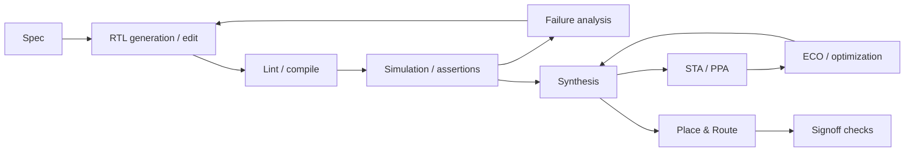

# 07. Chip Design / EDA Agent Relevance

작성일: 2026-08-25  
목적: `왜 최근 RTL/EDA agent 검증에서 GLM-5.2가 자주 보이는가?`를 evidence와 architecture 관점에서 분리해 분석한다.

## 1. 결론부터

현재 공개 자료만으로 **GLM-5.2가 칩 설계 현업 전체의 표준 또는 메인 foundation model이라고 단정할 근거는 부족하다.**

하지만 2026년 공개 agentic-EDA 연구/벤치마크에서 GLM-5.2가 **대표적인 strong open-weight backend**로 반복 등장하는 것은 확인된다.

그 이유는 모델 특성과 EDA workload가 상당히 잘 맞기 때문이다.

```text
EDA workload                    GLM-5.2 property
────────────────────────────────────────────────
large repo / RTL tree       ↔   1M context
long tool trajectory        ↔   long-horizon training
iterative debug             ↔   strong coding/reasoning
EDA CLI/API tool use        ↔   agentic/tool post-training
self-host / closed network  ↔   open weights + MIT
long output / patch loops   ↔   MTP decode acceleration
```

즉 단순 Verilog 생성 모델보다 **오래 상태를 유지하며 tool feedback을 반복 처리하는 engineering agent**에 맞는 특성이 많다.

---

## 2. Chip design은 본질적으로 agentic workload다

실제 RTL/physical-design flow는 한 번의 생성으로 끝나지 않는다.



이 workflow에서 agent가 유지해야 할 context:

- original specification
- design hierarchy
- interface contracts
- previous modifications
- simulator/linter logs
- waveform clues
- synthesis reports
- timing constraints
- PPA history
- tool/version-specific command semantics

따라서 software coding agent보다도 **tool state와 domain state의 일관성**이 중요하다.

---

## 3. Evidence 1 — FluxBench

2026년 7월 공개된 FluxBench 연구:

> *Can AI Agents Really Complete RTL-to-GDS? Lessons from Benchmarking Tool-Interactive EDA Workflows*

은 단순 model benchmark가 아니라 agent architecture × foundation model 조합을 평가한다.

평가 범위:

- RTL generation
- iterative repair
- tool feedback utilization
- logic synthesis
- placement & routing
- ECO
- end-to-end RTL-to-GDS

비교되는 agent architecture:

- FluxEDA
- Claude Code
- Claude Code + EDA Skills

foundation backend에는 GLM-5.2가 포함된다.

### 관찰된 GLM-5.2 관련 결과

공개 결과 요약에서:

- FluxEDA + GLM-5.2가 RealBench Easy/Hard에서 각각 57.10 / 53.58로 최고 결과를 기록
- CVDP-Hard에서는 GLM-5.2 조합이 100점을 기록한 configuration으로 보고됨
- RTL-to-GDS tight constraint에서도 FluxEDA + GLM-5.2가 93.70을 기록

한다.

이 숫자 자체보다 더 중요한 paper의 결론은:

> **같은 foundation model을 사용해도 agent architecture에 따라 최대 86.27% 수준의 성능 차이가 관찰될 수 있다.**

는 것이다.

즉 `GLM-5.2가 좋다`와 `GLM-5.2를 어떤 agent system에 넣어도 좋다`는 전혀 다른 명제다.

---

## 4. Evidence 2 — NVIDIA ACE-RTL

NVIDIA가 2026년 7월 공개한 ACE-RTL evaluation은 같은 agent loop에 여러 open model을 넣어 비교한다.

ACE-RTL workflow:

```text
Generator
   ↓
RTL candidate
   ↓
Simulator / verifier
   ↓
Reflector
   ↓
Coordinator updates context
   ↓
next iteration
```

GLM-5.2의 debugging/fixing example에서는:

```text
standalone GLM-5.2 : 44.0%
+ ACE-RTL agent    : 94.3%
```

로 큰 개선이 보고된다.

동일 ACE-RTL pipeline의 9개 CVDP category 평균에서는:

- GLM-5.2: 92.1%
- Kimi K2.6: 95.2%
- Nemotron 3 Ultra: 97.1%

가 보고된다.

이 결과는 GLM-5.2가 강한 backend임을 보여주는 동시에 **절대적인 1등 모델은 아니라는 것**도 보여준다.

---

## 5. 그래서 “GLM-5.2가 메인 같다”는 관찰은 어디까지 맞는가

### 맞는 부분

2026년 agentic RTL/EDA 공개 생태계에서 GLM-5.2는:

- 강력한 open-weight coding model
- long-context model
- self-hostable reference
- commercial closed model과 비교 가능한 baseline

으로 매우 쓰기 좋다.

그래서 benchmark author 입장에서도 실험 backend로 선택할 이유가 충분하다.

### 아직 증명되지 않은 부분

공개 benchmark의 빈도만으로:

- Synopsys/Cadence/Siemens 생태계의 표준 model
- 주요 반도체 회사 내부의 dominant model
- production tape-out workflow의 de-facto standard

라고 말할 수는 없다.

현업 내부 deployment는 대부분 비공개이고:

- proprietary model
- fine-tuned model
- on-prem constraints
- EDA vendor embedded assistant
- internally trained RTL model

이 섞여 있다.

따라서 현재 문서의 표현은:

> **“GLM-5.2는 2026년 공개 agentic-EDA 연구에서 대표적인 frontier/open-weight backend 중 하나다.”**

로 고정한다.

---

## 6. 왜 GLM-5.2 architecture가 EDA와 잘 맞는가

### 6.1 1M context — 단순 파일 크기 이상의 의미

큰 RTL repository나 SoC에서는 context에 다음이 동시에 들어갈 수 있다.

```text
specification
+ top hierarchy
+ related IP modules
+ testbench
+ assertions
+ build scripts
+ constraints
+ recent tool logs
+ previous patches
```

1M context는 이들을 한 trajectory에서 유지할 가능성을 높인다.

하지만 context window가 넓다고 자동으로 필요한 signal을 찾는 것은 아니다. GLM-5.2에서는 DSA가 긴 history 중 relevant top-k token을 선택하도록 학습되어 있다는 점이 더 중요하다.

### 6.2 DSA — log/repository retrieval workload

EDA agent가 현재 error를 고칠 때 전체 1M token이 동일하게 중요하지 않다.

예:

```text
current failing assertion
 ↕
related always_ff block
 ↕
interface definition
 ↕
previous simulation log
```

content-based sparse retrieval은 이런 workload와 개념적으로 잘 맞는다.

### 6.3 Long-horizon RL

EDA task는 여러 iteration 후에야 reward가 생긴다.

```text
edit → compile → simulate → synthesize → STA
```

중간 action은 최종 reward와 거리가 멀다.

GLM-5.2가 long-horizon coding/agent RL을 별도 target으로 강화한 점이 이런 workflow에 유리한 배경이다.

### 6.4 Flexible reasoning effort

단순 lint fix와 microarchitecture/timing optimization은 필요한 reasoning budget이 다르다.

reasoning effort를 workload별로 조정할 수 있으면 token/latency cost를 관리하기 쉽다.

### 6.5 MIT/open weights

칩 설계 데이터는 극도로 민감하다.

open-weight/self-host model은:

- air-gapped deployment
- source/RTL 외부 반출 방지
- EDA license network와 같은 보안 zone 배치
- custom tool parser
- domain adaptation

에 유리하다.

이 점은 실제 enterprise chip environment에서 매우 큰 장점이다.

---

## 7. 그러나 model보다 agent harness가 더 중요해지는 지점

FluxBench와 ACE-RTL이 공통으로 보여주는 패턴:

```text
LLM alone
   ↓
raw shell / raw Tcl / raw logs
   ↓
failure loops / invalid commands / context pollution
```

반면 structured agent:

```text
LLM
 ↓
typed tool/API layer
 ↓
EDA engine
 ↓
structured result
 ↓
state/context manager
 ↓
LLM
```

가 훨씬 안정적이다.

FluxBench의 분석에서는 physical-design 단계 failure에서 tool/Tcl compatibility가 주요 문제로 나타난다.

이것은 모델에게 수천 줄의 EDA skill 문서를 더 주는 것보다 **tool abstraction과 state control plane을 제대로 만드는 것**이 더 중요할 수 있다는 뜻이다.

---

## 8. Chip Agent architecture에 바로 가져올 원칙

### 8.1 Raw CLI를 최소화한다

나쁜 형태:

```text
LLM → arbitrary shell/Tcl
```

권장:

```text
LLM → validated structured action
    → adapter
    → EDA tool
```

예:

```json
{
  "action": "run_sta",
  "corner": "ss_0p72v_125c",
  "report": ["wns", "tns", "top_paths"]
}
```

### 8.2 Design state를 LLM context와 분리한다

source of truth는 model memory가 아니라 workspace/state store여야 한다.

```text
Git/worktree
EDA database
run metadata
constraints
metrics history
artifact store
```

LLM context는 필요한 state의 view다.

### 8.3 Verification gate를 강제한다

```text
edit
 → syntax
 → lint
 → sim
 → formal/equiv where applicable
 → synthesis
 → PPA
```

앞 단계 실패 시 뒤 단계 reward를 주지 않는다.

### 8.4 Reward hacking 방지

agent가:

- testbench 수정
- checker bypass
- constraint 완화
- target frequency 변경
- failing test 삭제

로 reward를 조작하지 못하도록 immutable policy와 audit log가 필요하다.

---

## 9. GLM-5.2를 chip-agent backend로 검증한다면

단순 VerilogEval 한 개로 끝내지 않는다.

### Layer A — Base RTL competence

- spec → RTL
- completion
- bug fix
- assertion generation
- testbench generation

### Layer B — Agent loop

- compile feedback recovery
- simulation debug
- multi-file patch
- repeated failing tests

### Layer C — Synthesis/PPA

- synthesis script interaction
- timing report interpretation
- area/timing trade-off
- ECO

### Layer D — Long-horizon state

- 100K/300K/1M accumulated context
- stale log handling
- long repository navigation
- context compaction

### Layer E — Runtime economics

- tokens/task
- wall-clock/task
- GPU seconds/task
- tool calls/task
- successful progress/token

FluxBench의 Token ROI 관점이 여기서 유용하다.

---

## 10. GLM-5.2 vs Kimi를 chip-agent 관점에서 보면

둘 다 후보가 될 수 있지만 강점의 origin이 다르다.

| 관점 | GLM-5.2 | Kimi K3/K2.x 계열 |
|---|---|---|
| Long context | DSA sparse retrieval + IndexShare | recurrent/attention hybrid 계보 |
| Coding/agent positioning | 매우 강함 | 매우 강함 |
| Open self-host | 가능 | 가능 모델에 따라 다름 |
| EDA benchmark visibility | 2026 공개 연구에서 높음 | 최근 비교군으로 증가 |
| Architecture serving challenge | DSA indexer + MoE + MTP | hybrid KDA/MLA + extreme MoE 등 |

foundation-model winner를 미리 정하기보다 **동일한 EDA harness에서 task/cost별로 비교**하는 것이 맞다.

---

## 11. 현재 판단

칩 설계 agent architecture를 설계한다면 GLM-5.2는 매우 좋은 기준 모델이다.

이유는 “제일 똑똑해서” 하나가 아니라:

```text
open
+ long context
+ coding strength
+ tool/agent training
+ current EDA benchmark evidence
+ production serving ecosystem
```

이 동시에 존재하기 때문이다.

하지만 실제 platform decision은 최소:

- GLM-5.2
- Kimi 계열
- DeepSeek 계열
- RTL-specialized model

을 **동일 harness / 동일 tool budget / 동일 context policy**에서 비교해야 한다.

---

## 12. Sources

### Primary research

- FluxBench — Can AI Agents Really Complete RTL-to-GDS?: https://arxiv.org/abs/2607.17528
- GLM-5.2 official blog: https://z.ai/blog/glm-5.2
- GLM-5 Technical Report: https://arxiv.org/abs/2602.15763

### Independent / vendor evaluation

- NVIDIA ACE-RTL / Nemotron 3 Ultra comparison: https://developer.nvidia.com/blog/nvidia-nemotron-3-ultra-leads-open-models-on-accuracy-and-efficiency-in-agentic-rtl-coding/

### Interpretation rule

EDA benchmark 결과는 model 자체의 순수 성능과 agent framework 효과를 혼합할 수 있으므로, **같은 harness에서 model만 바꾼 결과**와 **같은 model에서 harness를 바꾼 결과**를 따로 읽는다.
