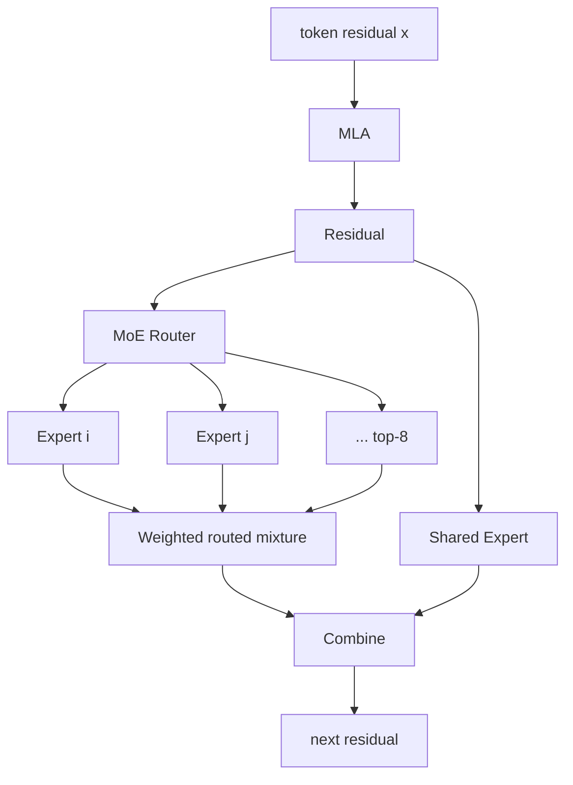
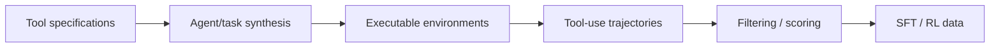
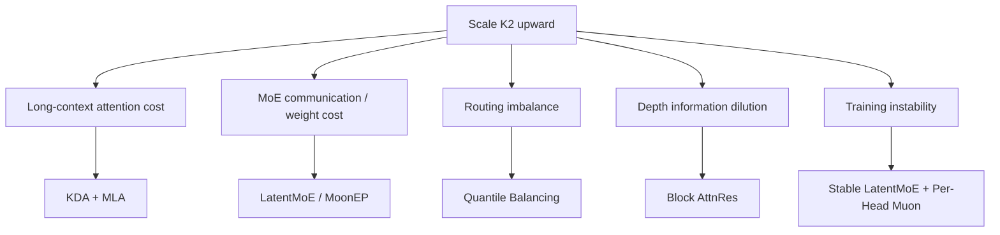

# 01. Kimi K2: K3의 Large-Scale Foundation

작성일: 2026-08-19  
상위 문서: [Kimi K3 Study Guide](README.md)

## 1. 왜 K3를 공부하는데 K2가 먼저 필요한가

Kimi K3의 architecture innovation은 KDA, AttnRes, Stable LatentMoE에 있지만, **대규모 sparse MoE를 어떻게 학습하고 agentic foundation으로 만드는가**라는 문제는 Kimi K2에서 이미 크게 풀렸다.

K3의 많은 숫자는 K2와 비교할 때 의미가 생긴다.

| 항목 | Kimi K2 | Kimi K3 |
|---|---:|---:|
| Layers | 61 | 93 |
| Hidden size | 7168 | 7168 |
| Total params | 약 1.04T | 약 2.78T |
| Active params | 약 32.6B | 약 104.2B |
| Routed experts | 384 | 896 |
| Active routed experts | 8 | 16 |
| Shared experts | 1 | 2 |
| Expert hidden | 2048 | 3072 |
| Attention heads | 64 | 96 |
| Attention | MLA | 69 KDA + 24 Gated MLA |
| Context | 128K | 1M |
| Optimizer lineage | MuonClip | Per-Head Muon + K2 stability techniques |

K3는 K2를 버린 것이 아니라 **K2가 검증한 1T-scale sparse MoE training foundation 위에서 sequence/depth/width architecture를 재설계**한 모델이다.

---

## 2. K2의 기본 구조

K2는 **Mixture-of-Experts(믹스처 오브 엑스퍼츠, 전문가 혼합; MoE)** language model이다.

공식 공개 수치:

- total parameters: 약 1T
- activated parameters: 약 32B
- 61 layers
- hidden size 7168
- 1 dense layer
- 384 routed experts
- top-8 routed experts/token
- 1 shared expert
- expert FFN hidden 2048
- 64 attention heads
- MLA
- 128K context
- SwiGLU
- 160K vocabulary



첫 dense layer 이후 대부분 layer가 sparse MoE FFN을 사용한다.

---

## 3. Total Parameter와 Active Parameter를 분리한다

MoE에서 가장 중요한 숫자 두 개:

### Total Parameters

모델 checkpoint에 존재하는 전체 expert/attention/embedding parameter 수다.

K2에서는 약:

$$
P_{total}\approx1T
$$

이다.

### Activated Parameters

한 token forward에서 실제 선택돼 계산되는 parameter의 규모다.

K2에서는 약:

$$
P_{active}\approx32B
$$

이다.

즉 token 하나가 384 routed expert를 모두 실행하지 않는다.

$$
8/384\approx2.08\%
$$

의 routed experts만 선택한다.

이것이 sparse MoE의 핵심 trade-off다.

> **Parameter capacity는 1T 규모로 키우되 token당 compute는 훨씬 작은 dense model 수준에 가깝게 유지한다.**

물론 attention/shared parameters와 모든 layer overhead가 있어 위 비율이 곧 total/active parameter 비율은 아니다.

---

## 4. Routed Expert와 Shared Expert

### Routed Expert

**Routed Expert(라우티드 엑스퍼트, router가 token별로 선택하는 전문가)**는 token마다 일부만 실행된다.

Router logit:

$$
r=W_rx
$$

에서 top-k expert index를 선택한다고 단순화할 수 있다.

### Shared Expert

**Shared Expert(셰어드 엑스퍼트, 모든 token이 항상 통과하는 전문가)**는 routed path와 별도로 dense/common knowledge path를 제공한다.

역할을 직관적으로 나누면:

```text
Shared Expert
  → 모든 token이 공통적으로 필요한 transformation

Routed Experts
  → token/content/domain에 따라 선택되는 specialized transformation
```

실제로 expert가 인간이 붙인 의미론적 직무 하나씩을 맡는다는 뜻은 아니다. specialization은 training에서 emergent하게 형성된다.

---

## 5. 왜 Expert 수를 늘리는가

같은 active experts 수를 유지하며 total expert 수 $N$을 늘리면 가능한 expert combination과 specialized parameter capacity가 증가한다.

Top-$K$ routing에서 가능한 expert subset 수는 단순 조합 관점에서:

$$
{N\choose K}
$$

이다.

물론 실제 network capacity를 조합 수로 직접 평가할 수는 없지만 expert bank가 커질수록 token마다 다른 parameter subnetwork를 사용할 수 있는 공간이 크게 늘어난다는 직관을 준다.

K2 report는 scaling-law experiment를 통해 높은 expert sparsity가 parameter efficiency를 높일 수 있다는 방향을 탐색하고 384 experts를 채택했다.

K3는 이를 896 experts까지 더 확장한다.

---

## 6. MoE가 실제로 싸기만 한 것은 아니다

Sparse compute는 FLOPs를 줄이지만 system cost를 만든다.

### 6.1 Expert Weight Memory

GPU는 자신이 담당하는 experts의 weights를 HBM에 보관해야 한다.

### 6.2 Expert Parallel All-to-All

Expert가 GPU에 분산돼 있으면 token hidden states를 선택된 expert가 있는 GPU로 보낸다.

```text
GPU0 tokens ─┐
GPU1 tokens ─┼─ all-to-all → expert-owner GPUs
GPU2 tokens ─┤
GPU3 tokens ─┘
```

Expert compute 후 다시 원래 token order로 결과를 반환한다.

### 6.3 Load Imbalance

어떤 expert에 token이 몰리면 그 GPU가 straggler가 된다.

```text
Expert A: 100 tokens
Expert B: 103 tokens
Expert C:  98 tokens
Expert D: 410 tokens  ← bottleneck
```

따라서 MoE의 핵심은 `FLOPs가 sparse`인 것만이 아니라:

> **routing balance + communication + expert GEMM efficiency**

까지 포함한다.

이 문제가 K3의 Quantile Balancing과 Stable LatentMoE로 이어진다.

---

## 7. K2의 MLA

K2 attention은 **Multi-head Latent Attention(멀티 헤드 레이턴트 어텐션; MLA)**이다.

K2의 `q_lora_rank=1536`, `kv_lora_rank=512` 계열 구조는 K3의 MLA path에도 계보적으로 이어진다.

MLA 수식과 cache compression은 별도 문서를 참조한다.

- [MLA와 Low-Rank Attention](../../study/attention/02-mla-low-rank-attention.md)

K2에서 중요한 것은:

> 1T MoE의 model weights 자체가 이미 매우 큰 상황에서 long-context KV cache까지 크게 만들 수 없으므로 MLA가 inference memory/bandwidth 설계의 중요한 기반이었다.

K3는 MLA를 버리지 않고 24개 global layer에 유지한다.

---

## 8. K2의 Optimizer: MuonClip

K2의 가장 중요한 training contribution 중 하나가 **MuonClip(뮤온클립)**이다.

먼저 Muon을 알아야 한다.

### 8.1 Muon

**Muon(뮤온, Momentum Orthogonalized by Newton-Schulz 계열 matrix optimizer)**은 matrix parameter의 gradient/momentum update를 element-wise로만 다루지 않고 matrix geometry를 활용한다.

단순화한 흐름:

```text
gradient G
  ↓ momentum
M
  ↓ Newton-Schulz iterations
orthogonalized / normalized matrix update
  ↓ scale adjustment
ΔW
```

**Newton–Schulz Iteration(뉴턴-슐츠 이터레이션, 행렬 역제곱근/직교화 등을 근사하는 반복법)**을 이용해 update matrix의 singular directions를 더 균등하게 만든다.

Muon scaling 연구는 weight decay와 update scale 조정으로 large LLM까지 확장할 수 있음을 보였다.

### 8.2 왜 K2에서 추가 안정화가 필요했는가

1T MoE는 작은 연구 모델보다 training instability가 훨씬 위험하다.

- attention logit explosion
- matrix update scale imbalance
- rare expert instability
- long run의 single loss spike가 전체 training을 망칠 위험

K2는 Muon에:

- weight decay
- RMS matching/update scale control
- QK-Clip 계열 안정화

를 결합한 MuonClip을 사용했다.

공식 report는 15.5T-token pretraining 동안 loss spike 없이 학습했다고 보고한다.

---

## 9. QK-Clip의 문제의식

Attention Q/K weight가 과도하게 커지면 dot-product logit:

$$
q^\top k
$$

의 scale이 증가하고 softmax가 지나치게 sharp해질 수 있다.

K2의 QK-Clip 계열 안정화는 attention head별 Q/K 관련 scale을 감시하고 과도한 update/weight growth를 제한하는 방향이다.

중요한 점은 K2가 optimizer를 단순 `학습률 튜닝 문제`로 보지 않고 **모델의 attention parameter geometry와 training stability를 함께 설계**했다는 것이다.

이 경험이 K3의 Per-Head Muon으로 이어진다.

---

## 10. K2의 Pretraining Data Philosophy

K2는 대규모 pretraining corpus를 단순 웹 텍스트 하나로 생각하지 않았다.

공식 기술보고서는 주요 data domain을 여러 범주로 나누고 quality filtering, deduplication, domain mixture를 설계한다.

K3를 이해할 때 중요한 것은 정확한 데이터 비율 암기가 아니라:

> **architecture scaling만큼 data mixture와 task coverage를 별도의 scaling axis로 관리한다.**

는 철학이다.

K3에서는 이 철학이 text+vision joint pretraining, long-context data, synthetic scattered-information task 등으로 확장된다.

---

## 11. Agentic Data Synthesis

K2는 tool use를 단순 chat-format instruction tuning으로만 만들지 않는다.

큰 흐름:



### Tool Specification

API/schema/CLI 같은 실제 tool interface를 모델에 노출한다.

### Task Synthesis

그 tool을 사용해야 풀 수 있는 task를 생성한다.

### Trajectory

모델 또는 synthetic agent가:

```text
reason → call tool → observe → reason → call tool → ...
```

형태의 trajectory를 만든다.

### Filtering

실제로 task가 해결됐는지, tool use가 유효한지 검증한다.

이 pipeline은 K3의 long-horizon coding/agentic training의 중요한 전신이다.

---

## 12. K2 Post-training: RLVR와 Self-Critique

### RLVR

**Reinforcement Learning with Verifiable Rewards(리인포스먼트 러닝 위드 베리파이어블 리워즈; 검증 가능한 보상 기반 강화학습, RLVR)**은 답의 correctness를 program/test/math verifier로 검증할 수 있는 task에서 강력하다.

예:

- 수학 정답
- code unit test
- formal answer

### Self-Critique / Rubric Reward

모든 task에 exact verifier가 있는 것은 아니다.

- writing
- open-ended knowledge work
- agentic quality

등은 rubric/reward model/critique를 이용해야 한다.

K2는 verifiable RL과 non-verifiable task용 critique/reward 경로를 함께 사용했다.

K3에서는 이 방향이 Generative Reward Model, domain-specific RL, multi-teacher distillation로 더 발전한다.

---

## 13. K2가 K3에 남긴 것

### 직접 이어지는 것

- 7168 hidden dimension
- 160K vocabulary
- sparse MoE foundation
- routed/shared expert split
- MLA knowledge
- Muon optimizer lineage
- MTP layer
- large-scale agentic data/RL infrastructure

### K3에서 크게 바뀐 것

- 61 → 93 layers
- 384 → 896 experts
- top-8 → top-16
- 1 → 2 shared experts
- full-width MoE → Stable LatentMoE
- SwiGLU → SiTU-GLU
- MLA-only → KDA/MLA hybrid
- standard residual → Block AttnRes
- 128K → 1M context
- text-only foundation → native multimodal

즉 K2는 K3 architecture의 답안이 아니라 **K3가 더 공격적인 구조를 시도할 수 있게 해준 stable scale foundation**이다.

---

## 14. K2 → K3에서 생기는 시스템 압력

K3는 K2보다 active compute가 약 3배 이상 커지고 expert bank도 2배 이상 커진다.

이때 단순히 GPU를 더 붙인다고 해결되지 않는다.

### Expert Parallel Communication

896 experts를 여러 GPU/node로 분산하면 all-to-all topology가 중요해진다.

### Expert Weight Bandwidth

Decode small batch에서는 expert GEMM보다 expert weight read가 memory-bound가 될 수 있다.

### Load Balance

top-16 선택과 896 experts에서 routing skew를 낮춰야 한다.

### Sequence Cost

1M context에서 MLA-only 93 layers는 cache/attention cost가 너무 커질 수 있다.

### Depth

93 layers에서 standard residual accumulation도 더 어려워진다.

따라서 K3의 핵심 innovation들은 모두 K2를 그대로 scale할 때 발생하는 병목에 대응한다고 볼 수 있다.



---

## 15. 이 장을 읽고 답할 수 있어야 하는 질문

1. K2의 1T total / 32B active가 동시에 가능한 이유는 무엇인가?
2. Routed expert와 shared expert의 역할은 무엇이 다른가?
3. Expert count를 늘리면 parameter capacity는 늘지만 어떤 system cost가 증가하는가?
4. MoE에서 FLOPs만 보면 안 되고 all-to-all과 weight bandwidth를 봐야 하는 이유는 무엇인가?
5. K2가 MLA를 사용한 이유를 cache/long-context 관점에서 설명할 수 있는가?
6. Muon은 AdamW와 어떤 관점에서 다른 optimizer인가?
7. K2가 MuonClip이라는 별도 안정화가 필요했던 이유는 무엇인가?
8. Agentic data synthesis가 단순 instruction-response dataset과 무엇이 다른가?
9. K2에서 K3로 scale할 때 어떤 병목이 각각 KDA, LatentMoE, AttnRes, Quantile Balancing을 요구했는가?

---

## 16. 원문

- Kimi K2 official repository/report  
  https://github.com/MoonshotAI/Kimi-K2
- Muon is Scalable for LLM Training  
  https://arxiv.org/abs/2502.16982
- Kimi K3 Technical Report  
  https://github.com/MoonshotAI/Kimi-K3
