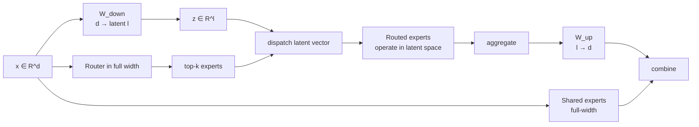
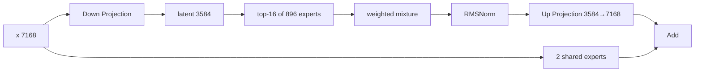

# 03. Sparse MoE → LatentMoE → Stable LatentMoE

작성일: 2026-08-19  
상위 문서: [Kimi K3 Study Guide](README.md)

## 1. 이 장의 목표

Kimi K3에서 parameter의 대부분은 attention이 아니라 **Mixture-of-Experts(믹스처 오브 엑스퍼츠, 전문가 혼합; MoE)** 쪽에 존재한다.

따라서 K3를 이해하려면 다음 흐름을 알아야 한다.

```text
Dense FFN
  ↓
Sparse MoE
  ↓
Shared + Routed Experts
  ↓
Extreme Expert Sparsity
  ↓
LatentMoE
  ↓
Stable LatentMoE
      ├─ RMS-normalized latent aggregation
      ├─ SiTU-GLU
      └─ Quantile Balancing
```

K3의 896 routed experts / top-16 구조는 단순히 `전문가가 많다`는 설명으로는 부족하다. 실제로는 **accuracy, FLOPs, HBM bandwidth, EP all-to-all communication, routing balance, training stability**를 동시에 맞추기 위한 architecture다.

---

## 2. Dense FFN부터 다시 시작한다

Transformer block의 attention 뒤에는 보통 **Feed-Forward Network(피드 포워드 네트워크; FFN)**가 있다.

SwiGLU 계열을 단순화하면:

$$
\operatorname{FFN}(x)
=W_2\left[
\operatorname{SiLU}(W_gx)\odot W_1x
\right]
$$

- $x\in\mathbb{R}^{d}$: model hidden vector
- $W_1,W_g$: hidden → intermediate projection
- $W_2$: intermediate → hidden projection
- $d$: residual/model hidden dimension
- $m$: intermediate FFN dimension

Dense model에서는 모든 token이 같은 FFN weights를 실행한다.

즉 parameter를 두 배 키우면 대체로 token당 FFN compute도 같이 커진다.

---

## 3. MoE의 출발: Parameter Capacity와 Token Compute를 분리한다

Sparse MoE에서는 FFN 하나를 여러 expert로 복제하고 router가 일부만 선택한다.

$$
\operatorname{MoE}(x)
=
\sum_{i\in\mathcal{T}_K(x)}p_i(x)E_i(x)
$$

- $E_i$: expert $i$
- $p_i$: routing weight
- $\mathcal{T}_K(x)$: top-$K$ selected expert 집합

예를 들어:

```text
Total experts = 896
Selected      = 16
```

이면 한 token은 896 expert를 모두 실행하지 않는다.

이것이:

```text
Total parameter capacity ↑↑
Token compute           ↑ or bounded
```

를 가능하게 한다.

---

## 4. 하지만 MoE의 비용은 FLOPs만이 아니다

MoE를 `parameter는 큰데 compute는 싸다`라고만 설명하면 production inference에서 가장 중요한 부분이 빠진다.

### 4.1 Expert Weight Loading

Decode처럼 expert별 token batch가 작으면 expert GEMM은 HBM에서 weight를 읽는 비용에 제한될 수 있다.

**Memory-bound(메모리 바운드, 연산기보다 memory bandwidth가 병목인 상태)**가 된다.

### 4.2 Expert Parallel Communication

Experts를 여러 GPU에 분산하면 token representation이 remote GPU로 이동한다.

$$
\text{Dispatch}\rightarrow\text{Expert GEMM}\rightarrow\text{Combine}
$$

EP에서 주로 **All-to-All(올투올, 모든 rank가 서로 data를 교환하는 collective)** communication이 필요하다.

### 4.3 Routing Imbalance

Expert token load가 고르지 않으면 가장 바쁜 expert/GPU가 전체 step 시간을 결정한다.

### 4.4 Parameter Memory

Total experts가 많으면 전체 model weight를 더 많은 GPU에 shard해야 한다.

따라서 MoE architecture는:

> **accuracy per FLOP뿐 아니라 accuracy per parameter, weight bandwidth, communication까지 평가해야 한다.**

이 문제의식이 LatentMoE의 직접적인 출발점이다.

---

## 5. Standard MoE의 구조적 병목

Standard routed expert가 model hidden dimension $d$를 입력으로 받는다고 하자.

Expert FFN:

$$
E_i:\mathbb{R}^{d}\rightarrow\mathbb{R}^{m}\rightarrow\mathbb{R}^{d}
$$

각 expert weight 규모는 대략:

$$
O(dm)
$$

이고 EP token dispatch vector width도 $d$다.

즉 $d$가 크면 동시에:

- expert weight read 증가
- dispatch/aggregate communication 증가

가 발생한다.

K3의 hidden size는 $d=7168$이다. 896 expert를 모두 이 width에서 직접 운영하면 system pressure가 매우 크다.

---

## 6. LatentMoE의 핵심 아이디어

**LatentMoE(레이턴트 엠오이, 잠재공간 전문가 혼합)**는 routed expert computation 전에 token을 더 작은 latent dimension $\ell$로 projection한다.

$$
z=W_{\downarrow}x
$$

$$
z\in\mathbb{R}^{\ell},\qquad \ell<d
$$

그 뒤 routed experts는 latent space에서 계산한다.

$$
E_i:\mathbb{R}^{\ell}\rightarrow\mathbb{R}^{m}\rightarrow\mathbb{R}^{\ell}
$$

aggregate 후 다시 model width로 올린다.

$$
y_{route}
=W_{\uparrow}\left(
\sum_{i\in\mathcal{T}_K}p_iE_i(z)
\right)
$$

공식 LatentMoE formulation은 shared expert는 full dimension $d$에 남길 수 있다.



---

## 7. Latent Dimension이 왜 시스템 knob인가

압축비를:

$$
\alpha=\frac{d}{\ell}
$$

라고 하자.

K3:

$$
d=7168,\qquad\ell=3584
$$

이므로:

$$
\alpha=2
$$

이다.

즉 routed expert path의 input/output width가 절반이다.

이론적으로 주요 효과:

### Communication

EP dispatch representation width:

$$
d\rightarrow\ell=d/2
$$

### Expert Parameter/Weight Bandwidth

각 routed expert의 input/output projection dimension도 절반 수준으로 줄어든다.

### 재투자

절약한 budget을:

- expert 수 증가
- active top-k 증가
- expert hidden dimension 증가

등에 다시 사용할 수 있다.

이것이 `LatentMoE는 단순 compression`이 아니라 **capacity를 더 효율적인 방향으로 재배치하는 architecture**인 이유다.

---

## 8. 왜 Shared Expert는 Full Width에 남기는가

LatentMoE의 원 formulation에서도 routing mechanism과 shared experts는 full hidden dimension에서 동작할 수 있다.

이유를 구조적으로 보면:

### Shared Path

모든 token이 항상 사용하는 공통 transformation이다.

- specialist routing과 무관한 base computation
- full hidden representation을 직접 처리

### Routed Path

MoE에서 가장 큰 parameter bank와 communication이 발생하는 부분이다.

- expert weights 다수
- token dispatch/aggregate

따라서 bottleneck이 큰 routed path만 latent로 줄이는 것이 cost-benefit이 좋다.

K3도 2개의 shared expert를 별도로 둔다.

---

## 9. K2 → K3의 Expert Scaling

| 항목 | K2 | K3 |
|---|---:|---:|
| Hidden $d$ | 7168 | 7168 |
| Latent width $\ell$ | 없음 | 3584 |
| Routed experts $N$ | 384 | 896 |
| Active $K$ | 8 | 16 |
| Shared | 1 | 2 |
| Expert hidden $m$ | 2048 | 3072 |

K3는 latent width를 절반으로 줄이면서:

- expert bank 약 2.33배
- top-k 2배
- expert intermediate 1.5배

로 확장한다.

즉 saved communication/weight bandwidth budget을 **더 많은 expert diversity와 active nonlinearity**에 재투자한 설계로 볼 수 있다.

---

## 10. Combinatorial Sparsity

Top-$K$ expert routing에서 expert 조합 수의 upper-bound 직관은:

$$
{N\choose K}
$$

이다.

K2:

$$
{384\choose8}
$$

K3:

$$
{896\choose16}
$$

로 combinatorial space가 매우 크게 증가한다.

실제 model expressivity가 이 숫자와 동일하다는 뜻은 아니다. 하지만 $N$과 $K$를 함께 늘리면 token마다 선택 가능한 specialized subnetwork 구성이 훨씬 다양해진다.

LatentMoE 연구가 `N과 K를 늘리되 hidden communication width를 줄이는 것`을 중요한 design point로 본 이유다.

---

# 11. 그런데 LatentMoE를 3T scale로 키우면 왜 불안정한가

K3 report는 vanilla LatentMoE를 매우 큰 scale에 적용할 때 중요한 두 문제를 다룬다.

## 11.1 연속 Projection/Expert Path의 Activation Growth

Routed path는 대략:

```text
x
 → W_down
 → expert input projection / gate
 → nonlinear expert
 → expert output
 → W_up
```

처럼 여러 matrix multiplication과 nonlinear operation이 연속된다.

Scale이 커지면 intermediate activation magnitude가 커질 수 있고 training instability를 유발할 수 있다.

## 11.2 896-expert Routing Balance

Expert 수가 약 $10^3$ 규모에 가까워지면 단순 평균 load-balancing signal로 각 expert load를 정교하게 맞추기 어렵다.

K3의 **Stable LatentMoE**는 이 두 문제를 직접 겨냥한다.

---

# 12. Stable LatentMoE 전체 구조

K3 routed path를 개념적으로 쓰면:

$$
z=W_{\downarrow}x
$$

$$
u=\sum_{i\in\mathcal T_K}p_iE_i(z)
$$

$$
\hat u=\operatorname{RMSNorm}(u)
$$

$$
y_{route}=W_{\uparrow}\hat u
$$

shared path를 더하면:

$$
y=y_{route}+\sum_jE_j^{shared}(x)
$$

핵심 추가가 **up projection 전에 RMSNorm**이라는 점이다.



---

## 13. 왜 Up Projection 전에 RMSNorm을 두는가

Latent mixture $u$의 norm이 training 중 커지면 $W_{\uparrow}$가 그 큰 activation을 다시 full hidden space로 확장하면서 instability가 증폭될 수 있다.

RMSNorm은:

$$
\operatorname{RMSNorm}(u)
=
\frac{u}{\sqrt{\frac1\ell\sum_i u_i^2+\epsilon}}\odot g
$$

로 scale을 제어한다.

중요한 의미:

> expert들의 mixture가 어떤 방향을 표현하는지는 유지하면서, up-projection으로 전달되는 magnitude를 일정하게 관리한다.

K3 report에서는 이를 Stable LatentMoE의 stability component로 사용한다.

---

# 14. SwiGLU에서 SiTU-GLU로

K2는 SwiGLU를 사용했지만 K3 expert activation은 **SiTU-GLU(시투-글루)**를 사용한다.

K3의 문제의식은 GLU branch 내부 activation이 extreme-scale training에서 과도하게 커지는 것을 막는 것이다.

SiTU 계열은 각 branch를 scaled `tanh`로 soft-cap한다.

개념적으로:

$$
\operatorname{SiTU}_\beta(x)
=\beta\tanh(x/\beta)
$$

처럼 input magnitude가 커져도 output은 bounded된다.

K3는 gate/up branch에 서로 다른 cap scale을 사용한다.

공개 report 값:

- $\beta_1=4$
- $\beta_2=25$

따라서 GLU product 자체도 무제한으로 커지지 않도록 제한한다.

### 왜 Hard Clip이 아니라 Tanh인가

Hard clip은 threshold 밖에서 gradient가 갑자기 잘리는 비연속적인 behavior를 만든다.

Scaled tanh는 smooth하게 saturation하므로 optimization에 더 유리할 수 있다.

---

# 15. Expert Load Balancing의 기본 문제

Router가 expert $i$에 score $s_i$를 만들고 top-k를 선택한다고 하자.

Model quality만 최적화하면 일부 expert가 자주 선택될 수 있다.

```text
expert 0  █████████████████
expert 1  █████
expert 2  ███
expert 3  ███████████████████████
```

Distributed system에서는 가장 많이 선택된 expert가 bottleneck이 된다.

따라서 목표는 대략:

$$
\text{load}_i\approx\frac{B\cdot K}{N}
$$

이다.

- $B$: batch tokens
- $K$: active experts/token
- $N$: experts

---

# 16. Auxiliary Load-Balancing Loss의 문제

전통적으로 router balance를 위해 auxiliary loss를 더한다.

$$
\mathcal L
=
\mathcal L_{LM}
+\lambda\mathcal L_{balance}
$$

하지만 $\lambda$가 너무 크면 language-model objective와 routing specialization을 방해할 수 있다.

DeepSeek 계열 등은 auxiliary-loss-free expert bias 방식도 발전시켰다.

K3는 여기서 더 큰 expert count를 위해 **Quantile Balancing(퀀타일 밸런싱, 분위수 기반 expert load balancing)**을 사용한다.

---

# 17. Quantile Balancing의 핵심

K3 router는 token별 expert score와 별도로 dispatch selection에 영향을 주는 expert bias를 유지한다.

중요한 구분:

- bias는 **어떤 expert가 top-k로 선택되는가**에 사용
- 최종 expert mixture weight 자체에는 직접 섞지 않음

즉 expert specialization score를 크게 왜곡하지 않고 dispatch 빈도만 조절하는 방향이다.

### 왜 Quantile인가

896 expert 각각의 target load를 맞추려면 단순 평균 error보다 **expert score distribution에서 어느 threshold를 조정해야 원하는 token 비율이 선택되는가**를 보는 것이 유용하다.

각 expert에 원하는 selection quantile을 추정해 bias를 업데이트하면 target batch load에 가까운 선택 빈도를 만들 수 있다.

큰 distributed batch에서는 score histogram/statistics를 aggregate하여 quantile을 추정한다.

```text
router score distribution per expert
          ↓
desired selection rate K/N
          ↓
quantile threshold estimate
          ↓
expert bias adjustment
          ↓
more balanced top-k dispatch
```

---

# 18. 왜 Balance가 Inference Architecture이기도 한가

Load balancing은 training optimization 문제처럼 보이지만 실제 serving 성능에도 직접 영향을 준다.

Expert Parallel step time:

$$
T_{MoE}\approx\max_g T_g
$$

가 되기 쉽다.

가장 느린 expert-owner GPU가 전체 layer를 기다리게 한다.

따라서 균형 잡힌 routing distribution을 학습하는 것은:

- training throughput
- serving throughput
- tail latency

모두에 영향을 준다.

---

# 19. Stable LatentMoE와 Expert Parallelism

K3에서 latent width가 절반인 것은 EP에서 특히 중요하다.

### Standard MoE Dispatch

Token당 $d=7168$ elements 전달.

### LatentMoE Dispatch

Token당 $\ell=3584$ elements 전달.

같은 dtype이라고 단순화하면 dispatch payload가 절반이다.

하지만 K3는 top-k를 8→16으로 두 배 늘렸다.

Communication을 아주 단순화하면:

$$
\text{traffic}\propto K\cdot\text{dispatch width}
$$

K2-like full-width:

$$
8\times7168
$$

K3 latent:

$$
16\times3584
$$

두 값이 같다.

즉 **width를 절반으로 줄인 budget을 top-k 2배 증가에 재투자할 수 있다**는 LatentMoE 설계 직관이 K3 숫자에서 매우 선명하게 보인다.

실제 traffic은 dtype, duplicate routing, shared path, metadata, EP layout 등에 따라 달라진다.

---

# 20. Decode에서 LatentMoE가 중요한 이유

High-throughput prefill에서는 expert GEMM이 충분히 큰 batch를 받아 compute-bound가 될 수 있다.

하지만 decode에서는 expert당 token 수가 작을 수 있다.

예:

```text
전체 running requests 128
× top-16 routing
÷ 896 experts
≈ expert당 평균 몇 token 수준
```

이때 expert matrix를 HBM에서 읽는 비용 대비 연산 재사용이 낮다.

Latent expert는 input/output width가 작아 expert parameter bytes도 감소하므로 latency-critical decode에서 특히 의미가 있다.

이는 `FLOPs만 줄이기`보다 **accuracy per parameter / memory bandwidth**를 강조한 LatentMoE의 문제의식과 연결된다.

---

# 21. Stable LatentMoE를 한 문장씩 분해한다

### `Latent`

Routed expert computation과 dispatch를 smaller representation에서 수행한다.

### `MoE`

896 expert bank 중 token별 16개를 선택한다.

### `Stable`

Extreme scale에서 activation/routing instability를 막기 위해 normalization, bounded activation, quantile balancing을 추가한다.

즉:

> **Stable LatentMoE는 expert 계산을 압축한 MoE에, 3T-scale 학습을 버티기 위한 activation·routing 안정화까지 합친 구조다.**

---

# 22. K3에서 Stable LatentMoE가 거의 모든 layer에 중요한 이유

K3는 dense layer가 1개뿐이다.

그 이후 대부분 backbone block에서 attention/sequence mixer 뒤에 Stable LatentMoE가 나온다.

따라서 model 전체 FLOPs, parameter storage, EP communication, decode bandwidth를 이해할 때 MoE path의 영향이 매우 크다.

K3 성능을 분석하면서 attention cache만 보면 실제 bottleneck을 놓칠 수 있다.

특히 H200 multi-node deployment에서는:

- NVLink/NVSwitch intra-node
- IB/RDMA inter-node
- EP placement
- expert weight sharding
- dispatch all-to-all
- active batch size

가 핵심이 된다.

---

# 23. K3 deployment에 바로 연결되는 질문

K3를 실제 vLLM에서 배포한다면 다음을 확인해야 한다.

1. EP size는 몇인가?
2. 896 experts가 rank에 어떻게 분배되는가?
3. shared experts는 TP/EP 중 어디에 shard/replicate되는가?
4. Latent down/up projection은 TP인지 DP/EP인지?
5. token dispatch가 latent representation으로 실제 수행되는가?
6. expert GEMM kernel dtype은 무엇인가?
7. small decode batch에서 expert kernel이 memory-bound인가?
8. expert load imbalance metric을 볼 수 있는가?
9. intra-node NVLink와 inter-node IB all-to-all 비중은?
10. routed expert weights의 MXFP4 layout을 backend가 native하게 사용하는가?

이 질문이 실제 K3 multi-node 배포 성능을 결정한다.

---

# 24. 이 장의 핵심 정리

1. Sparse MoE는 total parameter와 token compute를 분리한다.
2. MoE의 실제 비용은 FLOPs 외에 expert weight bandwidth와 all-to-all communication이다.
3. LatentMoE는 model hidden $d$를 smaller latent $\ell$로 내려 routed expert compute와 dispatch를 수행한다.
4. K3는 $7168→3584$, 정확히 2배 latent compression을 사용한다.
5. 이 절감 budget을 896 experts, top-16, expert width 3072에 재투자한다.
6. Shared experts는 full-width common path로 유지된다.
7. 3T scale에서는 latent path activation growth와 ~1000-expert routing balance가 새 문제다.
8. Stable LatentMoE는 RMSNorm, SiTU-GLU, Quantile Balancing으로 이를 안정화한다.
9. K3의 `16×3584` latent dispatch는 K2의 `8×7168` full-width dispatch와 같은 단순 product를 가져 LatentMoE 설계 철학을 잘 보여준다.
10. K3 serving에서는 attention보다 MoE EP/weight-bandwidth가 병목일 수 있으므로 반드시 함께 profile해야 한다.

---

# 25. 원 논문

- LatentMoE: Toward Optimal Accuracy per FLOP and Parameter in Mixture of Experts  
  https://arxiv.org/abs/2601.18089
- Kimi K3 Technical Report  
  https://github.com/MoonshotAI/Kimi-K3
- Kimi K2 Technical Report  
  https://github.com/MoonshotAI/Kimi-K2
