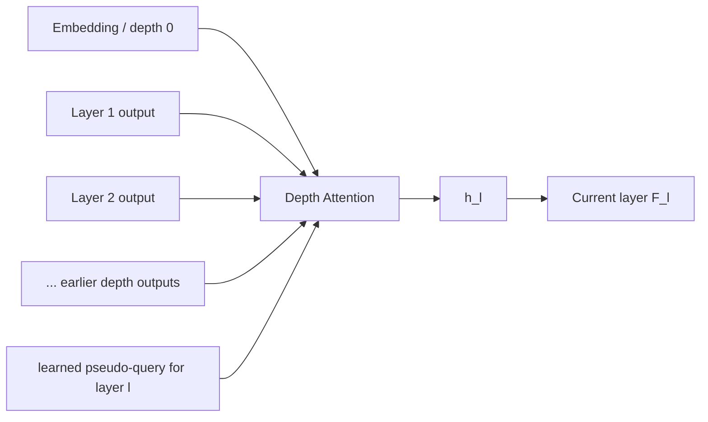
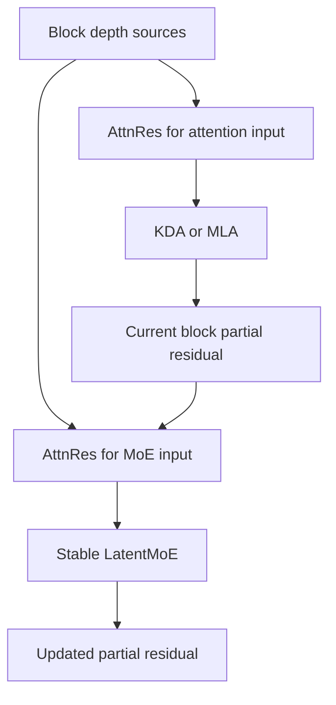

# 04. Attention Residuals: Token Attention이 아니라 Depth Mixing

작성일: 2026-08-19  
상위 문서: [Kimi K3 Study Guide](README.md)

## 1. 이름 때문에 가장 먼저 생기는 오해

**Attention Residuals(어텐션 레지듀얼즈; AttnRes)**는 이름에 Attention이 들어가지만 KDA/MLA처럼 sequence의 다른 token을 찾는 mechanism이 아니다.

축이 다르다.

```text
KDA / MLA
  → token axis attention / sequence mixing
  → "과거 어느 token 정보가 필요한가?"

AttnRes
  → depth axis attention / depth mixing
  → "이 token의 어느 과거 layer representation이 필요한가?"
```

Kimi K3를 이해할 때 이 구분은 매우 중요하다.

K3는:

- sequence axis → KDA + MLA
- depth axis → Block AttnRes
- width/channel axis → Stable LatentMoE

로 서로 다른 정보 흐름 문제를 분리한다.

---

## 2. Standard Residual Connection부터

Transformer의 residual connection을 단순화하면:

```math
x_{l+1}=x_l+F_l(x_l)
```

이다.

- $x_l$: layer $l$ 입력 residual representation
- $F_l$: attention 또는 FFN transformation

PreNorm Transformer에서는:

```math
x_{l+1}=x_l+F_l(\operatorname{Norm}(x_l))
```

형태가 흔하다.

Layer를 계속 전개하면:

```math
x_L=x_0+\sum_{i=0}^{L-1}F_i(\cdot)
```

에 가까운 **누적 합(accumulation)** 구조가 된다.

즉 모든 과거 layer contribution이 기본적으로 weight 1로 residual stream에 합쳐진다.

---

## 3. Residual의 장점

Residual connection은 deep network training을 가능하게 만든 핵심 발명 중 하나다.

### Gradient Flow

Identity path가 있어 gradient가 깊은 network를 통과하기 쉽다.

### Incremental Refinement

각 layer가 완전히 새 representation을 만드는 대신 이전 representation에 correction을 더할 수 있다.

### Optimization Stability

Deep Transformer의 convergence가 크게 쉬워진다.

따라서 AttnRes의 주장은 `residual은 나쁘다`가 아니다.

문제는 **아주 깊은 PreNorm Transformer에서 모든 과거 contribution을 동일한 방식으로 누적하는 것이 최선인가?**다.

---

## 4. Deep PreNorm에서 발생하는 두 문제

Moonshot의 Attention Residuals 연구는 크게 두 현상을 문제 삼는다.

### 4.1 Representation Dilution

현재 residual $x_l$은 이전 모든 transformation의 누적 합이다.

예를 들어 layer 3에서 아주 유용한 feature가 만들어져도 layer 50에서는 수십 개 후속 output과 같은 stream에 섞인다.

```text
layer 3 useful feature
     ↓
+ layer 4
+ layer 5
+ ...
+ layer 50
     ↓
one accumulated residual stream
```

현재 layer가 `layer 3 representation을 직접 다시 보고 싶다`고 해도 standard residual에는 depth address가 없다.

### 4.2 Hidden Magnitude Growth

많은 residual output이 계속 더해지면 residual stream norm이 depth와 함께 증가할 수 있다.

PreNorm은 각 sublayer 입력을 normalize하지만 residual accumulation 자체는 계속된다.

즉:

```text
Norm before F_l
≠
Residual sum itself is bounded
```

이다.

---

## 5. Full Attention Residuals의 아이디어

AttnRes는 이전 layer output들을 별도 **depth memory**로 본다.

현재 layer $l$이 과거 representation $v_i$를 weight $\alpha_{i\to l}$로 선택한다.

```math
h_l=
\sum_{i=0}^{l-1}
\alpha_{i\to l}v_i
```

- $v_i$: 이전 depth $i$의 representation
- $h_l$: 현재 layer가 사용할 depth-aggregated representation
- $\alpha_{i\to l}$: 이전 representation $i$를 얼마나 사용할지 나타내는 attention weight

Weight는 softmax로 normalization된다.



이제 현재 layer는 과거 depth를 균등하게 더하는 대신 **선택적으로 다시 읽을 수 있다.**

---

## 6. Pseudo-Query란 무엇인가

AttnRes에서는 각 layer에 learned **Pseudo-Query(슈도 쿼리, 가상 질의 벡터)** $w_l$가 있다.

```math
w_l\in\mathbb{R}^d
```

이 vector가 이전 representation의 normalized key와 similarity를 계산한다.

공식 reference pseudocode의 형태를 개념화하면:

```math
k_i=\operatorname{RMSNorm}(v_i)
```

```math
s_{i,l}=w_l^\top k_i
```

```math
\alpha_{i\to l}=\operatorname{softmax}_i(s_{i,l})
```

```math
h_l=\sum_i\alpha_{i\to l}v_i
```

중요한 점:

- sequence token 간 Q/K attention이 아님
- 각 token position에서 depth source들 사이 softmax를 수행
- layer마다 어떤 이전 depth를 선호할지 learned query가 있음
- source representation 자체가 token content-dependent이므로 결과도 input-dependent

이다.

---

## 7. Standard Residual과 AttnRes를 비교한다

### Standard Residual

```math
h_l=\sum_{i<l}1\cdot v_i
```

에 가까운 fixed uniform accumulation 관점.

### AttnRes

```math
h_l=\sum_{i<l}\alpha_{i\to l}v_i,
\qquad \sum_i\alpha_{i\to l}=1
```

### 의미

```text
Standard:
"이전 것은 전부 계속 더해 둔다"

AttnRes:
"현재 계산에 필요한 과거 depth representation을 다시 선택한다"
```

이 차이는 depth가 93 layer까지 커진 K3에서 중요해진다.

---

## 8. 왜 Softmax가 Hidden Magnitude Growth를 줄일 수 있는가

Standard sum:

```math
h=\sum_i v_i
```

에서는 source 수가 늘면 norm도 커질 여지가 있다.

AttnRes:

```math
h=\sum_i\alpha_i v_i,
\qquad\alpha_i\ge0,
\qquad\sum_i\alpha_i=1
```

이면 normalized weighted mixture가 된다.

물론 vector 방향에 따라 정확한 norm behavior는 다르지만 source 수가 늘었다고 단순히 모든 값을 weight 1로 계속 더하는 구조는 아니다.

공식 AttnRes 연구는 depth 증가에 따른 output magnitude와 gradient distribution이 baseline보다 안정적이라고 보고한다.

---

# 9. Full AttnRes의 문제: Depth Memory

Full AttnRes를 사용하려면 현재 layer가 모든 이전 depth representation을 읽을 수 있어야 한다.

Sequence tensor 하나가:

```math
[B,T,d]
```

라면 $L$ layer source를 유지하는 memory는 개념적으로:

```math
O(LBTd)
```

이다.

논문에서 depth dimension만 강조해 표현하면 source memory가:

```math
O(Ld)
```

로 증가한다.

K3처럼:

- 93 layers
- 1M sequence
- hidden 7168

인 model에서 모든 depth activation을 serving/training 중 그대로 유지하는 것은 매우 비싸다.

그래서 **Block Attention Residuals**가 필요하다.

---

# 10. Block Attention Residuals

**Block AttnRes(블록 어텐션 레지듀얼즈)**는 layer를 block으로 묶는다.

Block 내부에서는 conventional residual accumulation을 사용하고, block boundary representation만 long-term depth source로 저장한다.

예:

```text
Embedding ───────────────────────────────┐
                                         │
Block 0: L1 + L2 + ... + L12 ───────────┤
                                         │
Block 1: L13 + ... + L24 ───────────────┤
                                         │
Block 2: L25 + ... + L36 ───────────────┤
                                         ├→ depth attention for current layer
Current block partial residual ──────────┘
```

현재 layer는:

- 완료된 block representations
- 현재 block의 partial residual

을 source로 depth attention한다.

---

## 11. Block AttnRes 수식

완료된 block representation을:

```math
b_0,b_1,\ldots,b_{n-1}
```

현재 block partial sum을:

```math
b_n^{partial}
```

이라고 하자.

Source set:

```math
V=[b_0,b_1,\ldots,b_{n-1},b_n^{partial}]
```

각 source를 normalize하고 pseudo-query $w_l$로 score한다.

```math
s_j=w_l^\top\operatorname{Norm}(V_j)
```

```math
\alpha_j=\operatorname{softmax}_j(s_j)
```

```math
h_l=\sum_j\alpha_jV_j
```

즉 Full AttnRes와 같은 depth-selective principle이지만 source 개수가 `layer 수`가 아니라 `block 수`에 가깝게 줄어든다.

---

# 12. Memory Complexity 감소

Full AttnRes:

```math
O(Ld)
```

Block AttnRes:

```math
O(Nd)
```

- $L$: layer/source count
- $N$: block count, $N\ll L$

공식 AttnRes 연구는 약 8 block 수준이 Full AttnRes 이득 대부분을 보존하면서 practical overhead를 크게 줄일 수 있음을 보고했다.

K3는 이 아이디어를 93-layer scale에 사용한다.

---

# 13. K3의 Block AttnRes Layout

K3 config에는:

```text
attn_res_block_size = 12
```

가 있다.

K3 report는 93 layers를 12-layer 단위로 partition해 completed block representations를 depth source로 사용한다.

대략:

```text
Block 0:  1-12
Block 1: 13-24
Block 2: 25-36
Block 3: 37-48
Block 4: 49-60
Block 5: 61-72
Block 6: 73-84
Block 7: 85-93 (partial final block)
```

그리고 embedding/source까지 포함해 현재 layer가 소수의 depth memories를 선택할 수 있게 한다.

주의: K3 내부 implementation에서 AttnRes block counting은 attention/MLP sublayer boundary와 연결되므로 단순 user-facing `12 transformer layers`와 low-level counter를 동일하게 보면 안 된다. K3 report/config를 기준으로 실제 implementation을 확인한다.

---

## 14. Attention 앞과 MoE 앞에서 각각 Depth Mixing

공식 AttnRes reference pseudocode는:

1. attention sublayer 실행 전 depth source aggregate
2. attention output을 current partial residual에 누적
3. MLP/MoE 실행 전 다시 depth source aggregate
4. MLP output을 partial residual에 누적

하는 구조를 보여준다.



즉 AttnRes는 layer 전체 시작점에 한 번만 붙는 skip connection이 아니라 **major sublayer가 어떤 depth representation을 입력으로 받을지 제어하는 구조**로 이해하는 편이 좋다.

---

# 15. Kimi Linear에서 AttnRes를 먼저 검증했다

Attention Residuals 연구는 Kimi Linear 48B / 3B active 계열에 적용해 controlled pretraining experiment를 수행했다.

공식 repo는 동일 architecture baseline 대비:

- scaling-law loss 개선
- GPQA, code/math 등 downstream 개선
- bounded depth magnitude
- gradient distribution 개선

을 보고한다.

중요한 의미:

> K3에서 AttnRes가 갑자기 93-layer frontier model에 처음 적용된 것이 아니라, Kimi Linear 규모에서 별도 연구로 검증한 뒤 통합됐다.

이것이 Moonshot의 architecture 연구 계보를 이해하는 중요한 패턴이다.

---

# 16. AttnRes는 DenseNet과 무엇이 비슷하고 다른가

**DenseNet(덴스넷)**처럼 과거 layer representation을 후속 layer에서 재사용한다는 큰 직관은 비슷하다.

하지만 DenseNet은 주로 concatenation을 사용한다.

```text
[x0, x1, x2, ...]
```

AttnRes는 softmax weighted sum을 사용한다.

```math
\sum_i\alpha_i v_i
```

따라서 hidden width 자체를 source 수만큼 늘리지 않는다.

Block AttnRes는 source 수도 block representation으로 제한한다.

---

# 17. AttnRes는 Highway/Residual Gate와 무엇이 다른가

Residual gate는 흔히 현재 residual과 현재 transformation 사이를 조절한다.

```math
y=g\odot F(x)+(1-g)\odot x
```

AttnRes는 여러 과거 depth sources 중 하나 이상의 representation을 직접 선택한다.

즉:

```text
Residual Gate
  → current x vs current update

AttnRes
  → depth 0, block 1, block 2, ..., current partial source
```

라는 차이가 있다.

---

# 18. 왜 Reasoning에 Depth Routing이 도움이 될 수 있는가

Deep network의 서로 다른 depth는 일반적으로 서로 다른 수준의 transformation을 형성한다.

- shallow: lexical/local feature
- middle: semantic/compositional feature
- deep: task/reasoning/output-oriented feature

이는 엄격한 고정 역할은 아니지만 deep representation의 일반적 관점이다.

Standard residual은 이들을 하나의 누적 stream에 섞는다.

AttnRes는 현재 token이 필요에 따라 earlier block representation을 직접 다시 사용할 수 있다.

Multi-step reasoning에서 특정 intermediate representation이 deep layer까지 더 잘 전달될 가능성을 제공한다.

공식 AttnRes 실험에서 reasoning/coding benchmark gains가 특히 컸다는 결과는 이 가설과 일관되지만, benchmark improvement만으로 개별 feature routing causality를 단정하면 안 된다.

---

# 19. Training Memory 관점

AttnRes는 inference activation memory만의 문제가 아니다.

Training에서는 backward를 위해 source representation과 attention weight 계산 graph가 필요하다.

Full AttnRes가 모든 layer activation을 source로 유지하면 activation memory가 증가한다.

Block AttnRes는 source count를 줄여:

- activation checkpointing 부담
- inter-layer communication
- backward memory

를 줄인다.

K3 report는 Block AttnRes를 system-level kernel/parallelism과 함께 최적화한다.

---

# 20. Tensor/Sequence Parallel 관점

AttnRes source tensor shape은:

```math
[B,T,d]
```

이므로 distributed model에서 $T$나 $d$가 shard되어 있을 수 있다.

K3 system design은:

- prefill에서는 sequence parallelism을 활용하고
- decode에서는 inter-block side stream을 overlap하며
- intra-block merge/RMSNorm을 TP all-reduce와 fuse

하는 식으로 AttnRes overhead를 감춘다.

즉 model equation만 보면 작은 weighted sum 같지만 1M context × 7168 hidden × multi-node에서는 source movement가 system problem이 된다.

---

# 21. K3 전체에서 AttnRes를 어디에 위치시킬 것인가

K3 layer를 단순화하면:

```text
Depth sources
   ↓ AttnRes
Sequence Mixer (KDA or MLA)
   ↓ partial residual
Depth sources
   ↓ AttnRes
Stable LatentMoE
   ↓ partial residual
```

이 구조 때문에 K3의 residual stream은 conventional Transformer처럼 `바로 이전 layer output 하나`만 계속 전달되는 형태와 다르다.

현재 block의 local accumulation과 이전 block의 global depth memory가 함께 존재한다.

---

# 22. AttnRes와 KDA를 혼동하면 안 되는 이유

둘 다 `memory를 선택한다`는 표현을 쓸 수 있어 혼동하기 쉽다.

| 항목 | KDA | AttnRes |
|---|---|---|
| axis | sequence/time | network depth |
| source | 과거 tokens의 compressed recurrent state | 과거 layer/block representations |
| state dependence | token recurrence | layer representation list/block state |
| 목적 | long-context token mixing 비용 감소 | deep network information reuse 개선 |
| global token retrieval | 직접 아님 | 관계 없음 |
| cache | recurrent/conv state | depth source activations |

K3는 두 종류 memory를 동시에 사용한다.

---

# 23. K3에서 왜 특히 필요한가

K2:

```math
L=61
```

K3:

```math
L=93
```

으로 depth가 약 1.52배 증가한다.

그리고 각 layer의 active MoE capacity도 커졌다.

더 깊고 더 강한 transformation이 누적될수록 `모든 이전 output을 그냥 더하는 residual`보다 depth selection의 가치가 커질 수 있다.

K3의 전체 scaling strategy를 다시 보면:

```text
더 긴 sequence → KDA
더 넓은 parameter bank → Stable LatentMoE
더 깊은 network → AttnRes
```

로 대응이 명확하다.

---

# 24. 이 장의 핵심 정리

1. AttnRes는 token attention이 아니라 depth attention이다.
2. Standard residual은 과거 layer contribution을 fixed additive accumulation으로 합친다.
3. 깊은 PreNorm network에서는 representation dilution과 residual magnitude growth가 문제될 수 있다.
4. Full AttnRes는 learned pseudo-query로 과거 depth outputs를 softmax-weighted mixture한다.
5. Full AttnRes는 source memory가 $O(Ld)$로 증가한다.
6. Block AttnRes는 layer를 block으로 묶어 source count를 $L→N$으로 줄인다.
7. K3는 `attn_res_block_size=12`의 Block AttnRes를 사용한다.
8. AttnRes는 attention sublayer와 MoE sublayer input 모두에서 depth representation을 다시 구성할 수 있다.
9. Kimi Linear 규모에서 별도 연구로 검증한 뒤 K3에 통합됐다.
10. K3 system은 AttnRes를 sequence/TP communication과 fuse/overlap해 overhead를 줄인다.

---

# 25. 이 장을 읽고 답할 수 있어야 하는 질문

1. Standard residual을 전개하면 왜 과거 layer outputs의 누적 합으로 볼 수 있는가?
2. PreNorm이 있어도 residual magnitude growth가 완전히 사라지지 않는 이유는 무엇인가?
3. AttnRes의 pseudo-query가 sequence query와 다른 이유는 무엇인가?
4. Full AttnRes는 왜 $O(Ld)$ source memory를 요구하는가?
5. Block AttnRes는 information loss와 memory 사이를 어떻게 절충하는가?
6. K3에서 12-layer block이 93-layer architecture와 어떻게 연결되는가?
7. AttnRes와 KDA의 memory axis를 정확히 구분할 수 있는가?
8. Distributed serving/training에서 작은 depth softmax조차 system co-design이 필요한 이유는 무엇인가?

---

# 26. 원문

- Attention Residuals official repository  
  https://github.com/MoonshotAI/Attention-Residuals
- Attention Residuals paper  
  https://arxiv.org/abs/2603.15031
- Kimi K3 Technical Report  
  https://github.com/MoonshotAI/Kimi-K3
