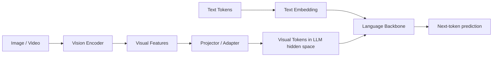
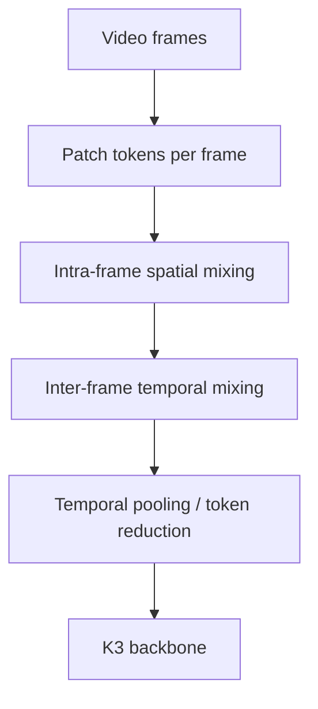

# 05. Native Multimodal 계보: Kimi-VL → K2.5 → MoonViT-V2 → K3

작성일: 2026-08-19  
상위 문서: [Kimi K3 Study Guide](README.md)

## 1. K3의 Vision을 '이미지 Encoder 하나 붙였다'고 보면 안 되는 이유

Kimi K3는 **Native Multimodal(네이티브 멀티모달, 모델의 foundation training부터 여러 modality를 함께 학습하는 방식)** model이다.

이 설계는 갑자기 나온 것이 아니다.

```text
Kimi k1.5
  └─ multimodal reasoning RL 경험

Kimi-VL
  └─ MoonViT native-resolution vision encoder
  └─ long-context VLM

Kimi K2
  └─ 1T language/agentic foundation

Kimi K2.5
  └─ K2-Base + ~15T mixed vision/text continual pretraining
  └─ joint text-vision SFT/RL
  └─ Agent Swarm

Kimi K3
  └─ MoonViT-V2를 scratch부터 next-token objective로 공동 학습
  └─ text/image/video information flow를 더 foundation-level로 통합
```

K3의 vision path를 이해하려면 `vision encoder → projector → language backbone`이라는 VLM 기본 구조뿐 아니라 **어느 시점부터 두 modality를 같이 학습했는가**가 중요하다.

---

## 2. VLM의 가장 기본적인 구조

Vision-Language Model(비전 랭귀지 모델; VLM)의 전형적인 구조를 단순화하면:



핵심 문제는 세 가지다.

1. 이미지/비디오를 어떤 visual representation으로 만들 것인가?
2. visual representation을 text model hidden space에 어떻게 넣을 것인가?
3. vision과 text를 언제, 어떤 objective로 같이 학습할 것인가?

---

# 3. Vision Transformer의 기본

**Vision Transformer(비전 트랜스포머; ViT)**는 image를 patch로 나눠 token sequence처럼 처리한다.

Image 크기 $H\times W$, patch size $P$라면 patch count는 대략:

```math
N=\frac{H}{P}\times\frac{W}{P}
```

이다.

예를 들어 1024×1024 image와 14×14 patch를 단순 계산하면 수천 visual tokens가 생긴다.

고해상도 image에서는 token 수가 급격히 증가한다.

```math
N\propto HW
```

따라서 native-resolution VLM에서는:

- dynamic resolution
- patch packing
- token merging
- pixel shuffle
- local/global vision attention

같은 token-count control이 매우 중요하다.

---

# 4. Kimi-VL과 MoonViT

Kimi-VL은 Moonshot의 vision lineage에서 중요한 공개 모델이다.

공식 technical report는:

- MoE language decoder
- 약 2.8B activated LLM parameters
- 128K context
- native-resolution vision encoder **MoonViT**
- image/video/document/OCR/agent tasks
- long-thinking multimodal SFT+RL

을 공개했다.

### Native Resolution의 의미

모든 이미지를 하나의 작은 fixed resolution으로 강제 resize하면:

- 작은 글자
- UI element
- document/table
- high-resolution chart

정보가 손실될 수 있다.

MoonViT 계열은 원본 aspect ratio와 resolution을 더 잘 활용하면서 compute/token 수를 관리하는 방향이다.

---

# 5. Kimi K2.5: K2 Foundation과 Vision 계보의 합류

K2.5는 K2-Base 위에서 **약 15T mixed visual/text tokens의 continual pretraining**을 수행한 native multimodal agentic model로 공개됐다.

K2 architecture 자체는 유지한다.

- 약 1T total / 32B active
- 61 layers
- MLA
- 384/top-8 experts
- hidden 7168

여기에:

- MoonViT vision encoder 약 400M
- 256K context
- native text+vision pretraining
- zero-vision SFT
- joint text-vision RL

을 추가한다.

즉 K2.5의 의미는 단순히 K2에 image QA dataset을 SFT한 것이 아니다.

> **대규모 language foundation을 visual tokens까지 포함하는 pretraining distribution으로 다시 확장했다.**

---

## 6. Continual Pretraining이란

**Continual Pretraining(컨티뉴얼 프리트레이닝, 기존 pretrained model에서 next-token pretraining을 추가로 이어가는 것)**은 SFT보다 foundation representation 자체를 더 깊게 바꾼다.

K2.5의 개념:

```text
K2-Base language checkpoint
       ↓
mixed text + image/video tokens
       ↓
next-token continual pretraining
       ↓
multimodal foundation
       ↓
SFT / RL
```

반면 post-hoc adapter 방식은:

```text
frozen/mostly-fixed LLM
 + pretrained vision encoder
 + projector alignment
```

에 더 가깝다.

K2.5는 앞쪽에 더 가깝고 K3는 이 방향을 더 밀어붙인다.

---

# 7. Zero-Vision SFT의 의미

K2.5 report는 **Zero-Vision SFT(제로 비전 SFT)**를 중요한 recipe로 다룬다.

핵심 문제:

Multimodal model을 post-training할 때 visual instruction data만 강하게 섞으면 기존 text reasoning/coding 능력을 훼손할 수 있다.

반대로 text-only SFT만 하면 vision capability가 충분히 alignment되지 않을 수 있다.

Zero-vision sample/strategy의 큰 목적은 **text capability와 multimodal capability의 interference를 줄이고 joint model을 안정적으로 post-train**하는 데 있다.

세부 recipe와 weighting은 K2.5 report를 기준으로 확인한다.

---

# 8. Joint Text-Vision RL

K2.5는 text reasoning RL과 visual reasoning RL을 별도 model로 분리하지 않고 같은 policy에 적용한다.

Task 예:

- visual math
- document reasoning
- screenshot/UI understanding
- image-grounded tool use
- coding from visual specification

이것은 K3의 `native multimodal agentic model` post-training으로 이어진다.

---

# 9. Agent Swarm은 Model Architecture인가?

K2.5의 대표 기능인 **Agent Swarm(에이전트 스웜, 여러 sub-agent를 동적으로 병렬 실행하는 orchestration framework)**은 base Transformer layer architecture와는 다른 층위다.

```text
Model Architecture
  K2.5 checkpoint / VLM backbone

Agent Runtime
  planner / task decomposition
  dynamic sub-agent creation
  parallel execution
  result aggregation
```

이를 구분해야 한다.

Agent Swarm은 K2.5/K3의 agentic capability를 실제 runtime에서 horizontal scaling하는 system이며 `attention mechanism`이나 `MoE routing`과는 다르다.

다만 model이 swarm을 잘 활용하도록 agentic training이 필요하므로 model/post-training과 system이 연결된다.

---

# 10. K3의 MoonViT-V2

K3는 **MoonViT-V2**를 사용한다.

공개 K3 수치:

| 항목 | MoonViT-V2 |
|---|---:|
| Parameters | 약 401M |
| Layers | 27 |
| Hidden dimension | 1024 |
| Intermediate | 4096 |
| Heads | 12 |
| Patch size | 14 |
| QKV hidden | 1536 |

K3 language hidden dimension은 7168이므로 vision features는 projector/token merge path를 거쳐 language backbone이 처리할 수 있는 representation으로 변환된다.

---

# 11. K3에서 가장 중요한 변화: Vision Encoder를 Scratch부터 같이 학습

K3 기술보고서는 MoonViT-V2를 **next-token prediction objective로 scratch부터 training**한다고 설명한다.

K2.5 계보에서 pretrained vision representation을 활용했던 접근보다 더 강한 integration이다.

왜 중요한가?

### 11.1 Objective Alignment

Contrastive image-text model의 feature는 image/text alignment에는 좋지만 autoregressive next-token prediction에 최적화된 representation과 완전히 같지는 않다.

### 11.2 Training Dynamics Alignment

Language backbone과 vision encoder가 처음부터 같은 next-token objective 아래 co-adapt할 수 있다.

### 11.3 Modality Boundary 감소

`vision encoder를 먼저 완성 → LLM에 맞추기`보다 visual token representation 자체가 K3 backbone이 필요로 하는 방식으로 학습될 수 있다.

K3 report는 이 선택이 training stability와 native integration에 중요하다고 설명한다.

---

# 12. Next-Token Prediction으로 Image를 학습한다는 의미

이미지를 직접 다음 픽셀로 생성한다는 뜻이 아니다.

Visual encoder가 image/video를 representation tokens로 만들고 language backbone이 text/structured sequence의 next token을 예측한다.

Loss는 여전히 autoregressive language-model objective 계열이다.

```math
\mathcal L
=-\sum_t\log p(x_t\mid x_{<t},V)
```

- $V$: image/video visual representation
- $x_t$: output/text token

Vision encoder는 이 loss의 gradient를 받아 `다음 token prediction에 유용한 visual feature`를 학습한다.

---

# 13. Image와 Video를 하나의 Encoder로 처리하는 문제

Video는 image frame sequence다.

Naïve하게 모든 frame의 모든 patch를 global attention하면 token 수가 폭발한다.

K3 MoonViT-V2는 image/video parameter를 공유하면서 video에서는 spatial/temporal structure를 분리한다.

### Intra-frame Spatial Attention

한 frame 내부 patch 관계를 처리한다.

### Inter-frame Temporal Attention

시간축의 frame 관계를 처리한다.



이렇게 factorize하면 모든 spatial×temporal token pair를 한꺼번에 보는 것보다 계산을 줄일 수 있다.

---

# 14. Pixel Shuffle과 Visual Token Compression

K3 report는 **2×2 Pixel Shuffle(픽셀 셔플, 인접 spatial token을 channel 쪽으로 재배열/병합하는 기법)**로 visual token 수를 줄인다.

2×2 group을 하나의 output 위치로 합치면 spatial token count는 대략 1/4이 된다.

```math
N_{visual}\rightarrow N_{visual}/4
```

왜 필요한가?

High-resolution 3584×3584 수준 image는 patch token이 매우 많다.

Visual tokens는 이후 language backbone의 93 layers를 통과하므로 vision encoder 자체 compute뿐 아니라 **LLM sequence length 비용**도 만든다.

따라서 projector 전에 token count를 줄이는 것이 매우 중요하다.

---

# 15. Native Resolution과 1M Context의 연결

고해상도 image/document/video는 visual token을 많이 만든다.

1M context는 text 문서만을 위한 기능이 아니다.

다음 workload도 가능해진다.

- 긴 PDF/document + screenshots
- 여러 high-resolution images
- 긴 video representation + text trace
- tool-use trajectory + visual observations

즉 K3의 long-context architecture와 native multimodality는 서로 독립적인 marketing feature가 아니라 **같은 context-budget 문제를 공유**한다.

KDA/MLA hybrid가 visual-heavy sequence에서도 memory/attention 비용을 줄이는 배경이다.

---

# 16. Visual Tokens가 KDA를 통과한다는 의미

K3 backbone에 들어온 뒤 visual tokens도 같은 sequence mixer를 거친다.

따라서 KDA recurrent state는 text-only memory가 아니라 multimodal history를 압축할 수 있다.

개념적으로:

```text
[text][image tokens][text][tool result][image tokens]...
                    ↓
             unified K3 backbone
                    ↓
       KDA state + periodic MLA memory
```

다만 KDA state channel이 `vision channel`, `text channel`로 사람이 정한 고정 분할을 가진다는 뜻은 아니다. Unified representation은 학습으로 형성된다.

---

# 17. K2.5와 K3의 Vision 계보 비교

| 항목 | Kimi K2.5 | Kimi K3 |
|---|---|---|
| Language foundation | K2-Base continual pretraining | K3 foundation 공동 학습 |
| Vision encoder | MoonViT | MoonViT-V2 |
| Vision params | 약 400M | 약 401M |
| Multimodal training | ~15T mixed visual/text continual pretraining | native joint pretraining from scratch |
| Context | 256K | 1M |
| Language attention | MLA | KDA + Gated MLA |
| Agent architecture | Agent Swarm introduced | K3 agentic/swarm runtime 계승/확장 |
| Video | native multimodal | shared image/video + factorized spatial/temporal design |

---

# 18. Multimodal Model에서 Serving이 어려워지는 이유

Vision request는 text request와 cost profile이 다르다.

### Encoder Compute

MoonViT-V2 forward가 추가된다.

### Variable Token Count

Image resolution/video duration에 따라 visual token 수가 크게 달라진다.

### Prefill Heavy

대부분 visual tokens는 prompt/prefill 쪽에 몰린다.

### Cache

Visual token representation도 KDA/MLA state/cache를 만든다.

### Scheduler

같은 `request 1개`라도 1K text request와 high-res multi-image request의 cost가 매우 다르다.

따라서 serving admission/scheduling은 raw request count보다 token/vision encoder cost를 봐야 한다.

---

# 19. K3 Deployment에서 Vision Path 확인 항목

1. vLLM이 Kimi-K3 multimodal processor를 지원하는가?
2. MoonViT-V2 encoder가 TP/DP 중 어떻게 실행되는가?
3. image resolution별 visual token 수는?
4. pixel shuffle/merge가 backend에서 reference와 동일한가?
5. video path가 third-party engine에서 지원되는가?
6. encoder output caching이 가능한가?
7. visual input이 prefix cache hash에 어떻게 포함되는가?
8. P/D disaggregation에서 vision encoder는 prefill side에만 배치 가능한가?
9. vision encoder memory가 model weights/cache budget에 얼마나 추가되는가?
10. high-resolution request의 admission control을 text token과 어떻게 통합할 것인가?

---

# 20. 이 장의 핵심 정리

1. K3 multimodality는 Kimi-VL과 K2.5에서 이어진 별도의 연구 계보다.
2. Kimi-VL은 MoonViT native-resolution vision과 efficient MoE VLM을 공개했다.
3. K2.5는 K2-Base에 약 15T mixed vision/text continual pretraining을 수행해 native multimodal agentic model로 확장했다.
4. K3는 MoonViT-V2를 next-token prediction objective로 scratch부터 language backbone과 공동 학습한다.
5. MoonViT-V2는 약 401M, 27-layer vision encoder다.
6. Video에서는 spatial/temporal processing을 factorize하고 visual token 수를 pooling/merge한다.
7. 2×2 pixel shuffle은 visual token count를 대략 1/4로 줄여 downstream LLM cost를 낮춘다.
8. 1M context와 multimodality는 high-resolution/multi-image/video sequence budget에서 직접 연결된다.
9. Agent Swarm은 Transformer architecture가 아니라 model capability를 runtime에서 병렬 scale하는 agent system이다.
10. K3 serving에서는 vision encoder cost와 visual token count까지 scheduler/cache design에 포함해야 한다.

---

# 21. 원문

- Kimi-VL Technical Report  
  https://arxiv.org/abs/2504.07491
- Kimi K2.5 official repository/report  
  https://github.com/MoonshotAI/Kimi-K2.5
- Kimi K3 official repository/report  
  https://github.com/MoonshotAI/Kimi-K3
