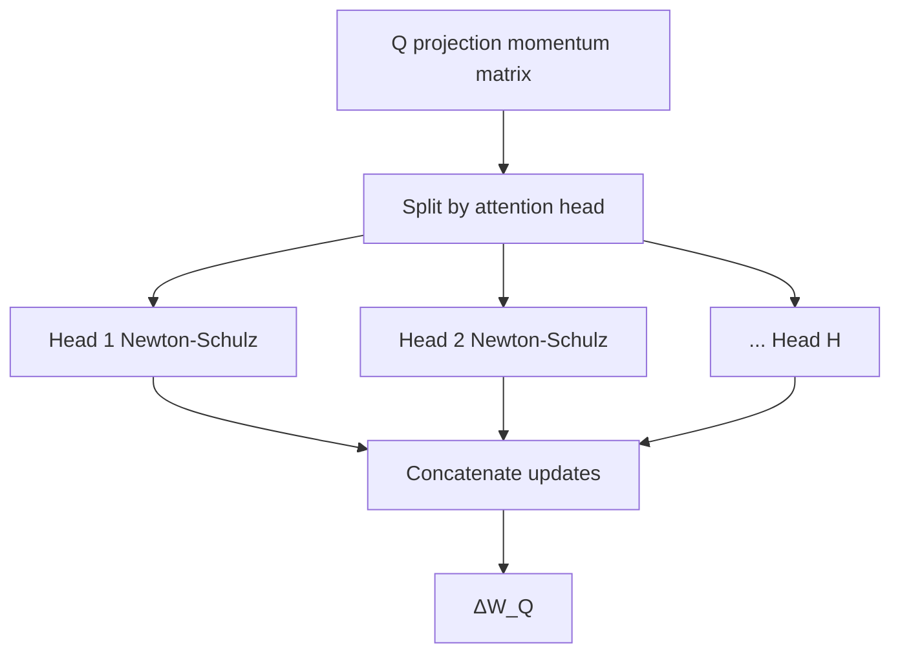

# 06. Optimization, Scaling, Pretraining: Muon → MuonClip → Per-Head Muon

작성일: 2026-08-19  
상위 문서: [Kimi K3 Study Guide](README.md)

## 1. 이 장의 목표

K3 architecture만 보고 `이 구조를 학습하면 K3가 된다`고 생각하면 안 된다.

2.8T parameter MoE를 안정적으로 학습하려면 optimization 자체가 architecture scale에 맞춰져야 한다.

Moonshot의 optimizer 계보를 단순화하면:

```text
AdamW-dominated LLM training baseline
            ↓
Muon large-scale study
  matrix-aware orthogonalized updates
            ↓
Kimi K2 MuonClip
  scale matching + weight decay + Q/K stability
            ↓
Kimi K3 Per-Head Muon
  Q/K/V head-wise orthogonalization
  + K2 stability techniques
```

그리고 K3 pretraining은:

- native multimodal next-token training
- progressive context-length curriculum
- cosine LR schedule
- long-context data engineering
- QAT-aware post-training

까지 하나의 pipeline으로 이어진다.

---

# 2. Optimizer는 무엇을 하는가

Gradient descent의 기본:

$$
W_{t+1}=W_t-\eta G_t
$$

- $W_t$: 현재 parameter
- $G_t=\nabla_W\mathcal L$: gradient
- $\eta$: learning rate

하지만 실제 LLM에서는 raw gradient를 그대로 쓰지 않는다.

Optimizer는:

- momentum
- adaptive scaling
- weight decay
- matrix geometry

등을 이용해 parameter update $\Delta W$를 만든다.

---

# 3. AdamW의 기본 관점

**AdamW(아담더블유)**는 각 parameter element의 1차/2차 moment를 추적한다.

단순화하면:

$$
m_t=\beta_1m_{t-1}+(1-\beta_1)g_t
$$

$$
v_t=\beta_2v_{t-1}+(1-\beta_2)g_t^2
$$

$$
\Delta w_t
\propto
\frac{m_t}{\sqrt{v_t}+\epsilon}
$$

각 scalar parameter마다 adaptive scale이 있다.

장점:

- 매우 검증됨
- robust
- framework ecosystem 성숙

하지만 matrix parameter의 row/column geometry를 직접 이용하지 않는다.

---

# 4. Muon의 핵심: Matrix Update를 Matrix로 본다

**Muon(뮤온)**은 2D weight matrix의 update를 하나의 matrix object로 취급한다.

Momentum matrix $M$을 만든 뒤 그 singular directions를 orthogonalized 형태에 가깝게 변환한다.

직관:

```text
Raw update matrix
  singular direction A: very large
  singular direction B: medium
  singular direction C: tiny

Muon-like orthogonalization
  ↓
directions become more uniformly scaled
```

즉 특정 direction 하나가 update norm 대부분을 차지하는 것을 줄이고 matrix의 여러 feature direction을 더 균등하게 업데이트하려는 관점이다.

---

# 5. SVD와 Orthogonalization의 직관

Matrix $M$의 singular value decomposition:

$$
M=U\Sigma V^\top
$$

- $U,V$: orthogonal directions
- $\Sigma$: singular values

이상적인 matrix sign/orthogonalized update를 개념적으로:

$$
UV^\top
$$

같이 볼 수 있다.

하지만 매 optimizer step마다 SVD를 직접 하면 너무 비싸다.

Muon은 **Newton–Schulz Iteration(뉴턴-슐츠 이터레이션)** 같은 matrix iteration으로 유사한 orthogonalization을 효율적으로 근사한다.

---

# 6. Newton–Schulz Iteration은 왜 쓰이는가

Newton–Schulz는 matrix inverse/inverse-square-root/sign과 관련된 iterative approximation에 사용되는 알고리즘 계열이다.

Muon implementation에서는 normalize된 update matrix에 polynomial iteration을 반복하여 singular values를 원하는 범위/shape로 변환한다.

핵심은 정확한 식 암기가 아니다.

> **큰 SVD를 직접 실행하지 않고 GEMM-friendly matrix iteration으로 update를 orthogonalized 형태에 가깝게 만든다.**

GEMM 위주이므로 GPU에서 실행하기 좋지만 optimizer step 자체의 compute/communication cost가 생긴다.

---

# 7. Muon이 LLM Scale에서 어려웠던 이유

작은 model에서 잘 동작하는 matrix optimizer가 trillion-scale에서도 자동으로 잘 동작하지는 않는다.

### Update Scale

Matrix shape가 layer마다 다르면 orthogonalized update의 RMS/parameter scale이 일관되지 않을 수 있다.

### Weight Growth

Weight decay가 적절히 없으면 parameter norm dynamics가 달라질 수 있다.

### Distributed Cost

Large matrix update를 여러 GPU에 shard한 상태에서 orthogonalization을 어떻게 수행할지 필요하다.

Muon scalability 연구는:

- weight decay
- careful per-parameter update scale
- distributed memory/communication-efficient implementation

으로 large LLM에 확장할 수 있음을 보여줬다.

---

# 8. K2의 MuonClip

Kimi K2는 1T MoE pretraining에 Muon을 사용하면서 training instability를 위한 추가 방법을 도입했다.

K2의 MuonClip 계보를 이해하는 핵심 세 가지:

### 8.1 Muon Update

Matrix-aware orthogonalized momentum update.

### 8.2 RMS Matching / Scale Control

Parameter shape마다 update RMS가 지나치게 달라지지 않도록 scale을 조정한다.

### 8.3 QK-Clip

Attention Q/K 관련 weight/logit instability를 head-wise로 감시하고 과도한 scale growth를 억제한다.

K2 report는 15.5T-token pretraining 동안 loss spike 없이 1T model을 학습했다고 보고한다.

---

# 9. 왜 Q/K가 특별한가

Attention score는:

$$
s=q^\top k
$$

이다.

Q/K projection weight scale이 커지면 q/k norm도 커지고 score magnitude가 증가할 수 있다.

Softmax:

$$
\operatorname{softmax}(s)
$$

는 큰 logit difference에서 매우 sharp해진다.

Extreme case에서는:

- numerical instability
- entropy collapse
- gradient spike

등이 발생할 수 있다.

따라서 attention Q/K는 일반 FFN matrix와 동일한 monitoring만으로 부족할 수 있다.

---

# 10. K3의 Per-Head Muon

K3는 Q/K/V projection에서 Muon orthogonalization을 **head별**로 수행한다.

일반 projection matrix를:

$$
W_Q\in\mathbb{R}^{H\cdot d_h\times d}
$$

라고 하자.

Vanilla matrix-level Muon은 전체 $W_Q$ update를 하나의 matrix로 orthogonalize한다.

Per-Head Muon은 이를:

$$
W_Q=
\begin{bmatrix}
W_Q^{(1)}\\
W_Q^{(2)}\\
\vdots\\
W_Q^{(H)}
\end{bmatrix}
$$

로 보고 head-specific matrix마다 update orthogonalization을 수행한다.



---

# 11. 왜 Head-wise가 더 자연스러운가

Q/K/V projection은 출력 dimension 전체가 하나의 homogeneous feature matrix가 아니다.

Architecture가 명시적으로 head로 나뉜다.

```text
Q head 0
Q head 1
...
Q head H-1
```

각 head는 독립적인 attention/state subspace를 가진다.

전체 matrix를 한 번에 orthogonalize하면 서로 다른 head의 update scale/direction이 한 matrix decomposition에서 경쟁할 수 있다.

Per-Head Muon은 architecture의 natural unit과 optimizer unit을 일치시킨다.

K3 report는 이를 통해 head별 update scale을 더 균등하게 만들고 stability를 개선했다고 설명한다.

---

# 12. KDA에서 Per-Head Optimizer가 특히 자연스러운 이유

KDA는 head별 recurrent state를 가진다.

각 head의 Q/K/V projection은 해당 head state dynamics를 직접 결정한다.

특히 key는 Delta Rule transition:

$$
(I-\beta kk^\top)
$$

에 들어간다.

따라서 일부 head의 K projection update가 지나치게 크거나 불안정하면 recurrent state dynamics 자체가 영향을 받을 수 있다.

K3의 Per-Head Muon은 attention architecture와 optimizer geometry를 더 밀접하게 맞추는 설계다.

---

# 13. Pretraining Objective: Native Multimodal Next-Token Prediction

K3는 text-only model을 완성한 뒤 vision을 붙이는 것이 아니라 text/vision inputs를 foundation training에서 함께 사용한다.

Objective는 기본적으로 autoregressive next-token loss다.

$$
\mathcal L_{NTP}
=-\sum_t\log p(x_t\mid x_{<t},V)
$$

Vision encoder도 이 gradient를 함께 받는다.

이 구조의 장점은 model architecture 전체가 처음부터 multimodal prediction에 co-adapt하는 것이다.

---

# 14. Learning Rate Schedule

K3 report는 **Cosine Learning Rate Schedule(코사인 러닝레이트 스케줄)**을 사용한다.

전형적인 cosine decay:

$$
\eta(t)
=
\eta_{min}
+\frac12(\eta_{max}-\eta_{min})
\left(1+\cos\frac{\pi t}{T}\right)
$$

이다.

초기 약 1% warmup 후 cosine decay를 수행하고 weight decay 0.1을 사용한다.

정확한 token count/lr endpoint는 K3 report의 training configuration을 기준으로 확인한다.

---

# 15. Warmup은 왜 필요한가

Random/early checkpoint에서 activation, optimizer moments, routing distribution이 안정되지 않은 상태로 큰 learning rate를 바로 사용하면 divergence 위험이 크다.

Warmup:

```text
small LR
  ↓
gradually increase
  ↓
main LR schedule
```

로 초기 model dynamics를 안정화한다.

MoE에서는 router/expert utilization도 초기 학습 중 형성되므로 특히 중요할 수 있다.

---

# 16. Context Length Curriculum

K3는 처음부터 모든 training sample을 1M context로 학습하지 않는다.

큰 흐름:

```text
Pretraining
8K → 64K

Cooldown / long-context extension
256K → 1M
```

왜 단계적으로 늘리는가?

### Compute Efficiency

초기부터 1M sequence는 너무 비싸다.

### Data Availability

1M 고품질 contiguous data는 제한적이다.

### Optimization

먼저 short/medium context에서 language/model capacity를 학습한 뒤 long-context dependency를 확장하는 편이 효율적이다.

### System Stability

KDA/MLA long-sequence kernels와 distributed context parallelism을 late training phase에서 집중적으로 사용할 수 있다.

---

# 17. K3가 RoPE Extension에 덜 의존하는 이유

K3의 KDA recurrent layer는 sequence order를 state transition 자체로 표현한다.

Gated MLA는 NoPE로 공개돼 있다.

따라서 conventional RoPE model의 128K→1M extension처럼:

- rope theta 변경
- YaRN scaling
- NTK interpolation

을 architecture 전체에서 조정하는 문제가 중심이 아니다.

물론 `position 문제가 완전히 없다`는 뜻은 아니다. KDA state의 memory timescale, training data, long-context curriculum이 그 역할을 대신 크게 담당한다.

Attention 상세:

- [Kimi-K3 Attention Architecture](../../study/attention/10-kimi-k3.md)

---

# 18. Long-Context Data가 Architecture만큼 중요한 이유

1M context를 지원하는 tensor shape만 만들었다고 model이 1M 정보를 활용하는 것은 아니다.

Training data가 실제로:

- 먼 위치 정보 retrieval
- 여러 scattered clues 결합
- long repository dependency
- multi-document reasoning
- long tool trajectory

를 요구해야 한다.

K3는 long-context data cleaning과 synthetic scattered-information tasks를 사용해 model이 긴 context를 실제로 사용하는 능력을 학습한다.

즉:

```text
1M max_position / kernel support
≠
1M usable intelligence
```

다.

---

# 19. Scaling Efficiency 2.5×는 무엇을 의미하는가

K3 official introduction은 K2 대비 architecture 변경을 통해 overall scaling efficiency가 약 2.5× 개선됐다고 설명한다.

이런 숫자를 `K3가 K2보다 2.5배 빠르다`로 해석하면 안 된다.

Scaling efficiency는 model quality와 compute/parameter scale의 Pareto improvement를 가리키는 architecture/training 비교 개념이다.

K3는 active parameter 자체가 K2보다 훨씬 크므로 absolute inference latency가 단순 2.5배 빨라진다는 뜻이 아니다.

실제 serving throughput은 separate benchmark가 필요하다.

---

# 20. Quantization-Aware Training과 Pretraining의 연결

K3 deployment target은 expert weights를 낮은 precision으로 사용한다.

공식 model summary:

- MXFP4 weights
- MXFP8 activations
- QAT

하지만 QAT는 base pretraining 초기부터 동일하게 적용한다는 뜻이 아니라 **post-training 단계 전체에서 quantized inference behavior를 모델이 경험하도록 설계**한 것이 중요하다.

이 부분은 다음 문서에서 자세히 다룬다.

- [07-posttraining-agentic-rl-and-speculative.md](07-posttraining-agentic-rl-and-speculative.md)

---

# 21. Training Stability를 시스템적으로 본다

2.8T model training에서 instability 한 번은 엄청난 compute waste다.

Stability mechanism을 layer별로 보면:

| 위치 | Mechanism |
|---|---|
| optimizer | Per-Head Muon, K2 scale controls |
| attention | normalized K/Q, bounded KDA decay |
| MoE activation | RMSNorm + SiTU-GLU |
| routing | Quantile Balancing |
| residual/depth | Block AttnRes normalized selection |
| LR | warmup + cosine schedule |
| context | progressive curriculum |

즉 K3의 안정성은 특정 `gradient clipping` 하나가 아니라 architecture 전체에 분산돼 있다.

---

# 22. Model/System Co-design 관점

K3에서는 training objective와 hardware가 분리돼 있지 않다.

예:

### KDA Lower-Bounded Decay

FlashKDA BF16 chunkwise kernel의 numerical range와 연결.

### LatentMoE

EP communication/weight bandwidth를 줄이기 위해 hidden width를 latent로 압축.

### Per-Head Muon

Q/K/V architecture unit과 optimizer matrix unit을 정렬.

### Block AttnRes

Full depth memory 대신 fixed block sources로 system overhead 감소.

Architecture parameter가 GPU/runtime feasibility를 반영한다.

---

# 23. 이 장의 핵심 정리

1. Muon은 element-wise adaptive optimizer와 달리 2D matrix update geometry를 직접 이용한다.
2. Newton–Schulz iteration을 통해 expensive SVD 없이 orthogonalized update를 GEMM-friendly하게 근사한다.
3. Large-scale Muon에는 weight decay와 update RMS/scale control이 중요하다.
4. K2의 MuonClip은 Q/K attention instability까지 포함한 1T-scale 안정화 계보다.
5. K3는 Q/K/V projection을 head별 matrix로 보고 Per-Head Muon을 적용한다.
6. KDA state dynamics 때문에 head-wise Q/K update stability는 특히 중요하다.
7. K3는 native multimodal next-token objective로 foundation을 학습한다.
8. Context는 8K→64K, 이후 256K→1M으로 progressive하게 확장한다.
9. Long-context capability는 architecture뿐 아니라 scattered-info data와 curriculum이 필요하다.
10. K3의 stability는 optimizer, MoE, attention, routing, residual, LR schedule에 분산된 co-design 결과다.

---

# 24. 이 장을 읽고 답할 수 있어야 하는 질문

1. AdamW의 element-wise adaptive update와 Muon의 matrix-aware update는 무엇이 다른가?
2. Muon이 SVD 대신 Newton–Schulz를 사용하는 이유는 무엇인가?
3. Orthogonalized update가 singular direction dominance를 줄인다는 의미는 무엇인가?
4. MuonClip에서 attention Q/K stability를 따로 보아야 하는 이유는 무엇인가?
5. K3가 Q/K/V projection을 head별로 orthogonalize하는 architecture-level 이유는 무엇인가?
6. 처음부터 1M context로 pretrain하지 않는 이유는 무엇인가?
7. K3가 conventional RoPE scaling technique에 덜 의존할 수 있는 이유는 무엇인가?
8. `1M context support`와 `1M context를 잘 활용하는 model`의 차이는 무엇인가?

---

# 25. 원문

- Muon is Scalable for LLM Training  
  https://arxiv.org/abs/2502.16982
- Kimi K2 Technical Report  
  https://github.com/MoonshotAI/Kimi-K2
- Kimi K3 Technical Report  
  https://github.com/MoonshotAI/Kimi-K3
