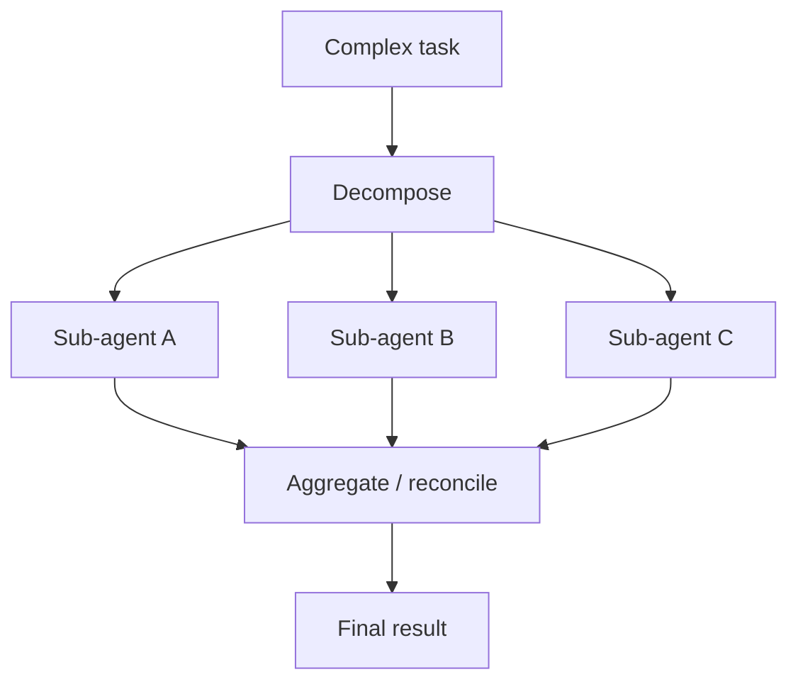
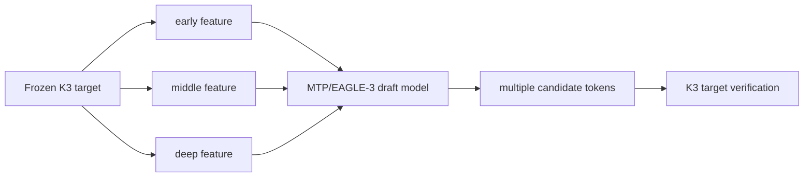
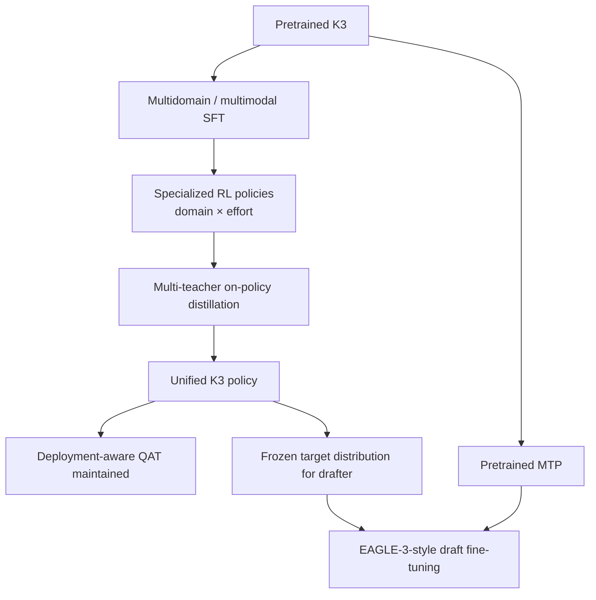

# 07. Post-Training 계보: Kimi k1.5 → K2 → K2.5 → K3 RL, MTP와 Speculative Decoding

작성일: 2026-08-19  
상위 문서: [Kimi K3 Study Guide](README.md)

## 1. 이 장의 목표

K3의 architecture가 아무리 좋아도 pretraining checkpoint만으로 현재의 coding/agentic/reasoning capability가 만들어지는 것은 아니다.

Moonshot의 post-training 연구선은 architecture와 별도로 발전해 왔다.

```text
Kimi k1.5
  long-context RL
  partial rollouts
  long-CoT scaling
        ↓
Kimi K2
  agentic data synthesis
  RLVR + critique/reward
        ↓
Kimi K2.5
  joint text-vision RL
  Agent Swarm
        ↓
Kimi K3
  domain × reasoning-effort RL
  multi-teacher on-policy distillation
  generative reward model
  long-horizon tool environments
  QAT-integrated post-training
  MTP → EAGLE-3-style speculative drafter
```

K3를 이해할 때 `모델 구조`와 `학습된 behavior`를 분리해 설명할 수 있어야 한다.

---

# 2. Pretraining과 Post-training의 역할 차이

## Pretraining

기본 next-token objective:

```math
\mathcal L_{NTP}
=-\sum_t\log p(x_t\mid x_{<t})
```

주로:

- world knowledge
- language/code representation
- general pattern learning
- multimodal foundation

을 형성한다.

## Supervised Fine-Tuning(SFT)

Curated instruction-response/trajectory로 desired response format과 task behavior를 학습한다.

## Reinforcement Learning(RL)

Model이 직접 rollout한 trajectory를 reward로 평가하고 policy를 개선한다.

```text
policy
  ↓ generate trajectory
trajectory
  ↓ environment / verifier / reward model
reward
  ↓ policy update
better policy
```

Agentic task에서 중요한 이유는 `정답 response 하나를 imitation`하는 것보다 **여러 단계 action 결과를 경험하며 학습**할 수 있기 때문이다.

---

# 3. Kimi k1.5: Moonshot RL Scaling의 중요한 뿌리

Kimi k1.5의 핵심 연구 질문은:

> **Pretraining compute 외에 RL rollout/interaction compute를 어떻게 scale해 reasoning을 계속 개선할 것인가?**

이었다.

공식 report의 중요한 요소:

- long-context RL
- long Chain-of-Thought
- partial rollouts
- improved policy optimization
- multimodal reasoning RL
- long-to-short methods

K3의 reasoning-effort control과 long-horizon agentic RL을 이해하려면 이 계보가 중요하다.

---

# 4. Long-CoT가 RL 비용을 키우는 이유

Reasoning trajectory가 길어지면 한 rollout의 token 수가 커진다.

```math
C_{rollout}\propto T_{prompt}+T_{reason}+T_{answer}
```

RL에서는 같은 prompt에 여러 rollout을 만들 수 있으므로 비용이 더 커진다.

또 long context에서 일부 trajectory가 잘못돼도 처음부터 다시 생성하면 많은 compute가 낭비된다.

Kimi k1.5의 **Partial Rollout(파셜 롤아웃, 기존 trajectory 일부를 재사용하고 이후 구간부터 다시 sampling하는 방식)**은 이런 long-horizon RL compute를 효율화하는 아이디어 중 하나다.

---

# 5. Long-to-Short의 의미

Long reasoning model은 품질은 좋지만 latency/token cost가 크다.

**Long-to-Short(롱투쇼트)** 계열은 long-CoT policy에서 학습한 reasoning capability를 더 짧은 output policy로 전달한다.

방법론 범주는:

- distillation
- rejection/selection
- long solution supervision
- policy optimization

등을 조합할 수 있다.

K3의 여러 reasoning effort mode를 이해할 때 중요한 기본 관점:

> reasoning quality를 하나의 고정 output-token budget으로만 학습할 필요는 없다.

---

# 6. K2: Agentic Data Synthesis

K2에서 post-training은 reasoning benchmark를 넘어서 tool-use agent를 본격적으로 다룬다.

전통 instruction data:

```text
User question → Assistant answer
```

Agentic trajectory:

```text
Task
 → reason
 → tool call
 → observation
 → reason
 → tool call
 → observation
 → final result
```

K2는 tool specification과 synthetic task/environment를 사용해 대규모 trajectories를 만든다.

### 왜 Synthetic Agentic Data가 필요한가

실제 human-produced tool trajectory는 비싸고 scale이 작다.

반면 API/tool specification은 많다.

```text
Tool descriptions
  ↓
synthesize tasks requiring those tools
  ↓
execute trajectories
  ↓
verify/filter
```

로 agentic data를 확장할 수 있다.

---

# 7. RLVR와 Non-Verifiable Reward를 분리한다

## RLVR

**Reinforcement Learning with Verifiable Rewards(검증 가능한 보상 RL)**는 programmatic verifier가 있는 task에 적합하다.

```text
Math answer → exact check
Code → unit tests
Kernel → correctness/performance tests
```

Reward 신뢰도가 높다.

## Non-Verifiable Task

Knowledge work, writing, open-ended research는 exact verifier가 없다.

이 경우:

- judge model
- rubric
- critique
- generative reward model

이 필요하다.

K2부터 두 reward world를 함께 다루고 K3에서 더 정교해진다.

---

# 8. K2.5: Multimodal RL과 Agent Swarm

K2.5는 K2의 language/agentic foundation에 vision을 결합하면서 post-training도 multimodal로 확장한다.

### Joint Text-Vision RL

- screenshot understanding
- visual coding
- document/image reasoning
- visual tool use

같은 trajectory를 같은 policy에서 학습한다.

### Agent Swarm

한 agent가 task를 순차 처리하는 대신 task를 여러 heterogeneous subtask로 분해해 병렬 sub-agent를 실행한다.



Agent Swarm 자체는 base model layer architecture가 아니라 orchestration runtime이다. 하지만 model이 decomposition, delegation, result synthesis를 잘하도록 post-training해야 한다.

---

# 9. K3의 RL은 Domain과 Reasoning Effort를 동시에 분리한다

K3 post-training은 크게 여러 capability domain을 전문화한다.

공개 report의 대표적인 domain:

- general reasoning/knowledge
- coding
- agentic/tool-use

그리고 각 domain에서 reasoning effort를 여러 수준으로 나눈다.

대표적으로:

```text
low
high
max
```

를 사용해 domain × effort specialized teachers를 만든다.

3 domains × 3 effort levels라면 9개의 specialization axis가 생긴다.

왜 분리하는가?

> `모든 task에서 최대 길이 reasoning을 쓰는 한 policy`는 latency/cost와 behavior control 면에서 비효율적이기 때문이다.

---

# 10. Multi-Teacher On-Policy Distillation

여러 specialized teacher를 최종 하나의 K3 policy로 합쳐야 한다.

K3는 **Multi-Teacher On-Policy Distillation(멀티 티처 온폴리시 디스틸레이션)** 계열을 사용한다.

중요한 것은 ordinary offline distillation과의 차이다.

## Offline Distillation

Teacher가 미리 생성한 static dataset을 student가 imitation한다.

## On-Policy Distillation

Student/current policy가 실제로 방문하는 trajectory distribution에서 teacher signal/reward를 받는다.

```text
Student policy
   ↓ rollout
student trajectory/state distribution
   ↓
specialized teacher evaluation/signal
   ↓
student update
```

장점:

- student가 실제로 만드는 error/state에 teacher가 signal을 제공
- teacher dataset과 student policy distribution mismatch 감소
- 여러 domain teacher를 unified policy에 합치기 쉬움

K3 report는 이를 reasoning-effort/domain capability consolidation에 사용한다.

---

# 11. 왜 여러 Teacher를 직접 하나의 Reward로만 합치지 않는가

Capability마다 reward scale과 task semantics가 다르다.

예:

```text
Code teacher
 → compile/test/performance

Agent teacher
 → tool trajectory / goal completion

General reasoning teacher
 → correctness / judge
```

하나의 monolithic reward만으로 모든 domain을 동시에 최적화하면 interference가 생길 수 있다.

Specialized teacher를 먼저 충분히 최적화한 뒤 unified student에 distill하는 것은 **specialization과 consolidation을 분리**하는 전략이다.

MoE routing에서 expert specialization과 shared model을 분리하는 것과 개념적으로 닮았지만 parameter-level mechanism은 전혀 다르다.

---

# 12. Generative Reward Model

K3는 open-ended agentic task를 평가하기 위해 **Generative Reward Model(제너레이티브 리워드 모델; GRM)** 계열을 사용한다.

Scalar reward model:

```text
trajectory → 0.73
```

보다 generative judge는:

```text
trajectory
 → rubric reasoning
 → compare alternatives
 → identify failure/success evidence
 → verdict/reward
```

처럼 평가 reasoning을 생성할 수 있다.

K3 report는 tournament-style binary comparison과 rubric protocol을 이용해 agentic/open-ended reward를 구성한다.

---

# 13. Tournament-Style Comparison의 직관

절대 점수를 바로 예측하는 것은 어렵다.

```text
A = 7.3/10?
B = 7.6/10?
```

보다:

```text
A vs B → 어느 쪽이 rubric을 더 잘 만족하는가?
```

pairwise comparison이 judge model에 더 안정적인 경우가 많다.

여러 candidate를 tournament처럼 비교해 stronger trajectory를 선택/학습 signal로 사용할 수 있다.

---

# 14. Reward Hacking과 Verbosity

Generative/judge-based reward는 model이 evaluator의 preference loophole을 학습할 위험이 있다.

예:

- 필요 이상으로 긴 설명
- judge가 좋아하는 표현 반복
- rubric keyword stuffing

K3 report는 reward model의 verbosity/budget behavior도 제어한다.

Reasoning effort가 low/high/max로 분리된 model에서는 특히 `길수록 무조건 좋다`는 reward bias를 막아야 한다.

---

# 15. Agentic RL Environment

Agentic RL은 text generation만 실행하면 끝나지 않는다.

실제 environment가 필요하다.

```text
Model
 → terminal command
 → filesystem changes
 → compiler/tests
 → browser/tool calls
 → new observation
 → next action
```

K3 training은:

- web search
- professional knowledge work
- coding
- GPU kernel optimization
- visual reasoning

등 다양한 executable environment를 포함한다.

이 때문에 sandbox infrastructure 자체가 model training system의 일부다.

---

# 16. AgentENV / Sandbox의 필요성

Untrusted model-generated code/tool action을 training cluster host에서 직접 실행할 수는 없다.

필요한 기능:

- isolation
- reproducible environment
- fast reset
- snapshot/restore
- parallel rollout
- preemption

K3 report의 agent environment infrastructure는 Firecracker-style microVM/sandbox를 활용하고 대규모 concurrent rollout을 지원한다.

RL scaling은 GPU training만의 문제가 아니라 **environment execution throughput**도 bottleneck이라는 점이 중요하다.

---

# 17. Multi-Token Prediction은 먼저 Training Objective다

K2/K3에는 **Multi-Token Prediction(멀티 토큰 프레딕션; MTP)** layer가 하나 존재한다.

Next-token prediction:

```math
p(x_{t+1}\mid x_{\le t})
```

만 학습하는 대신 MTP는 더 미래 token을 예측하는 auxiliary objective를 둔다.

목적:

- richer training signal
- future-aware representation
- 추론 시 speculative drafter로 재사용 가능

MTP와 speculative decoding의 일반 원리는:

- [Speculative Decoding Study](../../study/speculative-decoding/2026-08-18-speculative-decoding-mtp-dspark.md)

를 참고한다.

---

# 18. K3 MTP → EAGLE-3-Style Draft Model

K3 post-training에서는 pre-trained MTP module을 **EAGLE-3-style speculative drafter**로 fine-tune한다.

핵심 흐름:



K3 report는 AttnRes block의 서로 다른 depth feature를 drafter 입력에 활용한다.

즉 AttnRes가 inference output뿐 아니라 **speculative drafter가 target의 multi-level representation을 읽는 interface** 역할도 한다.

---

# 19. 왜 Target Model을 Freeze하는가

Speculative drafter training에서는 target distribution이 기준이다.

Target까지 같이 바꾸면 drafter가 따라가야 할 distribution 자체가 움직인다.

그래서:

```text
Target K3 = frozen teacher/verifier
Draft     = trainable
```

로 두고 draft가 target next-token distribution/acceptance behavior를 잘 예측하도록 학습한다.

---

# 20. Draft Unrolling

Draft model은 한 token만 예측하는 것이 아니라 여러 future step을 sequential/structured하게 예측한다.

K3 report는 drafter를 여러 step unroll하여 training한다.

예를 들어 7-step unroll이라면:

```text
state t
 → draft x(t+1)
 → draft x(t+2)
 → ...
 → draft x(t+7)
```

각 뒤쪽 step은 앞쪽 draft error의 영향을 더 많이 받는다.

따라서 teacher-forcing one-step accuracy만 높이는 것보다 multi-step acceptance를 직접 고려한 training이 중요하다.

---

# 21. Speculative Decoding의 진짜 목표는 KL 최소화만이 아니다

Draft distribution $q$가 target $p$와 가깝다고 해서 실제 accepted length가 항상 최대가 되는 것은 아니다.

Speculative decoding의 deployment 목표는:

```math
\mathbb E[\text{accepted tokens per verification}]
```

를 높이는 것이다.

K3 drafter training은 likelihood/acceptance-oriented objective를 사용해 실제 verification acceptance와 더 직접적으로 맞추려 한다.

즉:

> **draft를 작은 language model로 잘 만드는 것보다 target verifier가 많이 받아들이는 candidate generator로 만드는 것이 목적이다.**

---

# 22. KDA와 Speculative State Rollback

K3는 recurrent KDA state를 사용한다.

Draft candidate를 target으로 여러 token advance하면:

```math
S_t\rightarrow S_{t+1}\rightarrow\cdots\rightarrow S_{t+k}
```

state도 변한다.

중간 token에서 reject되면 accepted boundary state로 돌아가야 한다.

Full KV cache는 rejected suffix block을 버리면 되지만 recurrent state는 in-place mutation이라 rollback이 더 어렵다.

K3 system은 full state snapshot을 매 candidate마다 저장하기보다 projected input을 cache하고 accepted tokens를 fused recurrent kernel로 replay하는 방향을 사용한다.

자세한 system 내용은:

- [09-k3-systems-and-serving.md](09-k3-systems-and-serving.md)

에서 다룬다.

---

# 23. Quantization-Aware Training

K3는 deployment에서:

- routed expert weights: MXFP4 계열
- activations: MXFP8 계열
- 일부 non-expert path는 더 높은 precision

을 사용한다.

Naïve 방식:

```text
BF16/FP8 model post-training 완료
    ↓
마지막에 FP4 quantization
```

은 quantization error 때문에 capability가 떨어질 수 있다.

K3는 **Quantization-Aware Training(퀀타이제이션 어웨어 트레이닝; QAT)**을 post-training SFT/RL 과정에 통합한다.

Model이 실제 serving precision의 quantization noise를 경험하면서 policy를 학습하도록 한다.

---

# 24. 왜 QAT를 RL까지 유지하는가

SFT만 QAT하고 RL을 high precision으로 학습한 뒤 다시 quantize하면:

```text
RL policy distribution
≠
served quantized policy distribution
```

mismatch가 생길 수 있다.

K3는 post-training 전체에서 deployment precision을 고려해:

> **최종 serving model이 실제로 실행할 parameterization에서 capability를 직접 최적화한다.**

는 방향을 택한다.

Architecture와 deployment가 training objective까지 영향을 주는 또 하나의 co-design 사례다.

---

# 25. K3 Post-training을 하나의 pipeline으로 보기



실제 pipeline은 여러 RL/SFT stage와 dataset mixture를 더 포함하지만 이 그림이 architecture와 deployment 연결을 이해하는 데 유용하다.

---

# 26. K3의 Reasoning Effort를 Architecture로 착각하지 않는다

`low/high/max` reasoning level은 transformer layer를 30/60/93개만 실행하는 early-exit architecture가 아니다.

일반적으로 같은 model weights를 사용하면서 post-training/prompt/policy behavior에 의해:

- reasoning token budget
- exploration depth
- answer strategy

를 다르게 한다.

즉 reasoning effort control은 inference policy/behavioral axis이지 KDA/MLA layer count를 바꾸는 architecture axis가 아니다.

---

# 27. Agentic Capability를 모델 하나의 benchmark로만 보면 안 되는 이유

Agent task result는:

```math
\text{Model Quality}
\times
\text{Tool Interface}
\times
\text{Environment Reliability}
\times
\text{Context Management}
\times
\text{Runtime Orchestration}
```

의 함수에 가깝다.

K3가 agentic model이라는 것은 checkpoint만이 아니라:

- training environments
- tool schema
- sandbox
- swarm/runtime
- long-context serving

까지 포함한 system capability라는 점을 기억해야 한다.

---

# 28. 이 장의 핵심 정리

1. Moonshot의 large-scale RL 계보는 Kimi k1.5에서 long-context RL과 partial rollout으로 크게 발전했다.
2. K2는 tool specification→task→trajectory synthesis와 RLVR/non-verifiable reward를 agentic foundation에 통합했다.
3. K2.5는 joint text-vision RL과 Agent Swarm으로 multimodal/parallel agent runtime을 확장했다.
4. K3는 general/coding/agentic domain과 low/high/max reasoning effort를 전문화한다.
5. Specialized policies는 multi-teacher on-policy distillation으로 unified model에 통합된다.
6. Open-ended task에는 generative/rubric-based reward가 필요하다.
7. Agentic RL은 대규모 sandbox/environment throughput이 필수다.
8. K3의 MTP layer는 post-training에서 EAGLE-3-style speculative drafter로 fine-tune된다.
9. Drafter의 목표는 단순 language modeling 품질이 아니라 target acceptance를 높이는 것이다.
10. QAT를 SFT/RL까지 유지해 최종 MXFP4/MXFP8 serving distribution과 training mismatch를 줄인다.

---

# 29. 이 장을 읽고 답할 수 있어야 하는 질문

1. Pretraining과 RL은 model capability를 어떤 다른 방식으로 만든다고 볼 수 있는가?
2. Long reasoning에서 partial rollout이 compute를 절약하는 이유는 무엇인가?
3. Agentic trajectory data가 ordinary instruction data와 구조적으로 무엇이 다른가?
4. RLVR가 open-ended knowledge work에 그대로 적용되기 어려운 이유는 무엇인가?
5. On-policy distillation이 offline teacher dataset보다 student distribution mismatch를 줄이는 이유는 무엇인가?
6. Reasoning effort teacher를 따로 학습한 뒤 통합하는 이유는 무엇인가?
7. K3 MTP가 왜 target의 여러 depth feature를 읽는 EAGLE-3-style drafter로 바뀌는가?
8. Recurrent KDA가 speculative rollback을 conventional KV model보다 어렵게 만드는 이유는 무엇인가?
9. Post-training 전체에서 QAT를 유지하는 이유는 무엇인가?

---

# 30. 원문

- Kimi k1.5  
  https://arxiv.org/abs/2501.12599
- Kimi K2  
  https://github.com/MoonshotAI/Kimi-K2
- Kimi K2.5  
  https://github.com/MoonshotAI/Kimi-K2.5
- Kimi K3  
  https://github.com/MoonshotAI/Kimi-K3
- Speculative Decoding study  
  ../../study/speculative-decoding/2026-08-18-speculative-decoding-mtp-dspark.md
