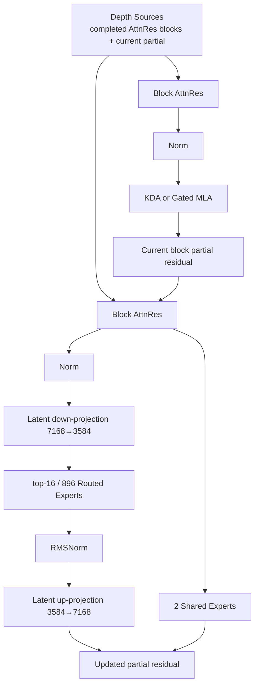
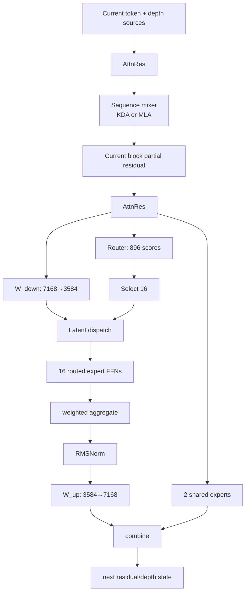

# 08. Kimi K3 Architecture Reconstruction: `config.json`에서 2.8T Model을 다시 세우기

작성일: 2026-08-19  
상위 문서: [Kimi K3 Study Guide](README.md)

## 1. 이 장의 목표

이 장에서는 논문의 설명을 외우지 않고 K3의 공개 model summary/config 숫자로 실제 model tree를 재구성한다.

최종적으로 다음 질문에 답하는 것이 목표다.

> `왜 K3가 2.8T인가?`, `왜 expert weight가 거의 전부인가?`, `93개 layer는 정확히 어떤 패턴인가?`, `104B active는 어디서 생기는가?`, `vision/MTP/AttnRes는 backbone 어디에 들어가는가?`

---

# 2. 최상위 Model 구조

K3는 native multimodal causal language model이다.

개념 module tree:

```text
KimiK3
├─ MoonViT-V2 vision encoder
│  ├─ patch embedding
│  ├─ 27 vision transformer layers
│  └─ visual token merge / projector
│
├─ Kimi Linear-derived language backbone
│  ├─ token embedding (160K vocab → 7168)
│  ├─ 93 language layers
│  │   ├─ Block AttnRes input mixing
│  │   ├─ KDA or Gated MLA
│  │   ├─ Block AttnRes input mixing
│  │   └─ Dense FFN or Stable LatentMoE
│  ├─ final norm
│  └─ LM head
│
└─ auxiliary MTP / speculative-draft-related module
```

핵심은 `KDA model + MoE` 정도가 아니라 **vision + sequence mixer + depth mixer + latent expert mixer**가 동시에 존재한다는 점이다.

---

# 3. Core Language Shape

공개 수치:

```text
hidden_size = 7168
num_hidden_layers = 93
vocab_size ≈ 160K
attention_heads = 96
```

Token representation 하나는:

$$
x_t\in\mathbb{R}^{7168}
$$

이다.

K2도 hidden 7168이었다. K3는 residual width를 늘리지 않고 depth/expert scale을 키웠다.

이 fact 하나가 architecture 철학을 보여준다.

---

# 4. 93-Layer Attention Pattern

K3 model summary:

```text
69 KDA
24 Gated MLA
```

합:

$$
69+24=93
$$

이다.

공개 config의 MLA/full-attention logical positions는 4-step 간격으로 나타나고 마지막 93번째 layer가 MLA다.

이를 architecture pattern으로 쓰면:

$$
23\times(3\mathrm{KDA}+1\mathrm{MLA})+1\mathrm{MLA}
$$

이다.

검산:

$$
23\times3=69\text{ KDA}
$$

$$
23+1=24\text{ MLA}
$$

```text
Layer group 1 : K K K M
Layer group 2 : K K K M
...
Layer group 23: K K K M
Final          : M

K = KDA
M = Gated MLA
```

이 패턴은 Kimi Linear의 3:1 hybrid를 대규모로 계승하면서 마지막 global MLA를 하나 더 둔 형태다.

---

# 5. 한 Language Layer를 구조적으로 분해한다

K3의 일반적인 MoE layer를 추상화하면:



첫 dense layer에서는 Stable LatentMoE 대신 dense FFN path가 사용된다.

---

# 6. `first_k_dense_replace = 1`의 의미

Sparse MoE model은 embedding 직후부터 모든 layer를 MoE로 만들 수 있지만 초기 layer를 dense FFN으로 두는 설계가 흔하다.

K3 공개 model summary:

```text
Number of Dense Layers = 1
```

즉 93 core language layers 중:

- 1 layer: dense FFN
- 약 92 layers: MoE/Stable LatentMoE

로 볼 수 있다.

초기 shallow representation은 모든 token이 공통 computation을 사용하는 dense layer에서 먼저 형성되고 이후 expert specialization이 시작된다.

---

# 7. Stable LatentMoE Shape

K3:

```text
model hidden d = 7168
latent MoE l  = 3584
expert hidden m = 3072
routed experts N = 896
selected K = 16
shared experts S = 2
```

Routed path:

$$
7168
\xrightarrow{W_{down}}
3584
\xrightarrow{Expert_i}
3584
\xrightarrow{W_{up}}
7168
$$

한 routed expert의 SiTU-GLU FFN은 개념적으로 3개 large matrix를 가진다.

- gate: $3584\rightarrow3072$
- up: $3584\rightarrow3072$
- down/output: $3072\rightarrow3584$

따라서 expert 하나의 주 weight element 수는 대략:

$$
P_{expert}
\approx3\times3584\times3072
$$

$$
=33,030,144
$$

즉 약 **33.0M parameters/expert**다.

Bias/scale/세부 implementation은 제외한 근사치다.

---

# 8. 896 Routed Experts가 Layer당 몇 Parameter인가

$$
33.03M\times896
\approx29.6B
$$

즉 **MoE layer 하나의 routed expert bank만 약 29.6B parameter**다.

이를 약 92 MoE layers에 곱하면:

$$
29.6B\times92
\approx2.72T
$$

가 된다.

K3 total 약 2.78T와 매우 가깝다.

이 단순 계산에서 중요한 결론:

> **K3의 total parameter 거의 전부가 routed expert weights에 있다.**

근사 비율:

$$
\frac{2.72T}{2.78T}\approx97.8\%
$$

이는 정확한 checkpoint parameter accounting이 아니라 공개 shape에서 유도한 근사치지만, `expert weights가 모델 parameter의 압도적 majority`라는 구조를 매우 잘 보여준다.

---

# 9. 왜 Active Parameter는 104B 정도인가

Token 하나는 896 experts 전부가 아니라 16개 routed experts만 실행한다.

Routed expert active parameter per MoE layer를 단순 계산하면:

$$
33.03M\times16
\approx528.5M
$$

이다.

여기에 매 layer:

- shared experts 2개
- latent down/up projection
- KDA/MLA projections
- norms/router

가 항상 또는 조건적으로 active하다.

92 layers 전체에서 이러한 active path를 합하면 total checkpoint 2.8T보다 훨씬 작은 104B 수준의 activated parameter count가 나온다.

`104B active`를 정확히 reconstruct하려면 attention/AttnRes/shared/dense/vision/MTP parameter까지 모두 implementation 기준으로 계산해야 한다.

핵심은:

$$
P_{active}\ll P_{total}
$$

이 expert routing 때문에 가능하다는 것이다.

---

# 10. Shared Expert Parameter도 무시할 수 없다

Shared expert는 latent routed path와 달리 full-width에서 동작한다.

단순 GLU shape를 같은 $m=3072$로 가정하면 expert 하나의 주요 weights:

$$
3\times7168\times3072
\approx66.1M
$$

2 shared experts면 layer당 약:

$$
132M
$$

수준의 full-width shared compute가 추가될 수 있다.

정확한 K3 implementation에서 shared expert 구조/activation parameterization을 기준으로 최종 accounting을 확인해야 한다.

이 계산은 왜 `active routed expert 16개`만 보고 token compute를 추정하면 안 되는지 보여준다.

---

# 11. Latent Down/Up Projection

공유 projection parameter:

$$
W_{down}\in\mathbb{R}^{3584\times7168}
$$

$$
W_{up}\in\mathbb{R}^{7168\times3584}
$$

각각 약:

$$
7168\times3584\approx25.69M
$$

parameters.

둘 합:

$$
\approx51.4M/layer
$$

이다.

이는 29.6B routed expert bank에 비하면 작지만 **매 token이 항상 실행하는 active compute**라는 점이 중요하다.

---

# 12. Routing Shape

Router는 current token full hidden representation에서 expert scores를 만든다.

개념적으로:

$$
r=W_rx,\qquad
W_r\in\mathbb{R}^{896\times7168}
$$

Router parameter 자체는:

$$
896\times7168\approx6.42M
$$

수준이다.

Expert bank와 비교하면 매우 작다.

Router는 top-16 index를 선택하고 Quantile Balancing bias가 dispatch decision을 조정한다.

---

# 13. KDA Shape

K3 KDA 공개 핵심 shape:

```text
96 heads
head_dim = 128
ShortConv kernel = 4
```

Logical recurrent state를 단순화하면:

$$
S\in\mathbb{R}^{96\times128\times128}
$$

이다.

Element 수:

$$
96\times128\times128
=1,572,864
$$

즉 한 KDA layer의 full logical state가 약 1.57M elements다.

BF16 raw bytes라면 약 3 MiB 수준이지만 실제 TP sharding/layout/dtype을 봐야 한다.

중요:

$$
\text{KDA state size}\not\propto T
$$

이다.

---

# 14. MLA Shape

K3 MLA는:

```text
q_lora_rank = 1536
kv_lora_rank = 512
mla_use_nope = true
mla_use_output_gate = true
```

계열 config를 사용한다.

즉 global layer는 token마다 full K/V width를 저장하기보다 latent KV representation을 사용한다.

24 MLA layers만 token-wise history cache를 갖는다.

K3 전체 sequence memory:

$$
69\times\text{fixed KDA state}
+
24\times\text{tokenwise MLA cache}(T)
$$

이다.

Attention 수식은:

- [Kimi-K3 Attention Architecture](../../study/attention/10-kimi-k3.md)

참조.

---

# 15. Block AttnRes Shape

K3:

```text
attn_res_block_size = 12
```

93 layers를 약 8 completed block + current partial source로 관리한다.

각 source representation은:

$$
[B,T,7168]
$$

shape다.

Full 93 depth states를 유지하는 대신 block-level source만 유지해 depth memory를 줄인다.

현재 layer의 pseudo-query는 이 depth-source axis에 softmax attention한다.

---

# 16. MoonViT-V2 Shape

공개 vision config:

```text
vision hidden = 1024
vision layers = 27
vision intermediate = 4096
vision heads = 12
patch size = 14
parameters ≈ 401M
```

Vision encoder output은 projector/merge를 거쳐 language hidden 7168 space로 들어간다.

```text
image/video
 → MoonViT-V2 1024-dim features
 → token merge/projector
 → 7168-dim K3 token sequence
 → 93-layer backbone
```

Vision encoder 401M은 2.8T total에서 비율상 작지만 multimodal request의 prefill compute에는 직접적인 추가 비용이다.

---

# 17. MTP는 93 Core Layer에 포함되는가?

K3 model summary의:

```text
69 KDA + 24 MLA = 93
```

이 core language backbone count다.

MTP는 next-token auxiliary/predictive module로 별도 tail/head 계열로 이해해야 한다.

즉:

```text
93 core layers
+
MTP auxiliary block/module
```

을 구분한다.

MTP를 94번째 일반 backbone layer처럼 해석하면 architecture count가 어긋난다.

Post-training에서는 이 MTP를 EAGLE-3-style speculative drafter로 fine-tune한다.

---

# 18. Attention Residual Block과 3:1 Attention Group은 서로 다른 Block 개념이다

K3에는 `block`이라는 말이 여러 곳에 나온다.

### Hybrid Attention Group

```text
KDA KDA KDA MLA
```

4 sequence-mixer layers의 반복 pattern.

### AttnRes Block

```text
12 layers worth of depth accumulation/source
```

depth memory grouping.

### KV/Cache Block

Serving engine에서 cache를 관리하는 physical/logical token page.

이 세 가지는 완전히 다른 개념이다.

문서/코드에서 `block`이라는 단어만 보고 같은 객체로 이해하면 안 된다.

---

# 19. 한 Token이 한 Layer를 지나가는 Data Flow

일반 MoE layer 기준:



이 그림 하나를 설명할 수 있으면 K3 language layer의 상당 부분을 이해한 것이다.

---

# 20. 왜 2.8T인데 H200 16/32장 배포가 극도로 어려운가

Total parameter가 2.8T이면 low-precision이어도 raw weight storage가 매우 크다.

예를 들어 이상적인 4-bit만 단순 적용해도:

$$
2.8T\times0.5\text{ byte}
\approx1.4\text{ TB}
$$

이다.

하지만 실제 checkpoint에는:

- non-expert higher precision weights
- scales/metadata
- alignment
- runtime workspace
- cache/state
- kernel buffers

가 추가된다.

H200 141GB × 16:

$$
2256\text{ GB raw VRAM}
$$

이므로 theoretical capacity는 있어 보여도 실제 shard/EP/TP/layout/graph/cache까지 넣으면 margin이 매우 작다.

32 GPU에서는 capacity margin이 커지지만 multi-node communication cost가 커진다.

그래서 K3 deployment는 `parameter가 VRAM에 들어가느냐`와 `성능이 나오느냐`가 완전히 다른 문제다.

---

# 21. Expert Weight가 약 98%라는 사실이 배포 전략을 결정한다

앞의 근사 계산:

$$
P_{routed}\approx2.72T
$$

이다.

따라서 K3 weight placement의 본질은 거의 **expert placement problem**이다.

### TP만 사용

모든 matrix를 tensor-shard하면 expert activation에 필요 없는 rank communication이 커질 수 있다.

### EP 사용

Expert bank를 GPU에 분산하고 token을 expert-owner rank로 보낸다.

K3처럼 expert weight가 압도적이면 EP가 매우 자연스러운 병렬화 축이다.

하지만 multi-node EP all-to-all이 network bottleneck을 만든다.

이것이 H200+IB environment에서 K3 deployment architecture의 핵심 문제다.

---

# 22. Model Tree를 외우지 말고 비용을 표시한다

```text
K3
├─ Vision 401M                      → prefill compute
├─ Embedding / LM head              → vocab memory/GEMM
├─ 69 KDA                            → fixed recurrent state
├─ 24 MLA                            → token-wise latent KV
├─ Block AttnRes                     → depth-source memory/communication
├─ Stable LatentMoE × ~92
│  ├─ Wdown/Wup                      → always active
│  ├─ 896 routed experts            → ~98% total params
│  ├─ top-16                        → main active expert compute
│  ├─ 2 shared experts              → always active expert path
│  └─ router / quantile bias        → dispatch/load balance
└─ MTP                               → training + SD draft
```

각 모듈이 서로 다른 serving resource를 사용한다.

---

# 23. 이 장의 핵심 정리

1. K3 core language backbone은 93 layers, hidden 7168이다.
2. 93 layers는 69 KDA + 24 Gated MLA다.
3. 구조는 23×(3 KDA + 1 MLA) + final MLA로 정확히 분해된다.
4. Dense FFN은 첫 1 layer이고 이후 약 92 layers가 Stable LatentMoE다.
5. Routed expert 하나는 공개 shape 기준 약 33M parameters로 근사된다.
6. 896 experts × ~92 MoE layers는 약 2.72T routed expert parameters를 만들어 total 2.78T의 약 98%를 설명한다.
7. Token 하나는 16 routed experts만 사용하므로 active parameters는 total보다 훨씬 작다.
8. KDA는 fixed recurrent state, MLA는 token-wise latent cache를 사용한다.
9. AttnRes 12-layer block은 attention 3:1 group이나 cache block과 다른 depth-mixing object다.
10. K3 deployment의 핵심 weight placement 문제는 사실상 896-expert bank를 어떻게 shard할 것인가다.

---

# 24. 이 장을 읽고 직접 해볼 계산

1. Expert 하나의 parameter 수를 $3\ell m$으로 다시 계산하라.
2. 896 experts의 layer당 total expert weight를 계산하라.
3. 92 MoE layers에서 routed expert total을 계산하라.
4. top-16 active expert weights를 layer당 계산하라.
5. H200 16/32장의 raw VRAM과 4-bit 2.8T weight lower bound를 비교하라.
6. KDA logical state를 96×128×128 BF16/FP32로 각각 계산하라.
7. K3의 hybrid cache가 context length에 대해 어떤 항만 $O(T)$인지 설명하라.

---

# 25. 원문

- Kimi K3 official repository / technical report  
  https://github.com/MoonshotAI/Kimi-K3
- Kimi K3 config  
  https://huggingface.co/moonshotai/Kimi-K3/blob/main/config.json
- Kimi Linear  
  https://github.com/MoonshotAI/Kimi-Linear
