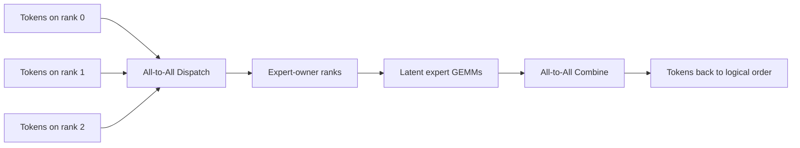
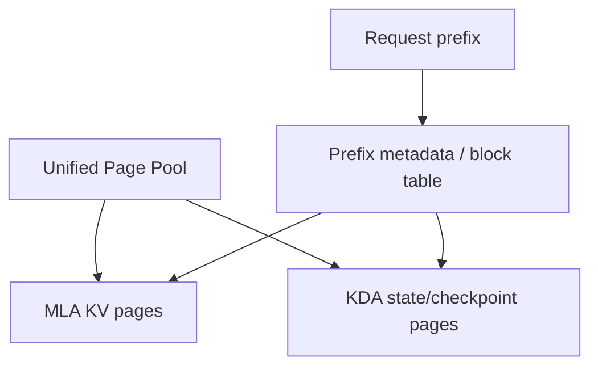
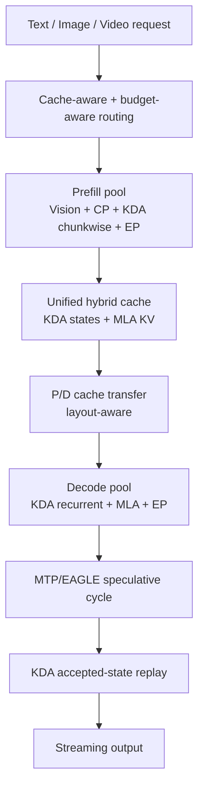

# 09. Kimi K3 Systems & Serving: Architecture를 실제 GPU Cluster에서 성립시키는 법

작성일: 2026-08-19  
상위 문서: [Kimi K3 Study Guide](README.md)

## 1. 이 장의 목표

K3는 `좋은 architecture를 만든 뒤 framework가 알아서 실행`할 수 있는 종류의 모델이 아니다.

다음 특성이 동시에 존재한다.

- 2.8T total weights
- 104B active compute
- 896 routed experts / top-16
- 69 recurrent KDA layers
- 24 token-wise MLA layers
- Block AttnRes
- 1M context
- native vision
- low-precision expert weights
- MTP/speculative decoding

각 feature가 서로 다른 memory/communication pattern을 만든다.

따라서 K3 기술보고서는 architecture와 system을 함께 설계한다.

> **K3의 실제 innovation 일부는 model equation이 아니라 그 equation을 multi-GPU에서 실행 가능하게 만드는 cache, kernel, parallelism, scheduler에 있다.**

---

# 2. K3가 요구하는 Parallelism 축

일반적으로 K3 같은 model에는 여러 parallelism이 동시에 필요하다.

## Tensor Parallelism(TP)

큰 projection/GEMM tensor를 여러 GPU에 shard한다.

## Expert Parallelism(EP)

896 expert bank를 GPU들에 분산하고 token을 selected expert가 있는 rank로 보낸다.

## Context Parallelism(CP)

긴 sequence $T$를 여러 rank에 나눠 prefill/context compute를 분산한다.

## Sequence Parallelism(SP)

특정 activation/norm/residual operation에서 sequence token dimension을 rank에 분산한다.

## Data Parallelism(DP)

독립 request/batch replica를 서로 다른 model replica가 처리한다.

K3에서는 한 방식 하나로 끝나지 않는다.

```text
Huge expert weights → EP
Large projections   → TP
1M prompt           → CP
AttnRes activation  → SP/TP-aware kernels
Service throughput  → DP replicas
```

---

# 3. Expert Parallelism이 K3에서 중심인 이유

앞 문서에서 공개 shape를 이용해 routed expert weights를 약 2.72T로 근사했다.

즉 total weights의 약 98%가 experts다.

따라서 model placement의 본질은:

> **896 experts를 어떤 GPU/node에 배치하고 selected token을 얼마나 싸게 그 위치로 전달할 것인가?**

다.

### EP Data Flow



EP performance는:

- network bandwidth
- network topology
- routing balance
- expert batch size
- dispatch dtype/width

에 좌우된다.

---

# 4. LatentMoE가 EP를 위해 만들어진 이유를 다시 본다

K3 dispatch width:

$$
7168\rightarrow3584
$$

로 절반이다.

하지만 active experts:

$$
8\rightarrow16
$$

으로 K2 대비 두 배다.

단순 traffic proxy:

$$
K\cdot d_{dispatch}
$$

를 보면:

$$
8\times7168
=16\times3584
$$

이다.

즉 더 많은 experts를 활성화하면서 dispatch payload order를 유지할 수 있다.

이것이 LatentMoE가 architecture와 EP system의 co-design인 이유다.

---

# 5. MoonEP의 역할

K3 report는 large-scale MoE training/execution을 위한 Moonshot의 expert-parallel system을 사용한다.

세부 low-level implementation은 공개 runtime과 다를 수 있지만 목표는 명확하다.

- large expert count의 dispatch/combine 효율화
- network communication과 expert GEMM overlap
- load imbalance 완화
- low-precision latent token transfer
- node/GPU topology 활용

Public vLLM/SGLang에서 K3를 실행한다고 해서 Moonshot 내부 MoonEP와 동일한 execution path를 사용하는 것은 아니다.

따라서:

```text
K3 paper system result
≠
public vLLM default performance
```

이다.

Model architecture support와 production system reproduction을 구분한다.

---

# 6. Prefill에서 1M Context를 한 GPU가 처리하기 어려운 이유

KDA가 linear/recurrent여도 1M token의 모든 layer projection/MoE compute는 여전히 존재한다.

KDA prefill은 sequence-length quadratic softmax를 줄이지만:

$$
T\times\text{QKV/conv/state update}
$$

와 93-layer MoE compute가 있다.

1M prompt를 한 GPU sequence dimension에 몰면:

- activation memory
- kernel duration
- MoE token volume
- TTFT

가 매우 커진다.

그래서 **Context Parallelism(컨텍스트 패럴렐리즘; CP)**이 필요하다.

---

# 7. KDA Context Parallelism의 어려움

Full attention CP에서는 query/KV partition을 어떻게 exchange하는지가 핵심이다.

KDA는 recurrent state dependency가 있다.

$$
S_t=f(S_{t-1},x_t)
$$

Sequence를 GPU0/GPU1로 단순 잘라:

```text
GPU0: token 0 ... 499K
GPU1: token 500K ... 1M
```

를 동시에 독립 계산할 수 없다. GPU1의 initial state는 GPU0 prefix의 final state에 의존하기 때문이다.

KDA CP는 recurrent transition을 associative/chunkwise form으로 바꿔 각 shard의 local transform을 계산하고 prefix composition/scan을 통해 global state effect를 결합해야 한다.

이것이 ordinary token partition보다 어렵다.

---

# 8. Chunkwise KDA와 CP의 관계

각 context shard/chunk가 state transform을:

$$
S_{out}=A_{chunk}S_{in}+B_{chunk}
$$

형태로 요약할 수 있다고 생각하자.

여러 chunk:

$$
S_1=A_1S_0+B_1
$$

$$
S_2=A_2S_1+B_2
$$

이므로 composition:

$$
S_2=A_2A_1S_0+A_2B_1+B_2
$$

가 된다.

이런 affine-like state transform을 parallel prefix-scan/composition할 수 있으면 context shards를 GPU에서 병렬 처리할 수 있다.

실제 KDA algorithm은 Delta transition 특성 때문에 더 복잡하지만 핵심 system intuition은 같다.

> **token 결과를 순차 실행하는 대신 chunk가 state에 미치는 전체 transform을 계산해 병렬로 compose한다.**

---

# 9. AttnRes도 Distributed Cost가 있다

Block AttnRes source는 각 token의 $7168$-dim representation이다.

1M prefill에서 block source tensor도 매우 크다.

K3 system은 AttnRes에서:

- prefill sequence parallelism
- decode side-stream overlap
- RMSNorm/merge와 TP collective fusion

같은 방법으로 overhead를 줄인다.

Model equation은 작은 depth softmax지만 tensor volume은 작지 않다.

---

# 10. Stable LatentMoE Kernel Fusion

Naïve LatentMoE path:

```text
W_down GEMM
 → write latent to HBM
 → router
 → dispatch
 → expert GEMM
 → write aggregate
 → RMSNorm
 → W_up GEMM
 → collective
```

각 단계 사이 HBM read/write와 kernel launch가 발생한다.

K3 system은 가능한 부분을 fuse/overlap한다.

대표 방향:

- latent down projection과 routing 관련 GEMM fusion
- latent matrices sharding
- output all-gather를 GEMM epilogue와 결합
- shared expert compute와 communication overlap
- small decode batch용 token-centric expert kernel

이런 최적화가 없으면 LatentMoE가 이론적으로 줄인 FLOPs/traffic을 runtime overhead가 먹어버릴 수 있다.

---

# 11. Decode Expert GEMM은 Prefill Expert GEMM과 다르다

Prefill:

```text
많은 prompt tokens
→ expert별 비교적 큰 token batch
→ GEMM reuse 높음
```

Decode:

```text
request당 1 token
→ routing 후 expert당 작은 token count
→ skinny/small-batch GEMM
→ weight read 비중 큼
```

K3 report의 decode expert kernel은 token-centric/streaming 관점으로 memory-bound workload를 최적화한다.

따라서 `prefill benchmark에서 MoE TFLOPS가 높다`고 decode ITL이 자동으로 좋은 것은 아니다.

---

# 12. K3에는 두 종류 Sequence Cache가 존재한다

이것이 serving에서 가장 중요한 차이 중 하나다.

## KDA Layers

Token-wise KV 대신:

- fixed recurrent state
- ShortConv state

를 가진다.

## MLA Layers

Token마다 latent KV history를 가진다.

따라서 request state:

```text
Request
├─ KDA recurrent state × 69 layers
├─ KDA ShortConv state × 69 layers
└─ MLA paged KV history × 24 layers
```

이다.

Conventional vLLM의 `KV block table 하나`보다 복잡하다.

---

# 13. Unified Paged Cache

K3 production design은 KDA state와 MLA KV를 별개의 완전히 독립 allocator로 두기보다 unified paged cache abstraction에서 함께 관리한다.

핵심 아이디어:

- KDA state page와 MLA KV page의 byte-size class를 맞춤
- allocation/reference counting/eviction pool 공유
- request prefix가 KDA checkpoint와 MLA pages를 함께 참조



`KDA state`와 `MLA KV`는 semantics는 다르지만 memory manager layer에서 공통 page abstraction을 사용할 수 있다.

---

# 14. 왜 KDA Prefix Cache가 어려운가

Full attention prefix cache:

```text
512-token block hit
→ 해당 KV block을 그대로 재사용
```

KDA에서는 prefix boundary $N$의 recurrent state:

$$
S_N
$$

가 있어야 이후 suffix를 이어 계산할 수 있다.

매 512 token마다 69 layers의 큰 KDA state를 snapshot하면 memory가 너무 커질 수 있다.

따라서 K3는:

- physical cache page를 비교적 크게 유지하고
- hash matching granularity는 더 작게 분리하며
- KDA state checkpoint는 sparse boundary에만 저장

하는 구조를 사용한다.

---

# 15. Physical Block과 Hash Block을 분리한다

예를 들어 conceptual configuration:

```text
Physical cache page: 6144 tokens
Hash granularity    : 512 tokens
```

이라면 한 physical page 안에:

$$
6144/512=12
$$

개의 hash boundary가 있다.

왜 분리하는가?

### 큰 Physical Page

KDA state checkpoint/storage overhead를 줄이고 allocator/kernel locality 확보.

### 작은 Hash Block

prefix match granularity를 작게 유지해 cache hit loss를 줄임.

이 구조는 conventional `physical KV block size = hash prefix block size` 설계보다 복잡하지만 recurrent state에 더 적합하다.

---

# 16. Prefix Hit는 MLA만 맞으면 충분하지 않다

어떤 prefix가 MLA KV pages 기준으로 50K까지 동일해도 KDA state checkpoint가 48K까지만 존재한다면 50K에서 바로 resume할 수 없다.

재사용 가능한 boundary는:

```text
MLA prefix available
AND
KDA state checkpoint available for all required groups
```

인 가장 긴 지점이다.

즉 hybrid cache hit는 여러 state type의 **intersection**이다.

이 원칙은 future hybrid SSM/attention model serving에서도 일반적으로 중요하다.

---

# 17. Partial Block과 Copy-on-Write

Prefix cache 끝이 physical page 중간에 걸릴 수 있다.

Shared prefix의 page를 그대로 수정하면 다른 request의 cache를 오염시킨다.

따라서 partial suffix를 이어 쓸 때:

- shared completed portion 재사용
- partial page는 copy-on-write
- KDA checkpoint boundary에서 recurrent state restore

가 필요하다.

OS virtual-memory의 page copy-on-write와 비슷한 memory-management 문제다.

---

# 18. P/D Disaggregation에서 더 어려워지는 점

**Prefill/Decode Disaggregation(P/D 디스애그리게이션, prompt prefill과 token decode를 서로 다른 GPU pool에서 실행)**을 쓰면 prefill side가 만든 request state를 decode side로 옮겨야 한다.

Conventional model:

```text
Prefill → KV cache transfer → Decode
```

K3:

```text
Prefill
  ├─ MLA KV pages
  ├─ KDA recurrent states
  └─ ShortConv states / metadata
       ↓ transfer/relayout
Decode
```

즉 cache protocol 자체가 hybrid-state aware해야 한다.

---

# 19. Prefill과 Decode의 TP가 다를 수 있다

Prefill은 long sequence parallelism 때문에 큰 TP/CP layout을 쓰고 decode는 latency 때문에 다른 TP/EP layout을 쓸 수 있다.

문제:

```text
Prefill state shard layout
≠
Decode expected state shard layout
```

Naïve 방식은 decode GPU에 받은 뒤 다시 GPU collective/reshuffle한다.

K3 production design은 transfer path에서 layout conversion을 수행해 destination GPU에서 추가 reshuffle을 줄이는 방향을 사용한다.

P/D architecture는 단순 network copy가 아니라 **parallel-layout conversion protocol**이 된다.

---

# 20. Speculative Decoding과 KDA Rollback

Candidate 7개를 target K3로 verify한다고 하자.

KDA state:

$$
S_t\rightarrow S_{t+1}\rightarrow\cdots\rightarrow S_{t+7}
$$

로 in-place update된다.

3개만 accepted되면 $S_{t+3}$가 필요하다.

### Naïve Snapshot

각 candidate step마다 모든 KDA layer state 복사.

→ memory bandwidth가 매우 큼.

### Replay 방식

K3 system은 full recurrent state를 여러 번 snapshot하는 대신 state update에 필요한 projected inputs를 보관하고 accepted prefix만 fused kernel로 다시 replay한다.

```text
base S_t
+ cached projected inputs for accepted tokens
→ fused replay
→ S_(t+accepted)
```

이는 recurrent/SSM speculative decoding에서 중요한 general technique다.

---

# 21. Cache-Aware Routing

Long multi-turn request가 특정 replica에 prefix cache를 가지고 있다면 다른 replica로 보내는 순간:

- prefix cache miss
- huge prefill recompute

가 발생할 수 있다.

1M context에서는 recompute cost가 매우 크다.

K3 production design은 cache locality를 routing decision에 포함한다.

개념적으로:

```text
Request prefix hash
    ↓
Which serving cluster/replica already owns longest prefix?
    ↓
prefer that replica
```

Cache-aware routing은 long-context architecture에서 model kernel만큼 중요한 serving optimization이다.

---

# 22. Budget-Based Admission Control

Request cost 차이가 매우 크다.

예:

```text
Short chat: 1K tokens
Long agent: 1M tokens
```

context length만 대략 1000배 차이다.

같은 FIFO queue에서 처리하면 long request 몇 개가 short request latency를 파괴할 수 있다.

K3 serving design은 request resource budget을 고려해 admission/scheduling을 분리한다.

핵심:

- short vs ultra-long workload isolation
- prompt token cost
- vision cost
- expected output/reasoning effort
- cache hit 여부

를 scheduling signal로 활용하는 것이다.

---

# 23. CUDA Graph와 K3

Decode latency를 줄이기 위해 CUDA Graph를 사용하려면 execution shape/address가 안정적이어야 한다.

K3에서는 dynamic 요소가 많다.

- expert routing
- KDA state pointers
- MLA block table
- variable batch size
- speculative candidate count
- vision request/no-vision request

따라서 runtime은:

- fixed bucket
- indirection tables
- graph-friendly memory pool
- piecewise capture

등을 사용해야 한다.

`K3 support`와 `K3 CUDA Graph optimized support`는 다른 수준이다.

---

# 24. Public vLLM/SGLang 지원을 해석하는 방법

2026-08 현재 vLLM과 SGLang은 K3 지원/recipe를 공개하고 있다.

하지만 세 가지를 분리한다.

### Functional Support

Model이 load되고 correct output을 생성한다.

### Optimized Kernel Support

KDA, MXFP4 MoE, MLA, vision path가 high-performance kernel을 사용한다.

### Production System Parity

Moonshot report의 cache hierarchy, fleet routing, internal EP topology와 동일한 운영 최적화까지 재현한다.

이 셋은 같은 말이 아니다.

Framework version별로 backend와 kernel path를 반드시 검증한다.

---

# 25. H200 Multi-Node 관점의 구조적 난점

특정 deployment recipe가 아니라 architecture 관점에서 보면 H200 여러 노드에 K3를 배포할 때 병목 후보는 다음이다.

## Capacity

2.8T low-precision weights + runtime metadata/cache/workspace.

## Intra-node

NVLink/NVSwitch로 TP/EP communication이 빠름.

## Inter-node

896 experts가 node boundary를 넘으면 EP all-to-all이 IB/network에 걸린다.

## Long Context

1M prefill은 CP와 매우 큰 MoE token traffic을 요구한다.

## Decode

expert weight bandwidth + inter-node routing + periodic MLA cache read.

따라서 `H200 16장에 weight가 들어간다`는 사실과 `H200 16장에서 효율적인 inference가 된다`는 것은 완전히 별개다.

---

# 26. Profile할 때 반드시 분해할 시간

한 K3 iteration을 개념적으로:

$$
T_{layer}
=
T_{AttnRes}
+T_{KDA/MLA}
+T_{router}
+T_{dispatch}
+T_{expert}
+T_{combine}
+T_{shared}
+T_{collective}
$$

로 분해한다.

Prefill과 decode를 별도로 profile한다.

### Prefill 후보 병목

- MoonViT
- KDA chunkwise kernel
- CP communication
- expert GEMM
- EP dispatch

### Decode 후보 병목

- expert weight bandwidth
- EP latency
- recurrent KDA kernel
- periodic MLA cache read
- CUDA graph/scheduler overhead

---

# 27. K3용 Monitoring에서 보고 싶은 것

### Request/SLO

- TTFT
- ITL/TPOT
- E2E latency
- prompt/output tokens
- reasoning effort

### KDA/MLA Cache

- KDA state memory
- MLA KV usage
- prefix hit boundary
- prefix hit token count
- replay/recompute count

### MoE

- per-expert token load
- max/mean imbalance
- dispatch bytes
- all-to-all time
- expert GEMM time
- shared expert time

### Network

- NVLink traffic
- IB/RDMA traffic
- collective duration

### GPU

- HBM bandwidth
- SM/Tensor Core utilization
- memory usage

이 metric들이 있어야 `K3가 느리다`를 원인별로 분석할 수 있다.

---

# 28. K3 System을 한 장으로 보기



---

# 29. 이 장의 핵심 정리

1. K3 weight placement는 expert weights가 약 98%이므로 본질적으로 EP placement problem이다.
2. LatentMoE는 expert communication width를 줄여 top-k와 expert count를 늘릴 budget을 만든다.
3. 1M KDA prefill은 recurrent dependency 때문에 specialized context-parallel algorithm이 필요하다.
4. AttnRes/LatentMoE도 system-level fusion과 communication overlap이 없으면 scale에서 비싸다.
5. Decode MoE는 expert당 token 수가 작아 HBM bandwidth bound가 되기 쉽다.
6. K3 request는 KDA recurrent state와 MLA token-wise KV를 동시에 가진다.
7. Prefix caching은 MLA hit뿐 아니라 KDA checkpoint가 같은 boundary에 있어야 재사용 가능하다.
8. Physical cache block과 prefix-hash granularity를 분리해 recurrent checkpoint overhead와 hit granularity를 절충한다.
9. P/D disaggregation은 KV뿐 아니라 KDA state와 parallel-layout conversion까지 전송 protocol에 포함한다.
10. Speculative decoding rollback은 full state snapshot 대신 accepted-token replay로 최적화할 수 있다.
11. Ultra-long context에서는 cache-aware routing과 cost-aware admission control이 kernel만큼 중요하다.
12. Public framework의 functional support, optimized kernel support, Moonshot production parity를 구분해야 한다.

---

# 30. 이 장을 읽고 답할 수 있어야 하는 질문

1. 왜 K3에서는 TP보다 EP가 특히 중요한 병렬화 축인가?
2. KDA context parallelism이 conventional sequence sharding보다 어려운 이유는 무엇인가?
3. LatentMoE의 통신량 절감이 top-16 확대와 어떻게 상쇄/재투자되는가?
4. KDA state와 MLA KV를 같은 page pool에 넣을 수 있어도 semantics가 다른 이유는 무엇인가?
5. Recurrent prefix caching에서 매 작은 hash block마다 state snapshot을 저장하면 왜 이점이 사라지는가?
6. P/D prefill과 decode TP degree가 다를 때 cache transfer가 단순 memcpy가 아닌 이유는 무엇인가?
7. Speculative candidate rollback에서 state replay가 snapshot보다 유리할 수 있는 이유는 무엇인가?
8. H200 16장에 weight가 들어가는 것과 실제 throughput이 좋은 것은 왜 다른 문제인가?
9. K3 성능 profile에서 attention time만 보면 안 되는 이유는 무엇인가?

---

# 31. 관련 자료

- Kimi K3 official report  
  https://github.com/MoonshotAI/Kimi-K3
- vLLM Kimi K3 day-0 support / serving notes  
  https://vllm.ai/blog/kimi-k3
- vLLM recipes  
  https://github.com/vllm-project/recipes
- SGLang Kimi K3 cookbook  
  https://docs.sglang.ai/
- Attention serving fundamentals  
  [Serving Engineer 관점의 Attention](../../study/attention/90-serving-engineer-view.md)
