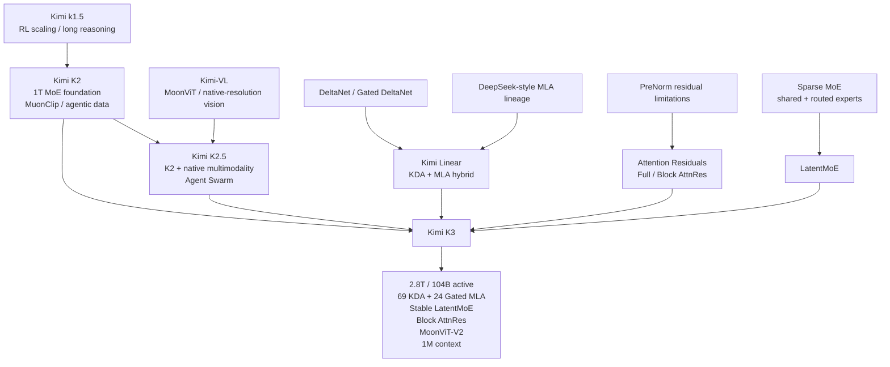
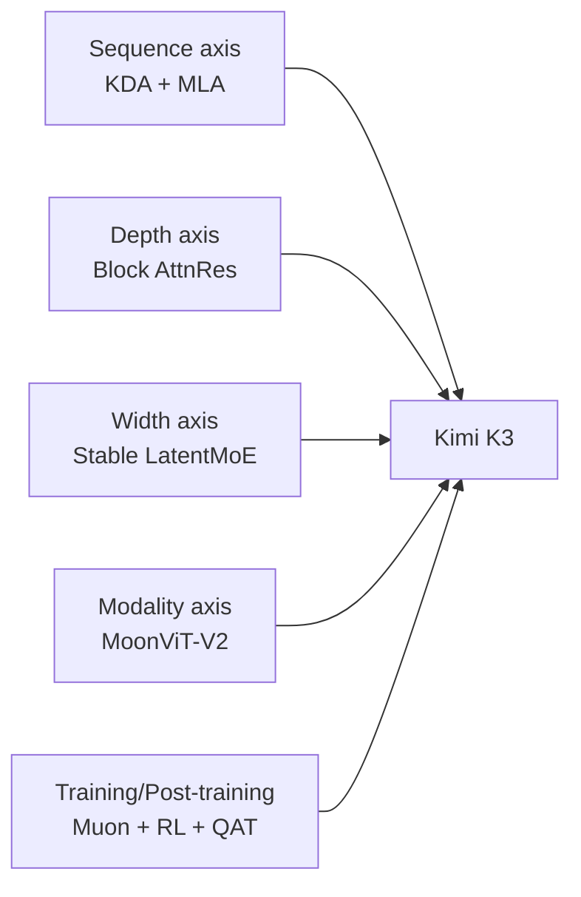

# Kimi K3 — Model Architecture & Lineage Study Guide

작성일: 2026-08-19  
분류: `models/kimi-k3`  
범위: Kimi 계보, Kimi Linear, K2/K2.5, MoE/LatentMoE, Attention Residuals, native multimodality, optimizer/pretraining, post-training/RL, speculative decoding, K3 systems/serving

## 1. 이 디렉터리의 목적

이 문서 세트는 Kimi-K3의 특정 attention 수식만 설명하는 자료가 아니다. 목표는 **Kimi K3라는 모델이 왜 현재 구조가 되었는지 연구 계보와 시스템 제약까지 거슬러 올라가 이해하는 것**이다.

K3는 한 논문에서 갑자기 등장한 architecture가 아니다. 크게 보면 다음 연구선이 합류한다.

따라서 `Kimi Linear → Kimi K3`만 직선으로 보면 K3의 상당 부분을 놓친다.

> **Kimi Linear는 K3의 sequence-mixing/long-context 계보이고, K2는 scale·MoE·optimizer·agentic foundation의 계보이며, Kimi-VL/K2.5는 vision 계보, Attention Residuals는 depth-mixing 계보다.**

---

## 2. Attention 문서와 역할 분리

KDA, MLA, Delta Rule, Gated DeltaNet의 수학적 원리는 이미 `study/attention`에서 상세히 다룬다. 이 디렉터리에서는 같은 수식을 반복하기보다 모델 전체에서 그 mechanism이 왜 필요한지 연결한다.

관련 문서:

- [Linear/Recurrent Attention — DeltaNet, GDN, KDA](../../study/attention/03-linear-recurrent-attention.md)
- [MLA와 Low-Rank Attention](../../study/attention/02-mla-low-rank-attention.md)
- [Kimi-K3 Attention Architecture](../../study/attention/10-kimi-k3.md)
- [Serving Engineer 관점의 Attention](../../study/attention/90-serving-engineer-view.md)

이 디렉터리의 질문은 더 넓다.

- 왜 K3는 2.8T parameter인데 104B만 activate하는가?
- 896 expert를 16개만 선택하는 것이 어떤 compute/memory/communication 구조를 만드는가?
- 왜 routed expert를 7168 model dimension이 아닌 3584 latent space에서 계산하는가?
- LatentMoE를 3T scale까지 키우자 어떤 instability가 생겼고 Stable LatentMoE가 무엇을 추가했는가?
- Attention Residuals는 왜 `attention mechanism`이 아니라 depth mixing 문제인가?
- K2의 MuonClip이 K3의 Per-Head Muon으로 어떻게 이어졌는가?
- K3가 K2.5처럼 vision encoder를 붙이면서도 MoonViT-V2를 다시 scratch부터 학습한 이유는 무엇인가?
- K3의 1M context는 architecture, training curriculum, serving cache가 어떻게 동시에 맞물리는가?
- MTP는 training auxiliary objective에서 어떻게 EAGLE-3-style speculative drafter가 되는가?
- Agentic RL은 model architecture와 별개로 K3의 long-horizon capability를 어떻게 형성하는가?

---

## 3. 권장 학습 순서

| 순서 | 문서 | 핵심 질문 |
|---:|---|---|
| 0 | [00-lineage-and-study-map.md](00-lineage-and-study-map.md) | K3는 어떤 연구 계보들이 합쳐져 만들어졌는가? |
| 1 | [01-kimi-k2-foundation.md](01-kimi-k2-foundation.md) | K2가 K3에 남긴 MoE, MuonClip, data/RL 기반은 무엇인가? |
| 2 | [02-kimi-linear-bridge.md](02-kimi-linear-bridge.md) | Kimi Linear가 무엇을 검증했고 K3가 무엇을 바꿨는가? |
| 3 | [03-moe-latentmoe-stable-latentmoe.md](03-moe-latentmoe-stable-latentmoe.md) | Sparse MoE에서 Stable LatentMoE까지 왜 진화했는가? |
| 4 | [04-attention-residuals-depth-mixing.md](04-attention-residuals-depth-mixing.md) | Residual stream은 왜 depth가 깊어지면 문제가 되고 AttnRes는 무엇을 바꾸는가? |
| 5 | [05-native-multimodal-lineage.md](05-native-multimodal-lineage.md) | Kimi-VL/K2.5에서 K3 MoonViT-V2까지 vision 계보는 무엇인가? |
| 6 | [06-optimization-scaling-and-pretraining.md](06-optimization-scaling-and-pretraining.md) | Muon, MuonClip, Per-Head Muon과 context curriculum은 어떻게 연결되는가? |
| 7 | [07-posttraining-agentic-rl-and-speculative.md](07-posttraining-agentic-rl-and-speculative.md) | K1.5→K2→K2.5→K3의 RL/agentic/post-training 계보는 무엇인가? |
| 8 | [08-k3-architecture-reconstruction.md](08-k3-architecture-reconstruction.md) | 실제 config에서 93-layer K3를 모듈 단위로 어떻게 복원하는가? |
| 9 | [09-k3-systems-and-serving.md](09-k3-systems-and-serving.md) | 이 architecture를 실제 training/serving하려면 어떤 system co-design이 필요한가? |
| 10 | [99-papers-and-glossary.md](99-papers-and-glossary.md) | 원 논문과 용어를 어떤 순서로 다시 확인하는가? |

---

## 4. K3를 이해하는 세 가지 축

K3 기술보고서는 architecture scaling을 크게 **sequence length, network depth, model width**라는 세 정보 흐름 축으로 볼 수 있게 한다.

### 4.1 Sequence Length — token 사이의 정보 흐름

담당 mechanism:

- KDA
- Gated MLA
- ShortConv

핵심 문제:

> 1M token history를 매 layer에서 full KV로 유지하고 모두 읽는 것이 가능한가?

K3는 대부분의 layer를 finite recurrent state인 KDA로 바꾸고 주기적 MLA를 남긴다.

### 4.2 Network Depth — layer 사이의 정보 흐름

담당 mechanism:

- Block Attention Residuals

핵심 문제:

> 93 layer를 단순 residual sum으로 연결하면 과거 representation이 얼마나 잘 보존되고 선택되는가?

K3는 이전 layer/block representation을 content-dependent하게 다시 읽게 한다.

### 4.3 Model Width — parameter/expert 사이의 정보 흐름

담당 mechanism:

- Stable LatentMoE
- 896 routed experts
- 16 selected experts/token
- 2 shared experts

핵심 문제:

> 전체 parameter를 크게 늘리면서 token당 FLOPs와 inter-GPU communication은 어떻게 억제할 것인가?

K3는 expert computation을 latent space에서 수행하고 extreme sparsity를 사용한다.

---

## 5. K2와 K3 숫자를 먼저 비교한다

| 항목 | Kimi K2 | Kimi K3 | 의미 |
|---|---:|---:|---|
| Layers | 61 | 93 | depth 증가 |
| Total parameters | 약 1.04T | 약 2.78T | model capacity 대폭 증가 |
| Activated parameters | 약 32.6B | 약 104.2B | token당 compute도 증가 |
| Hidden size | 7168 | 7168 | residual width는 유지 |
| Attention | MLA | KDA + Gated MLA | long-context sequence mixer 재설계 |
| Attention heads | 64 | 96 | attention/state capacity 증가 |
| Routed experts | 384 | 896 | expert specialization 확대 |
| Active routed experts | 8 | 16 | token당 expert capacity 증가 |
| Shared experts | 1 | 2 | dense/shared path 강화 |
| Expert hidden | 2048 | 3072 | expert 내부 capacity 증가 |
| Latent MoE width | 없음 | 3584 | routed computation을 half-width latent에서 수행 |
| Activation | SwiGLU | SiTU-GLU | extreme-scale activation stability 개선 |
| Context | 128K | 1M | 8배 확대 |
| Vision encoder | 없음 | MoonViT-V2 401M | native multimodal backbone |
| MTP | 1 layer | 1 layer | training + speculative decoding 계보 유지 |

`hidden_size=7168`은 그대로인데 전체 parameter가 약 2.7배 늘었다는 점이 중요하다. K3의 scale-up은 residual width를 단순 확대하는 방식보다 **더 깊게, 더 sparse한 expert bank로, 더 큰 active compute로** 가는 방향이다.

---

## 6. 모델을 이해할 때 architecture와 training을 분리한다

K3의 능력을 architecture 하나로 설명하면 안 된다.

### Architecture

- KDA / Gated MLA
- Stable LatentMoE
- Block AttnRes
- MoonViT-V2
- MTP block

### Pretraining

- native multimodal next-token prediction
- Per-Head Muon
- progressive context extension
- long-context data/synthetic tasks
- Quantile Balancing

### Post-training

- SFT
- RL across reasoning/coding/agentic domains
- reasoning-effort specialization
- multi-teacher on-policy distillation
- generative reward modeling
- quantization-aware training

### Systems

- KDA kernels and context parallelism
- MoE/EP optimization
- hybrid KDA+MLA cache
- state-aware prefix caching
- P/D disaggregation
- speculative state replay
- sandbox/agent infrastructure

한 영역만 떼어 이해하면 `왜 이 model이 실제로 동작하는지` 설명할 수 없다.

---

## 7. 이 문서 세트를 읽고 답할 수 있어야 하는 질문

1. K3는 왜 `scaled Kimi Linear`라고만 부르면 부정확한가?
2. K2의 384×top-8 MoE가 K3의 896×top-16 Stable LatentMoE로 갈 때 어떤 system problem이 커지는가?
3. LatentMoE의 down/expert/up 구조가 accuracy-per-FLOP와 accuracy-per-parameter를 동시에 개선할 수 있는 이유는 무엇인가?
4. 왜 K3는 routed expert를 latent space에 넣고 shared expert는 full-width path로 유지하는가?
5. SiTU-GLU는 SwiGLU와 무엇이 다르고 왜 extreme scale에서 activation bound가 중요한가?
6. Quantile Balancing은 router probability를 직접 loss로 균형화하는 방식과 무엇이 다른가?
7. PreNorm residual accumulation에서 representation dilution과 hidden magnitude growth가 왜 생기는가?
8. Block AttnRes는 Full AttnRes의 어떤 $O(Ld)$ 문제를 줄이는가?
9. K2.5의 MoonViT와 K3의 MoonViT-V2는 학습 출발점이 왜 다른가?
10. Muon이 AdamW와 다른 핵심은 무엇이고 Newton–Schulz orthogonalization은 왜 필요한가?
11. MuonClip은 어떤 training instability를 해결했고 Per-Head Muon은 왜 Q/K/V head별로 optimizer update를 나누는가?
12. K3는 RoPE extension trick 없이 어떻게 1M context curriculum을 구성했는가?
13. K1.5의 long-context RL과 K2의 agentic data synthesis가 K3 post-training에 어떻게 이어지는가?
14. K3의 MTP block은 어떻게 EAGLE-3-style drafter로 fine-tune되는가?
15. KDA state와 MLA KV가 공존할 때 prefix cache가 conventional KV cache보다 어려운 이유는 무엇인가?
16. 896 experts를 multi-node GPU에서 실행할 때 EP all-to-all, weight bandwidth, routing balance가 왜 핵심이 되는가?

---

## 8. 공식/1차 자료

- Kimi K3 official repository and technical report  
  https://github.com/MoonshotAI/Kimi-K3
- Kimi Linear official repository and report  
  https://github.com/MoonshotAI/Kimi-Linear
- Kimi K2 official repository and report  
  https://github.com/MoonshotAI/Kimi-K2
- Kimi K2.5 official repository and report  
  https://github.com/MoonshotAI/Kimi-K2.5
- Kimi-VL Technical Report  
  https://arxiv.org/abs/2504.07491
- Kimi k1.5  
  https://arxiv.org/abs/2501.12599
- Attention Residuals official repository  
  https://github.com/MoonshotAI/Attention-Residuals
- LatentMoE  
  https://arxiv.org/abs/2601.18089
- Muon is Scalable for LLM Training  
  https://arxiv.org/abs/2502.16982
