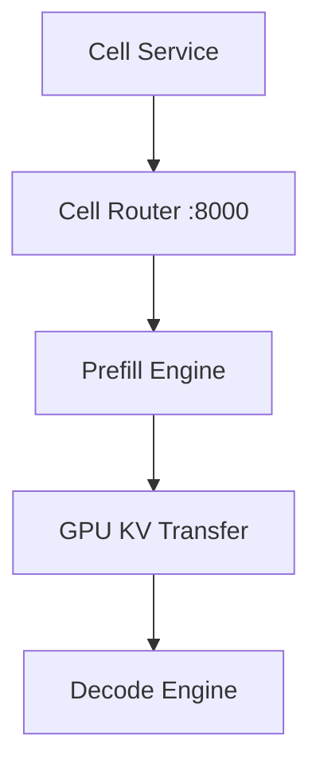
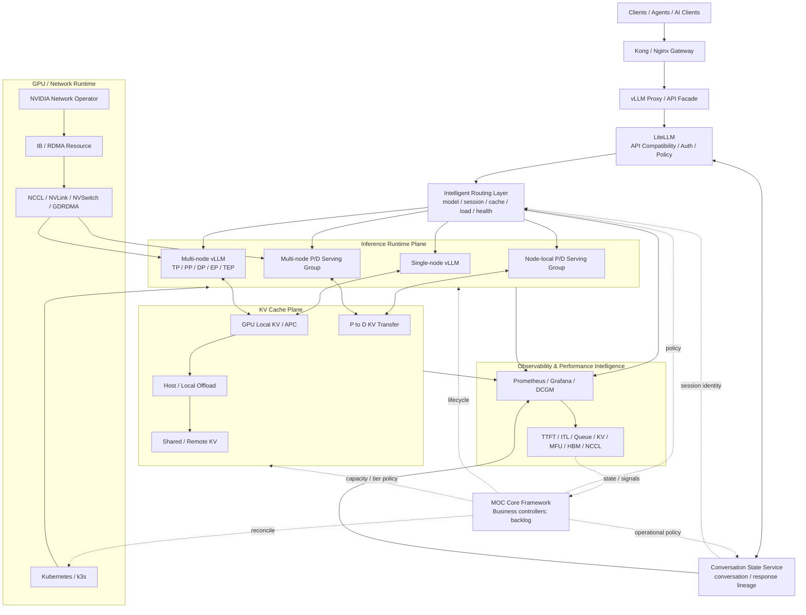

# 2026 Q3 Target Architecture

이 문서는 Q3 과제들이 각각 어디에 위치하고 최종적으로 어떻게 연결되는지 보여주는 상위 아키텍처 스케치다.

최근 검토: 2026-08-24 KST

## 현재 운영 흐름

```text
Client / AI Service
  → Kong Gateway
  → Nginx Ingress
  → vLLM Proxy (FastAPI)
  → LiteLLM Proxy
  → model service / router
  → vLLM engine

Observability
  → Prometheus / Grafana / Loki / Alloy / DCGM
```

현재 구조는 이미 다중 모델 운영이 가능하지만, Q3부터는 단일 vLLM instance를 전제로 한 구조를 넘어 **P/D Cell, Multi-node, KV locality, Stateful Conversation**을 수용해야 한다.

---

## 현재 Node-local P/D Cell data path



- 단기 API는 기존 integrated/Ray renderer와 분리된 `pdCellSpec.models[]`이다.
- Router/P/D는 한 Pod에 있어 Node-locality와 failure domain을 공유한다.
- 망B H200의 Mooncake 목표 transport는 same-node `nvlink_intra`다. MNNVL용 `nvlink`와 구분한다.
- 현재 공식 `0.3.10.post2` artifact의 CUDA ABI 문제는 해결됐지만 `nvlink_intra` feature가 없어 source-built image가 필요하다.
- PR #2 이전 커밋 P1:D1 data path는 성공했고, PR #4 HEAD에서 Qwen3.6-27B topology 확대 검증 중이다.

---

## Q3 통합 목표 아키텍처



---

## 레이어별 책임

### 1. API / Compatibility — LiteLLM

주요 개념:
- OpenAI / Anthropic compatible API
- model alias / auth / policy
- streaming delta
- reasoning / tool-call translation

역할:
- 클라이언트 API 차이를 inference engine 밖에서 흡수한다.
- GPU topology나 P/D 내부 구조는 가능한 한 숨긴다.

### 2. Routing Plane

주요 개념:
- load-aware routing
- prefix / KV locality
- session affinity
- backend health / ejection
- P/D orchestration

역할:
- 요청마다 어떤 serving endpoint 또는 P/D group을 사용할지 결정한다.
- MOC처럼 deployment 자체를 생성/삭제하는 control plane과 분리한다.

### 3. Inference Runtime Plane

주요 개념:
- TP / PP / DP / EP / TEP
- Prefill / Decode disaggregation
- MoE / Expert Parallel
- chunked prefill
- speculative decoding / MTP
- distributed executor / native multiprocess / LWS

실행 형태:
- Single-node integrated vLLM
- Node-local P/D Cell
- 망A Multi-node vLLM
- 향후 Multi-node P/D Serving Group

### 4. KV Cache Plane

서로 다른 문제를 한 기능으로 취급하지 않는다.

- **GPU Local KV / APC** — 한 engine 내부 prefix reuse
- **KV Offloading** — GPU KV capacity를 CPU/외부 tier로 확장
- **P→D KV Transfer** — Prefill 결과를 Decode engine으로 전달
- **Shared KV** — 다른 instance에서도 prefix KV를 재사용
- **Cache-aware Routing** — KV가 존재할 가능성이 높은 backend로 요청을 보냄

주요 구현 후보:
- vLLM native connector
- LMCache
- NIXL
- Mooncake / MooncakeStore

현재 P/D transfer에서는 connector 선택만으로 충분하지 않다. connector package version, CUDA ABI, compile된 transport feature, runtime selector, 실제 선택 로그를 하나의 compatibility contract로 관리한다.

### 5. Stateful Serving Plane

주요 개념:
- conversation_id / response_id
- previous_response_id
- session identity
- tool-call / result lineage
- durable semantic state

원칙:
- Conversation Store는 **대화 의미 상태**를 저장한다.
- KV Cache는 **재계산을 줄이기 위한 transient compute state**다.
- 둘은 session identity로 연결하되 lifecycle과 storage contract는 분리한다.

### 6. GPU / Network Runtime

망A:
- H200 중심 GPU pool
- IB / GPUDirect RDMA 검증
- NVIDIA Network Operator / RDMA resource
- NVLink / NVSwitch / NCCL

망B:
- H200 중심 GPU pool
- IB 없음
- Node-local P/D가 우선적인 topology
- Mooncake 사용 시 `nvlink_intra` build/runtime path 우선

Mooncake protocol 경계:

- `nvlink`: Multi-Node NVLink(MNNVL)
- `nvlink_intra`: 동일 Node NVLink/NVSwitch
- `rdma`: IB/RoCE/GDRDMA
- `tcp`: 일반 network fallback

실제 node/GPU 수량과 hostname/IP는 공개 저장소에 두지 않는다.

### 7. Observability / Performance Intelligence

최소 관측 축:
- TTFT / ITL / E2E latency
- running / waiting / queue depth
- KV usage / hit / transfer
- GPU utilization / MFU / HBM BW
- NCCL / RDMA 상태
- backend routing decision / ejection
- P/D phase별 metrics

목표는 dashboard 자체가 아니라 **배포 topology와 운영 의사결정에 사용할 canonical signal**을 만드는 것이다.

### 8. MOC Operations Control Plane

MOC는 위 모든 기능을 대체하는 플랫폼이 아니다.

현재 구현 경계는 state collection, canonical state, policy, planner, safety, adapter/executor, verify/reconcile, audit로 구성된 Core Framework다. endpoint/LiteLLM 동기화, dynamic placement/scale, GPU reclaim/repacking, Production Stack adoption 같은 business controller는 아직 backlog다.

MOC가 담당할 영역:
- actual state 수집 및 정규화
- policy evaluation
- scale / drain / node reclaim 계획
- serving group lifecycle
- cache / routing / conversation 운영 정책 연계
- safety guard / cooldown / protected workload
- 변경 후 verify 및 audit

즉 요청 처리 data path 밖에서 **플랫폼 전체를 안전하게 수렴시키는 cross-plane controller**로 둔다.

상세 상태: [`moc/README.md`](../../../moc/README.md)

---

## 중요한 아키텍처 경계

1. `LiteLLM != Router != MOC`
2. `Conversation State != KV Cache`
3. `P/D KV Transfer != Shared KV Cache`
4. `Pod Ready != Inference Healthy`
5. `Model Profile != Runtime Topology`
6. `Multi-node transport capability != Model-specific deployment recipe`

이 경계를 유지해야 신규 모델이나 upstream 변경이 생겨도 전체 구조를 다시 뜯지 않는다.
