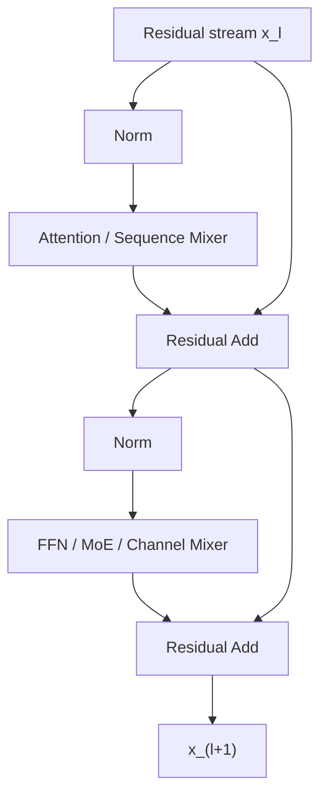

# 00. 수학적 기반과 Transformer Block

작성일: 2026-08-18  
상위 문서: [Attention Architecture Study Guide](README.md)

## 1. 이 장의 목표

Attention을 이해할 때 가장 큰 장애물은 수식 자체보다 **수식의 각 객체가 실제 모델에서 무엇인지** 연결되지 않는 것이다. 이 장은 필요한 선형대수와 Transformer block만 정리한다.

이 장을 읽고 다음 문장을 수식과 tensor shape으로 설명할 수 있어야 한다.

> 한 token의 hidden vector를 Q/K/V 공간으로 projection하고, query-key 내적으로 과거 token의 value를 가중합한 뒤 residual stream으로 되돌린다.

---

## 2. Scalar, Vector, Matrix, Tensor

### 2.1 Scalar

**Scalar(스칼라, 하나의 수)**는 단일 값이다.

$$
\beta_t = 0.7
$$

- $\beta$: **베타**
- $t$: token 위치 또는 시간 step
- $\beta_t$: **베타 서브 티**, $t$번째 step의 값

Attention gate, learning rate, probability, scaling factor 등이 scalar가 될 수 있다.

### 2.2 Vector

**Vector(벡터, 여러 수를 한 축으로 배열한 객체)**는 다음처럼 쓴다.

$$
x_t \in \mathbb{R}^{d}
$$

읽기: **엑스 서브 티는 알 디 차원 실수 벡터에 속한다.**

- $x_t$: $t$번째 token의 hidden representation
- $\mathbb{R}$: **리얼 넘버스**, 실수 집합
- $d$: vector dimension

예를 들어 `hidden_size=7168`인 모델이라면 한 token의 residual representation은 7,168개의 실수로 표현된다.

### 2.3 Matrix

**Matrix(매트릭스, 행렬)**는 두 축을 가진 수 배열이다.

$$
W \in \mathbb{R}^{m\times n}
$$

신경망의 linear layer는 보통 다음과 같이 생각할 수 있다.

$$
y = Wx + b
$$

- $W$: weight matrix
- $b$: bias vector
- $x$: 입력 vector
- $y$: 출력 vector

**Linear Projection(리니어 프로젝션, 선형 투영/선형변환)**이라는 표현은 LLM 구현에서 흔히 단순한 learned matrix multiplication까지 넓게 가리킨다.

### 2.4 Tensor

**Tensor(텐서, 다차원 수 배열)**는 vector와 matrix를 일반화한 표현이다.

Decoder LLM의 hidden state는 흔히:

$$
X \in \mathbb{R}^{B\times T\times d_{model}}
$$

- $B$: **Batch Size(배치 사이즈)**
- $T$: **Sequence Length(시퀀스 렝스, token 길이)**
- $d_{model}$: model hidden dimension

Attention head로 reshape한 query는 흔히:

$$
Q \in \mathbb{R}^{B\times H_q\times T\times d_h}
$$

- $H_q$: query head 수
- $d_h$: head dimension

실제 framework는 `[B,T,H,D]`, `[B,H,T,D]` 등 서로 다른 layout을 쓸 수 있으므로 **수학적 shape와 메모리 layout은 구분**해야 한다.

---

## 3. 내적, 외적, 전치, rank

### 3.1 Transpose

$$
x^\top
$$

**Transpose(트랜스포즈, 전치)**는 행과 열을 바꾼다.

$$
\begin{bmatrix}x_1\\x_2\\x_3\end{bmatrix}^{\top}
=
\begin{bmatrix}x_1 & x_2 & x_3\end{bmatrix}
$$

### 3.2 Dot Product

**Dot Product(닷 프로덕트, 내적)**는 같은 차원의 두 vector에서 scalar 하나를 만든다.

$$
q^\top k = \sum_{j=1}^{d} q_j k_j
$$

Attention에서는 query와 key의 content similarity를 나타내는 score로 사용한다.

### 3.3 Outer Product

**Outer Product(아우터 프로덕트, 외적)**는 두 vector에서 matrix를 만든다.

$$
k v^\top \in \mathbb{R}^{d_k\times d_v}
$$

이 연산은 linear/recurrent attention에서 매우 중요하다. $k$라는 방향에 $v$라는 내용을 대응시키는 rank-1 memory update로 해석할 수 있다.

### 3.4 Rank

**Rank(랭크, 행렬이 표현하는 독립 방향의 수)**는 행렬 표현력의 중요한 개념이다.

$$
k v^\top
$$

처럼 vector 두 개의 외적으로 만든 matrix는 일반적으로 rank 1이다. 따라서 이를 기존 matrix에 더하는 것을 **Rank-1 Update(랭크 원 업데이트, 랭크 1 갱신)**라고 부른다.

Low-rank attention이나 LoRA의 `rank`도 결국 큰 matrix의 변화/표현을 더 적은 독립 방향으로 나타낼 수 있다는 가정과 관련된다.

---

## 4. Norm과 normalization

### 4.1 L2 Norm

**L2 Norm(엘투 놈, 유클리드 길이)**는 vector 크기를 다음처럼 정의한다.

$$
\|x\|_2 = \sqrt{\sum_i x_i^2}
$$

L2 normalization은:

$$
\hat{x}=\frac{x}{\|x\|_2}
$$

로 vector의 길이를 1로 만든다.

DeltaNet/KDA에서 key를 L2-normalize하면 $kk^\top$이 key 방향 projector로 안정적으로 동작하기 쉬워진다.

### 4.2 RMSNorm

**RMSNorm(알엠에스 놈, Root Mean Square Normalization; 제곱평균제곱근 정규화)**는 평균을 빼지 않고 root-mean-square scale을 이용한다.

단순화하면:

$$
\operatorname{RMSNorm}(x)
=
\frac{x}{\sqrt{\frac{1}{d}\sum_{i=1}^{d}x_i^2+\epsilon}}\odot g
$$

- $\epsilon$: 수치 안정성을 위한 작은 값
- $g$: 학습 가능한 scale vector
- $\odot$: **Hadamard Product(하다마드 프로덕트, 원소별 곱)**

현대 decoder LLM에서 LayerNorm 대신 RMSNorm이 널리 쓰인다.

### 4.3 QK-Norm

**QK-Norm(큐케이 놈, query/key 정규화)**은 attention score를 계산하기 전에 Q/K를 normalization하여 logit scale의 불안정성을 완화하는 계열의 기법이다. 모델마다 RMSNorm 또는 L2 normalization 등 세부 구현이 다를 수 있으므로 이름만 보고 동일한 수식이라고 가정하면 안 된다.

---

## 5. Softmax와 확률적 가중합

**Softmax(소프트맥스, 여러 score를 합이 1인 양수 가중치로 변환하는 함수)**는:

$$
\operatorname{softmax}(z_i)
=
\frac{e^{z_i}}{\sum_j e^{z_j}}
$$

이다.

예를 들어 attention score가:

$$
z=[2,1,0]
$$

이면 softmax는 첫 번째 위치에 가장 큰 weight를 주지만 나머지도 완전히 0으로 만들지는 않는다.

Attention에서 중요한 성질은 다음과 같다.

1. 모든 선택지의 weight가 서로 경쟁한다.
2. score 차이를 exponential로 확대한다.
3. 출력은 value vector들의 convex-like weighted mixture가 된다.
4. causal mask를 적용하면 미래 위치는 softmax에 참여하지 않는다.

---

## 6. Transformer가 처리하는 정보의 세 축

현대 LLM block을 이해할 때 정보가 섞이는 방향을 분리하면 좋다.

### 6.1 Sequence/Token Mixing

서로 다른 token 위치의 정보를 섞는다.

- MHA/GQA/MLA
- Sliding Window Attention
- KDA/Gated DeltaNet 같은 recurrent sequence mixer

### 6.2 Channel Mixing

한 token vector 내부의 feature channel을 변환한다.

- Dense FFN/MLP
- SwiGLU
- MoE/LatentMoE

### 6.3 Depth Mixing

서로 다른 layer의 representation을 결합한다.

- 일반 residual connection
- Hyper-Connection
- Kimi-K3 Attention Residuals

이 세 축을 섞어 생각하면 `attention`, `MoE`, `residual`이 모두 비슷한 종류의 feature mixing처럼 보여 모델 구조를 이해하기 어려워진다.

---

## 7. Decoder-only Transformer block

현대 LLM은 대부분 **Decoder-only Transformer(디코더 온리 트랜스포머, 자기회귀 생성용 Transformer)**를 사용한다.

Pre-Norm 형태를 단순화하면:

$$
u_l = x_l + \operatorname{Attention}(\operatorname{Norm}(x_l))
$$

$$
x_{l+1} = u_l + \operatorname{FFN}(\operatorname{Norm}(u_l))
$$

- $l$: layer index
- $x_l$: layer $l$의 residual stream
- $u_l$: attention 결과가 합쳐진 중간 residual
- FFN: **Feed-Forward Network(피드 포워드 네트워크, token별 비선형 channel mixer)**

Attention은 **다른 token에서 정보를 가져오고**, FFN/MoE는 **그 정보를 현재 token 내부에서 변환**한다고 생각하면 된다.

---

## 8. Token embedding과 residual stream

문자열은 tokenizer를 거쳐 integer token ID가 되고, embedding table에서 vector를 찾는다.

$$
x_t^{(0)} = E[\operatorname{token\_id}_t]
$$

- $E$: embedding matrix
- $x_t^{(0)}$: layer 0에 들어가는 token representation

각 layer는 이 representation에 새로운 정보를 누적한다. 그래서 residual stream을 단순한 `현재 token embedding`이 아니라 **현재까지 모델이 이 token에 대해 구성한 작업 공간**이라고 보는 편이 정확하다.

---

## 9. Query, Key, Value는 왜 세 개로 나누는가

한 token representation $x_t$에서 다음 projection을 만든다.

$$
q_t=W_Qx_t,\qquad
k_t=W_Kx_t,\qquad
v_t=W_Vx_t
$$

- **Query(쿼리, 질의)**: 현재 token이 어떤 정보를 찾는가
- **Key(키, 검색 주소/특징)**: 이 token이 어떤 질의에 선택될 수 있는가
- **Value(밸류, 전달 내용)**: 선택됐을 때 무엇을 전달하는가

같은 $x_t$에서 세 representation을 따로 만드는 이유는 `검색 기준`과 `전달 내용`을 분리하기 위해서다.

예를 들어 한 token이 인물 이름이라면:

- key는 `이 정보가 사람 이름이며 어떤 entity인지`를 나타낼 수 있고
- value는 `그 entity와 관련된 문맥 정보`를 담을 수 있으며
- 다른 token의 query는 `앞에서 언급한 주체가 누구인지`를 검색하도록 학습될 수 있다.

이 해석은 직관일 뿐 head가 사람이 읽을 수 있는 하나의 고정 역할만 수행한다는 뜻은 아니다.

---

## 10. Scaled Dot-Product Attention

Transformer의 기본 attention은:

$$
\operatorname{Attention}(Q,K,V)
=
\operatorname{softmax}\left(\frac{QK^\top}{\sqrt{d_k}}+M\right)V
$$

이다.

읽기:

> **큐 케이 트랜스포즈를 루트 디 케이로 스케일하고 마스크를 더한 뒤 소프트맥스를 취하고, 그 weight로 브이를 가중합한다.**

### 10.1 $QK^\top$

모든 query와 모든 key의 pairwise score를 만든다.

$$
QK^\top\in\mathbb{R}^{T\times T}
$$

sequence length가 $T$이면 token pair 수가 대략 $T^2$로 증가한다.

### 10.2 $1/\sqrt{d_k}$

head dimension이 커지면 random-like Q/K의 dot product variance도 커진다. 너무 큰 logit은 softmax를 극단적으로 만들 수 있으므로 $\sqrt{d_k}$로 scale한다.

### 10.3 Causal Mask

**Causal Mask(코절 마스크, 미래 token을 보지 못하게 하는 마스크)**는 decoder가 미래 정답 token을 미리 읽지 못하게 한다.

개념적으로:

$$
M_{t,i}=
\begin{cases}
0 & i\le t\\
-\infty & i>t
\end{cases}
$$

softmax에서 $-\infty$ 위치는 weight 0이 된다.

---

## 11. Self-Attention과 Cross-Attention

### 11.1 Self-Attention

**Self-Attention(셀프 어텐션, 자기 주의집중)**은 Q/K/V가 같은 sequence representation에서 나온다.

Decoder LLM의 text backbone attention은 일반적으로 causal self-attention이다.

### 11.2 Cross-Attention

**Cross-Attention(크로스 어텐션, 교차 주의집중)**은 query와 key/value가 서로 다른 source에서 나온다.

예:

$$
Q=W_QX_{text},\qquad K,V=W_{K/V}X_{image}
$$

이는 text decoder가 vision encoder representation을 조회하는 전통적인 multimodal 구조에서 쓰일 수 있다. 반면 최근 native multimodal LLM 중에는 image token을 text token과 같은 sequence에 넣는 early-fusion 구조도 많아, 반드시 cross-attention block이 존재하는 것은 아니다.

---

## 12. Position information이 필요한 이유

Attention score $q_t^\top k_i$만으로는 `token $i$가 token $t$보다 몇 칸 앞에 있는지`가 명시적으로 표현되지 않는다.

### 12.1 RoPE

**Rotary Position Embedding(로터리 포지션 임베딩, 회전형 위치 임베딩; RoPE)**은 position에 따라 Q/K vector의 2차원 subspace들을 회전시킨다.

$$
q_t'=R_tq_t,\qquad k_i'=R_ik_i
$$

그러면:

$$
(q_t')^\top k_i'
=
q_t^\top R_t^\top R_i k_i
$$

이고 $R_t^\top R_i$가 상대 위치 차이를 반영한다.

### 12.2 Partial RoPE

**Partial RoPE(파셜 로프, head dimension 일부에만 RoPE 적용)**는 content-only dimension과 position-aware dimension을 나눈다. Qwen3-Next/3.5/3.6와 DeepSeek 계열 등에서 서로 다른 형태로 사용된다.

### 12.3 NoPE

**NoPE(노프/노 피이, 명시적 positional encoding 없음)**는 해당 attention score에 RoPE 같은 위치 변환을 적용하지 않는 설계다. NoPE layer만 따로 보면 위치를 직접 encode하지 않지만, 다른 recurrent/full-attention layer나 residual stream이 이미 position-sensitive 정보를 제공할 수 있다. Kimi-K3의 MLA를 해석할 때 중요하다.

---

## 13. Big-O를 읽는 방법

**Big-O Complexity(빅 오 복잡도, 입력 크기가 증가할 때 비용이 어떻게 증가하는지 나타내는 점근 표기)**는 절대 실행시간을 뜻하지 않는다.

- $O(1)$: sequence length와 무관한 고정 차수
- $O(T)$: 길이에 선형 비례
- $O(T^2)$: 길이 제곱에 비례

Full attention의 pairwise score 계산은 sequence dimension 기준 $O(T^2)$다. 그러나 실제 wall-clock은 다음에도 좌우된다.

- GPU Tensor Core 활용률
- HBM bandwidth
- kernel fusion
- batch size
- head dimension
- TP/CP 분산
- dtype
- scheduler와 cache layout

따라서 `선형 복잡도니까 항상 더 빠르다` 또는 `FlashAttention을 쓰면 복잡도가 선형이 된다` 같은 결론은 틀릴 수 있다.

---

## 14. Compute-bound와 Memory-bound

### 14.1 Compute-bound

**Compute-bound(컴퓨트 바운드, 연산 처리량이 병목)**는 Tensor Core/FLOPs가 주된 제한인 상태다. 긴 prompt의 prefill에서 큰 GEMM이 잘 batching되면 compute-bound 성격이 강해질 수 있다.

### 14.2 Memory-bandwidth-bound

**Memory-bandwidth-bound(메모리 밴드위스 바운드, 메모리 읽기/쓰기가 병목)**는 계산기보다 HBM에서 데이터를 가져오는 속도가 제한인 상태다.

Autoregressive decode는 token 하나를 생성하기 위해 model weights와 KV cache를 반복적으로 읽기 때문에 memory bandwidth가 매우 중요하다.

MQA/GQA/MLA가 단순 FLOPs 감소뿐 아니라 **KV byte와 memory traffic 감소**를 중시하는 이유다.

---

## 15. Prefill과 Decode를 구분해야 하는 이유

### 15.1 Prefill

**Prefill(프리필, prompt 전체를 처리해 hidden state와 cache/state를 만드는 단계)**에서는 많은 token이 동시에 존재하므로 large matrix multiplication을 활용하기 좋다.

Full attention은 sequence pair 수 때문에 대략 $O(T^2)$ 관계를 가진다.

### 15.2 Decode

**Decode(디코드, output token을 autoregressive하게 한 개씩 생성하는 단계)**에서는 현재 query 하나가 과거 cache/state와 상호작용한다.

Full attention의 새 token 한 개는 대략 과거 $T$개의 K/V를 읽으므로 sequence length에 따라 비용이 증가한다.

Linear recurrent attention은 fixed-size state를 사용하면 decode의 history-length dependency를 $O(T)$에서 $O(1)$로 바꿀 수 있지만, 그 state 자체의 matrix 연산은 여전히 존재한다.

---

## 16. 이 장의 핵심 정리

1. Attention에서 **내적**은 `얼마나 관련 있는가`, **외적**은 `어떤 key 방향에 어떤 value를 기록할 것인가`를 이해하는 핵심 연산이다.
2. Transformer block은 token 방향의 attention과 channel 방향의 FFN/MoE를 residual stream 위에서 반복한다.
3. Q/K/V는 검색 질의, 검색 주소, 전달 내용을 분리한다.
4. Full softmax attention은 $T\times T$ token pair 관계를 직접 계산한다.
5. RoPE 같은 position mechanism은 content similarity에 sequence order를 주입한다.
6. Prefill과 Decode는 같은 모델을 실행하지만 계산 shape와 병목이 크게 다르다.
7. 이후의 모든 efficient attention은 결국 **head 수, token 수, representation rank, 조회 범위, recurrent state 중 무엇을 줄이거나 바꾸는가**의 문제다.

---

## 17. 원 논문

- Vaswani et al., **Attention Is All You Need**, 2017  
  https://arxiv.org/abs/1706.03762
- Su et al., **RoFormer: Enhanced Transformer with Rotary Position Embedding**, 2021  
  https://arxiv.org/abs/2104.09864
