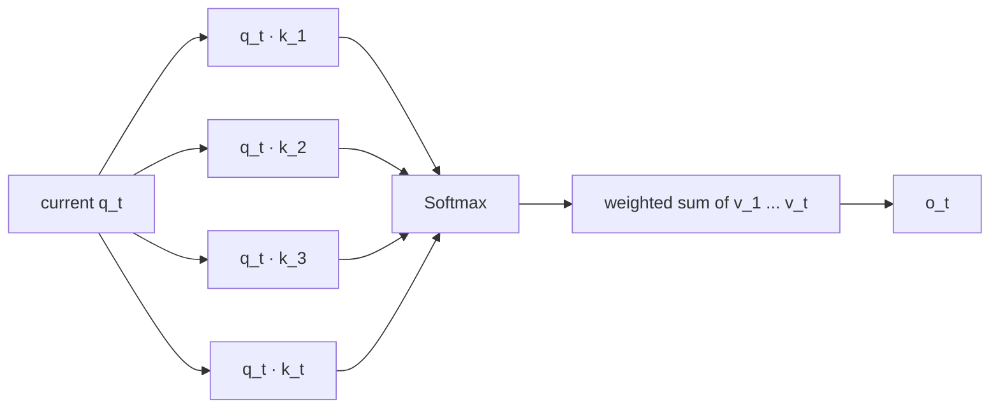
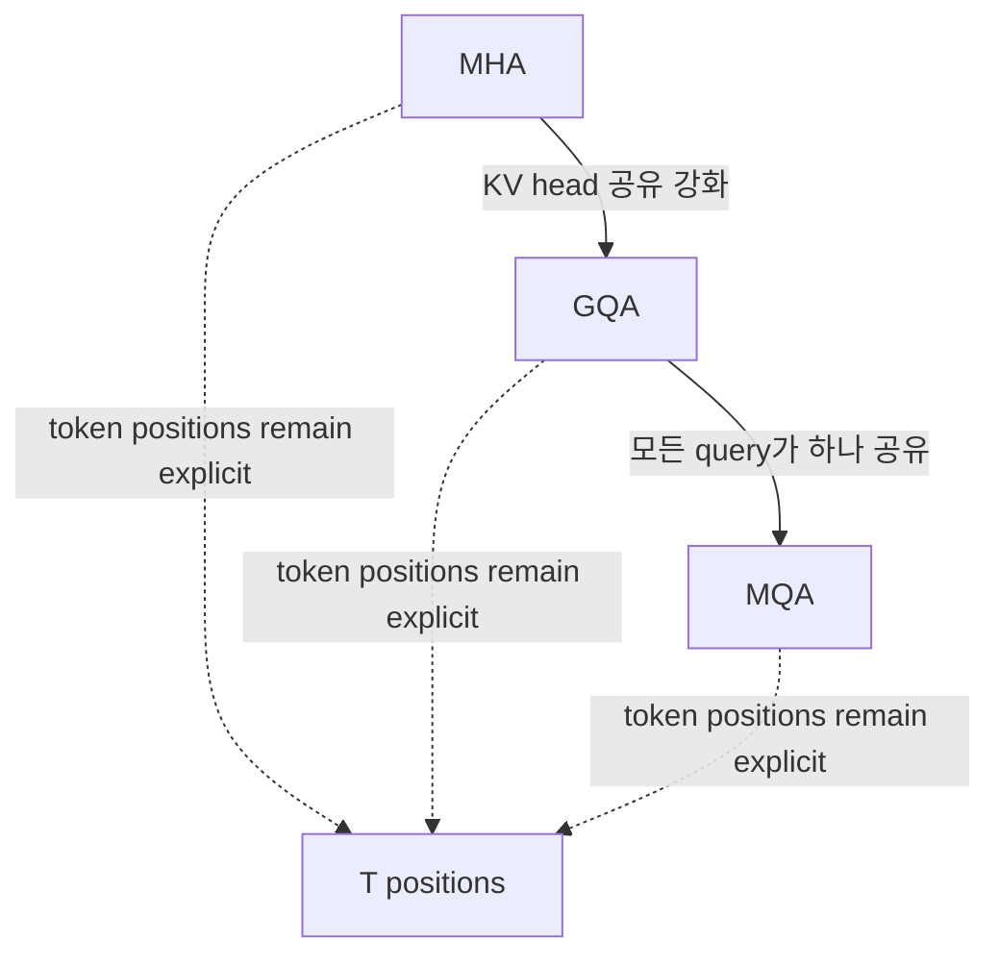
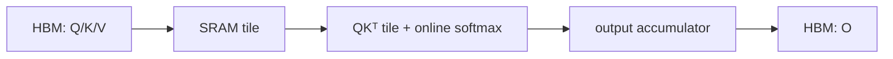

# 01. Full Softmax Attention: MHA, MQA, GQA와 KV Cache

작성일: 2026-08-18  
상위 문서: [Attention Architecture Study Guide](README.md)

## 1. 이 장의 목표

이 장은 전통적인 **Full Softmax Attention(풀 소프트맥스 어텐션, 현재 query가 허용된 모든 과거 key를 직접 조회하는 attention)**을 기준점으로 삼는다.

현대 efficient attention을 이해하려면 먼저 다음 사실을 명확하게 잡아야 한다.

> MHA, MQA, GQA는 모두 기본적으로 token-to-token softmax attention이다. 차이는 `query head와 KV head를 어떻게 공유하는가`에 있다.

따라서 GQA는 KV cache와 decode bandwidth를 크게 줄일 수 있지만, 모든 과거 position을 조회하는 full attention의 본질은 유지한다.

---

## 2. Scaled Dot-Product Attention 재정리

한 head에서 현재 token $t$의 출력은:

```math
o_t = \sum_{i\le t}
\operatorname{softmax}_i\left(
\frac{q_t^\top k_i}{\sqrt{d_h}}
\right)v_i
```

- $o_t$: **오 서브 티**, 현재 token의 attention output
- $q_t$: 현재 query
- $k_i$: 과거 위치 $i$의 key
- $v_i$: 과거 위치 $i$의 value
- $d_h$: head dimension

핵심은 현재 query가 과거의 **각 위치를 별개로 유지한 채** 조회한다는 점이다.



이 직접 주소성(addressability)이 full attention의 강점이다. 특정 UUID, 변수 정의, 문장, entity처럼 `과거의 어느 한 위치를 다시 찾는 작업`에 강하다.

---

## 3. Multi-Head Attention

**Multi-Head Attention(멀티 헤드 어텐션, 다중 머리 주의집중; MHA)**은 hidden dimension을 여러 attention head로 나눠 서로 다른 subspace에서 attention을 계산한다.

```math
\operatorname{MHA}(X)=
\operatorname{Concat}(head_1,\ldots,head_H)W_O
```

각 head는:

```math
head_h=
\operatorname{Attention}(XW_Q^{(h)},XW_K^{(h)},XW_V^{(h)})
```

를 계산한다.

### 3.1 왜 head를 나누는가

하나의 거대한 attention score 공간보다 여러 subspace에서 서로 다른 관계를 동시에 표현할 수 있다.

- syntax relation
- entity relation
- local context
- long-range dependency
- code symbol relation

등을 서로 다른 head가 학습할 수 있다. 다만 실제 head를 사람이 해석 가능한 고정 역할로 단순화하는 것은 위험하다.

### 3.2 MHA의 shape

Query head 수와 KV head 수가 같다고 하자.

```math
H_q=H_{kv}=H
```

각 token의 K/V logical element 수는:

```math
2H d_h
```

이다. `2`는 key와 value 두 tensor를 뜻한다.

---

## 4. KV Cache

Autoregressive decode에서 이미 계산한 과거 token의 K/V를 매 step 다시 계산하는 것은 낭비다. 그래서 **KV Cache(케이브이 캐시, 과거 token의 key/value 저장소)**를 유지한다.

### 4.1 기본 크기 식

한 layer, 한 sequence의 logical KV element 수:

```math
N_{KV}=2T H_{kv} d_h
```

byte 크기는:

```math
M_{KV}=2T H_{kv}d_h\cdot b
```

- $T$: cached token 수
- $H_{kv}$: KV head 수
- $d_h$: head dimension
- $b$: element당 byte 수 (`BF16=2`, `FP8≈1` 등)

전체 model에서는 layer 수 $L$을 곱한다.

```math
M_{total}\approx 2LT H_{kv}d_h b
```

실제 serving engine에서는 block padding, alignment, metadata, mixed cache representation 등의 overhead가 추가될 수 있다.

### 4.2 예시: MHA

96 heads, head dimension 128, BF16이라고 하자.

한 token/layer당:

```math
2\times96\times128\times2
=49152\ \text{bytes}
```

즉 약 48 KiB다.

93 layer라면 token 하나의 전체 layer logical KV만 약:

```math
48\text{KiB}\times93\approx4.36\text{MiB}
```

가 된다. 100K token context에서 이 구조를 그대로 유지하는 것이 얼마나 비싼지 바로 알 수 있다.

---

## 5. Decode가 memory-bandwidth problem이 되는 이유

새 output token 하나를 만들 때 current query 하나는 기존 KV cache를 읽는다.

```math
q_t K_{1:t}^\top
```

계산량도 중요하지만, decode에서는 작은 batch/sequence shape 때문에 Tensor Core를 prefill만큼 효율적으로 채우기 어렵고 과거 KV를 HBM에서 반복적으로 읽는 비용이 커진다.

즉 KV cache 최적화의 핵심은 단순히 `VRAM에 들어가는가`만이 아니다.

- 더 큰 batch를 수용할 수 있는가?
- 한 decode step에서 HBM에서 몇 byte를 읽는가?
- TP rank마다 어떤 KV shard를 읽는가?
- context가 길어질수록 ITL이 얼마나 증가하는가?

가 모두 연결된다.

---

## 6. Multi-Query Attention

**Multi-Query Attention(멀티 쿼리 어텐션, 여러 query가 하나의 K/V를 공유하는 attention; MQA)**은 Noam Shazeer가 2019년 제안했다.

MHA:

```text
Q0 ↔ K0,V0
Q1 ↔ K1,V1
Q2 ↔ K2,V2
Q3 ↔ K3,V3
```

MQA:

```text
Q0 ─┐
Q1 ─┤
Q2 ─┼── K0,V0
Q3 ─┘
```

즉:

```math
H_{kv}=1
```

이다.

### 6.1 왜 decode가 빨라지는가

KV bytes/token/layer가:

```math
2H_qd_hb
```

에서:

```math
2d_hb
```

로 줄어든다.

96 query heads, $d_h=128$, BF16이면:

```math
2\times128\times2=512\ \text{bytes/token/layer}
```

앞의 48 KiB MHA 예시와 비교하면 96배 작다.

### 6.2 대가

모든 query head가 같은 key/value representation을 공유한다. 따라서 head마다 독립 K/V를 갖는 MHA보다 표현력이 제한될 수 있다.

MQA 논문의 목표 자체가 incremental decoding의 memory-bandwidth cost를 줄이는 데 있었다.

---

## 7. Grouped-Query Attention

**Grouped-Query Attention(그룹드 쿼리 어텐션, 그룹화 질의 attention; GQA)**은 MHA와 MQA 사이를 일반화한다.

```math
1<H_{kv}<H_q
```

예를 들어 query head 8개, KV head 2개라면:

```text
Q0 Q1 Q2 Q3 ── K0,V0
Q4 Q5 Q6 Q7 ── K1,V1
```

한 KV head를 공유하는 query head 수는:

```math
g=\frac{H_q}{H_{kv}}
```

이다. 이를 group size라고 생각할 수 있다.

### 7.1 예시

$H_q=96$, $H_{kv}=8$, $d_h=128$, BF16이면:

```math
2\times8\times128\times2
=4096\ \text{bytes/token/layer}
```

즉 4 KiB다.

| 방식 | Query heads | KV heads | BF16 KV/token/layer 예시 |
|---|---:|---:|---:|
| MHA | 96 | 96 | 48 KiB |
| GQA | 96 | 8 | 4 KiB |
| MQA | 96 | 1 | 0.5 KiB |

### 7.2 GQA의 목적

GQA 원 논문은 MQA의 inference speed와 MHA에 가까운 quality 사이의 절충을 목표로 한다.

실무적으로 GQA는 현대 open LLM에서 매우 흔하다.

- Llama 3 계열
- Mistral 계열
- Qwen3 이전 full-attention 계열
- Gemma 2/3
- gpt-oss

등이 대표적인 사례다. 세부 head 수와 local/global 구조는 모델별로 다르다.

---

## 8. GQA가 줄이지 못하는 것

GQA를 `linear attention`으로 오해하면 안 된다.

현재 query는 여전히 과거 모든 position의 key와 비교한다.

```math
q_tK_{1:t}^\top
```

따라서 global GQA에서는:

- KV cache growth: 여전히 $O(T)$
- decode attention의 history-length dependency: 여전히 $O(T)$
- prefill pairwise interaction: 여전히 $O(T^2)$

이다.

GQA가 줄이는 것은 주로 **KV head axis의 상수항**이다.



---

## 9. Full Attention의 prefill complexity

Sequence 전체 Q/K score matrix는:

```math
QK^\top\in\mathbb{R}^{T\times T}
```

한 head 기준 주요 dot-product 연산량은 대략:

```math
O(T^2d_h)
```

이다.

Head 수와 batch를 포함하면 상수항이 커진다.

GQA는 K/V projection과 cache를 줄이지만 Q head 수가 유지되고 query가 모든 token position을 조회하므로 pairwise token interaction 자체는 제거하지 않는다.

---

## 10. FlashAttention은 무엇을 바꾸는가

**FlashAttention(플래시 어텐션, IO-aware exact attention algorithm)**은 model architecture가 아니다.

일반 attention을 naïve하게 구현하면 $T\times T$ attention matrix를 HBM에 materialize하고 여러 kernel 사이에서 읽고 쓰는 비용이 크다.

FlashAttention은 Q/K/V를 tile로 나누고 on-chip SRAM을 활용하여 softmax를 streaming 방식으로 정확하게 계산한다.



### 10.1 중요한 구분

FlashAttention은:

- exact softmax 결과를 유지한다.
- $T\times T$ intermediate를 HBM에 전부 저장하지 않는다.
- HBM↔SRAM I/O를 크게 줄인다.

하지만 full attention의 **pairwise arithmetic 관계 자체는 여전히 quadratic**이다.

즉:

> FlashAttention은 `어떤 정보를 보는가`를 바꾸는 것이 아니라 `같은 attention을 GPU에서 어떻게 계산하는가`를 바꾼다.

---

## 11. PagedAttention은 무엇을 바꾸는가

**PagedAttention(페이지드 어텐션, OS의 paging에서 영감을 받은 KV cache block 관리 방식)**은 vLLM에서 제안됐다.

긴/짧은 request가 동적으로 들어오고 나가면 KV cache를 contiguous buffer로 크게 예약할 경우:

- 내부 fragmentation
- over-reservation
- beam/prefix duplication

등의 낭비가 생긴다.

PagedAttention은 logical token sequence와 physical KV blocks를 분리한다.

```text
Logical request tokens
  block 0 → physical KV page 17
  block 1 → physical KV page 42
  block 2 → physical KV page  3
```

이것은 attention mechanism 자체를 MHA→GQA처럼 바꾸지 않는다. 같은 모델의 KV를 더 유연하게 저장/공유하도록 하는 serving memory algorithm이다.

---

## 12. Local / Sliding Window Attention

**Sliding Window Attention(슬라이딩 윈도우 어텐션, 최근 고정 길이 window만 보는 softmax attention; SWA)**은 full attention의 조회 범위를 제한한다.

현재 token $t$가 window $W$만 본다면:

```math
i\in[t-W+1,t]
```

에 대해서만 attention을 계산한다.

전체 sequence 연산은 대략:

```math
O(TW)
```

이 되고 $W$를 고정하면 $T$에 대해 선형이다.

하지만 이 방식은 linear recurrent attention과 다르다.

- SWA: 최근 token의 K/V를 **개별적으로 유지하고 softmax 조회**
- recurrent linear attention: history를 **state matrix/vector로 압축**

Mistral 7B가 GQA+SWA를 대표적으로 사용했고, Gemma 2/3 및 gpt-oss처럼 local과 global layer를 섞는 설계도 있다.

---

## 13. Global과 Local layer를 섞는 이유

Local attention만 사용하면 멀리 떨어진 exact retrieval이 어렵다. 반대로 모든 layer가 global이면 KV와 compute가 비싸다.

따라서 일부 모델은:

```text
Local → Local → Local → ... → Global
```

패턴을 사용한다.

예를 들어 Gemma 3는 큰 모델에서 5개의 local attention layer와 1개의 global attention layer를 반복한다. 이는 recurrent linear attention과는 다른 형태의 hybrid이지만 목표는 비슷하다.

> 대부분의 layer는 싼 memory path를 사용하고, 일정 간격마다 global path로 장거리 정보를 보정한다.

---

## 14. Attention Sink

긴 context에서 일부 attention head가 의미상 특별하지 않은 초기 token 또는 특정 position에 큰 attention mass를 할당하는 현상을 **Attention Sink(어텐션 싱크, attention 확률을 흡수하는 위치)**라고 부른다.

이는 softmax가 모든 허용된 token 사이에 확률 mass를 배분해야 하는 구조와도 관련된다.

일부 최근 모델은:

- learned sink/bias
- output gating
- 별도 sink logit

등을 사용해 `아무 token도 크게 선택하지 않는 선택지` 또는 안정적인 확률 경로를 제공한다.

gpt-oss model card는 각 attention head의 softmax denominator에 learned bias를 두어 어떤 token에도 attention하지 않을 수 있는 경로를 제공한다고 공개한다.

---

## 15. Full Attention의 장점과 한계

### 장점

1. 모든 과거 token을 개별적으로 address할 수 있다.
2. exact copy/retrieval에 강하다.
3. training 시 token dimension 병렬성이 높다.
4. FlashAttention 등 mature kernel ecosystem이 있다.

### 한계

1. global prefill pairwise compute가 $O(T^2)$다.
2. token별 KV cache가 $O(T)$로 증가한다.
3. decode마다 과거 KV를 읽어 history-length-dependent bandwidth cost가 발생한다.
4. million-token context에서 모든 layer를 global로 유지하기 어렵다.

이 한계에서 이후 세 방향이 나왔다.

- **KV representation 압축** → MLA
- **조회 위치 제한/압축** → SWA, DSA, CSA/HCA
- **history 자체를 recurrent state로 접기** → Linear Attention, DeltaNet, KDA

---

## 16. 실전 확인용 config 해석

모델의 `config.json`에서 다음 값을 먼저 본다.

```json
{
  "num_attention_heads": 32,
  "num_key_value_heads": 8,
  "head_dim": 128,
  "num_hidden_layers": 64
}
```

이 경우:

- query heads: 32
- KV heads: 8
- query group size: $32/8=4$
- GQA
- token/layer KV element: $2\times8\times128=2048$
- BF16이면 약 4096 byte/token/layer

단 `head_dim`, K/V value dimension, latent cache representation이 별도로 정의된 MLA 계열에서는 이 단순 공식을 그대로 적용하면 안 된다.

---

## 17. 원 논문과 공식 자료

- Vaswani et al., **Attention Is All You Need**  
  https://arxiv.org/abs/1706.03762
- Shazeer, **Fast Transformer Decoding: One Write-Head is All You Need** — MQA  
  https://arxiv.org/abs/1911.02150
- Ainslie et al., **GQA: Training Generalized Multi-Query Transformer Models from Multi-Head Checkpoints**  
  https://arxiv.org/abs/2305.13245
- Dao et al., **FlashAttention: Fast and Memory-Efficient Exact Attention with IO-Awareness**  
  https://arxiv.org/abs/2205.14135
- Kwon et al., **Efficient Memory Management for Large Language Model Serving with PagedAttention**  
  https://arxiv.org/abs/2309.06180
- Mistral AI, **Mistral 7B**  
  https://arxiv.org/abs/2310.06825
