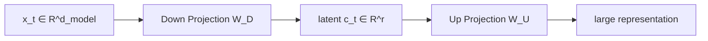
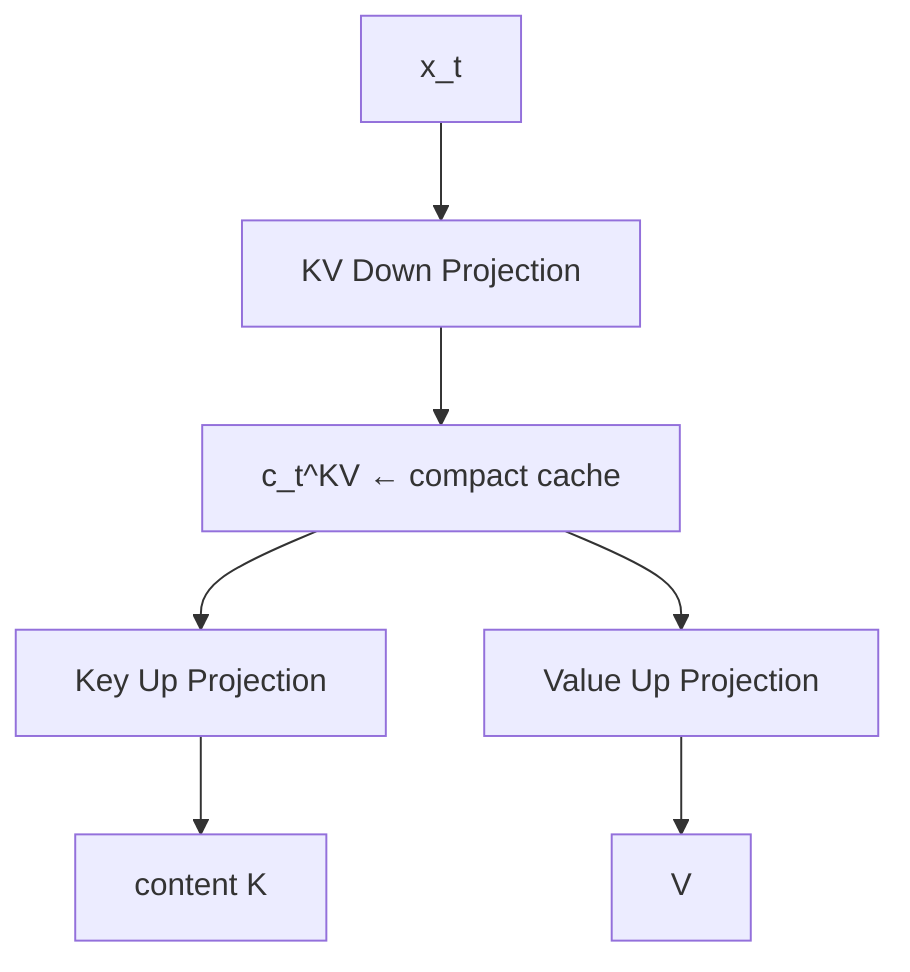
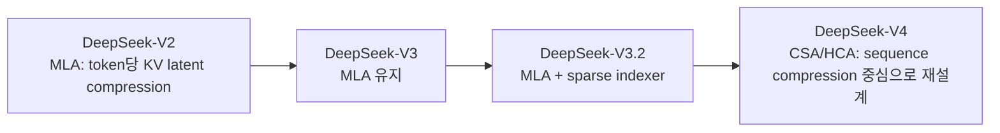

# 02. MLA와 Low-Rank Attention: KV를 Head가 아니라 표현 공간에서 압축하기

작성일: 2026-08-18  
상위 문서: [Attention Architecture Study Guide](README.md)

## 1. 이 장의 목표

**Multi-head Latent Attention(멀티 헤드 레이턴트 어텐션, 다중 머리 잠재 attention; MLA)**은 DeepSeek-V2에서 본격적으로 공개된 KV-cache 절감 구조이며, 이후 DeepSeek-V3/V3.2 계열과 Kimi의 MLA 경로를 이해하는 핵심 기반이다.

MLA를 GQA와 같은 축에서 이해하면 혼란이 생긴다.

- GQA: **KV head 수를 줄인다.**
- MLA: **각 token의 K/V가 생성되는 latent representation의 rank를 줄인다.**

둘 다 KV cache를 줄이지만 압축 원리가 다르다.

---

## 2. MHA/GQA의 KV projection 다시 보기

일반 MHA/GQA에서는 hidden vector $x_t$에서 K/V를 직접 만든다.

```math
k_t=W_Kx_t,\qquad v_t=W_Vx_t
```

여러 KV head를 포함하면 logical K/V width는 대략:

```math
d_{KV}=H_{kv}d_h
```

이고 token마다 이 representation을 cache한다.

GQA는 $H_{kv}$를 줄여 $d_{KV}$를 작게 만든다.

```text
MHA: x_t → K0 K1 K2 ... KH, V0 V1 V2 ... VH
GQA: x_t → K0 K1 ... Kg,       V0 V1 ... Vg
```

하지만 K/V projection이 `어떤 더 작은 공통 latent subspace에서 만들어질 수 있다`는 가정을 직접 사용하지는 않는다.

---

## 3. Low Rank의 의미

**Low Rank(로우 랭크, 저랭크)**는 큰 vector/matrix representation이 실제로는 더 적은 수의 독립적인 basis direction으로 설명될 수 있다는 가정이다.

예를 들어 큰 projection $W$를:

```math
W\approx W_UW_D
```

로 분해한다고 하자.

```math
W_D\in\mathbb{R}^{r\times d_{model}},\qquad
W_U\in\mathbb{R}^{d_{out}\times r}
```

여기서:

```math
r\ll d_{out}
```

이면 입력을 먼저 작은 $r$차원 latent로 압축하고 다시 큰 공간으로 확장할 수 있다.



---

## 4. MLA의 핵심: KV Down-Projection

DeepSeek-V2 MLA를 단순화하면 token $t$의 hidden state를 작은 KV latent로 압축한다.

```math
c_t^{KV}=W_{DKV}x_t
```

- $c_t^{KV}$: **씨 서브 티 케이브이**, KV용 compressed latent vector
- $W_{DKV}$: **KV Down-Projection(케이브이 다운 프로젝션, KV 잠재공간으로 축소하는 projection)**
- $r_{KV}=\dim(c_t^{KV})$: KV latent rank

그 뒤 content key와 value를 복원한다.

```math
k_t^{C}=W_{UK}c_t^{KV}
```

```math
v_t=W_{UV}c_t^{KV}
```

- $W_{UK}$: key up-projection
- $W_{UV}$: value up-projection
- 위첨자 $C$: content/no-position component라는 의미로 쓰이는 경우가 많다.

핵심 cache 후보는 full K/V가 아니라 $c_t^{KV}$다.



---

## 5. Query도 Low-Rank로 만들 수 있다

DeepSeek MLA는 query에도 low-rank projection을 사용한다.

단순화하면:

```math
c_t^Q=W_{DQ}x_t
```

```math
q_t=W_{UQ}c_t^Q
```

여기서 `q_lora_rank`, `kv_lora_rank` 같은 config 이름이 나온다.

이때 `LoRA rank`라는 이름이 붙어 있어도 inference adapter인 LoRA를 끼운다는 뜻이 아니다. **큰 Q 또는 KV projection을 low-rank factorization 형태로 parameterize한 model architecture**라는 의미다.

---

## 6. MLA와 RoPE의 충돌 문제

MLA에서 가장 중요한 세부 설계 중 하나는 positional encoding이다.

만약 full key에 RoPE를 적용한 뒤 token마다 cache해야 한다면:

```math
k_i'=R_iW_{UK}c_i^{KV}
```

position-dependent 회전 $R_i$ 때문에 단순히 $c_i^{KV}$만 cache하고 모든 projection을 query 쪽에 absorb하기가 어려워진다.

그래서 DeepSeek MLA는 key/query dimension을 두 부분으로 분리한다.

- **NoPE Content Part(노피이 콘텐츠 파트, 위치 회전이 없는 content 차원)**
- **RoPE Part(로프 파트, 위치 정보를 담당하는 차원)**

개념적으로:

```math
q_t=[q_t^C;q_t^R]
```

```math
k_i=[k_i^C;k_i^R]
```

attention logit은:

```math
q_t^\top k_i
=
(q_t^C)^\top k_i^C
+
(q_t^R)^\top k_i^R
```

이다.

이런 분리를 **Decoupled RoPE(디커플드 로프, content 압축과 positional component를 분리한 RoPE)**라고 이해할 수 있다.

DeepSeek 계열 config에서 흔히:

- `qk_nope_head_dim`
- `qk_rope_head_dim`

이 따로 보이는 이유다.

---

## 7. Matrix Absorption: 매번 full K/V를 복원하지 않는 법

MLA를 naïve하게 구현하면 cache는 작아져도 decode할 때 모든 cached latent를 full key/value로 다시 up-project해야 한다. 그러면 이득이 크게 줄어든다.

하지만 행렬 곱의 결합법칙을 사용하면 일부 projection을 다른 연산에 흡수할 수 있다.

### 7.1 Key 쪽 absorption

```math
q_t^\top k_i^C
=q_t^\top W_{UK}c_i^{KV}
```

곱 순서를 바꾸면:

```math
q_t^\top W_{UK}c_i^{KV}
=
(W_{UK}^\top q_t)^\top c_i^{KV}
```

즉 모든 $c_i$를 큰 key로 복원하는 대신 query를 latent space로 변환할 수 있다.

```math
q_t^{latent}=W_{UK}^\top q_t
```

그 뒤:

```math
(q_t^{latent})^\top c_i^{KV}
```

를 계산한다.

### 7.2 Value 쪽 absorption

attention weight를 $a_i$라 하면:

```math
\sum_i a_i v_i
=
\sum_i a_i W_{UV}c_i^{KV}
```

선형성을 이용하면:

```math
=W_{UV}\left(\sum_i a_i c_i^{KV}\right)
```

이므로 latent를 weighted sum한 뒤 한 번 up-project할 수 있다.

이런 **Matrix Absorption(매트릭스 업소프션, projection matrix를 query/output path와 결합해 runtime full reconstruction을 피하는 최적화)**이 MLA decode 효율의 핵심이다.

---

## 8. MLA cache는 무엇을 저장하는가

이상적인 MLA cache는 대략:

```math
\text{Cache per token}
\approx
c_t^{KV} + k_t^R
```

형태다.

즉:

```math
O(r_{KV}+d_{rope})
```

의 token당 representation을 저장한다.

일반 MHA/GQA의:

```math
O(H_{kv}d_h)
```

보다 훨씬 작게 설계할 수 있다.

다만 중요한 주의점이 있다.

> 논문상 latent-cache representation과 특정 framework의 reference implementation이 실제로 materialize하는 cache representation은 항상 같지 않다.

일부 범용 구현은 호환성 때문에 reconstructed K/V를 저장할 수 있다. 실제 vLLM/SGLang/FlashMLA 경로를 볼 때는 **논문 수식이 아니라 kernel과 cache manager가 어떤 tensor를 저장하는지** 확인해야 한다.

---

## 9. MLA는 token 축을 없애지 않는다

MLA에서 과거 token은 여전히 개별 latent entry로 남아 있다.

```text
Token 1 → c_1^KV
Token 2 → c_2^KV
Token 3 → c_3^KV
...
Token T → c_T^KV
```

현재 query가 global MLA를 수행하면 과거 모든 token latent와 상호작용한다.

따라서:

- cache growth: $O(T)$
- global decode lookup: history length $T$에 의존
- global prefill pairwise interaction: 기본적으로 quadratic

이다.

MLA의 핵심은 **token 수를 줄인 것이 아니라 token당 KV representation을 강하게 압축한 것**이다.

이 점이 KDA/Gated DeltaNet 같은 recurrent linear attention과 가장 큰 차이다.

---

## 10. GQA와 MLA 비교

| 항목 | GQA | MLA |
|---|---|---|
| 압축 축 | head 수 | representation rank |
| cache 단위 | 실제 K/V head | KV를 생성하는 latent + positional component |
| token별 entry | 유지 | 유지 |
| global softmax | 유지 | 유지 |
| exact token addressability | 유지 | 유지 |
| cache growth | $O(T)$ | $O(T)$ |
| token당 bytes | KV head 수에 비례 | latent rank에 비례 |
| 핵심 runtime 최적화 | shared KV broadcast/read | matrix absorption + specialized kernel |

GQA는 `head sharing`, MLA는 `low-rank latent compression`이다.

---

## 11. DeepSeek-V2 MLA의 의미

DeepSeek-V2 기술보고서는 MLA를 KV cache를 크게 줄이기 위한 핵심 architecture로 제시했다. 보고서에서는 이전 DeepSeek 67B 대비 KV cache를 93.3% 줄였다고 보고한다. 이 수치는 DeepSeek-V2 실험 조건의 모델 비교 결과이며 모든 MLA 모델에서 고정적으로 얻는 비율은 아니다.

MLA가 중요한 이유는 단순한 cache compression 외에도 다음을 보여줬기 때문이다.

1. KV representation을 head 개수만으로 최적화할 필요가 없다.
2. model architecture와 runtime algebra(matrix absorption)를 함께 설계할 수 있다.
3. long-context decode에서 HBM traffic을 줄이는 것이 모델 품질과 직접적인 trade-off만은 아니다.

---

## 12. DeepSeek-V3와 V3.2

DeepSeek-V3는 DeepSeek-V2에서 검증된 MLA와 DeepSeekMoE를 계승했다.

V3.2의 **DeepSeek Sparse Attention(딥시크 스파스 어텐션; DSA)**은 MLA를 버린 것이 아니다. MLA backbone 위에 query별 중요한 과거 token을 고르는 indexer를 결합해 long-context 조회 범위를 sparse하게 만든다.

즉 계보를 다음처럼 이해하는 편이 맞다.



V3.2 DSA와 V4 CSA/HCA는 [12-deepseek.md](12-deepseek.md)에서 별도로 자세히 다룬다.

---

## 13. Kimi-K3의 MLA는 DeepSeek MLA와 완전히 같지 않다

Kimi-K3 역시 `kv_lora_rank=512`, `q_lora_rank=1536` 같은 MLA 계열 parameterization을 사용한다. 하지만 Kimi-K3 config에는:

```text
mla_use_nope = true
mla_use_output_gate = true
```

가 명시된다.

즉 Kimi-K3의 Gated MLA는 **NoPE global content attention + input-dependent output gate**라는 역할을 맡는다.

KDA recurrent layer가 sequence order/recency 정보를 계속 residual stream에 제공하고, MLA는 주기적으로 전체 token memory를 content-based global lookup하는 분업이다.

따라서 `MLA`라는 공통 이름만 보고 DeepSeek-V3와 Kimi-K3의 position path까지 동일하다고 보면 안 된다.

---

## 14. MLA와 Quantized KV Cache

MLA와 FP8 KV cache는 서로 다른 최적화 축이다.

- MLA: token당 **element count**를 줄인다.
- FP8 KV: element당 **byte 수**를 줄인다.

따라서 함께 사용하면 효과가 곱해질 수 있다.

개념적으로:

```math
M_{cache}
\propto
T\times d_{cached}\times b
```

에서 MLA는 $d_{cached}$를 줄이고, quantization은 $b$를 줄인다.

하지만 낮은 precision은 scale metadata, dequantization cost, kernel support, numerical error 등을 동반한다.

---

## 15. MLA와 Tensor Parallelism

MLA에서 TP를 볼 때는 다음 projection들이 어디에 shard되는지 확인해야 한다.

- Q up/down projection
- KV down projection
- K/V up projection 또는 absorbed matrix
- output projection
- RoPE component

일반 GQA의 `KV head를 rank에 나눈다`는 직관만으로는 충분하지 않다. 일부 latent tensor는 rank 사이 복제되는 편이 더 싸고, 일부 projection은 column/row parallel로 분할된다.

따라서 serving engine에서 MLA 성능은 model-level cache 절감만으로 결정되지 않고 **TP collective와 kernel layout**에도 크게 좌우된다.

---

## 16. MLA를 직접 계산해 보는 사고 실험

가정:

- model hidden: 7168
- full KV width가 매우 큼
- KV latent rank: 512
- positional cache component: 64
- BF16

이상적인 cache representation이 `512 + 64` element/token이라고 단순화하면:

```math
576\times2=1152\ \text{bytes/token/layer}
```

이다.

반면 8 KV heads, head dim 128 GQA라면:

```math
2\times8\times128\times2=4096\ \text{bytes/token/layer}
```

이다.

이 예시는 MLA의 원리를 보여주기 위한 단순 계산이다. 실제 모델에서는 K/V dimension, cache representation, positional component, dtype, alignment와 kernel path를 확인해야 한다.

---

## 17. MLA를 이해할 때 자주 생기는 오해

### 오해 1. MLA는 GQA보다 KV head가 적은 방식이다

아니다. 핵심 축이 다르다. MLA의 핵심은 low-rank latent compression이다.

### 오해 2. MLA는 Linear Attention이다

아니다. MLA는 일반적으로 global softmax attention을 유지한다. 과거 token별 latent entry도 남는다.

### 오해 3. latent rank가 작으면 매 decode마다 full K/V 복원 비용이 반드시 크다

matrix absorption을 사용하면 large up-projection을 query/output 쪽으로 재배치할 수 있다.

### 오해 4. MLA를 쓰면 KV cache가 context length와 무관하다

아니다. token당 representation이 작아질 뿐 token 수 $T$에 따라 cache는 증가한다.

### 오해 5. 모든 MLA 모델이 동일한 RoPE 구조를 쓴다

아니다. DeepSeek의 decoupled RoPE 계열과 Kimi-K3의 NoPE MLA처럼 position 설계가 다를 수 있다.

---

## 18. 이 장의 핵심 정리

1. GQA는 KV **head axis**를 압축한다.
2. MLA는 KV **representation rank**를 압축한다.
3. MLA의 cache 핵심은 token별 low-rank latent representation이다.
4. Matrix absorption을 이용하면 cached latent를 매 step full K/V로 모두 복원하지 않고 attention을 계산할 수 있다.
5. positional component는 low-rank absorption을 방해할 수 있어 DeepSeek MLA는 content/position path를 분리한다.
6. MLA는 token별 memory를 유지하므로 global attention의 $T$ dependence가 남는다.
7. KDA/GDN처럼 history를 fixed recurrent state로 접는 방식과는 근본적으로 다르다.

---

## 19. 원 논문과 구현

- DeepSeek-AI, **DeepSeek-V2: A Strong, Economical, and Efficient Mixture-of-Experts Language Model**  
  https://arxiv.org/abs/2405.04434
- DeepSeek-AI, **DeepSeek-V3 Technical Report**  
  https://arxiv.org/abs/2412.19437
- DeepSeek FlashMLA  
  https://github.com/deepseek-ai/FlashMLA
- Kimi Team, **Kimi Linear: An Expressive, Efficient Attention Architecture**  
  https://arxiv.org/abs/2510.26692
