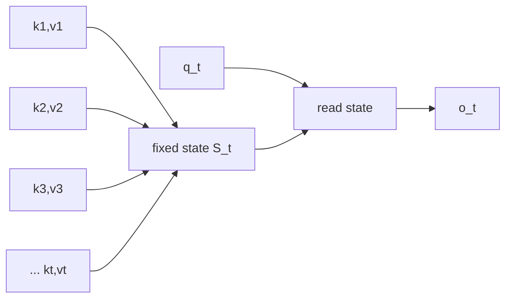
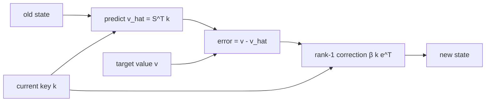

# 03. Linear/Recurrent Attention: Linear Transformer → DeltaNet → Gated DeltaNet → KDA

작성일: 2026-08-18  
상위 문서: [Attention Architecture Study Guide](README.md)

## 1. 이 장의 목표

이 장은 Full Softmax Attention과 다른 계보인 **Linear Attention(리니어 어텐션, sequence length에 대해 선형 시간/상태 계산을 목표로 하는 attention 계열)**을 다룬다.

핵심 전환은 다음 한 문장이다.

> 과거 token을 하나씩 다시 조회하지 말고, key-value 관계를 fixed-size state에 누적한 뒤 현재 query가 그 state를 읽게 한다.

여기서 시작해 단순 additive memory의 간섭 문제, Delta Rule, DeltaNet, Gated DeltaNet, Kimi Delta Attention(KDA)까지 이어진다.

---

## 2. Softmax Attention에서 무엇이 재배열을 막는가

Full attention을 단순화하면:

```math
o_t = \sum_{i\le t}
\mathrm{softmax}_i(q_t^\top k_i)v_i
```

이다.

Softmax는 현재 query와 **모든 key score를 함께 정규화**한다.

```math
a_{t,i}=\frac{e^{q_t^\top k_i}}{\sum_{j\le t}e^{q_t^\top k_j}}
```

분모가 query마다 모든 과거 token에 의존하므로 단순히 과거의 $kv^\top$를 하나의 fixed state로 미리 합산하기 어렵다.

---

## 3. Kernelized Linear Attention의 출발점

`Transformers are RNNs` 계열의 linear transformer는 softmax attention을 feature map $\phi(\cdot)$를 이용한 kernel 형태로 바꾼다.

```math
\mathrm{sim}(q,k)=\phi(q)^\top\phi(k)
```

그러면 정규화된 causal linear attention을 개념적으로:

```math
o_t=
\frac{
\phi(q_t)^\top
\left(\sum_{i\le t}\phi(k_i)v_i^\top\right)
}{
\phi(q_t)^\top
\left(\sum_{i\le t}\phi(k_i)\right)
}
```

처럼 쓸 수 있다.

여기서 두 recurrent state를 정의한다.

```math
S_t=\sum_{i\le t}\phi(k_i)v_i^\top
```

```math
z_t=\sum_{i\le t}\phi(k_i)
```

그러면:

```math
S_t=S_{t-1}+\phi(k_t)v_t^\top
```

```math
z_t=z_{t-1}+\phi(k_t)
```

이고 query 시점에는:

```math
o_t=
\frac{\phi(q_t)^\top S_t}{\phi(q_t)^\top z_t}
```

만 계산하면 된다.

### 핵심

과거 token 수가 늘어도 $S_t$와 $z_t$ shape은 고정된다.



---

## 4. Associativity가 왜 중요한가

단순 attention에서 softmax를 잠시 제외하면:

```math
o_t=\sum_{i\le t}(q_t^\top k_i)v_i
```

이다.

스칼라와 행렬 곱의 결합법칙을 이용하면:

```math
o_t=
\left(\sum_{i\le t}v_i k_i^\top\right)q_t
```

또는 state orientation을 바꾸면:

```math
S_t=\sum_{i\le t}k_iv_i^\top
```

```math
o_t=S_t^\top q_t
```

로 쓸 수 있다.

즉 `query × 모든 key`를 먼저 계산하지 않고, **과거 key-value의 외적을 먼저 누적**할 수 있다.

이 행렬 곱의 **Associativity(어소시에이티비티, 결합법칙)**가 linear attention을 recurrent form으로 바꾸는 핵심 수학이다.

---

## 5. Fast Weight와 Associative Memory

State $S_t$를 다음 mapping을 학습하는 작은 matrix라고 생각하자.

```math
S_t^\top k \approx v
```

이것은 **Associative Memory(어소시에이티브 메모리, 연상 메모리)**다.

예:

```text
key   : "변수 user_id의 정의"
value : "request.auth.user.id"
```

같은 association을 matrix direction으로 저장한다고 볼 수 있다.

Model parameter $W$는 training 이후 inference 동안 고정되지만, $S_t$는 prompt를 읽으면서 계속 바뀐다. 이런 state matrix를 **Fast Weight(패스트 웨이트, 입력 sequence 동안 빠르게 바뀌는 임시 가중치)** 관점으로 해석할 수 있다.

---

## 6. 단순 Additive Update의 문제

가장 단순한 state update는:

```math
S_t=S_{t-1}+k_tv_t^\top
```

이다.

문제는 새 association을 항상 더하기만 한다는 것이다.

기존 state가:

```text
"A의 값" → old_value
```

를 강하게 기억하고 있는데 같은 key direction에:

```text
"A의 값" → new_value
```

가 들어오면 old/new value가 중첩된다.

이를 **Memory Interference(메모리 인터피어런스, 기억 간 간섭)** 또는 associative collision로 생각할 수 있다.

Fixed state의 capacity는 유한하므로 context가 길수록 여러 association이 같은 subspace를 공유하게 된다.

---

## 7. Delta Rule의 뿌리: Memory도 Online Learning을 할 수 있다

현재 memory $S_{t-1}$에 key $k_t$를 넣었을 때 예측하는 value를:

```math
\hat v_t=S_{t-1}^\top k_t
```

라고 하자.

- $\hat v_t$: **브이 햇 서브 티**, memory가 예측한 value

실제로 기록하려는 target은 $v_t$다.

그럼 reconstruction loss를:

```math
\mathcal{L}_t(S)
=
\frac{1}{2}
\|S^\top k_t-v_t\|_2^2
```

로 둘 수 있다.

이 loss에 대해 $S$를 **Gradient Descent(그래디언트 디센트, 경사하강법)** 한 step 업데이트한다.

```math
S_t=S_{t-1}-\eta_t\nabla_S\mathcal{L}_t
```

gradient는:

```math
\nabla_S\mathcal{L}_t
=k_t(S_{t-1}^\top k_t-v_t)^\top
```

이므로:

```math
S_t
=
S_{t-1}
+
\beta_t k_t
(v_t-S_{t-1}^\top k_t)^\top
```

를 얻는다.

이것이 **Delta Rule(델타 룰, 현재 예측과 목표의 차이만큼 association을 수정하는 규칙)**의 핵심이다.

---

## 8. Delta Rule을 의미 단위로 해석하기

### 8.1 Predict

```math
\hat v_t=S_{t-1}^\top k_t
```

현재 key에 대해 memory가 이미 무엇을 알고 있는지 읽는다.

### 8.2 Error

```math
e_t=v_t-\hat v_t
```

- $e_t$: **이 서브 티**, error/correction vector

새 target과 기존 기억의 차이만 계산한다.

### 8.3 Correct

```math
S_t=S_{t-1}+\beta_tk_te_t^\top
```

현재 key 방향에 correction만 기록한다.



단순 additive update와 달리 memory가 이미 정확한 association을 알고 있다면 correction이 작다.

---

## 9. Delta Rule의 Erase + Write 형태

식:

```math
S_t
=
S_{t-1}
+
\beta_tk_t(v_t-S_{t-1}^\top k_t)^\top
```

을 전개하면:

```math
S_t
=
S_{t-1}
-
\beta_tk_tk_t^\top S_{t-1}
+
\beta_tk_tv_t^\top
```

다시 묶으면:

```math
S_t
=
(I-\beta_tk_tk_t^\top)S_{t-1}
+
\beta_tk_tv_t^\top
```

여기서:

- $I$: Identity Matrix(아이덴티티 매트릭스, 단위행렬)
- $k_tk_t^\top$: key 방향의 rank-1 projector 성격
- 첫 항: 현재 key 방향의 기존 association을 약화/수정
- 둘째 항: 새 value를 기록

즉 Delta Rule은 단순히 `write`하는 것이 아니라 **targeted erase + write**다.

---

## 10. DeltaNet

**DeltaNet(델타넷, Delta Rule을 recurrent linear transformer memory update에 적용한 구조)**은 이 delta update를 sequence model에서 효율적으로 사용한다.

기본 recurrent form은:

```math
S_t=(I-\beta_tk_tk_t^\top)S_{t-1}+\beta_tk_tv_t^\top
```

```math
o_t=S_t^\top q_t
```

이다.

DeltaNet 연구는 additive linear attention보다 associative recall을 개선했지만, recurrence를 training에서 sequence dimension으로 병렬화하는 것이 어려웠다.

2024년 `Parallelizing Linear Transformers with the Delta Rule over Sequence Length`는 Householder matrix product의 효율적 representation을 이용해 DeltaNet을 modern GPU에서 parallel training할 수 있는 algorithm을 제안했다.

---

## 11. 왜 $k$를 Normalize하는가

Delta transition에:

```math
k_tk_t^\top
```

이 직접 들어간다.

만약 $\|k_t\|$가 매우 크면 erase/update strength가 key norm에 강하게 좌우된다.

그래서 DeltaNet/KDA 계열은 key를 L2-normalize하는 경우가 많다.

```math
\bar k_t=\frac{k_t}{\|k_t\|_2}
```

그러면:

```math
\bar k_t\bar k_t^\top
```

이 unit key direction을 기준으로 더 안정적인 rank-1 projection 역할을 한다.

---

## 12. DeltaNet에도 문제가 남는다: Memory Lifetime

Delta Rule은 현재 key와 겹치는 memory를 정교하게 수정한다.

하지만 어떤 old information이 다시 같은 key로 접근되지 않는다면 오래된 state component가 계속 남을 수 있다.

필요한 것은:

> 현재 token을 보고 `과거 memory 자체를 얼마나 유지할 것인가`를 결정하는 forgetting mechanism

이다.

---

## 13. Gated DeltaNet

**Gated DeltaNet(게이티드 델타넷, gated forgetting과 delta update를 결합한 recurrent linear attention; GDN)**은 forgetting과 targeted update를 결합한다.

단순한 형태로:

```math
S_t
=
\alpha_t
(I-\beta_tk_tk_t^\top)S_{t-1}
+
\beta_tk_tv_t^\top
```

로 볼 수 있다.

- $\alpha_t$: **알파 서브 티**, retention/forget gate
- $\beta_t$: **베타 서브 티**, delta update strength

### 13.1 역할 분리

- $\alpha_t$: memory 전체의 lifetime을 제어
- Delta Rule: 같은 key direction의 내용을 정밀 교정

논문은 이 둘이 상보적이라고 본다.

- gating → 빠른 memory erasure
- delta rule → targeted memory modification

---

## 14. Scalar Forget Gate의 의미

한 head에서 $\alpha_t$가 scalar라면:

```math
S_{t-1}\rightarrow\alpha_tS_{t-1}
```

으로 모든 state row/channel을 같은 비율로 감쇠한다.

예:

```text
syntax memory      × 0.8
entity memory      × 0.8
recent instruction × 0.8
old number         × 0.8
```

하지만 서로 다른 feature는 서로 다른 memory timescale을 가질 필요가 있다.

- local syntax는 빠르게 사라져도 됨
- task instruction은 오래 유지해야 함
- entity relation은 중간 lifetime을 가질 수 있음

이 한계에서 KDA의 finer-grained gate가 나온다.

---

## 15. Kimi Delta Attention

**Kimi Delta Attention(키미 델타 어텐션, Kimi가 확장한 channel-wise gated delta attention; KDA)**의 핵심 state update는:

```math
S_t
=
(I-\beta_tk_tk_t^\top)
\mathrm{Diag}(\alpha_t)S_{t-1}
+
\beta_tk_tv_t^\top
```

이다.

- $\alpha_t\in(0,1)^{d_k}$: channel-wise retention vector
- $\mathrm{Diag}(\alpha_t)$: alpha vector를 diagonal에 놓은 matrix
- $\beta_t$: delta update strength

GDN의 scalar decay를 key/state channel별 vector decay로 확장한 것이 KDA의 가장 중요한 개념적 변화다.

---

## 16. KDA를 가장 읽기 쉬운 형태로 분해하기

먼저 memory를 channel별로 decay한다.

```math
M_t=\mathrm{Diag}(\alpha_t)S_{t-1}
```

현재 key로 memory prediction을 읽는다.

```math
\hat v_t=M_t^\top k_t
```

correction을 구한다.

```math
e_t=v_t-\hat v_t
```

state를 수정한다.

```math
S_t=M_t+\beta_tk_te_t^\top
```

현재 query로 읽는다.

```math
\tilde o_t=S_t^\top q_t
```

즉:

```text
Forget by channel → Predict → Correct → Read
채널별 망각          예측       교정       조회
```

이다.

---

## 17. Channel-wise Retention의 시간 척도

한 channel $c$에 대해 old memory가 여러 step을 통과해 남는 scale은 대략:

```math
\prod_{j=i+1}^{t}\alpha_{j,c}
```

이다.

- $\prod$: **프로덕트**, 여러 값을 모두 곱함
- $c$: state/key channel

예를 들어 어떤 channel이 지속적으로 $\alpha=0.99$이고 다른 channel은 $\alpha=0.5$라면 memory half-life가 크게 다르다.

따라서 KDA는 한 head 내부에서도:

- long-term channel
- medium-term channel
- local/rapidly-changing channel

같은 서로 다른 timescale을 학습할 수 있다.

---

## 18. KDA의 Q/K/V 전처리

Kimi-K3 KDA는 Q/K/V linear projection만 바로 state에 넣지 않는다.

개념적으로:

```text
x_t
 ├─ Q projection → ShortConv → Swish → L2Norm → q_t
 ├─ K projection → ShortConv → Swish → L2Norm → k_t
 └─ V projection → ShortConv → Swish          → v_t

x_t → decay projection → α_t
x_t → beta projection  → β_t
```

### 18.1 ShortConv

**Short Convolution(쇼트 컨볼루션, 최근 몇 token을 섞는 짧은 1D convolution)**은 local dependency를 먼저 처리한다.

Kimi-K3와 Qwen GDN 경로 모두 kernel size 4의 short convolution을 사용하는 config가 공개돼 있다.

recurrent state가 전체 history를 압축하더라도 바로 인접한 token의 subword/syntax pattern은 작은 convolution이 효율적으로 처리할 수 있다.

### 18.2 Swish/SiLU

**Swish/SiLU(스위시/실루, smooth gated activation)**는 대략:

```math
\mathrm{SiLU}(x)=x\sigma(x)
```

형태다.

### 18.3 Q/K L2 Normalization

앞에서 설명한 delta transition의 안정화를 위해 Q/K를 unit norm 방향으로 정규화한다.

---

## 19. Kimi-K3의 Lower-Bounded Decay

Kimi-K3 config에는:

```text
gate_lower_bound = -5.0
```

가 들어 있다.

K3의 log-decay를 단순화하면:

```math
g_t=g_{min}\cdot\sigma(z_t),\qquad g_{min}=-5
```

그리고 retention은:

```math
\alpha_t=e^{g_t}
```

이다.

따라서:

```math
g_t\in(-5,0)
```

```math
\alpha_t\in(e^{-5},1)
```

가 된다.

이 lower bound는 model semantics뿐 아니라 FlashKDA의 BF16 chunkwise computation을 안정적으로 만들기 위한 **algorithm-system co-design**이다.

---

## 20. 왜 Chunkwise Algorithm이 필요한가

Recurrent form은:

```math
S_1\rightarrow S_2\rightarrow\cdots\rightarrow S_T
```

처럼 보인다.

decode에서는 token 한 개씩 처리하므로 자연스럽지만, training/prefill에서 이를 Python loop처럼 순차 실행하면 GPU 병렬성이 나쁘다.

그래서 linear recurrent attention은 sequence를 chunk로 나누고 recurrence를 matrix operation으로 재배열한다.

```text
chunk 0         chunk 1         chunk 2
[t0 ... t15] → [t16 ... t31] → [t32 ... t47]
     │               │                │
  intra-chunk      intra-chunk      intra-chunk
  parallel         parallel         parallel
     └──── state ─────┴──── state ─────┘
```

- **Inter-chunk(인터 청크)**: 이전 chunk의 final state가 다음 chunk로 전달
- **Intra-chunk(인트라 청크)**: chunk 내부 token relation을 matrix multiplication으로 병렬 계산

Kimi-K3의 FlashKDA는 16-token chunk를 사용한다.

---

## 21. FlashKDA에서 chunk size 16이 중요한 이유

MoonshotAI의 FlashKDA deep-dive는 16을 선택한 이유를 크게 세 가지로 설명한다.

1. `gate_lower_bound=-5`일 때 cumulative decay 범위가 BF16에서 다루기 좋음
2. $16\times16$ matrix inverse가 충분히 작음
3. GPU MMA/Tensor Core tile과 잘 맞음

16 token 동안 최악의 cumulative log-decay는:

```math
16\times(-5)=-80
```

이므로 inverse scale이 대략 $e^{80}$ 수준으로 제한된다.

KDA는 여기서 모델 수식 자체를 GPU의 numerical range와 matrix tile에 맞춰 조정했다. 단순한 `CUDA kernel 최적화`와 달리 **architecture parameterization이 kernel feasibility를 직접 고려한 사례**다.

---

## 22. KDA Output Gate

KDA raw memory read:

```math
\tilde o_t=S_t^\top q_t
```

를 그대로 residual stream으로 보내지 않고 input-dependent gate를 사용한다.

개념적으로:

```math
y_t
=
W_O\left[
\sigma(W_gx_t)
\odot
\mathrm{RMSNorm}(\tilde o_t)
\right]
```

- $W_gx_t$: 현재 input이 만드는 output gate
- $\odot$: element-wise multiplication

Gate 종류를 역할별로 분리하면:

| Gate | 제어 대상 |
|---|---|
| $\alpha_t$ | 과거 memory의 retention |
| $\beta_t$ | 현재 key-value association correction 강도 |
| output gate | 읽은 recurrent information을 residual stream에 얼마나 노출할지 |

---

## 23. Recurrent State가 위치 정보를 갖는 방식

KDA/GDN에는 모든 layer에서 RoPE가 반드시 필요한 것이 아니다.

State transition을:

```math
A_t=(I-\beta_tk_tk_t^\top)\mathrm{Diag}(\alpha_t)
```

라고 하면:

```math
S_t=A_tS_{t-1}+B_t
```

이고 과거 token $i$의 contribution은 현재까지:

```math
A_tA_{t-1}\cdots A_{i+1}B_i
```

같은 순서 의존적인 transition product를 거친다.

즉 token 순서를 바꾸면 state 결과가 달라진다.

이런 recurrent transition 자체가 position/recency를 표현하며 Kimi Linear 논문에서는 이를 multiplicative positional mechanism 관점으로 해석한다.

---

## 24. Linear Attention의 근본적 한계: Finite State Capacity

Full attention은 과거 token별 memory를 유지한다.

```text
K1,V1
K2,V2
K3,V3
...
KT,VT
```

Recurrent linear attention은 이를 fixed state에 압축한다.

```text
K1,V1 ┐
K2,V2 ├──→ S_t
...   │
KT,VT ┘
```

Context가 1K든 1M이든 state shape이 같다는 것은 효율성 측면에서 강점이지만, 정보 이론적으로는 유한한 capacity에 history를 넣는 **lossy compression**이다.

따라서 어려울 수 있는 작업:

- exact UUID copy
- 매우 멀리 있는 특정 raw token span 재조회
- 유사한 key의 여러 independent value 유지
- long repository에서 정확한 symbol 위치 retrieval

등이 있다.

Delta Rule과 gating은 간섭을 줄이지만 finite state라는 사실 자체를 없애지는 못한다.

---

## 25. 그래서 Hybrid Attention이 등장한다

Linear attention의 cheap recurrence와 full attention의 exact retrieval을 layer 단위로 결합한다.

대표 사례:

- Qwen3-Next/3.5/3.6: **3 Gated DeltaNet : 1 Gated Full Attention**
- Kimi Linear/Kimi-K3: **3 KDA : 1 MLA 계열**
- MiniMax-01/M1: **Lightning Attention + periodic Softmax Attention**

공통 철학은:

> 대부분의 sequence mixing은 fixed/cheap state로 처리하고, 일정 간격마다 token-addressable global memory로 정보 손실을 보정한다.

---

## 26. Mamba/SSM과의 관계

**State Space Model(스테이트 스페이스 모델, 상태공간 모델; SSM)**도 hidden state를 recurrence로 갱신한다.

일반적인 linear state-space form은:

```math
h_t=A_th_{t-1}+B_tx_t
```

```math
y_t=C_th_t
```

Mamba는 input-dependent selective SSM을 사용해 어떤 정보를 propagate/forget할지 학습한다.

Mamba-2/SSD의 `Transformers are SSMs` 연구는 structured state-space model과 attention 계열 사이의 수학적 연결을 semiseparable matrix 관점에서 정리한다.

하지만 실무에서는 다음을 구분해야 한다.

- Mamba/SSM을 모두 `attention`이라고 부르는 것은 부정확하다.
- Linear attention과 SSM이 특정 수학적 form에서 연결될 수 있다는 것과 모든 구현이 동일하다는 것은 다르다.
- Gated DeltaNet은 Mamba-2와 delta rule의 장점을 비교/결합하는 연구 흐름에서 나왔다.

---

## 27. Qwen의 GDN과 Kimi의 KDA 비교

| 항목 | Qwen Gated DeltaNet | Kimi KDA |
|---|---|---|
| 계보 | GDN | GDN 확장 |
| recurrent state | fixed-size | fixed-size |
| delta rule | 사용 | 사용 |
| forgetting | head-wise/scalar 계열 gate | channel-wise diagonal gate |
| local conv | 사용 | 사용 |
| global 보완 | Gated Full Attention | Gated MLA |
| 대표 hybrid | 3:1 | 약 3:1 |
| 주요 optimized kernel | FlashQLA/FLA 계열 | FlashKDA |

둘 다 `linear_attention`이라는 label로 묶일 수 있지만 state transition과 gating granularity가 다르다.

---

## 28. Complexity를 정확하게 말하기

KDA/GDN decode를 `O(1)`이라고 부를 때 뜻은:

> **history length $T$에 대해 state size와 read/update cost가 증가하지 않는다.**

이지 연산이 공짜라는 뜻이 아니다.

State가:

```math
S\in\mathbb{R}^{H\times d_k\times d_v}
```

이면 token마다 이 matrix를 읽고 update하는 비용은 존재한다.

따라서 짧은 context에서는 큰 fixed recurrent state가 작은 GQA cache보다 더 비쌀 수도 있다.

Linear attention의 장점은 context가 길어질수록 비용 증가율이 낮다는 데 있다.

---

## 29. 이 장의 핵심 정리

1. Linear attention의 핵심은 associativity를 이용해 token history를 fixed state로 누적하는 것이다.
2. 단순 additive state는 overwrite가 없어 memory interference가 누적된다.
3. Delta Rule은 memory prediction error만 key 방향에 rank-1 correction한다.
4. DeltaNet은 delta-rule associative memory를 sequence model로 확장한다.
5. Gated DeltaNet은 global/fast forgetting과 targeted delta correction을 결합한다.
6. KDA는 retention을 channel-wise vector로 세분화한다.
7. Chunkwise formulation은 recurrent 수식을 GPU-friendly matrix multiplication으로 바꾼다.
8. KDA의 lower-bounded decay는 numerical stability와 Tensor Core kernel을 함께 고려한 architecture/runtime co-design이다.
9. Recurrent state는 context length와 무관한 대신 finite capacity라는 근본 trade-off가 있다.
10. 그래서 현대 frontier open model들은 linear-only보다 hybrid attention을 적극적으로 사용한다.

---

## 30. 원 논문과 구현

- Katharopoulos et al., **Transformers are RNNs: Fast Autoregressive Transformers with Linear Attention**  
  https://arxiv.org/abs/2006.16236
- Yang et al., **Parallelizing Linear Transformers with the Delta Rule over Sequence Length**  
  https://arxiv.org/abs/2406.06484
- Yang et al., **Gated Delta Networks: Improving Mamba2 with Delta Rule**  
  https://arxiv.org/abs/2412.06464
- Gu & Dao, **Mamba: Linear-Time Sequence Modeling with Selective State Spaces**  
  https://arxiv.org/abs/2312.00752
- Dao & Gu, **Transformers are SSMs: Generalized Models and Efficient Algorithms Through Structured State Space Duality**  
  https://arxiv.org/abs/2405.21060
- Kimi Team, **Kimi Linear: An Expressive, Efficient Attention Architecture**  
  https://arxiv.org/abs/2510.26692
- MoonshotAI, **FlashKDA**  
  https://github.com/MoonshotAI/FlashKDA
