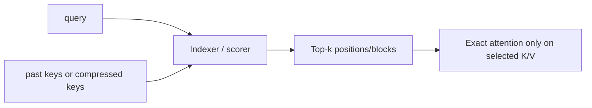
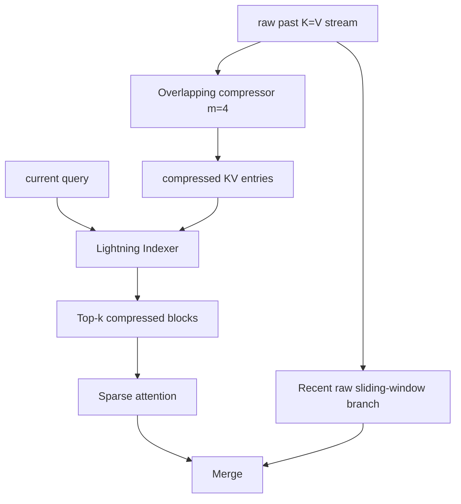
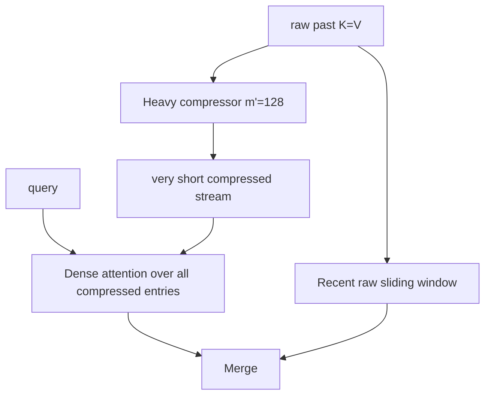

# 04. Local, Sparse, Compressed, Hybrid Attention

작성일: 2026-08-18  
상위 문서: [Attention Architecture Study Guide](README.md)

## 1. 이 장의 목표

Full attention의 비용을 줄이는 방법은 recurrent linear attention만이 아니다. Softmax attention을 유지하면서 **어느 token을 볼지**, **과거 token을 어떤 단위로 압축할지**, **어떤 layer만 global하게 만들지**를 제한할 수도 있다.

이 장에서는 다음을 구분한다.

- Local/Sliding Window Attention
- Static Sparse Attention
- Dynamic Sparse Attention / Learned Indexer
- Sequence Compression
- DeepSeek Sparse Attention(DSA)
- Compressed Sparse Attention(CSA)
- Heavily Compressed Attention(HCA)
- Hybrid Attention

핵심은 `sparse`, `compressed`, `linear`이라는 단어를 같은 의미로 사용하지 않는 것이다.

---

## 2. Full Attention의 비용을 줄이는 세 방향

Global softmax attention의 score matrix는:

```math
A=QK^\top\in\mathbb{R}^{T\times T}
```

이다.

이를 줄이는 방법을 크게 세 축으로 나눌 수 있다.

### 2.1 Query가 보는 key 수를 줄인다

```math
T\rightarrow K,\qquad K\ll T
```

- Sliding Window
- Sparse block/token selection
- learned top-k indexer

### 2.2 Key/value sequence 자체를 압축한다

```math
T\rightarrow T/m
```

여러 token을 한 compressed entry로 pooling한다.

### 2.3 일부 layer만 global하게 한다

예:

```text
Local → Local → Local → Global
```

또는:

```text
Linear → Linear → Linear → Full
```

이것이 hybrid layer architecture다.

---

## 3. Sliding Window Attention

**Sliding Window Attention(슬라이딩 윈도우 어텐션, 최근 고정 구간만 조회하는 local softmax attention; SWA)**은 query $t$가 최근 $W$개 key만 본다.

```math
\mathcal{N}(t)=\{i\mid t-W+1\le i\le t\}
```

attention은:

```math
o_t=
\sum_{i\in\mathcal{N}(t)}
\mathrm{softmax}_i(q_t^\top k_i)v_i
```

이다.

Global $T$ 대신 window $W$만 보므로 전체 sequence 비용은 대략:

```math
O(TW)
```

이다.

$W$를 고정하면 sequence length에 대해 선형이다.

### 3.1 Cache 관점

순수 SWA라면 오래된 KV를 계속 보관할 필요가 없으므로 rotating/ring buffer 형태로:

```math
O(W)
```

cache만 유지할 수 있다.

Mistral 7B는 4096-token sliding window와 GQA를 함께 사용한 대표 사례다.

### 3.2 receptive field는 layer를 따라 넓어진다

한 layer가 최근 $W$개만 봐도 다음 layer의 최근 token들이 이미 이전 layer에서 과거 정보를 받아왔으므로 깊이가 증가할수록 간접 receptive field는 넓어질 수 있다.

하지만 이는 global attention처럼 특정 먼 token을 현재 layer에서 직접 조회하는 것과 동일하지 않다.

---

## 4. Static Sparse Attention

**Static Sparse Attention(스태틱 스파스 어텐션, 미리 정해진 규칙으로 attention edge를 제한하는 방식)**은 특정 pattern만 허용한다.

예:

- local block
- dilated pattern
- strided attention
- fixed global token
- block sparse

Score matrix에서 대부분의 위치를 계산하지 않는다.

```text
Full:
████████
████████
████████
████████

Sparse 예:
██      
███     
 ███    
  ███   
```

장점은 pattern이 고정되어 kernel 최적화가 쉽다는 점이다. 단점은 input content에 따라 `어느 먼 token이 중요한지` 동적으로 선택하기 어렵다는 점이다.

---

## 5. Dynamic / Learned Sparse Attention

**Dynamic Sparse Attention(다이내믹 스파스 어텐션, query 내용에 따라 조회할 과거 위치를 동적으로 고르는 sparse attention)**은 selector/indexer가 필요하다.

기본 구조:



이 구조의 중요한 비용은:

1. indexer가 모든 과거 후보를 score하는 비용
2. top-k selection 비용
3. selected KV를 gather하는 irregular memory access
4. sparse attention kernel

이다.

즉 `top-k만 attention하니 무조건 O(K)`라고 단순화하면 안 된다. indexer가 $T$ 후보를 어떤 비용으로 검색하는지 봐야 한다.

---

## 6. DeepSeek Sparse Attention

**DeepSeek Sparse Attention(딥시크 스파스 어텐션; DSA)**은 DeepSeek-V3.2-Exp에서 공개된 learned fine-grained sparse attention이다.

V3.2는 DeepSeek-V3.1/3 계열의 MLA backbone을 유지하면서 **Lightning Indexer(라이트닝 인덱서, query마다 중요한 과거 token을 빠르게 score/select하는 학습형 indexer)**를 추가한다.

큰 그림은:

```text
MLA-compressed KV history
        │
        ├─ Lightning Indexer → top-k important positions
        │
        └───────────────────→ sparse MLA attention
```

즉 DSA는 `MLA를 대체`한 것이 아니라 **MLA cache 위의 조회를 sparse하게 만드는 방향**이다.

### 6.1 왜 의미가 큰가

MLA는 token당 cache representation을 줄였지만 global attention이면 query는 여전히 과거 모든 token entry와 상호작용한다.

DSA는 다음 축을 추가로 줄인다.

```math
\text{token candidates } T
\rightarrow
\text{selected tokens } K
```

따라서:

- MLA: token당 bytes 감소
- DSA: query당 읽는 token 수 감소

라는 서로 다른 최적화가 결합된다.

---

## 7. Sparse Attention의 Indexer Problem

Sparse attention에서 indexer는 공짜가 아니다.

만약 query마다 모든 $T$ token에 대해 expensive score를 계산하면 core attention을 sparse하게 만든 효과를 잃을 수 있다.

그래서 indexer는 일반 attention보다 훨씬 작은 dimension/precision을 사용하거나 별도의 lightweight representation을 사용한다.

DeepSeek 계열의 Lightning Indexer도 이런 원칙을 따른다.

Serving 관점에서 확인할 항목:

- indexer head 수
- indexer dimension
- top-k
- score dtype
- paged indexer 지원 여부
- prefill/decode kernel이 다른지
- KV gather가 contiguous/blockwise인지

---

## 8. Sequence Compression

**Sequence Compression(시퀀스 컴프레션, 여러 인접 token의 memory를 더 적은 entry로 요약하는 방식)**은 sparse selection과 다른 축이다.

압축률을 $m$이라 하면:

```math
T\rightarrow T_c\approx\frac{T}{m}
```

이다.

예를 들어 1M token을 4:1로 압축하면 약 250K compressed entries가 된다.

중요한 trade-off는:

- 더 큰 $m$ → cache와 attention 후보 감소
- 더 큰 $m$ → token-level exact information 손실 증가

이다.

그래서 최근 구조는 compressed global path와 uncompressed local path를 함께 두기도 한다.

---

## 9. DeepSeek-V4 CSA

**Compressed Sparse Attention(컴프레스트 스파스 어텐션, 압축된 history 위에서 sparse retrieval을 수행하는 attention; CSA)**은 DeepSeek-V4의 핵심 long-range path 중 하나다.

Hugging Face Transformers의 DeepSeek-V4 구현 설명과 공개 config 기준 기본 compression rate는 4다.

구조:



CSA는 두 단계를 동시에 사용한다.

1. sequence를 먼저 약 4배 압축한다.
2. compressed history 중 query별 top-k만 골라 attention한다.

즉 DSA의 `sparse retrieval` 철학을 **이미 압축된 search space**에 적용한다.

### 9.1 왜 local branch가 필요한가

Compression은 여러 token을 하나로 합치므로 최근 세밀한 local dependency를 손실시킬 수 있다.

그래서 V4 CSA/HCA는 최근 raw token을 보는 sliding-window branch를 별도로 둔다.

> long range는 압축하고, short range는 raw resolution으로 본다.

---

## 10. DeepSeek-V4 HCA

**Heavily Compressed Attention(헤빌리 컴프레스트 어텐션, 매우 강하게 압축된 global history 전체를 dense하게 조회하는 attention; HCA)**은 CSA와 다르게 sparse indexer가 없다.

기본 compression rate는:

```math
m'=128
```

수준이다.

즉:

```math
T\rightarrow T/128
```

로 history가 충분히 짧아지므로 compressed entries 전체에 dense attention을 수행한다.



중요한 점:

> HCA는 `sparse attention`이 아니다. **sequence를 매우 강하게 압축했기 때문에 compressed space에서는 dense attention이 싸다.**

---

## 11. CSA와 HCA 비교

| 항목 | CSA | HCA |
|---|---|---|
| sequence compression | 낮음/중간, 기본 4x | 매우 높음, 기본 128x |
| global search | indexer로 top-k sparse | compressed entries 전체 dense |
| indexer | 있음 | 없음 |
| token detail | HCA보다 더 많이 보존 | 강한 compression으로 더 손실 가능 |
| local raw branch | 있음 | 있음 |
| 역할 | 중요한 long-range block을 선택 | 저해상도 global summary 전체 조회 |

DeepSeek-V4는 두 mechanism을 layer마다 interleave한다. V4-Pro 공개 61-layer layout에서 첫 2개는 HCA, 이후 CSA/HCA가 교대하며 마지막 MTP block은 sliding-window-only 경로를 사용한다.

### 온라인 원본 도식

아래 그림들은 Hugging Face의 DeepSeek-V4 설명 문서가 공식 기술보고서의 figure를 옮긴 것이다.


*DeepSeek-V4 Figure 3 — CSA. Source: DeepSeek-V4 technical report / Hugging Face article.*


*DeepSeek-V4 Figure 4 — HCA. Source: DeepSeek-V4 technical report / Hugging Face article.*

---

## 12. Shared K=V MQA in DeepSeek-V4

DeepSeek-V4 attention에는 또 하나의 중요한 축이 있다. Transformers 구현 설명 기준 `num_key_value_heads=1`이고 같은 tensor를 K와 V로 읽는 **Shared K=V Multi-Query Attention** 구조를 사용한다.

즉 V4는 한 종류의 최적화만 쓰지 않는다.

- KV head sharing
- K=V sharing
- partial RoPE
- sequence compression
- sparse indexer(CSA)
- heavy compression(HCA)
- local sliding-window branch
- grouped low-rank output projection

이 모두가 조합된다.

이 때문에 단순히 `DeepSeek-V4는 CSA 모델`이라고 부르는 것보다 **여러 attention-axis optimization을 중첩한 hybrid attention system**으로 보는 편이 정확하다.

---

## 13. Hybrid Attention의 의미

**Hybrid Attention(하이브리드 어텐션, 서로 다른 sequence mixer/attention layer를 한 backbone에 섞는 설계)**은 최근 가장 중요한 흐름 중 하나다.

### 13.1 Local + Global

Gemma 3:

```text
Local ×5 → Global ×1 → repeat
```

### 13.2 Recurrent Linear + Global Full

Qwen3-Next/3.5/3.6:

```text
GDN ×3 → Gated Full Attention ×1 → repeat
```

### 13.3 Recurrent Linear + MLA

Kimi-K3:

```text
KDA ×3 → Gated MLA ×1 → repeat
...
Final MLA
```

### 13.4 Linear + Softmax

MiniMax-01:

```text
Lightning Attention ×7 → Softmax Attention ×1 → repeat
```

### 13.5 Compressed Sparse + Heavily Compressed

DeepSeek-V4:

```text
HCA, HCA, CSA, HCA, CSA, HCA, ...
```

---

## 14. 왜 Hybrid가 반복해서 등장하는가

Attention mechanism은 크게 두 종류의 능력을 동시에 요구한다.

### 14.1 효율적인 지속적 정보 전달

- 최근 상태
- 문맥의 누적
- topic/task state
- local dependency

이런 정보는 매 layer에서 1M token 전체를 exact lookup할 필요가 없을 수 있다.

### 14.2 정확한 주소 기반 retrieval

- 특정 숫자
- UUID
- 과거 코드 symbol
- 특정 문장
- 유사 entity 중 한 개

이런 정보는 token-addressable global memory가 유리하다.

Linear/local/compressed path만 쓰면 첫 번째는 싸게 처리하지만 두 번째에서 손실이 생길 수 있고, global full attention만 쓰면 정확하지만 비용이 너무 크다.

그래서 layer 역할을 나눈다.

> cheap path가 대부분의 정보 흐름을 담당하고, expensive path가 일정 간격마다 global/exact correction을 수행한다.

---

## 15. Hybrid ratio는 마법의 숫자가 아니다

Qwen과 Kimi에서 3:1이 등장하고 Gemma 3에서 5:1, MiniMax에서 7:1이 등장한다고 해서 universal optimal ratio가 있는 것은 아니다.

Ratio는 다음에 따라 달라진다.

- cheap layer의 expressivity
- global layer의 cache/compute cost
- target context length
- training recipe
- model scale
- retrieval benchmark
- hardware/kernel efficiency

따라서 `3:1이 최신 표준`이라고 외우는 대신 **각 cheap path가 global attention을 얼마나 대체할 수 있었는가**를 보는 것이 중요하다.

---

## 16. Sparse와 Linear의 근본 차이

### Sparse Attention

과거 token memory 자체는 유지하되 일부만 고른다.

```text
K1,V1 K2,V2 ... KT,VT
        ↓ index
     selected K/V
```

### Linear/Recurrent Attention

과거 token memory 자체를 fixed state에 합친다.

```text
K1,V1 K2,V2 ... KT,VT
        ↓ recurrent compression
             S_t
```

따라서 cache semantics, prefix caching, request preemption 방식도 완전히 다르다.

---

## 17. Compressed Attention과 MLA의 차이

둘 다 `compression`이라는 단어가 들어가지만 축이 다르다.

### MLA

각 token의 feature representation을 압축한다.

```math
\text{token }i:\quad d_{KV}\rightarrow r_{KV}
```

Token count는 $T$ 그대로다.

### CSA/HCA

sequence axis에서 여러 token을 더 적은 memory entry로 압축한다.

```math
T\rightarrow T/m
```

DeepSeek-V4는 여기에 MQA/K=V sharing까지 결합한다.

---

## 18. 모델을 볼 때의 분해 체크리스트

새 model config나 paper를 보면 다음 순서로 읽는다.

1. Query head는 몇 개인가?
2. KV head는 몇 개인가?
3. K와 V는 별도인가 공유인가?
4. token당 KV representation은 full인가 latent인가?
5. query가 모든 token을 보는가 window만 보는가 top-k만 보는가?
6. sequence compression이 있는가?
7. recurrent fixed state가 있는가?
8. positional encoding은 full/partial/none 중 무엇인가?
9. local/global/linear layer가 어떤 비율로 섞이는가?
10. 실제 serving kernel이 어떤 representation을 cache하는가?

이렇게 분해하면 새로운 attention 이름이 나와도 본질을 파악하기 쉽다.

---

## 19. 이 장의 핵심 정리

1. Sliding Window는 최근 token별 KV를 exact softmax로 본다.
2. Sparse Attention은 과거 memory는 유지하되 일부 token/block만 선택한다.
3. DSA는 MLA backbone에 learned sparse selection을 결합한 계열이다.
4. Sequence Compression은 token 축 자체를 더 적은 memory entry로 줄인다.
5. DeepSeek-V4 CSA는 4x 계열 compression 뒤 top-k sparse lookup을 한다.
6. HCA는 128x 계열 heavy compression 뒤 compressed history 전체를 dense하게 본다.
7. DeepSeek-V4는 local raw branch를 병렬로 유지해 최근 token detail을 보완한다.
8. Hybrid Attention은 cheap/approximate path와 expensive/exact path의 역할을 layer 단위로 나눈다.
9. 최근 공개 frontier 모델의 attention은 한 메커니즘보다 여러 압축 축을 조합하는 방향으로 발전하고 있다.

---

## 20. 주요 자료

- DeepSeek-V3.2-Exp official repository  
  https://github.com/deepseek-ai/DeepSeek-V3.2-Exp
- DeepSeek FlashMLA  
  https://github.com/deepseek-ai/FlashMLA
- Hugging Face Transformers — DeepSeek-V4 architecture documentation  
  https://huggingface.co/docs/transformers/model_doc/deepseek_v4
- Hugging Face — DeepSeek-V4 architecture article and report figures  
  https://huggingface.co/blog/deepseekv4
- Mistral 7B  
  https://arxiv.org/abs/2310.06825
- Gemma 3 Technical Report  
  https://arxiv.org/abs/2503.19786
