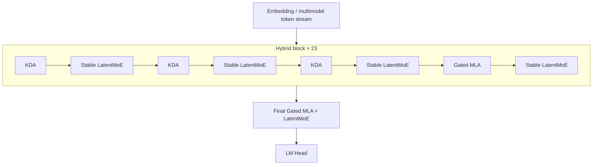
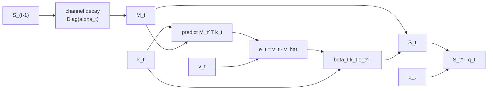
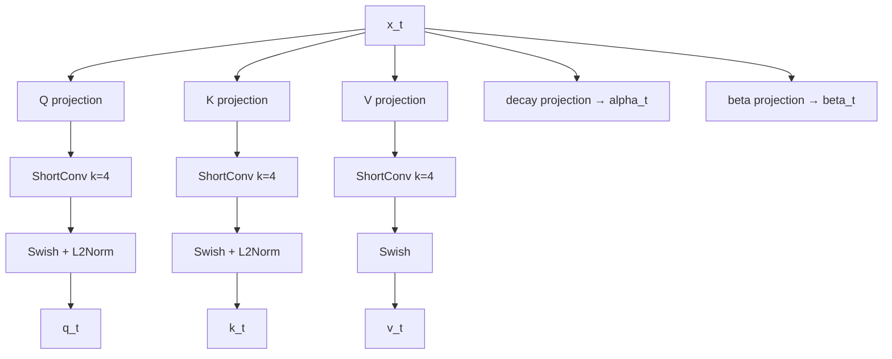
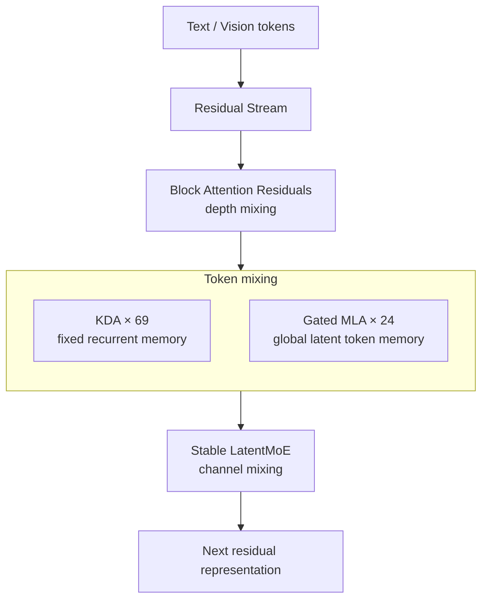

# 10. Kimi-K3 Attention Architecture: KDA, Gated MLA, Attention Residuals

작성일: 2026-08-18  
상위 문서: [Attention Architecture Study Guide](README.md)

## 1. 이 장의 목표

이 문서는 Kimi-K3를 `KDA를 쓴 2.8T MoE`라는 문장 수준이 아니라 다음 층위까지 연결해서 이해하는 것을 목표로 한다.

1. KDA가 어떤 수학적 계보에서 나왔는가?
2. KDA state는 실제로 무엇을 기억하는가?
3. 왜 Kimi-K3는 KDA만 쓰지 않고 Gated MLA를 섞는가?
4. NoPE MLA와 recurrent position-sensitive KDA는 어떻게 역할을 나누는가?
5. FlashKDA의 chunkwise algorithm과 lower-bounded decay는 왜 모델 구조 자체에 영향을 줬는가?
6. KDA/MLA hybrid cache는 serving engine에서 무엇을 요구하는가?
7. Attention Residuals와 Stable LatentMoE는 attention과 다른 어떤 축을 담당하는가?

---

## 2. 공개된 Kimi-K3 핵심 구성

MoonshotAI의 공식 model card와 `config.json` 기준:

| 항목 | Kimi-K3 |
|---|---:|
| Total parameters | 2.8T |
| Activated parameters | 104B |
| Language layers | 93 |
| Hidden size | 7,168 |
| Attention heads | 96 |
| KDA layers | 69 |
| Gated MLA layers | 24 |
| Context | 1,048,576 tokens |
| KV latent rank | 512 |
| Q latent rank | 1,536 |
| KDA head dim | 128 |
| KDA ShortConv kernel | 4 |
| Routed experts | 896 |
| Selected routed experts/token | 16 |
| Shared experts | 2 |
| LatentMoE width | 3,584 |
| Expert hidden width | 3,072 |

공식 config의 `full_attn_layers`는:

```text
4, 8, 12, ..., 88, 92, 93
```

이고 나머지 69개가 KDA다.

따라서 정확한 layer pattern은:

$$
23\times(3\text{ KDA}+1\text{ MLA})+1\text{ final MLA}
$$

이다.



---

## 3. Kimi-K3의 정보 혼합을 세 축으로 나누기

K3는 다음 세 방향을 별도 mechanism으로 설계했다.

### 3.1 Sequence/Token Mixing

- KDA
- Gated MLA

과거/현재 token 사이의 정보 흐름을 담당한다.

### 3.2 Channel Mixing

- Stable LatentMoE

한 token representation 내부의 feature channel을 비선형적으로 변환하고 expert knowledge를 사용한다.

### 3.3 Depth Mixing

- Attention Residuals(AttnRes)

현재 layer가 과거 depth의 representation을 어떤 비율로 다시 사용할지 결정한다.

KDA, MoE, AttnRes를 모두 `attention 비슷한 것`으로 묶으면 K3의 설계 의도를 놓치게 된다.

---

## 4. KDA의 뿌리

KDA의 계보는:

```text
Linear Attention
   ↓
Fast-Weight Associative Memory
   ↓
Delta Rule
   ↓
DeltaNet
   ↓
Gated DeltaNet
   ↓
Kimi Delta Attention
```

이다.

핵심은 full softmax attention처럼 과거 token별 K/V를 직접 다시 조회하지 않고 fixed-size matrix state를 유지한다는 점이다.

---

## 5. KDA 공식 state update

KDA의 핵심 recurrence는:

$$
S_t
=
(I-\beta_tk_tk_t^\top)
\operatorname{Diag}(\alpha_t)S_{t-1}
+
\beta_tk_tv_t^\top
$$

이다.

### 기호 읽기

- $S_t$: **에스 서브 티**, 현재 recurrent memory state
- $I$: **아이덴티티 매트릭스**, 단위행렬
- $k_t$: **케이 서브 티**, current key
- $v_t$: **브이 서브 티**, current value
- $\beta_t$: **베타 서브 티**, delta update strength
- $\alpha_t$: **알파 서브 티**, channel-wise retention vector
- $\operatorname{Diag}(\alpha_t)$: **다이애그 오브 알파 티**, alpha를 diagonal에 둔 matrix
- $k_tk_t^\top$: key 방향 rank-1 projector
- $k_tv_t^\top$: key-value outer product

출력은:

$$
\tilde o_t=S_t^\top q_t
$$

이다.

---

## 6. 식을 실제 memory operation으로 바꾸기

공식 수식을 다음 순서로 다시 쓰면 가장 이해하기 쉽다.

### 6.1 Forget

$$
M_t=\operatorname{Diag}(\alpha_t)S_{t-1}
$$

과거 state의 각 key/channel direction을 서로 다른 비율로 감쇠한다.

### 6.2 Predict

$$
\hat v_t=M_t^\top k_t
$$

현재 key에 대해 기존 memory가 어떤 value를 예측하는지 읽는다.

### 6.3 Error

$$
e_t=v_t-\hat v_t
$$

새 value와 기존 prediction의 차이만 계산한다.

### 6.4 Correct

$$
S_t=M_t+\beta_tk_te_t^\top
$$

현재 key 방향에 correction을 rank-1 write한다.

### 6.5 Read

$$
\tilde o_t=S_t^\top q_t
$$

현재 query가 갱신된 memory를 읽는다.



KDA를 한 문장으로 요약하면:

> **각 token이 과거 memory를 채널별로 잊고, 현재 key로 기존 association을 예측한 뒤, 틀린 부분만 delta correction하고, query로 그 memory를 읽는 구조다.**

---

## 7. Gated DeltaNet에서 KDA로

Gated DeltaNet의 retention gate를 한 head당 scalar라고 단순화하면:

$$
S_t=\alpha_t\cdot \text{DeltaUpdate}(S_{t-1},k_t,v_t)
$$

이다.

KDA에서는:

$$
\alpha_t\in\mathbb{R}^{d_k}
$$

가 되어 state row/channel마다 서로 다른 retention을 가진다.

예:

```text
channel 0: alpha ≈ 0.999  → long-lived
channel 1: alpha ≈ 0.95   → medium-term
channel 2: alpha ≈ 0.40   → local context
channel 3: alpha ≈ 0.05   → almost replace immediately
```

KDA 논문이 `finer-grained gating`이라고 부르는 핵심이다.

---

## 8. Beta는 단순 write gate가 아니다

식:

$$
S_t=M_t+\beta_tk_t(v_t-M_t^\top k_t)^\top
$$

을 전개하면:

$$
S_t
=M_t
-\beta_tk_tk_t^\top M_t
+\beta_tk_tv_t^\top
$$

이다.

즉 $\beta_t$는 동시에:

- 기존 key association을 얼마나 erase할지
- 새 value를 얼마나 write할지

를 결정한다.

따라서 `beta = current token 중요도` 정도로만 이해하면 부족하다.

---

## 9. KDA Q/K/V path

Kimi-K3의 KDA는 단순 projection 결과를 recurrence에 바로 넣지 않는다.

개념 구조:



### 9.1 ShortConv

`short_conv_kernel_size=4`다.

Recent 4-token neighbourhood의 local interaction을 recurrence 전에 처리한다. 이 때문에 serving state에는 recurrent matrix뿐 아니라 convolution state도 필요하다.

### 9.2 Q/K normalization

Q/K를 L2-normalize하여 delta transition에서 key norm이 update strength를 불안정하게 만들지 않도록 한다.

---

## 10. Lower-Bounded Decay

Kimi-K3 config:

```text
gate_lower_bound = -5.0
```

K3의 log-decay는 범위를 제한한다.

$$
g_t=g_{min}\sigma(z_t),\qquad g_{min}=-5
$$

$$
\alpha_t=e^{g_t}
$$

따라서:

$$
g_t\in(-5,0),\qquad
\alpha_t\in(e^{-5},1)
$$

이다.

이 변화는 Kimi Linear 초기 KDA 대비 K3의 중요한 system-aware 수정이다.

---

## 11. 왜 -5가 GPU kernel과 연결되는가

FlashKDA는 chunk size 16을 사용한다.

16개 token에서 log-decay 누적 최솟값은:

$$
16\times(-5)=-80
$$

이다.

따라서 cumulative decay inverse가 대략 $e^{80}$ 범위 안에 제한된다.

MoonshotAI FlashKDA 문서는 이 선택이:

- BF16 numerical range
- 16×16 inverse cost
- MMA tile

를 동시에 고려한다고 설명한다.

즉 K3의 decay parameterization은 pure model theory가 아니라 **GPU 실행 가능성과 직접 연결된 architectural choice**다.

---

## 12. KDA Prefill: recurrent인데 왜 병렬 가능한가

수식만 보면:

$$
S_0\rightarrow S_1\rightarrow\cdots\rightarrow S_T
$$

이므로 완전 순차적이다.

하지만 training/prefill에서는 sequence를 chunk로 나눈다.

```text
[0..15] → state → [16..31] → state → [32..47] → ...
```

각 chunk 내부에서는 recurrence를 matrix form으로 변환해 parallel GEMM을 수행한다.

출력을 개념적으로:

$$
O_{chunk}=O_{inter}+O_{intra}
$$

로 나눌 수 있다.

- $O_{inter}$: 이전 chunk final state가 현재 queries에 미치는 영향
- $O_{intra}$: 현재 chunk 내부 token interaction

따라서:

> decode는 fused recurrent step, prefill/training은 chunkwise matrix algorithm

이라는 서로 다른 execution path를 갖는다.

---

## 13. KDA Output Gate

KDA raw readout:

$$
\tilde o_t=S_t^\top q_t
$$

에 RMSNorm과 input-dependent full-rank gate를 적용한다.

개념식:

$$
y_t=W_O[
\sigma(W_gx_t)\odot\operatorname{RMSNorm}(\tilde o_t)
]
$$

이 gate는 memory write/forget과 별개다.

- alpha: memory retention
- beta: memory correction
- output gate: read 결과를 residual stream에 노출하는 양

---

## 14. KDA의 위치 정보

KDA는 recurrence의 순서 자체가 position-sensitive하다.

Transition을:

$$
A_j=(I-\beta_jk_jk_j^\top)\operatorname{Diag}(\alpha_j)
$$

라 하면 token $i$의 contribution은 token $t$까지:

$$
A_tA_{t-1}\cdots A_{i+1}B_i
$$

를 통과한다.

거리뿐 아니라 중간 token의 content-dependent gate/key에 따라 contribution이 달라진다.

따라서 KDA는 RoPE 없이도 order/recency-sensitive state를 형성할 수 있다.

---

## 15. 그런데 왜 KDA만 쓰지 않는가

KDA의 state는 context length에 무관한 fixed size다.

$$
S_t\in\mathbb{R}^{d_k\times d_v}
$$

이는 1M token을 처리해도 state가 커지지 않는다는 강점이지만 동시에 **1M개의 token-level memory를 개별적으로 보존하지 않는다**는 뜻이다.

유한 state에 많은 association이 겹쳐 들어가므로 exact retrieval/copy에서 손실이 생길 수 있다.

특히:

- long numeric string
- UUID
- 특정 원문 span
- 유사한 entity 다수
- repository의 exact symbol

같은 task는 global token-addressable attention이 유리하다.

---

## 16. Gated MLA가 보완하는 것

Kimi-K3는 24개 Gated MLA layer를 사용한다.

K3 config:

```text
kv_lora_rank = 512
q_lora_rank = 1536
mla_use_nope = true
mla_use_output_gate = true
```

즉 MLA path는 token별 compressed latent memory를 유지하면서 global softmax lookup을 제공한다.

### 역할 분담

| KDA | Gated MLA |
|---|---|
| fixed recurrent state | token별 latent cache |
| history-length-independent decode state | context-length-dependent global lookup |
| order/recency-sensitive recurrence | NoPE global content lookup |
| lossy associative memory | token-addressable memory |
| 대부분의 layer | 주기적인 correction layer |

이 구조를 단순하게 표현하면:

> KDA는 `현재까지 무엇이 중요했는가`를 압축해서 들고 가고, MLA는 `원래 과거 token 중 정확히 무엇을 다시 봐야 하는가`를 주기적으로 확인한다.

---

## 17. 왜 MLA에 NoPE를 쓰는가

K3의 MLA는 `mla_use_nope=true`다.

이는 MLA가 순서를 전혀 모른다는 의미가 아니다. MLA 입력 residual stream 자체가 이미 여러 KDA recurrence를 거쳐 position/recency-sensitive representation이 됐다.

따라서 layer 역할을 다음처럼 나눌 수 있다.

```text
KDA: order / recency / compressed sequential state
MLA: global content-addressable lookup
```

NoPE MLA는 global content similarity에 집중하고 position modeling 부담은 recurrent KDA path와 residual representation에 더 많이 맡긴다.

---

## 18. 왜 마지막 layer가 MLA인가

K3의 full-attention/MLA layer list는 4,8,...,92에 더해 93이 포함된다.

즉 23개의 3:1 block 뒤에 final MLA가 한 번 더 있다.

Architecture-level inference로 보면 output head 직전에 global token memory를 다시 조회할 기회를 주는 구조다. 다만 `마지막 MLA의 유일한 목적이 final global refresh다`라는 강한 인과 주장은 공식 ablation 없이 단정하지 않는다.

---

## 19. KDA Cache

한 sequence의 KDA layer에는 대략 다음 state가 필요하다.

1. recurrent matrix state
2. ShortConv state

개념 shape:

$$
S\in\mathbb{R}^{H\times d_k\times d_v}
$$

K3 공개 KDA shape를 전체 logical head 기준으로 단순 계산하면:

$$
96\times128\times128
=1,572,864\text{ elements}
$$

이다.

BF16이면 단순 raw element만 약 3 MiB, FP32면 약 6 MiB다. 실제 serving에서는 TP sharding, state dtype, padding, layout, graph buffer 등에 따라 달라진다.

중요한 것은:

$$
\text{KDA state size}\not\propto T
$$

라는 점이다.

---

## 20. Kimi-K3 전체 cache는 constant가 아니다

K3 전체 cache는 개념적으로:

$$
69\times\text{fixed KDA state}
+
24\times\text{MLA token cache}(T)
$$

이다.

따라서:

> `Kimi-K3는 KV cache가 없다`는 표현은 틀리다.

정확하게는:

> `69개 layer가 token-wise KV 대신 fixed recurrent/conv state를 사용하고, 24개 MLA layer에는 context-length-dependent global cache가 남아 있다.`

---

## 21. Prefix Caching의 난점

일반 full attention prefix caching에서는 prefix KV blocks를 공유한다.

KDA에서 prefix $0..N$을 재사용하려면 최소한:

$$
S_N+\text{ConvState}_N
$$

가 필요하다.

매 token마다 큰 KDA state snapshot을 저장하면 linear attention의 memory 이점이 사라진다.

따라서 serving engine은:

- 어떤 block boundary에서 state snapshot을 materialize할지
- prefix hit가 block 중간이면 어디부터 recompute할지
- shared prefix state를 copy-on-write할지
- state block allocator를 KV block allocator와 어떻게 연결할지

를 설계해야 한다.

K3 기술보고서는 system co-design 영역에서 state-aware prefix caching을 다룬다.

---

## 22. Preemption과 Continuous Batching

vLLM식 continuous batching에서는 request가 batch slot에 들어오고 나간다.

KDA request에는:

```text
Request
 ├─ KDA recurrent state × KDA layers
 ├─ ShortConv state × KDA layers
 └─ MLA block table × MLA layers
```

가 연결된다.

Preemption/resume 시 일반 KV block table만 복구하면 끝나지 않는다. recurrent/conv state의 ownership과 storage도 보존해야 한다.

---

## 23. Speculative Decoding Rollback

Speculative decoding은 여러 candidate token을 임시로 advance한 뒤 일부가 reject되면 state를 rollback해야 한다.

Full KV cache는 rejected token block을 버리면 되지만 recurrent KDA는 accepted prefix 이후 state로 되돌아가야 한다.

선택지는:

- candidate step별 state snapshot
- checkpoint + recompute
- state copy buffer
- specialized multi-token recurrent kernel

등이 있다.

따라서 recurrent attention 모델은 SD의 state management가 model-specific하게 복잡해질 수 있다.

---

## 24. Attention Residuals

**Attention Residuals(어텐션 레지듀얼즈, attention으로 과거 layer representation을 고르는 residual mechanism; AttnRes)**는 sequence attention과 다른 **depth axis**의 mechanism이다.

일반 residual:

$$
x_l=x_{l-1}+F_l(x_{l-1})
$$

에서는 과거 정보가 하나의 stream에 계속 누적된다.

AttnRes는 layer/block별 representation을 source로 두고 현재 layer가 학습 가능한 pseudo-query로 어떤 depth representation을 사용할지 weight한다.

개념적으로:

$$
h_l=\sum_{i<l}a_{l,i}v_i
$$

$$
a_{l,i}=\operatorname{softmax}_i(q_l^\top k_i)
$$

이다.

- token position attention이 `어느 token을 볼까`라면
- AttnRes는 `어느 depth의 representation을 사용할까`다.

K3는 memory/communication cost를 줄이기 위해 block-level AttnRes를 사용한다.

---

## 25. Stable LatentMoE

**Stable LatentMoE(스테이블 레이턴트 엠오이, routed expert computation을 압축 latent channel 공간에서 수행하는 MoE)**는 channel mixer다.

K3:

- 896 routed experts
- top-16 routed experts/token
- 2 shared experts
- model width 7168
- latent MoE width 3584

개념적으로:

```text
full residual x (7168)
  ├─ shared expert path
  └─ down projection → latent (3584)
                    → routed experts
                    → up projection
```

Attention과 관계를 구분하면:

- KDA/MLA: 어떤 context information을 가져올까?
- LatentMoE: 현재 token representation을 어떤 expert function으로 변환할까?
- AttnRes: 어떤 depth의 representation을 현재 layer input으로 사용할까?

---

## 26. Kimi-K3를 한 장으로 보기



K3의 핵심은 `linear attention을 써서 빠르다`가 아니다.

> **finite recurrent memory, token-addressable latent memory, depth-addressable residual memory, sparse expert memory를 서로 다른 축으로 분리해 결합한 모델**이다.

---

## 27. 배포 관점에서 확인해야 할 항목

Kimi-K3를 vLLM/SGLang에 올릴 때 attention만 놓고 보면 다음을 확인한다.

1. KDA kernel이 FlashKDA인지 FLA/Triton fallback인지
2. Hopper/H200 target에서 실제 fused path가 hit하는지
3. prefill chunkwise path와 decode recurrent path가 각각 정상인지
4. recurrent state dtype/layout
5. MLA cache가 latent representation으로 실제 저장되는지
6. TP/CP에서 KDA state가 어떻게 shard되는지
7. hybrid KV cache manager가 KDA/MLA block을 어떻게 관리하는지
8. prefix caching이 KDA state-aware path를 타는지
9. CUDA Graph capture가 hybrid state mutation과 호환되는지
10. speculative decoding 사용 시 recurrent rollback path가 있는지

이 목록은 단순 모델 load 성공보다 실제 장기 context throughput과 correctness를 검증하기 위한 항목이다.

---

## 28. 자주 생기는 오해

### `KDA는 softmax attention을 근사한다`

정확하지 않다. KDA는 finite recurrent associative memory로 과거 key-value relation을 학습적으로 update/read한다.

### `KDA에는 KV cache가 없다`

KDA layer에 token-wise KV는 없지만 recurrent state와 conv state가 있다. K3 전체에는 MLA cache도 존재한다.

### `KDA가 있으면 position encoding이 필요 없다`

KDA recurrence 자체는 order-sensitive지만 모델 전체의 position design은 layer별로 봐야 한다. K3 MLA는 NoPE로 명시돼 있다.

### `MLA는 KDA보다 구형이라 보조로만 쓰인다`

K3에서 두 path의 역할이 다르다. MLA는 global token-addressable retrieval이라는 KDA가 fixed-state compression 때문에 잃을 수 있는 기능을 보완한다.

### `3:1이면 항상 최적이다`

Kimi Linear/K3의 training/design 결과다. 다른 model family의 universal constant가 아니다.

---

## 29. 이 장에서 반드시 기억할 문장

1. KDA는 Delta Rule memory에 channel-wise retention을 결합한 recurrent linear attention이다.
2. KDA는 과거 token별 KV를 보관하는 대신 fixed-size matrix state에 association을 압축한다.
3. Delta Rule은 새 value를 무작정 더하지 않고 기존 prediction과의 차이만 기록한다.
4. alpha는 `무엇을 얼마나 오래 기억할지`, beta는 `현재 association을 얼마나 교정할지` 제어한다.
5. K3의 lower-bounded decay는 FlashKDA BF16 chunk kernel과 공동 설계됐다.
6. 69개 KDA는 long-context memory/compute를 줄이고 24개 Gated MLA는 global exact retrieval을 보완한다.
7. K3의 MLA는 NoPE이며 KDA가 order/recency-sensitive sequence mixing을 담당하는 구조적 분업을 이룬다.
8. KDA 때문에 prefix caching, preemption, speculative rollback은 conventional KV-only model보다 복잡해진다.
9. AttnRes는 token attention이 아니라 depth mixing이고 Stable LatentMoE는 channel mixing이다.
10. Kimi-K3는 하나의 attention trick이 아니라 sequence/depth/channel/system을 함께 설계한 architecture다.

---

## 30. 공식 자료

- Kimi Team, **Kimi K3: Open Frontier Intelligence**  
  https://arxiv.org/abs/2607.24653
- MoonshotAI Kimi-K3 official repository/model card  
  https://github.com/MoonshotAI/Kimi-K3
- Kimi-K3 official config  
  https://huggingface.co/moonshotai/Kimi-K3/blob/main/config.json
- Kimi Team, **Kimi Linear: An Expressive, Efficient Attention Architecture**  
  https://arxiv.org/abs/2510.26692
- MoonshotAI, **FlashKDA**  
  https://github.com/MoonshotAI/FlashKDA
- FlashKDA v1 deep dive  
  https://github.com/MoonshotAI/FlashKDA/blob/master/docs/20260420-flashkda-v1-deep-dive.md
