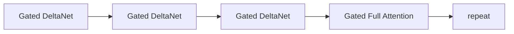
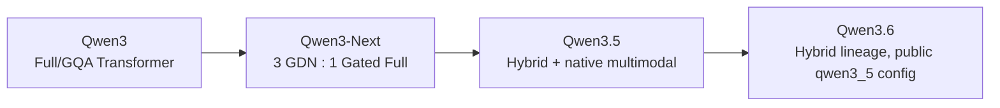

# 11. Qwen Attention Architecture: GQA에서 Gated DeltaNet Hybrid까지

작성일: 2026-08-18  
상위 문서: [Attention Architecture Study Guide](README.md)

## 1. 이 장의 목표

Qwen 계열은 최근 몇 세대 사이에 attention 설계가 크게 바뀌었다. 이를 단순히 `Qwen은 GQA를 쓴다` 또는 `Qwen은 linear attention을 쓴다`로 기억하면 현재 공개 모델을 잘못 이해하게 된다.

이 장은 다음 흐름을 추적한다.

```text
Qwen2/2.5/초기 Qwen3 계열
  └─ conventional Full Softmax Attention + GQA

Qwen3-Next
  └─ 3 × Gated DeltaNet + 1 × Gated Full Attention
       + partial RoPE
       + attention output gate
       + larger full-attention head dimension

Qwen3.5 / Qwen3.6
  └─ Qwen3-Next 계열 hybrid를 계승
       + native multimodal/MRoPE 계열 통합
       + optimized linear-attention kernels
```

핵심은 Qwen이 `softmax attention을 버렸다`가 아니라 **대부분의 layer를 recurrent linear attention으로 바꾸고, 일정 간격의 full attention을 정확한 global retrieval 경로로 남긴 것**이다.

> 이 문서는 2026-08-18 현재 공개된 공식 Qwen 자료와 Qwen3.6 공개 config를 기준으로 한다. 이후 Qwen release는 같은 이름 계열이라도 반드시 공식 `config.json`을 다시 확인해야 한다.

---

## 2. 기준점: Qwen3의 Conventional Attention

Qwen3의 전통적인 dense decoder 계열은 **Grouped-Query Attention(그룹드 쿼리 어텐션, 그룹화 질의 attention; GQA)**를 사용하는 conventional Transformer였다.

대표적인 공개 Qwen3 config에서는:

- query heads가 KV heads보다 많고
- RoPE를 사용하며
- token별 KV cache를 유지하고
- 모든 허용된 과거 token에 softmax attention을 수행한다.

즉 기본 특성은:

$$
\text{cache}\propto T
$$

$$
\text{global prefill attention}\propto T^2
$$

이다.

GQA는 KV cache의 head-axis 상수항을 줄이지만 global token interaction 자체를 제거하지 않는다.

---

## 3. 왜 Qwen3-Next는 구조를 바꿨는가

Qwen3-Next 공식 발표는 long-context efficiency를 핵심 목표 중 하나로 두었다. 공개 설명에서 연구팀은 pure linear attention만으로는 **in-context learning과 recall**에서 full attention 대비 손실이 있을 수 있고, 반대로 every-layer full attention은 긴 context에서 비싸다는 문제를 명시한다.

따라서 hybrid를 선택했다.

> **3개의 Gated DeltaNet layer마다 1개의 Gated Full Attention layer를 배치한다.**



이 구조는 Kimi의 3:1 hybrid와 표면적으로 닮았지만 cheap path와 global path의 세부 메커니즘은 다르다.

- Qwen cheap path: Gated DeltaNet
- Qwen global path: Gated Full Attention
- Kimi cheap path: KDA
- Kimi global path: Gated MLA

---

## 4. Qwen Gated DeltaNet의 뿌리

**Gated DeltaNet(게이티드 델타넷, forgetting gate와 Delta Rule을 결합한 recurrent linear attention; GDN)**은 fixed-size recurrent state를 사용한다.

단순화한 state update는:

$$
S_t
=
\alpha_t
(I-\beta_tk_tk_t^\top)S_{t-1}
+
\beta_tk_tv_t^\top
$$

로 볼 수 있다.

- $S_t$: **에스 서브 티**, recurrent associative memory state
- $\alpha_t$: **알파 서브 티**, retention/forget gate
- $\beta_t$: **베타 서브 티**, delta update strength
- $k_t$: current key
- $v_t$: current value

다르게 쓰면:

$$
M_t=\alpha_tS_{t-1}
$$

$$
\hat v_t=M_t^\top k_t
$$

$$
e_t=v_t-\hat v_t
$$

$$
S_t=M_t+\beta_tk_te_t^\top
$$

이다.

즉 GDN의 mental model은:

```text
Forget → Predict → Correct → Read
```

이다.

---

## 5. KDA와 GDN은 무엇이 다른가

둘 다 Delta Rule 기반이고 fixed recurrent state를 사용하지만 forgetting granularity가 다르다.

Kimi KDA:

$$
S_t=(I-\beta_tk_tk_t^\top)
\operatorname{Diag}(\alpha_t)S_{t-1}
+\beta_tk_tv_t^\top
$$

Qwen GDN 계열의 핵심 아이디어는 gated delta recurrence이고, KDA는 이를 더 세밀한 channel-wise diagonal retention으로 확장한다.

| 항목 | Qwen GDN | Kimi KDA |
|---|---|---|
| family | Gated DeltaNet | KDA, GDN 확장 |
| memory | fixed recurrent state | fixed recurrent state |
| overwrite | Delta Rule | Delta Rule |
| forgetting | gated retention | finer-grained channel-wise retention |
| local mixing | ShortConv | ShortConv |
| global correction | Full Attention | MLA |
| representative ratio | 3:1 | 약 3:1 |

`둘 다 linear attention이므로 구현이 같다`고 보면 안 된다. state tensor layout, gate parameterization, head shape, kernel도 서로 다르다.

---

## 6. Qwen3-Next Full Attention은 과거 Qwen의 Full Attention과도 다르다

Qwen3-Next 공식 설명은 global full-attention layer에도 몇 가지 변화를 넣었다.

### 6.1 Output Gating

**Attention Output Gate(어텐션 아웃풋 게이트, attention 결과를 residual stream에 보내기 전에 input-dependent하게 조절하는 gate)**를 사용한다.

개념적으로:

$$
y_t=W_O[g_t\odot o_t]
$$

$$
g_t=f(W_gx_t)
$$

이다.

Attention이 가져온 모든 channel을 무조건 residual에 더하지 않고 현재 input에 따라 선택적으로 통과시킨다.

### 6.2 Larger Head Dimension

Qwen3-Next 공개 설명에서는 full-attention head dimension을 기존 128 계열에서 256으로 키웠다.

이는 full attention layer 수를 줄이는 대신 각 global layer의 representation capacity를 강화하는 방향으로 볼 수 있다.

### 6.3 Partial RoPE

RoPE를 head dimension 전체가 아니라 일부에만 적용한다.

Qwen3.6 공개 config:

```text
head_dim = 256
partial_rotary_factor = 0.25
```

이므로 conceptual RoPE dimension은:

$$
256\times0.25=64
$$

이고 나머지 192 dimension은 content-only/no-RoPE component로 볼 수 있다.

이는 위치 정보와 content similarity가 같은 모든 dimension을 공유하지 않도록 하는 설계다.

---

## 7. Qwen3.6-27B 실제 config 해부

2026-08-18 현재 공개된 Qwen3.6-27B config는 `model_type=qwen3_5` 계열이며 64-layer hybrid backbone을 사용한다.

### 7.1 Backbone

| 항목 | 값 |
|---|---:|
| Hidden size | 5,120 |
| Hidden layers | 64 |
| Max position embeddings | 262,144 |
| Full attention interval | 4 |
| Full attention query heads | 24 |
| Full attention KV heads | 4 |
| Full attention head dim | 256 |
| Partial rotary factor | 0.25 |
| Linear key heads | 16 |
| Linear value heads | 48 |
| Linear key head dim | 128 |
| Linear value head dim | 128 |
| Linear ShortConv kernel | 4 |
| MTP layers | 1 |

`layer_types`는 실제로:

```text
linear, linear, linear, full,
linear, linear, linear, full,
...
```

패턴을 64 layer에 반복한다.

따라서:

$$
48\text{ GDN-like linear layers}
+
16\text{ full-attention layers}
$$

이다.

---

## 8. Full-Attention GQA Shape

Qwen3.6 full attention:

$$
H_q=24
$$

$$
H_{kv}=4
$$

$$
d_h=256
$$

따라서 query group size는:

$$
g=\frac{24}{4}=6
$$

이다.

즉 KV head 하나를 6개의 query head가 공유한다.

BF16 K/V라고 단순 가정하면 full-attention layer의 token당 logical KV bytes는:

$$
2\times4\times256\times2
=4096\text{ bytes}
$$

즉 약 4 KiB/token/layer다.

16개 full attention layer 전체면:

$$
4096\times16
=65536\text{ bytes/token}
$$

즉 약 64 KiB/token/sequence의 logical full-attention KV가 된다.

실제 vLLM cache dtype이 FP8이면 element byte가 달라지고 block metadata/alignment가 추가된다.

---

## 9. Linear Attention Head Shape가 Full Attention과 다른 이유

Qwen3.6 config:

```text
linear_num_key_heads   = 16
linear_num_value_heads = 48
linear_key_head_dim    = 128
linear_value_head_dim  = 128
```

Full attention처럼 `Q head 하나 ↔ K/V head 하나`의 대칭 구조로 읽으면 안 된다.

GDN recurrence에서는 state가 key/value feature space를 연결하는 matrix 형태이므로 K/V projection과 grouping을 recurrent kernel에 맞게 별도 설계할 수 있다.

특히 value head 수가 key head 수보다 많은 것은 conventional GQA의 `num_attention_heads / num_key_value_heads` 개념과 다른 state layout을 암시한다.

실제 engine implementation을 볼 때는:

- key groups
- value groups
- expansion/group mapping
- recurrent state shape
- TP shard axis

를 코드 수준에서 확인해야 한다.

---

## 10. Qwen3.6의 Recurrent State는 무엇을 저장하는가

Linear/GDN layer에서는 token별 full KV가 아니라 대략 다음 state를 유지한다.

```text
per request / per linear layer
  ├─ recurrent delta memory state
  └─ short-convolution state
```

State 크기는 context length $T$에 비례하지 않는다.

$$
M_{linear}\approx O(H\cdot d_k\cdot d_v)
$$

따라서 256K context까지 prompt가 길어져도 linear layer의 state byte는 token 수에 따라 증가하지 않는다.

하지만 16개 full-attention layer의 KV cache는 계속 $O(T)$로 증가한다.

즉 Qwen3.6 전체 cache 역시 hybrid다.

---

## 11. Partial RoPE와 MRoPE

Qwen3.5/3.6 계열은 native multimodal 구조를 포함하므로 positional representation에서 **MRoPE(Multimodal Rotary Position Embedding; 엠로프, 멀티모달 회전 위치 임베딩)** 계열을 사용한다.

공개 Qwen3.6 config에는:

```text
mrope_interleaved = true
mrope_section = [11, 11, 10]
```

같은 설정이 존재한다.

Text sequence의 1D position만 다루는 RoPE와 달리 multimodal token은 image/video의 spatial/temporal axes를 함께 표현해야 한다.

따라서 Qwen 계열에서는:

- full attention의 일부 head dimension에만 rotary position 적용
- multimodal position axes를 rotary sub-dimension에 배분

하는 설계가 결합된다.

이 부분은 GDN recurrence와는 별도의 position path다.

---

## 12. Gated Full Attention이 왜 필요한가

GDN은 history를 fixed state에 압축한다.

```text
x1,x2,...,xT
      ↓
     S_t
```

따라서 long context에서 매우 효율적이지만 finite-state capacity로 인해 exact token retrieval에서 full attention보다 불리할 수 있다.

Qwen3-Next 공식 블로그는 이러한 recall/in-context-learning 품질과 효율성을 비교한 결과 **3:1 hybrid가 좋은 균형**이었다고 설명한다.

Full attention layer에서는:

```text
current Q
   ↓
all cached token K/V
```

가 가능하므로 recurrent path가 압축 과정에서 잃은 세밀한 token-level 정보를 주기적으로 회복할 수 있다.

---

## 13. Kimi와 Qwen의 3:1이 같은 이유라고 단정하면 안 된다

둘 다 3:1 패턴을 사용하지만 서로 독립적인 design/training result다.

### Qwen

```text
GDN ×3 → Gated Full Attention
```

### Kimi

```text
KDA ×3 → Gated MLA
```

Global layer의 cache representation부터 다르다.

- Qwen global: GQA/full KV head representation
- Kimi global: latent-compressed MLA memory

따라서 같은 3:1이라도 Kimi의 global layer는 token당 cache를 MLA로 다시 압축하고, Qwen은 GQA와 partial RoPE를 사용하는 full-attention path다.

---

## 14. Qwen3.5와 Qwen3.6

Qwen3.5 공식 발표는 Qwen3-Next에서 개발한 **Gated DeltaNet + Gated Attention hybrid**를 foundation으로 삼아 native multimodality 등으로 확장했다고 설명한다.

Qwen3.6 공개 Transformers config 역시 같은 `qwen3_5` architecture family를 사용하며 `full_attention_interval=4`와 linear/full layer pattern을 명시한다.

따라서 architecture lineage를 다음처럼 보는 것이 실용적이다.



---

## 15. FlashQLA: Model Architecture와 Kernel을 다시 분리하기

Qwen은 GDN 계열을 효율적으로 실행하기 위해 **FlashQLA(플래시 큐엘에이, Qwen Linear Attention용 fused kernel)**를 공개했다.

공식 repository 설명 기준:

- TileLang 기반
- Qwen3-Next/3.5/3.6 Gated DeltaNet workload를 목표
- Hopper 계열에서 FLA Triton baseline 대비 forward/backward 개선을 보고
- convolution과 recurrent/linear attention path를 GPU-friendly하게 fuse/tiling

한다.

중요한 구분:

```text
Gated DeltaNet = model recurrence
FlashQLA      = 그 recurrence를 GPU에서 빠르게 계산하는 kernel
```

즉 model config가 GDN이라고 해서 실제 배포가 반드시 FlashQLA를 사용하는 것은 아니다. vLLM/SGLang/Transformers backend가 어떤 kernel을 dispatch하는지 확인해야 한다.

---

## 16. Prefill과 Decode Path

### 16.1 Prefill

GDN recurrence를 token별 for-loop로 실행하지 않고 chunkwise/parallel linear-attention algorithm을 사용한다.

```text
prompt sequence
  ↓
chunks
  ↓
intra-chunk parallel matrix operations
  ↓
chunk state propagation
```

### 16.2 Decode

한 token마다 recurrent state를 한 step update한다.

$$
S_t=f(S_{t-1},x_t)
$$

따라서 history length가 증가해도 linear layer의 state read/update 크기는 일정하다.

반면 매 4번째 full-attention layer에서는 decode query가 해당 layer의 token KV cache 전체를 읽는다.

---

## 17. Qwen Hybrid의 전체 Long-Context 비용

64 layer Qwen3.6을 개념적으로 쓰면:

$$
48\times O(T)_{\text{linear prefill}}
+
16\times O(T^2)_{\text{full prefill}}
$$

형태다.

Decode에서는:

$$
48\times O(1)_{\text{w.r.t. history}}
+
16\times O(T)
$$

이다.

이는 실제 FLOPs 식이 아니라 sequence-length dependence를 보여주는 구조식이다.

즉 full-attention layer가 25%만 남아도 전체 model은 이론적으로 완전한 linear-time model은 아니다. 하지만 expensive global path의 layer 수가 크게 줄어들어 long context에서 상당한 절감 여지가 생긴다.

---

## 18. Qwen3.6 Serving에서 주의할 Cache 구조

일반 GQA-only Qwen과 달리 hybrid Qwen은 두 종류 state를 함께 관리한다.

```text
Request
 ├─ 48 × GDN recurrent state
 ├─ 48 × ShortConv state
 └─ 16 × Full Attention KV blocks
```

따라서 engine의 cache manager는:

- recurrent state allocator
- conv state allocator
- paged KV block allocator

를 함께 다룬다.

이 구조는 Kimi-K3와 큰 범주에서 비슷하지만 global cache가 MLA가 아닌 GQA KV이고 recurrent state도 KDA와 다르다.

---

## 19. Prefix Caching

Full-attention layer는 기존 방식처럼 prefix KV block을 공유할 수 있다.

하지만 GDN layer는 prefix 끝의 recurrent state가 필요하다.

$$
\text{Prefix}_{0:N}
\rightarrow
S_N^{(l)}, C_N^{(l)}
$$

- $S_N^{(l)}$: layer $l$의 recurrent state
- $C_N^{(l)}$: convolution state

따라서 prefix caching correctness를 위해서는 `KV block hash hit`만으로 충분하지 않다.

Engine이 linear-attention state checkpoint를 어느 block boundary에 저장하는지 확인해야 한다.

---

## 20. Preemption / Resume

일반 KV-only request를 preempt할 때는 KV blocks의 상태가 중심이다.

Hybrid Qwen에서는:

- full KV blocks
- recurrent matrix state
- conv history

를 모두 복원해야 동일한 다음 token distribution을 유지할 수 있다.

GPU slot에서 CPU 또는 다른 storage로 state를 이동하는 비용도 request당 fixed state가 큰 경우 무시할 수 없다.

---

## 21. Speculative Decoding과 MTP

Qwen3.6 공개 config에는 MTP layer가 포함돼 있다.

MTP를 speculative decoding proposer로 사용하는 경우 draft token을 여러 step advance한 동안 **GDN recurrent state도 speculative future로 진행**될 수 있다.

Reject 발생 시 accepted prefix의 state로 rollback해야 한다.

따라서 실제 framework에서 확인할 것:

- target GDN state snapshot/fork 방식
- MTP가 별도 state를 쓰는지 target state와 결합하는지
- CUDA Graph에서 state copy가 capture 가능한지
- rejected suffix의 full KV와 recurrent state를 함께 정리하는지

이다.

---

## 22. TP 관점

Full attention layer에서는 conventional GQA TP intuition을 어느 정도 사용할 수 있다.

하지만 GDN에서는 state가 key/value dimensions와 head grouping에 따라 shard된다.

특히 Qwen3.6은:

```text
16 key heads
48 value heads
```

를 사용하므로 TP size가 이 head/group structure와 어떻게 나눠지는지 kernel implementation을 확인해야 한다.

불균등 shard나 state replication이 발생하면 theoretical cache advantage와 실제 bandwidth/scaling이 다를 수 있다.

---

## 23. CUDA Graph 관점

Hybrid recurrent model은 fixed-size state가 있어 decode graph capture에 유리해 보일 수 있지만 실제로는:

- batch slot별 state address
- request swap/preemption
- variable full-attention block table
- recurrent kernel workspace
- speculative rollback

등이 graph replay와 연결된다.

따라서 `linear attention = CUDA Graph가 항상 쉽다`는 결론은 잘못이다.

실제 vLLM 버전에서 해당 Qwen architecture의 cudagraph mode, piecewise capture, kernel support를 확인해야 한다.

---

## 24. Qwen Hybrid를 KDA 관점에서 다시 읽기

KDA를 먼저 공부했다면 Qwen GDN을 다음처럼 비교하면 이해가 빠르다.

```text
공통점
- history를 fixed recurrent memory로 압축
- Delta Rule로 associative memory 수정
- forgetting gate 존재
- local short convolution 사용
- global attention layer와 hybrid

차이
- KDA: channel-wise finer-grained retention
- Qwen: GDN recurrence
- Kimi global: MLA latent cache
- Qwen global: GQA Full Attention
- head/state shape 및 optimized kernel 다름
```

즉 두 모델은 같은 문제를 비슷한 철학으로 풀었지만 동일한 architecture는 아니다.

---

## 25. 온라인 구조 그림

Qwen3.5 hybrid architecture를 시각적으로 볼 때 아래 Google Developers engineering overview 그림이 도움이 된다.


*보조 시각자료: Google Developers의 Qwen3.5 architecture overview. 세부 layer count와 tensor shape의 source of truth는 Qwen 공식 blog와 각 checkpoint의 `config.json`을 우선한다.*

---

## 26. Qwen 계열을 볼 때 확인할 config 키

새 Qwen checkpoint를 받으면 다음을 먼저 본다.

```text
model_type
num_hidden_layers
layer_types
full_attention_interval
num_attention_heads
num_key_value_heads
head_dim
partial_rotary_factor
linear_num_key_heads
linear_num_value_heads
linear_key_head_dim
linear_value_head_dim
linear_conv_kernel_dim
mrope_interleaved
mrope_section
max_position_embeddings
```

`Qwen3.x`라는 이름만 보고 architecture를 추정하지 않는다.

---

## 27. 핵심 정리

1. 초기 Qwen3 dense 계열은 conventional GQA full-attention Transformer가 기준점이었다.
2. Qwen3-Next는 3 Gated DeltaNet : 1 Gated Full Attention hybrid로 전환했다.
3. GDN은 Delta Rule + forgetting을 사용하는 fixed-state recurrent linear attention이다.
4. Full Attention layer는 output gate, larger head dimension, partial RoPE로 강화됐다.
5. Qwen3.6-27B 공개 config는 64 layer 중 48 linear + 16 full layer를 사용한다.
6. Qwen3.6 full layer는 24 query heads, 4 KV heads, head_dim 256의 GQA다.
7. Linear layer는 16 key heads와 48 value heads를 사용하므로 conventional GQA head 관계로 해석하면 안 된다.
8. Hybrid 구조의 cache는 recurrent/conv state와 token-wise full KV가 함께 존재한다.
9. FlashQLA는 GDN architecture가 아니라 이를 빠르게 실행하는 optimized kernel이다.
10. Kimi KDA와 Qwen GDN은 같은 Delta-memory 계보지만 forgetting granularity, global path, state shape가 다르다.

---

## 28. 공식 자료

- Qwen Team, **Qwen3-Next: Towards Ultimate Training & Inference Efficiency**  
  https://qwenlm.github.io/blog/qwen3-next/
- Qwen Team, **Qwen3.5**  
  https://qwenlm.github.io/blog/qwen3.5/
- Qwen3.6-27B official model/config  
  https://huggingface.co/Qwen/Qwen3.6-27B/blob/main/config.json
- Hugging Face Transformers Qwen3.5/Qwen3.6 model documentation  
  https://huggingface.co/docs/transformers/model_doc/qwen3_5
- Qwen Team, **FlashQLA**  
  https://github.com/QwenLM/FlashQLA
- Yang et al., **Gated Delta Networks: Improving Mamba2 with Delta Rule**  
  https://arxiv.org/abs/2412.06464
