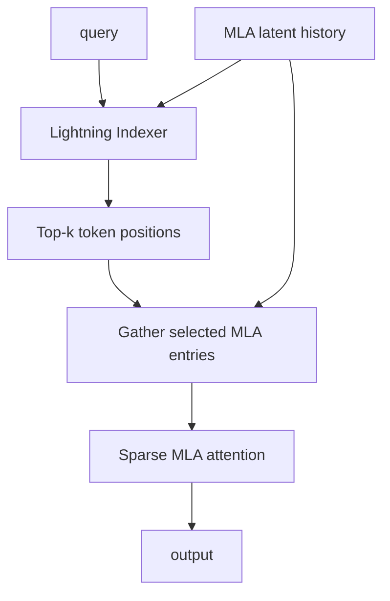
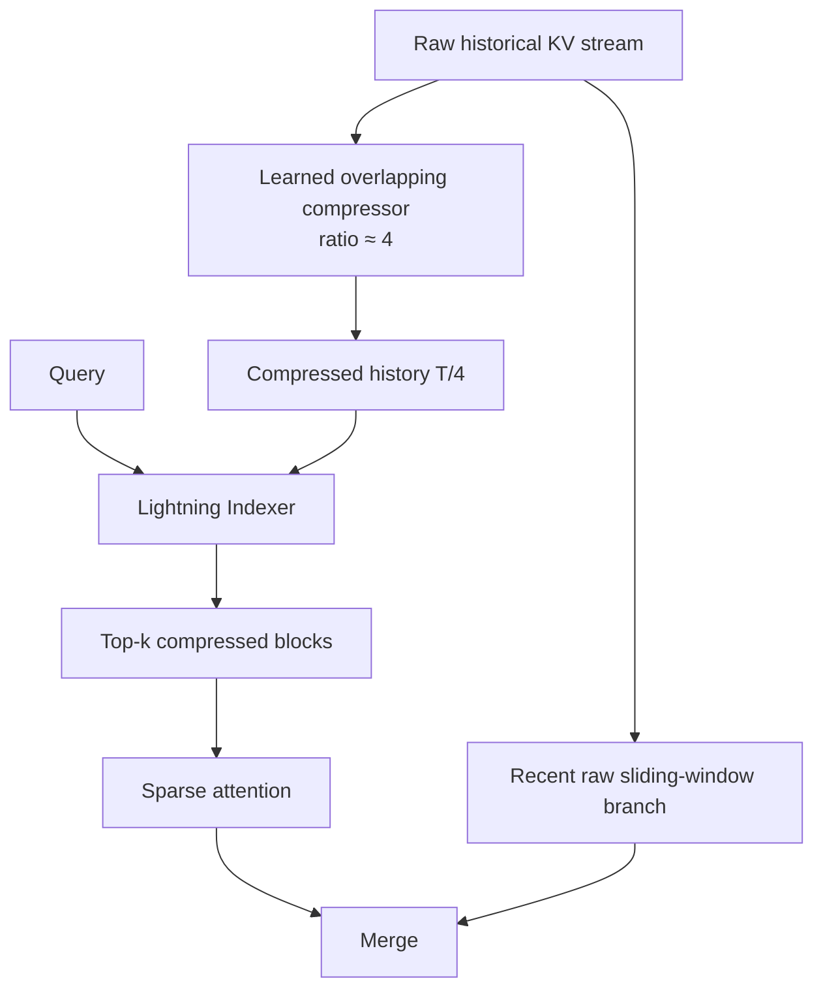
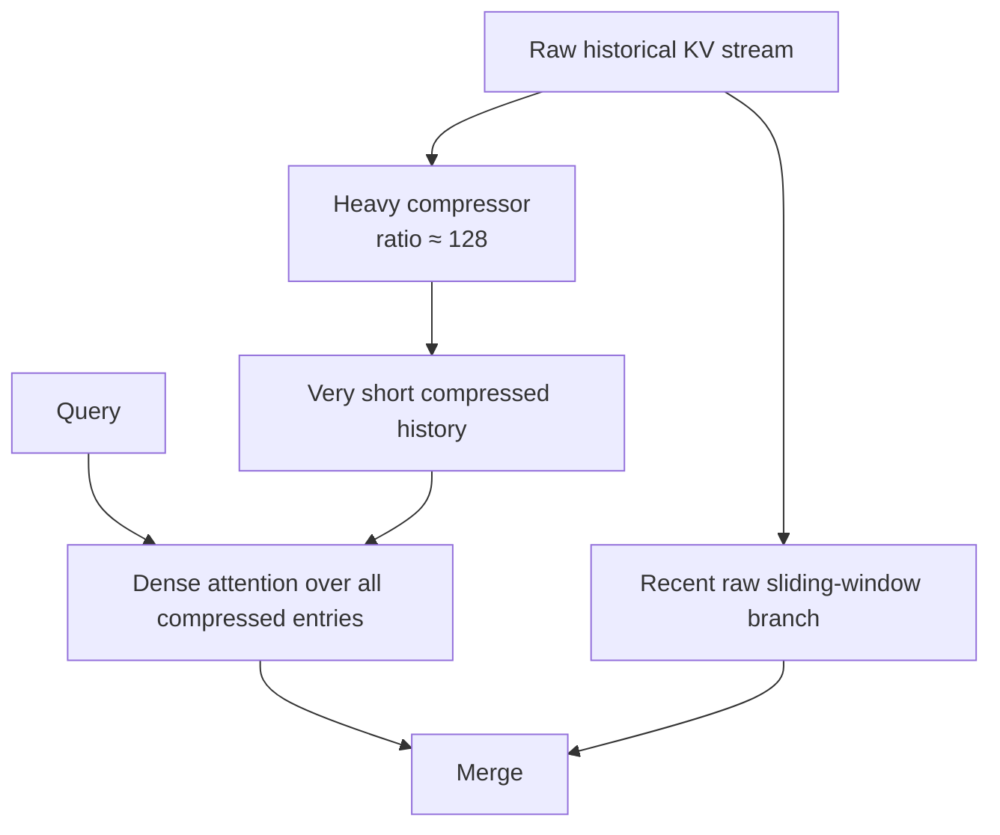

# 12. DeepSeek Attention Architecture: MLA → DSA → CSA/HCA

작성일: 2026-08-18  
상위 문서: [Attention Architecture Study Guide](README.md)

## 1. 이 장의 목표

DeepSeek 계열은 최근 efficient attention 발전을 이해하기 좋은 연속적인 사례다.

```text
DeepSeek-V2
  └─ MLA
      : token별 KV representation을 latent로 압축

DeepSeek-V3
  └─ MLA 유지
      : MoE/학습/시스템 최적화와 결합

DeepSeek-V3.2
  └─ MLA + DSA
      : 압축된 token memory 중 중요한 위치만 sparse lookup

DeepSeek-V4
  └─ CSA + HCA + local branch
      : token representation 압축을 넘어 sequence 축 자체를 압축
```

이 계보의 핵심은 `DeepSeek가 매 세대마다 완전히 다른 attention을 버리고 갈아탔다`가 아니라, **KV byte → query가 조회하는 token 수 → sequence representation 수**라는 서로 다른 비용 축을 단계적으로 공격했다는 점이다.

---

## 2. DeepSeek-V2: MLA의 출발

DeepSeek-V2가 공개한 **Multi-head Latent Attention(멀티 헤드 레이턴트 어텐션, 다중 머리 잠재 attention; MLA)**의 핵심은 각 token의 full K/V를 cache하지 않고 low-rank latent를 저장하는 것이다.

### 2.1 KV Compression

```math
c_t^{KV}=W_{DKV}x_t
```

- $c_t^{KV}$: **씨 서브 티 케이브이**, compressed KV latent
- $W_{DKV}$: KV down-projection
- $r_{KV}=\dim(c_t^{KV})$: KV latent rank

Content K/V는:

```math
k_t^C=W_{UK}c_t^{KV}
```

```math
v_t=W_{UV}c_t^{KV}
```

처럼 생성된다.

Token별 cache representation을:

```math
H_{kv}d_h
\rightarrow
r_{KV}+d_{rope}
```

수준으로 줄이는 것이 핵심이다.

DeepSeek-V2 기술보고서는 당시 비교 기준에서 DeepSeek 67B 대비 KV cache를 93.3% 줄였다고 보고했다. 이는 해당 architecture/config 비교에서의 결과이지 모든 MLA 모델에 고정적으로 적용되는 비율은 아니다.

---

## 3. Decoupled RoPE

Low-rank latent를 효율적으로 cache하려면 positional encoding이 문제다.

만약:

```math
k_i'=R_iW_{UK}c_i^{KV}
```

처럼 up-projected key 전체에 position-dependent RoPE를 적용하면, $W_{UK}$를 runtime attention에 흡수하기가 어렵다.

DeepSeek MLA는 Q/K를 다음 두 부분으로 나눈다.

```math
q_t=[q_t^C;q_t^R]
```

```math
k_i=[k_i^C;k_i^R]
```

- $C$: content/no-position part
- $R$: RoPE position part

Score는:

```math
q_t^\top k_i
=(q_t^C)^\top k_i^C+(q_t^R)^\top k_i^R
```

이다.

이렇게 position-sensitive dimension을 별도로 분리함으로써 large content projection에 대한 **Matrix Absorption(매트릭스 업소프션, projection을 query/output path에 흡수하는 runtime algebra)**을 가능하게 한다.

---

## 4. Matrix Absorption

Key content path:

```math
q_t^\top W_{UK}c_i^{KV}
=(W_{UK}^\top q_t)^\top c_i^{KV}
```

Value path:

```math
\sum_i a_iW_{UV}c_i^{KV}
=W_{UV}\left(\sum_i a_ic_i^{KV}\right)
```

따라서 decode마다 cached latent 전체를 full K/V로 materialize할 필요 없이 latent space에서 attention의 주요 부분을 계산할 수 있다.

이 점 때문에 MLA는 단순한 low-rank parameter reduction이 아니라 **cache representation과 inference algebra를 함께 설계한 attention**이다.

---

## 5. DeepSeek-V3: MLA를 버리지 않았다

DeepSeek-V3는 attention backbone에서 MLA를 계승했다.

주요 변화의 많은 부분은:

- DeepSeekMoE
- load balancing
- FP8 training
- Multi-Token Prediction
- large-scale training system

등에 있었지만 attention의 KV-cache 효율 기반은 MLA였다.

따라서 V2와 V3를 attention 관점에서 보면:

```text
V2: MLA architecture 정립
V3: MLA를 대규모 MoE/학습 시스템에서 확장
```

이라고 보는 편이 맞다.

---

## 6. MLA가 남긴 문제: Query는 여전히 모든 Token을 본다

MLA는 token당 cache byte를 줄였지만 token count 자체는 그대로다.

```text
Token 1 → latent c1
Token 2 → latent c2
...
Token T → latent cT
```

Global MLA query는 여전히:

```math
q_t\leftrightarrow c_1,c_2,\ldots,c_T
```

를 수행한다.

따라서 context가 1M으로 늘면:

- cache entry 수는 1M에 비례
- decode에서 global attention 후보 수는 1M에 비례
- prefill의 pairwise global interaction 부담도 남음

이다.

DeepSeek-V3.2의 DSA는 이 두 번째 문제, 즉 **query가 실제로 읽는 token 수**를 줄이는 방향이다.

---

## 7. DeepSeek-V3.2: DSA

**DeepSeek Sparse Attention(딥시크 스파스 어텐션; DSA)**은 MLA backbone에 **Lightning Indexer(라이트닝 인덱서, query별로 중요한 과거 token을 빠르게 찾는 경량 learned indexer)**를 붙인다.

큰 흐름:



### 7.1 두 단계 retrieval

1. 값싼 indexer가 전체 history를 coarse score한다.
2. top-k로 선택된 위치에서만 expensive attention을 계산한다.

즉:

```math
T\rightarrow K,\qquad K\ll T
```

이다.

---

## 8. V3.2 공개 config로 보는 DSA

DeepSeek-V3.2 공개 구현/config에서 대표적으로 볼 수 있는 값:

| 항목 | 값 |
|---|---:|
| Hidden dimension | 7,168 |
| Layers | 61 |
| Attention heads | 128 |
| Q LoRA rank | 1,536 |
| KV LoRA rank | 512 |
| QK NoPE dim/head | 128 |
| QK RoPE dim/head | 64 |
| V dim/head | 128 |
| Indexer heads | 64 |
| Indexer head dim | 128 |
| Sparse top-k | 2,048 |

이 숫자를 통해 MLA와 DSA가 별개의 tensor path라는 점을 볼 수 있다.

```text
Main attention:
  128 heads
  latent KV rank 512
  NoPE 128 + RoPE 64

Indexer:
  64 heads × 128 dimension
  → top-2048 positions
```

Indexer는 main attention보다 싸야 sparse selection의 의미가 있다.

---

## 9. DSA의 핵심 비용

Sparse attention은 selected $K$개만 attention한다고 해서 전체 비용이 단순 $O(K)$로 끝나지 않는다.

실제 decode path에는:

```math
T_{total}
=
T_{index}
+T_{topk}
+T_{gather}
+T_{sparse-attn}
```

가 있다.

- $T_{index}$: history candidate scoring
- $T_{topk}$: top-k selection
- $T_{gather}$: selected KV를 memory에서 gather
- $T_{sparse-attn}$: 실제 attention

따라서 DSA의 실효 성능은 **Lightning Indexer가 얼마나 싸고, sparse gather/kernel이 GPU에 얼마나 잘 맞는가**에 달려 있다.

---

## 10. FlashMLA와 DeepGEMM

DeepSeek-V3.2 계열은 optimized inference kernel을 별도로 공개했다.

- **FlashMLA(플래시 엠엘에이)**: MLA decode/prefill을 위한 GPU kernel
- **DeepGEMM(딥젬엠)**: FP8/저정밀 GEMM을 위한 kernel ecosystem

중요한 구분:

```text
MLA / DSA = model architecture
FlashMLA  = MLA를 실행하는 kernel
DeepGEMM  = projection/MoE 등에 사용되는 GEMM kernel
```

Model architecture를 이해하는 것과 특정 vLLM version에서 어떤 kernel path가 hit하는지는 별도로 검증해야 한다.

---

# 11. DeepSeek-V4: Attention의 압축 축이 바뀐다

DeepSeek-V4는 V3.2의 DSA를 단순히 조금 수정한 형태가 아니다. long-context attention을 **sequence compression 중심**으로 다시 설계한다.

핵심 두 mechanism:

1. **Compressed Sparse Attention(컴프레스트 스파스 어텐션; CSA)**
2. **Heavily Compressed Attention(헤빌리 컴프레스트 어텐션; HCA)**

그리고 모든 long-range path와 병렬로 최근 raw token을 보는 sliding-window branch를 둔다.

### 공식 전체 구조 그림


*DeepSeek-V4 기술보고서 Figure 2. Hybrid CSA/HCA attention, DeepSeekMoE와 residual architecture를 포함한다. Hugging Face 공개 article에 mirror된 report figure.*

---

## 12. DeepSeek-V4의 또 다른 축: Shared K=V MQA

Transformers DeepSeek-V4 architecture documentation과 공개 config를 보면 long-range attention은:

- query heads 다수
- `num_key_value_heads=1`
- 같은 representation을 K와 V로 사용하는 shared K=V path

를 사용한다.

즉 **Multi-Query Attention(멀티 쿼리 어텐션; MQA)**보다 더 강한 sharing을 수행한다.

일반 attention:

```text
K stream + V stream
```

V4:

```text
shared KV stream
   ├─ interpreted as K
   └─ interpreted as V
```

이 설계는 token/sequence compression과 별개의 memory reduction 축이다.

---

# 13. CSA: Sequence를 먼저 4배 압축하고 Sparse하게 찾는다

DeepSeek-V4 CSA의 기본 compression ratio는 4다.

```math
T\rightarrow T_c\approx\frac{T}{4}
```

Compression은 단순 token drop이 아니라 learned compressor를 통해 overlapping group의 history를 compressed KV entry로 만든다.

그 뒤 Lightning Indexer가 compressed entries 중 top-k를 고른다.



### 공식 CSA 도식


*DeepSeek-V4 기술보고서 Figure 3 — Compressed Sparse Attention.*

---

## 14. DSA와 CSA의 차이

두 구조 모두 Lightning Indexer와 sparse top-k라는 표현이 등장하지만 search space가 다르다.

### DSA

```text
Token-level MLA entries
      ↓ indexer
selected token positions
```

### CSA

```text
Raw history
   ↓ 4x learned sequence compression
Compressed entries
   ↓ indexer
selected compressed blocks
```

따라서 CSA는 indexer가 탐색하기 전부터 candidate sequence가 약 1/4로 줄어 있다.

| 항목 | V3.2 DSA | V4 CSA |
|---|---|---|
| base memory | token-level MLA latent | compressed shared-KV sequence |
| sequence compression | 없음 | 기본 약 4x |
| sparse indexer | 있음 | 있음 |
| selected unit | token/latent position | compressed block/entry |
| recent raw local branch | architecture 중심 요소 아님 | 명시적으로 병렬 사용 |

---

# 15. HCA: 128배 압축 후 전체를 Dense하게 본다

**Heavily Compressed Attention(헤빌리 컴프레스트 어텐션; HCA)**은 기본 compression ratio가 약 128이다.

```math
T\rightarrow T_h\approx\frac{T}{128}
```

이 정도로 sequence가 짧아지면 indexer로 top-k를 골라야 할 필요가 줄어든다.

그래서 HCA는 compressed history 전체를 dense softmax attention으로 본다.



### 공식 HCA 도식


*DeepSeek-V4 기술보고서 Figure 4 — Heavily Compressed Attention.*

---

## 16. HCA는 Sparse Attention이 아니다

이 점이 중요하다.

HCA에서는 compressed entry 수가 매우 작아졌기 때문에:

```math
\text{query}\leftrightarrow\text{all compressed entries}
```

를 수행한다.

즉 global relation은 dense하게 유지되지만 원래 1M raw token과 직접 pairwise attention하는 것이 아니라 128:1로 요약된 coarse memory를 본다.

> Sparse selection으로 key 수를 줄이는 것이 아니라 **representation count를 먼저 강하게 줄여 dense attention을 싸게 만든다.**

---

## 17. 왜 Raw Sliding-Window Branch가 필요한가

Compression ratio 4나 128에서는 근거리 token detail이 손실될 수 있다.

그래서 V4 CSA/HCA에는 최근 raw token을 그대로 보는 sliding-window path가 있다.

```text
Long-range path: compressed history
Short-range path: recent raw tokens
```

이 구조는 이미지 처리의 multi-resolution feature처럼 생각할 수 있다.

- 먼 history: 저해상도/압축
- 최근 history: 고해상도/raw

현재 query는 두 path를 결합해 output을 만든다.

---

## 18. Partial RoPE

DeepSeek-V4도 query/key head dimension 전체에 RoPE를 적용하지 않는다.

Content dimension과 trailing RoPE dimension을 나눠:

```text
[ content dimensions | RoPE dimensions ]
```

형태로 position-aware part를 제한한다.

이는 DeepSeek MLA의 decoupled positional philosophy와 비슷한 문제의식을 공유하지만 V4의 K/V compression architecture 자체는 V3 MLA와 동일하지 않다.

---

## 19. Attention Sink

V4 attention에는 head별 learned sink 성격의 parameter가 있다.

**Attention Sink(어텐션 싱크, softmax probability mass를 특정 ordinary token에 강제로 배분하지 않아도 되게 하는 추가 attention target/bias)**는 query가 유용한 historical token을 찾지 못했을 때 stable fallback 역할을 할 수 있다.

Softmax denominator에 learned sink logit을 포함한다고 생각하면:

```math
a_i=
\frac{e^{s_i}}
{e^{s_{sink}}+\sum_j e^{s_j}}
```

처럼 ordinary token들의 weight 총합이 반드시 1이 되지 않고 일부 mass가 sink로 갈 수 있다.

세부 parameterization은 구현을 기준으로 확인해야 한다.

---

## 20. Grouped Low-Rank Output Projection

DeepSeek-V4는 attention output projection에도 low-rank/grouped 구조를 사용한다.

일반 full projection:

```math
y=W_Oo
```

대신 group별 low-rank path를 사용하여 large head output projection의 FLOPs/parameter traffic을 줄인다.

공개 V4-Pro config에는 `o_groups`, `o_lora_rank` 같은 항목이 존재한다.

예:

```text
o_groups = 16
o_lora_rank = 1024
```

이것도 CSA/HCA와 별개의 compression 축이다.

---

## 21. DeepSeek-V4-Pro 공개 Attention Config

공개 V4-Pro config에서 attention 관련 핵심 값은 대략 다음과 같다.

| 항목 | V4-Pro 공개 config |
|---|---:|
| Hidden size | 7,168 |
| Layers | 61 |
| Query heads | 128 |
| KV heads | 1 |
| Head dimension | 512 |
| RoPE dimension | 64 |
| Q LoRA rank | 1,536 |
| Indexer heads | 64 |
| Indexer head dim | 128 |
| CSA top-k | 1,024 |
| Local window | 128 |
| Output groups | 16 |
| Output LoRA rank | 1,024 |
| Max position | 1,048,576 |

Layer별 compression ratio는 처음 두 HCA layer 이후 4와 128이 교대하는 형태로 공개돼 있다.

개략적으로:

```text
Layer 0  HCA 128x
Layer 1  HCA 128x
Layer 2  CSA   4x
Layer 3  HCA 128x
Layer 4  CSA   4x
Layer 5  HCA 128x
...
```

MTP tail은 별도의 sliding-window-only 구성을 갖는다.

---

## 22. DeepSeek-V4에서 KV Cache라는 말이 더 복잡해지는 이유

Conventional attention의 KV cache는:

```text
Token i → K_i, V_i
```

다.

MLA는:

```text
Token i → latent c_i + positional component
```

다.

V4에서는:

```text
Historical tokens
   ├─ compressed long-range shared-KV entries
   └─ recent raw local shared-KV entries
```

가 된다.

따라서 단순한:

```math
2TH_{kv}d_hb
```

식만으로 V4 cache를 계산하면 틀린다.

압축 stride/window overlap, local branch, representation dtype, shared K=V, layer별 compression ratio를 함께 봐야 한다.

---

## 23. DeepSeek-V4의 Long-Context 효율 수치 읽는 법

Hugging Face가 기술보고서를 정리한 공개 article 기준 V4-Pro/Flash는 1M context를 목표로 attention FLOPs와 accumulated KV cache를 V3.2 대비 크게 줄인다.


*DeepSeek-V4 기술보고서 Figure 1 — benchmark와 long-context FLOPs/KV scaling 비교.*

이 그래프는 architecture 효과를 이해하는 데 유용하지만 다음에 주의한다.

- 특정 model scale/config의 공식 비교
- theoretical/measurement 정의가 모델마다 같아야 해석 가능
- 실제 vLLM throughput은 kernel maturity와 hardware에 따라 달라짐
- `KV cache %`와 end-to-end VRAM %는 같은 값이 아님

---

## 24. V2 → V3.2 → V4를 압축 축으로 보기

### DeepSeek-V2 MLA

```math
\text{feature width compression}
```

각 token의 KV를 더 작은 latent로 저장한다.

### DeepSeek-V3.2 DSA

```math
\text{query lookup sparsification}
```

과거 token 중 top-k만 정밀 attention한다.

### DeepSeek-V4 CSA

```math
\text{sequence compression}
+
\text{sparse lookup}
```

### DeepSeek-V4 HCA

```math
\text{heavy sequence compression}
+
\text{dense lookup}
```

즉 DeepSeek의 발전을 `MLA → sparse → compression`이라는 세 축으로 보면 구조가 선명해진다.

---

## 25. Kimi/Qwen과의 차이

DeepSeek-V4는 Kimi/Qwen의 recurrent hybrid와 다른 방향이다.

| 모델 | Cheap path의 본질 | Global/detail 보완 |
|---|---|---|
| Qwen3.6 | GDN fixed recurrent state | periodic full GQA |
| Kimi-K3 | KDA fixed recurrent state | periodic MLA |
| DeepSeek-V4 | compressed token memory | CSA/HCA + raw local branch |

DeepSeek-V4는 history를 하나의 finite recurrent state로 접지 않는다. 압축되었지만 여전히 **여러 historical memory entry**를 유지한다.

따라서 recurrent model보다 token-addressability를 더 보존하는 대신 cache가 완전한 $O(1)$은 아니다.

---

## 26. Serving Engine 관점 비교

### MLA/V3 계열

필요한 것:

- latent KV cache layout
- matrix absorption kernel
- decoupled RoPE cache
- paged latent-cache support

### DSA/V3.2

추가:

- indexer cache/compute
- top-k selection
- sparse gather
- sparse paged attention kernel

### V4

추가:

- layer별 sequence compressor state/cache
- compressed block layout
- local raw ring/sliding cache
- CSA indexer
- HCA dense compressed attention
- shared K=V path
- mixed compression ratio allocator

즉 V4를 generic GQA kernel로 쉽게 대체할 수 없고 framework가 model-specific kernel/cache support를 가져야 성능이 나온다.

---

## 27. Prefix Caching

Conventional prefix cache는 raw KV block hash를 공유한다.

V4에서는 prefix를 재사용할 때 압축된 long-range representation도 동일해야 한다.

고려할 것:

- compressor가 block boundary를 넘는 overlapping window를 쓰는가?
- prefix block hash와 compressed block boundary가 맞는가?
- local raw branch는 어디까지 재사용 가능한가?
- CSA indexer용 representation이 별도 cache되는가?

이런 요소 때문에 compressed attention의 prefix caching은 `KV block 하나 공유`보다 복잡할 수 있다.

---

## 28. Context Parallelism

1M prompt prefill을 여러 GPU에 context-parallel하게 나눌 때 attention mechanism별 communication 패턴이 달라진다.

### Full attention

각 query shard가 remote KV를 필요로 할 수 있다.

### MLA

remote latent KV를 교환/조회한다.

### DSA

indexer가 global candidate를 찾고 selected KV를 전달해야 한다.

### CSA/HCA

compressed sequence를 shard하면 raw token 대비 communication volume을 줄일 가능성이 있지만 compressor boundary와 global selection을 고려해야 한다.

따라서 CP 설계는 model attention 구조와 직접 연결된다.

---

## 29. DeepSeek 계열에서 자주 생기는 오해

### `V3.2의 DSA는 MLA를 없앴다`

아니다. V3.2는 MLA backbone에 sparse indexer를 결합한다.

### `V4의 CSA는 그냥 DSA에 compression 하나 추가한 것이다`

철학적 연속성은 있지만 KV representation, shared K=V, local branch, layer architecture까지 재설계됐다. 별도 architecture로 보는 편이 정확하다.

### `HCA는 sparse attention이다`

아니다. 매우 강하게 압축된 memory 전체에 dense attention한다.

### `V4는 token별 KV를 완전히 없앴다`

아니다. long-range compressed entries와 recent raw local entries를 유지한다. recurrent fixed-state 모델과 다르다.

### `num_key_value_heads=1이면 V4의 모든 cache를 MQA 공식으로 계산할 수 있다`

아니다. sequence compression, K=V sharing, local branch를 함께 고려해야 한다.

---

## 30. 핵심 정리

1. DeepSeek-V2 MLA는 token당 KV representation을 low-rank latent로 압축했다.
2. DeepSeek-V3는 MLA를 대규모 MoE backbone에 계승했다.
3. DeepSeek-V3.2 DSA는 MLA history에서 query별 top-k token만 정밀 조회한다.
4. Sparse attention에서는 indexer/top-k/gather 비용을 포함해 봐야 한다.
5. DeepSeek-V4 CSA는 history를 약 4배 압축한 뒤 indexer로 top-k compressed entries를 조회한다.
6. HCA는 history를 약 128배 압축한 뒤 compressed entries 전체에 dense attention한다.
7. V4는 recent raw sliding-window path를 병렬로 유지해 압축으로 잃을 local detail을 보완한다.
8. V4는 shared K=V MQA, partial RoPE, attention sink, grouped low-rank output projection을 함께 사용한다.
9. DeepSeek 계열은 `feature width → lookup count → sequence count`라는 서로 다른 축을 순차적으로 압축해 왔다.
10. Kimi/Qwen recurrent hybrid와 달리 V4는 finite state 하나로 history를 접지 않고 compressed historical entries를 유지한다.

---

## 31. 공식/1차 자료

- DeepSeek-AI, **DeepSeek-V2**  
  https://arxiv.org/abs/2405.04434
- DeepSeek-AI, **DeepSeek-V3 Technical Report**  
  https://arxiv.org/abs/2412.19437
- DeepSeek-AI, **DeepSeek-V3.2**  
  https://arxiv.org/abs/2512.02556
- DeepSeek-V3.2 official repository  
  https://github.com/deepseek-ai/DeepSeek-V3.2-Exp
- DeepSeek FlashMLA  
  https://github.com/deepseek-ai/FlashMLA
- DeepSeek DeepGEMM  
  https://github.com/deepseek-ai/DeepGEMM
- DeepSeek-V4-Pro official model/config  
  https://huggingface.co/deepseek-ai/DeepSeek-V4-Pro
- Hugging Face Transformers, **DeepSeek-V4 architecture documentation**  
  https://huggingface.co/docs/transformers/model_doc/deepseek_v4
- Hugging Face, **DeepSeek-V4 architecture report walkthrough**  
  https://huggingface.co/blog/deepseekv4
