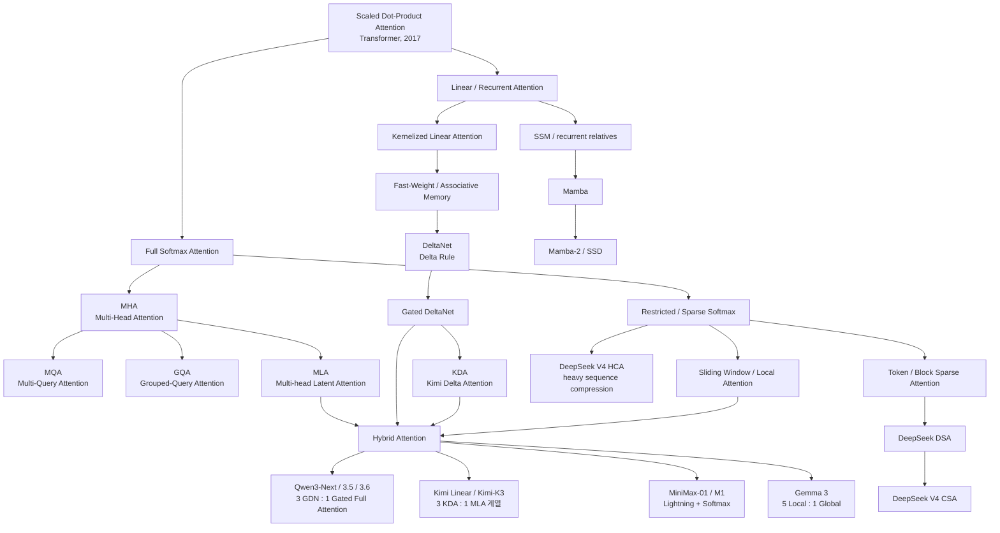

# Attention Architecture Study Guide

작성일: 2026-08-18  
분류: `study/attention`  
범위: Transformer attention의 수학적 기반, Full/Softmax Attention, MQA/GQA/MLA, Local/Sparse/Compressed Attention, Linear/Recurrent Attention, DeltaNet/Gated DeltaNet/KDA, 주요 공개 LLM 적용 사례, 서빙 엔진 관점

## 1. 문서의 목적

이 디렉터리는 특정 모델의 attention 옵션을 외우기 위한 노트가 아니다. 현대 LLM의 attention 계열을 **수식, 정보 표현, 메모리 구조, 계산 복잡도, GPU 실행 방식, 실제 모델 설계**까지 하나의 계보로 연결해 이해하기 위한 학습 문서다.

핵심 질문은 다음과 같다.

1. Transformer의 attention은 본질적으로 무엇을 계산하는가?
2. MHA, MQA, GQA는 무엇을 공유하고 무엇을 줄이는가?
3. MLA는 왜 단순한 GQA의 변형이 아니며, latent KV compression은 어떻게 동작하는가?
4. FlashAttention과 PagedAttention은 왜 모델 아키텍처가 아니라 실행/메모리 알고리즘인가?
5. Linear Attention은 행렬 곱의 결합법칙을 어떻게 이용해 token 축을 fixed-size state로 접는가?
6. Delta Rule, DeltaNet, Gated DeltaNet, KDA는 왜 단순 누적형 linear attention보다 표현력이 높은가?
7. Sliding Window, Sparse Attention, DSA, CSA, HCA는 token을 버리는 방식이 서로 어떻게 다른가?
8. Kimi-K3, Qwen3-Next/3.5/3.6, DeepSeek-V2/V3/V3.2/V4는 각각 어떤 attention 문제를 선택해 풀었는가?
9. 이러한 선택이 vLLM 같은 serving engine에서 KV cache, prefix caching, continuous batching, preemption, kernel dispatch에 어떤 영향을 주는가?

이 문서 세트는 위 질문에 답할 수 있을 정도의 구조적 이해를 목표로 한다.

---

## 2. 권장 학습 순서

처음부터 순서대로 읽는 것을 권장한다.

| 순서 | 문서 | 핵심 질문 |
|---:|---|---|
| 0 | [00-foundations.md](00-foundations.md) | 수식과 Transformer block을 어떻게 읽는가? |
| 1 | [01-full-attention.md](01-full-attention.md) | MHA/MQA/GQA와 KV cache는 무엇인가? |
| 2 | [02-mla-low-rank-attention.md](02-mla-low-rank-attention.md) | MLA는 어떻게 token별 KV를 latent로 압축하는가? |
| 3 | [03-linear-recurrent-attention.md](03-linear-recurrent-attention.md) | Linear Attention에서 DeltaNet/GDN/KDA까지 어떻게 이어지는가? |
| 4 | [04-local-sparse-compressed-hybrid.md](04-local-sparse-compressed-hybrid.md) | Local/Sparse/Compressed/Hybrid Attention은 무엇을 절충하는가? |
| 5 | [10-kimi-k3.md](10-kimi-k3.md) | Kimi-K3의 KDA+MLA 구조를 layer부터 kernel까지 어떻게 읽는가? |
| 6 | [11-qwen.md](11-qwen.md) | Qwen3 → Qwen3-Next → Qwen3.5/3.6의 attention은 어떻게 변했는가? |
| 7 | [12-deepseek.md](12-deepseek.md) | DeepSeek MLA → DSA → CSA/HCA의 계보는 무엇인가? |
| 8 | [13-other-major-models.md](13-other-major-models.md) | Llama, Gemma, Mistral, MiniMax, gpt-oss는 어떤 선택을 했는가? |
| 9 | [90-serving-engineer-view.md](90-serving-engineer-view.md) | 모델 attention이 실제 추론 인프라에 어떤 비용으로 나타나는가? |
| 10 | [99-papers-and-glossary.md](99-papers-and-glossary.md) | 원 논문과 용어를 어디서 다시 확인하는가? |

---

## 3. 전체 계보

이 계보에서 가장 중요한 구분은 다음이다.

- **MHA/MQA/GQA/MLA**는 기본적으로 softmax attention의 token-to-token lookup 능력을 유지한다.
- **Sliding Window/Sparse/Compressed Attention**은 softmax attention을 유지하면서 조회할 token 또는 representation의 수를 줄인다.
- **Linear/Recurrent Attention**은 과거 token별 KV를 그대로 조회하는 대신 history를 recurrent state에 누적한다.
- **Hybrid Attention**은 한 가지 방식이 모든 문제에서 최적이 아니라는 전제에서 여러 계열을 layer 단위로 섞는다.

---

## 4. 문서 표기 규칙

영문 또는 수학 용어가 처음 등장할 때 가능하면 다음 형식을 사용한다.

> **Grouped-Query Attention (그룹드 쿼리 어텐션, 그룹화 질의 어텐션; GQA)**

수식은 기호 자체뿐 아니라 모델에서 그 값이 무엇인지 함께 적는다.

예를 들어

$$
S_t = S_{t-1} + k_t v_t^\top
$$

에서:

- $S_t$: **에스 서브 티**, 시점 $t$까지의 memory state
- $k_t$: **케이 서브 티**, 현재 token의 key vector
- $v_t$: **브이 서브 티**, 현재 token의 value vector
- $v_t^\top$: **브이 서브 티 트랜스포즈**, value vector의 전치
- $k_t v_t^\top$: key와 value의 **Outer Product(아우터 프로덕트, 외적)**

다만 같은 용어가 문서 전체에서 반복될 때는 매번 발음을 재기입하지 않는다. 이 문서의 목적은 용어 암기가 아니라 구조적 이해다.

---

## 5. Attention을 분류하는 다섯 축

Attention 이름이 많아지는 이유는 서로 다른 최적화 축이 섞여 있기 때문이다. 다음 다섯 질문으로 분해하면 대부분의 메커니즘을 빠르게 분류할 수 있다.

### 5.1 Query/KV head를 어떻게 구성하는가?

- MHA: query head와 KV head 수가 동일
- MQA: 모든 query head가 하나의 KV head 공유
- GQA: query head 여러 개가 KV head 하나를 그룹 단위 공유

이 축은 주로 **KV cache byte/token과 decode bandwidth**를 바꾼다.

### 5.2 token별 memory를 어떤 representation으로 저장하는가?

- MHA/GQA: full 또는 grouped K/V
- MLA: low-rank latent KV
- DeepSeek V4: 압축된 sequence-level KV representation
- Linear attention: token별 memory 대신 recurrent state

이 축은 **cache의 표현력과 크기**를 바꾼다.

### 5.3 현재 query가 과거의 어느 위치를 조회하는가?

- Global/Full: 모든 과거 위치
- Sliding Window: 최근 $W$개
- Sparse: indexer/rule이 고른 일부 위치 또는 block
- Recurrent: 과거 위치 자체가 아니라 state를 조회

이 축은 **attention FLOPs와 memory read 범위**를 바꾼다.

### 5.4 위치 정보는 어디에서 들어가는가?

- RoPE: Q/K에 회전 변환
- Partial RoPE: head dimension 일부에만 적용
- NoPE: 해당 attention layer에는 명시적 positional encoding 없음
- recurrent state transition: 연산 순서 자체가 position/recency를 담음

### 5.5 모델과 kernel을 구분했는가?

다음은 흔히 같은 범주로 오해하지만 다른 층위다.

| 이름 | 층위 | 바꾸는 것 |
|---|---|---|
| MHA/GQA/MLA/KDA | 모델 아키텍처 | 모델이 정보를 표현하고 조회하는 방식 |
| FlashAttention | exact attention kernel/algorithm | HBM↔SRAM I/O와 tile 계산 방식 |
| FlashMLA/FlashKDA/FlashQLA | 특정 attention용 kernel | 같은 모델 수식을 GPU에서 실행하는 방식 |
| PagedAttention | serving memory algorithm | KV block 배치/공유/fragmentation 관리 |
| Tensor/Context Parallel | 분산 실행 | 계산과 state/cache를 GPU에 분할하는 방식 |

---

## 6. 주요 모델을 한눈에 보기

이 표는 세부 수치를 외우기 위한 표가 아니라 attention 설계 방향을 비교하기 위한 지도다.

| 모델 계열 | 대표 attention 설계 | 핵심 목적 |
|---|---|---|
| Llama 3 계열 | GQA + RoPE | 검증된 full attention 품질과 decode 효율 |
| Llama 4 | interleaved attention + iRoPE | 매우 긴 context의 position/generalization |
| Gemma 3 | 5 Local : 1 Global + GQA | KV cache 감소와 global recall 절충 |
| Mistral 7B | GQA + Sliding Window | 제한된 window로 inference 비용 감소 |
| gpt-oss | dense/global과 banded local attention 교대 + GQA | 128K에서 full/local 비용 절충 |
| MiniMax-01/M1 | Lightning Attention + Softmax hybrid | million-token context와 linear-time path |
| DeepSeek-V2/V3 | MLA | token별 KV를 latent로 압축 |
| DeepSeek-V3.2 | MLA + DSA indexer | long-context에서 중요한 token만 sparse lookup |
| DeepSeek-V4 | CSA + HCA + local branch | sequence 자체를 압축하고 sparse/dense compressed lookup 결합 |
| Qwen3-Next/3.5/3.6 | 3 Gated DeltaNet : 1 Gated Full Attention | linear recurrence 효율과 exact recall 절충 |
| Kimi-K3 | 69 KDA + 24 Gated MLA | fixed-state recurrence와 global latent lookup 절충 |

폐쇄형 모델은 공개된 근거 이상의 아키텍처를 추정하지 않는다. 이 디렉터리의 모델별 비교는 원칙적으로 기술보고서, 공식 model card/config, 공식 구현 또는 검증 가능한 framework 구현이 있는 모델을 중심으로 한다.

---

## 7. 소스 우선순위

문서 내용은 다음 순서로 신뢰한다.

1. 모델 개발사가 공개한 기술보고서/논문
2. 공식 model repository의 config와 reference implementation
3. Hugging Face Transformers 등 실제 upstream framework 구현
4. 개발사 공식 engineering blog
5. kernel repository와 serving framework 구현
6. 제3자 분석은 공식 자료의 빈칸을 설명할 때만 보조적으로 사용

특히 모델 이름이 비슷하거나 release 간 변경이 잦은 경우 **config가 최종적인 실행 shape을 확인하는 기준**이다.

---

## 8. 이 문서를 읽고 나서 답할 수 있어야 하는 질문

- `num_attention_heads=96`, `num_key_value_heads=8`, `head_dim=128`이면 BF16 KV cache는 token/layer당 몇 byte인가?
- GQA가 KV cache를 줄이는데도 왜 full attention의 $O(T^2)$ prefill 문제는 그대로인가?
- MLA의 `kv_lora_rank=512`가 단순히 KV head를 512개 쓴다는 뜻이 아닌 이유는 무엇인가?
- DeepSeek MLA의 decoupled RoPE와 matrix absorption은 어떤 문제를 해결하는가?
- Linear attention에서 $\sum_i k_i v_i^\top$를 먼저 계산할 수 있는 이유는 무엇인가?
- Delta Rule이 단순 additive update보다 associative recall에 유리한 이유는 무엇인가?
- Gated DeltaNet의 scalar decay와 KDA의 channel-wise decay는 표현력 면에서 무엇이 다른가?
- Qwen3.6의 `full_attention_interval=4`가 실제 64-layer stack에서 무엇을 의미하는가?
- Kimi-K3의 69 KDA + 24 MLA를 3:1 패턴으로 표현할 때 마지막 MLA가 왜 별도로 하나 더 생기는가?
- DSA와 DeepSeek-V4 CSA는 둘 다 indexer를 쓰는데 무엇이 압축되고 무엇이 sparse한가?
- HCA는 sparse attention이 아닌데도 1M context에서 비용이 낮아지는 이유는 무엇인가?
- FlashAttention이 $O(T^2)$ attention을 $O(T)$ attention으로 바꾸지 않는 이유는 무엇인가?
- recurrent state를 사용하는 모델에서 prefix caching과 speculative rollback이 왜 더 복잡해지는가?

이 질문에 수식과 serving 관점 모두로 답할 수 있다면, attention 메커니즘을 모델 이름이 아니라 구조로 이해한 상태에 가깝다.
