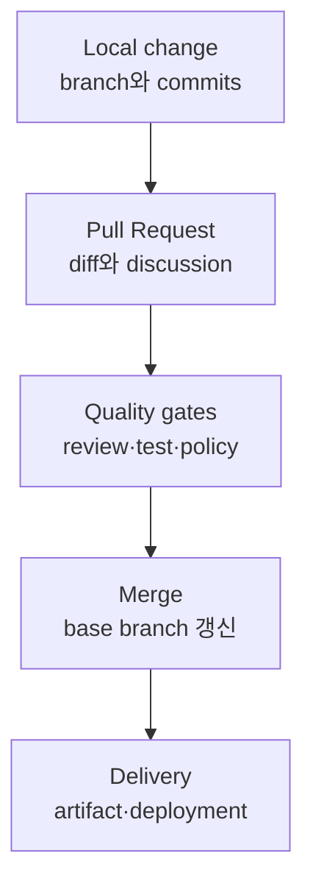

# 00. Git·GitHub 전체 구조와 정신 모델

## 1. 버전 관리가 필요한 진짜 이유

`final`, `final2`, `final-real` 파일을 여러 개 보관하는 방식도 과거 상태를 남길 수는 있다. 하지만 현업의 핵심 문제는 파일 한 개의 이전 버전을 찾는 것이 아니다.

- 누가 어떤 목적에서 여러 파일을 함께 바꿨는가?
- 두 사람이 동시에 작업한 결과를 어떻게 합칠 것인가?
- 어느 변경부터 장애가 생겼는가?
- 검토와 테스트를 통과한 상태만 배포되었다는 것을 어떻게 증명할 것인가?
- 특정 release를 구성한 source, dependency, artifact를 어떻게 다시 찾을 것인가?

Git은 이 문제를 **snapshot과 부모 관계가 있는 commit**으로 푼다. GitHub는 그 commit graph 위에 제안, 대화, 승인, 자동 검사, 정책, 배포 기록을 얹는다.

## 2. Git은 중앙 서버가 없어도 동작한다

Git은 Distributed Version Control System, 즉 분산 버전 관리 시스템이다. 일반적인 clone은 현재 파일만 받는 것이 아니라 repository의 commit history와 branch 정보를 로컬에 가져온다. 따라서 네트워크가 없어도 다음 작업이 가능하다.

- 과거 log와 diff 조회
- branch 생성과 이동
- commit 작성
- merge와 rebase
- `bisect`, `blame`, `reflog` 기반 조사

GitHub가 내려가도 local Git repository가 사라지는 것은 아니다. 반대로 `.git`이 없는 일반 폴더는 GitHub에서 내려받은 파일을 가지고 있어도 local repository가 아니다.

## 3. 다섯 개의 상태 공간

Git을 어렵게 만드는 가장 큰 이유는 같은 파일이 동시에 여러 상태 공간에 존재할 수 있기 때문이다.

| 공간 | 의미 | 대표 확인 명령 |
|---|---|---|
| Working tree | 현재 디스크에서 편집 중인 파일 | `git status`, `git diff` |
| Index / staging area | 다음 commit에 넣기로 선택한 snapshot | `git diff --cached` |
| Local repository | `.git` 안의 object와 local ref | `git log`, `git show` |
| Remote-tracking refs | 마지막 fetch 때 본 원격 branch 상태 | `git branch -r`, `git log origin/main` |
| Remote repository | GitHub 같은 서버가 보유한 공유 ref | `git fetch`, GitHub UI |

한 파일을 수정하고 `git add`한 뒤 다시 수정하면 세 버전이 동시에 생길 수 있다.

- `HEAD`: 마지막 commit에 기록된 버전
- index: 첫 번째 수정 후 stage한 버전
- working tree: 두 번째 수정까지 포함한 버전

그래서 `git status`에 같은 파일이 staged와 unstaged 양쪽으로 표시될 수 있다. 오류가 아니라 index가 독립된 snapshot 후보이기 때문이다.

## 4. 자주 섞이는 개념 분리

### 4.1 Repository와 project

- repository는 Git object database와 refs를 포함한 버전 관리 단위다.
- project는 repository 외에도 issue, roadmap, 배포 환경, 문서, 운영 프로세스를 포함할 수 있다.
- monorepo는 여러 component를 한 repository에 두는 전략이지 Git의 별도 기능이 아니다.

### 4.2 Branch와 환경

branch는 commit을 가리키는 ref다. dev/staging/prod 환경 그 자체가 아니다. `develop` branch를 staging 환경에 연결할 수는 있지만, 둘을 동일시하면 다음 문제가 생긴다.

- 환경별 차이가 source branch에 장기간 누적된다.
- production hotfix가 여러 branch에 역전파되어야 한다.
- 실제 배포 artifact와 branch tip이 달라질 수 있다.

환경은 deployment record와 artifact digest로 식별하고, branch는 source change의 통합 흐름으로 다루는 것이 안전하다.

### 4.3 Commit과 Pull Request

- commit은 Git object다.
- PR은 특정 head branch의 변경을 base branch에 합치자는 GitHub의 협업 객체다.
- 하나의 PR에는 여러 commit이 들어갈 수 있고, merge 방식에 따라 base에는 하나 또는 여러 새 commit이 생긴다.
- PR을 닫아도 commit은 자동 삭제되지 않는다.

### 4.4 Workflow와 CI/CD

- workflow는 event에 반응해 job을 실행하는 자동화 정의다.
- CI는 변경을 자주 통합하고 build/test로 품질을 확인하는 practice다.
- CD는 검증된 변경을 release 또는 deployment까지 전달하는 practice다.
- GitHub Actions workflow로 CI/CD를 구현할 수 있지만, 모든 workflow가 CI/CD인 것은 아니다. label 자동화나 정기 보고서도 workflow다.

## 5. 한 변경이 production까지 가는 흐름



각 단계가 남기는 증거가 다르다.

| 단계 | 남겨야 할 증거 |
|---|---|
| Local change | 의미 단위 commit, 재현 가능한 test 결과 |
| PR | 문제 정의, 변경 범위, 영향, 검증, rollback |
| Review | 사람의 승인과 unresolved conversation 상태 |
| CI | 어떤 SHA를 어떤 runner와 command로 검사했는지 |
| Merge | 선택한 merge 방식과 base에 생긴 commit |
| Release | tag, release note, artifact digest, provenance |
| Deploy | 환경, 승인자, 배포된 digest, 시각, 결과 |

## 6. Git을 사용할 때 매번 던질 네 질문

명령어가 기억나지 않을 때는 옵션부터 찾지 말고 다음을 결정한다.

1. **지금 어디에 있는가?** working tree, index, local ref, remote ref 중 무엇을 바꾸려는가?
2. **무엇을 보존해야 하는가?** 파일 내용, commit, branch 이름, 공개 이력 중 무엇인가?
3. **누가 이미 이 이력을 사용했는가?** 나만 쓴 local branch인가, push된 공유 branch인가?
4. **결과 graph는 어떤 모습이어야 하는가?** merge commit을 남길 것인가, linear history를 만들 것인가?

이 네 질문이 정해지면 명령 선택은 대부분 단순해진다.

## 7. 최소 초기 설정

```bash
git config --global user.name "Your Name"
git config --global user.email "you@example.com"
git config --global init.defaultBranch main
git config --global fetch.prune true
git config --global rerere.enabled true
```

- name/email은 commit의 author metadata에 들어간다. 인증 권한과는 별개다.
- `fetch.prune`은 원격에서 삭제된 branch의 오래된 remote-tracking ref를 정리한다.
- `rerere`는 한 번 수동 해결한 conflict 패턴을 기억해 같은 conflict가 반복될 때 재사용한다.

팀 정책이 정해지기 전에는 `pull.rebase`, `pull.ff`를 전역으로 단정하지 않는다. `git pull`의 통합 방식은 repository 정책과 맞아야 하기 때문이다.

## 8. 다음 장으로 가기 전 확인

- GitHub 없이도 local commit을 만들 수 있는 이유를 설명할 수 있는가?
- working tree와 index가 분리된 이유를 설명할 수 있는가?
- `origin/main`이 실시간 GitHub 상태가 아니라 마지막 fetch의 관측값임을 이해했는가?
- PR과 commit, workflow와 CI를 각각 분리해서 설명할 수 있는가?
