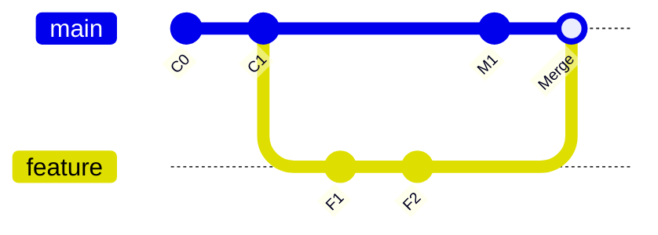

# 01. Git object, ref와 commit DAG

## 1. 왜 내부 구조를 알아야 하는가

branch, merge, rebase, reset이 어렵게 느껴지는 이유는 명령 결과만 외우기 때문이다. Git 내부에서는 대부분 다음 두 종류의 변화만 일어난다.

1. content-addressed object를 새로 만든다.
2. branch나 `HEAD` 같은 ref가 가리키는 commit을 옮긴다.

이 구조를 알면 “commit이 사라졌다”, “branch가 갈라졌다”, “rebase 후 SHA가 바뀌었다”는 현상을 추측하지 않고 설명할 수 있다.

## 2. Git의 핵심 object 네 가지

Git은 content-addressable object database다. 내용으로 계산한 object ID를 key처럼 사용한다. 최근 Git은 repository 설정에 따라 SHA-1 또는 SHA-256 object format을 사용할 수 있지만, 사용자가 기억해야 할 핵심은 hash 길이가 아니라 **내용과 metadata가 바뀌면 object ID가 바뀐다**는 점이다.

### 2.1 Blob

blob은 파일 내용을 저장한다.

- 파일 이름을 저장하지 않는다.
- 같은 내용이면 여러 경로가 같은 blob을 참조할 수 있다.
- 파일의 line-by-line delta가 기본 논리 모델은 아니다. Git은 snapshot을 object로 보고, 저장 최적화 단계에서 pack/delta compression을 사용할 수 있다.

### 2.2 Tree

tree는 directory snapshot에 가깝다. 각 entry에 이름, mode, blob 또는 subtree의 ID를 담는다.

```text
tree
├── README.md -> blob A
├── values.yaml -> blob B
└── templates -> tree C
```

파일 이름은 blob이 아니라 tree 쪽에 있으므로 rename도 내부적으로 “old tree entry 제거 + new tree entry 추가”로 표현된다. Git의 rename 표시는 저장된 rename record가 아니라 diff 시점의 유사도 기반 탐지다.

### 2.3 Commit

commit은 다음을 담는다.

- root tree ID: 프로젝트 전체 snapshot
- parent commit ID 한 개 이상
- author와 committer metadata
- commit message

일반 commit은 parent가 하나다. 최초 commit은 parent가 없고, merge commit은 둘 이상의 parent를 가진다.

### 2.4 Annotated tag

annotated tag object는 특정 object를 사람이 읽을 수 있는 release 이름, tagger, message, 선택적 signature와 연결한다. lightweight tag는 별도 tag object 없이 ref가 commit을 직접 가리킨다. 공식 release 지점에는 일반적으로 annotated tag가 더 많은 provenance를 남긴다.

## 3. Commit history는 DAG다

DAG는 Directed Acyclic Graph, 방향성 비순환 그래프다. commit에서 parent 방향으로 과거를 따라가며 cycle은 없다.



중요한 결과는 다음과 같다.

- “최신”은 시간 하나로 결정되지 않는다. 서로 다른 branch tip이 동시에 존재한다.
- merge는 공통 조상인 merge base와 양쪽 tip을 이용하는 3-way 통합이다.
- commit의 parent가 바뀌면 commit 내용이 같아 보여도 ID가 달라진다.
- history를 다시 쓰는 rebase는 기존 commit을 이동시키는 것이 아니라 새 parent 위에 새 commit을 만든다.

## 4. Branch는 commit 묶음이 아니다

branch는 보통 `refs/heads/<name>`에 있는 **움직이는 commit pointer**다.

```text
main    -> C3
feature -> F2
```

feature branch에서 commit을 하나 만들면 새 commit `F3`가 만들어지고 feature ref만 `F3`로 이동한다. 기존 commit을 복사해 별도 폴더에 저장하는 것이 아니다. 그래서 branch 생성은 매우 가볍다.

## 5. `HEAD`는 현재 위치다

보통 `HEAD`는 현재 branch를 가리키는 symbolic ref다.

```text
HEAD -> refs/heads/feature -> F2
```

특정 commit이나 tag를 직접 checkout하면 detached HEAD 상태가 된다.

```text
HEAD -> C1
```

detached HEAD에서도 commit을 만들 수 있지만 branch ref가 자동으로 따라오지 않는다. 그 commit을 보존하려면 branch를 만든다.

```bash
git switch -c rescue/my-work
```

## 6. 이름은 ref이고 object는 별도로 남는다

branch를 삭제하는 것은 ref를 지우는 일이다. 그 branch가 가리키던 commit object가 즉시 파괴되는 것은 아니다. 다른 ref나 reflog가 도달 가능하게 만들 수 있고, 일정 기간 뒤 garbage collection 대상이 될 수 있다.

이 때문에 잘못 branch를 삭제하거나 reset해도 바로 멈추고 `git reflog`를 확인하면 복구 가능한 경우가 많다.

## 7. 실제 object를 관찰하는 명령

일반 업무에서 plumbing command를 자주 쓸 필요는 없지만 한 번 직접 보면 정신 모델이 단단해진다.

```bash
# HEAD commit 내용
git cat-file -p HEAD

# HEAD가 가리키는 tree
git cat-file -p 'HEAD^{tree}'

# object 종류와 크기
git cat-file -t HEAD
git cat-file -s HEAD

# ref가 해석되는 최종 SHA
git rev-parse HEAD
git rev-parse main
git rev-parse origin/main
```

commit을 보면 root tree, parent, author, committer, message를 직접 확인할 수 있다. author는 원 변경 작성자, committer는 현재 commit object를 생성한 사람이다. cherry-pick이나 rebase 후 둘이 달라질 수 있다.

## 8. revision 표기

| 표기 | 의미 |
|---|---|
| `HEAD` | 현재 commit |
| `HEAD^` 또는 `HEAD^1` | 첫 번째 parent |
| `HEAD^2` | merge commit의 두 번째 parent |
| `HEAD~3` | 첫 번째 parent를 세 번 따라간 commit |
| `main..feature` | main에는 없고 feature에서 도달 가능한 commit |
| `main...feature` | 양쪽 tip과 merge base를 이용하는 비교 범위 |
| `commit:path` | 특정 commit snapshot 안의 파일 |

PR 화면의 diff를 이해할 때 two-dot과 three-dot 차이가 중요하다. GitHub PR의 변경 관점은 일반적으로 merge base 이후 head branch가 만든 변경에 초점을 둔다. base가 전진하면 merge base와 표시 결과가 달라질 수 있다.

## 9. graph를 읽는 기본 명령

```bash
git log --graph --decorate --oneline --all
git show --stat <commit>
git show <commit>
git diff <base>..<tip>
git diff <base>...<tip>
git merge-base <base> <tip>
```

문제가 생겼을 때 GUI의 branch 선만 보지 말고 `merge-base`와 실제 parent 관계를 확인한다.

## 10. 핵심 결론

- file content는 blob, directory snapshot은 tree다.
- commit은 snapshot tree와 parent를 연결한다.
- branch는 commit을 가리키는 이동 가능한 ref다.
- `HEAD`는 현재 작업 위치다.
- merge는 graph를 연결하고, rebase는 commit을 새 parent 위에 재생성한다.
- ref가 사라진 것과 object가 즉시 삭제된 것은 다르다.

> 이 장의 본질: Git history는 시간순 파일 백업 목록이 아니라, **각 snapshot이 어떤 snapshot에서 파생되었는지를 기록한 인과 그래프**다.
