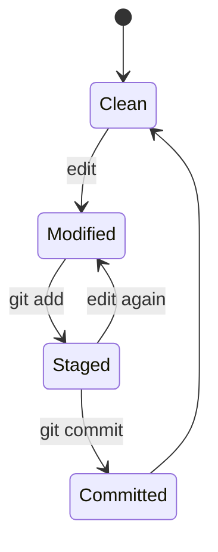

# 02. 로컬 작업, index와 좋은 commit

## 1. 기본 상태 전이



실제로는 untracked, ignored, deleted, renamed 상태도 존재하지만 핵심은 working tree와 index를 분리해서 읽는 것이다.

## 2. 작업 전 안전 확인

```bash
git status -sb
git branch --show-current
git log -5 --oneline --decorate
git remote -v
```

확인할 것:

- 의도한 repository인가?
- 의도한 branch인가?
- 기존 미완성 변경이 있는가?
- upstream tracking branch는 무엇인가?
- 최근 commit은 예상한 것인가?

자동화 agent나 다른 사람이 같은 checkout을 쓸 가능성이 있다면 기존 변경을 사용자 소유로 보고 함부로 stage, restore, reset하지 않는다.

## 3. 변경을 세 관점으로 읽기

```bash
# Working tree와 index 차이: 아직 stage하지 않은 변경
git diff

# Index와 HEAD 차이: 다음 commit에 들어갈 변경
git diff --cached

# Working tree 전체와 HEAD 차이
git diff HEAD
```

`git status`는 요약이고 `git diff`는 실제 내용이다. commit 직전에는 반드시 `git diff --cached`를 읽는다.

## 4. `git add`는 업로드가 아니다

`git add`는 파일을 GitHub로 보내지 않는다. 현재 내용을 index에 기록해 **다음 commit의 snapshot 후보**로 선택한다.

```bash
git add README.md
git add charts/model/values.yaml
```

한 파일 안에서도 일부 hunk만 선택할 수 있다.

```bash
git add -p
```

주요 선택:

- `y`: 이 hunk stage
- `n`: stage하지 않음
- `s`: 더 작은 hunk로 분리
- `e`: patch를 직접 편집
- `q`: 종료

한 파일에 기능 변경과 디버그 로그 제거가 섞였을 때 `add -p`로 commit을 분리하면 review와 revert가 쉬워진다.

## 5. 좋은 commit의 기준

좋은 commit은 작기만 한 commit이 아니라 **하나의 이유로 설명되고 독립적으로 검증·취소 가능한 변경**이다.

### 좋은 경계

- 버그 재현 test 추가
- 실제 fix
- 무관한 formatting 정리
- 문서 갱신

이 네 항목은 필요에 따라 별도 commit이 될 수 있다. 반대로 하나의 API 변경에 schema, implementation, test가 모두 필요하다면 함께 있어야 build 가능한 atomic commit이 된다.

### 나쁜 경계

- `update files`
- 여러 기능과 대규모 rename을 한 commit에 혼합
- generated file은 바뀌었지만 generator source는 누락
- test가 깨지는 중간 commit을 여러 개 남겨 bisect를 방해

## 6. Commit message

권장 구조:

```text
docs: add Git collaboration study guide

Explain commit DAG, pull request synchronization, CI gates,
and recovery workflows with platform-engineering examples.
```

- 제목은 명령형 또는 결과 중심으로 짧게 쓴다.
- 본문에는 “무엇”을 반복하기보다 “왜”, 제약, trade-off를 기록한다.
- issue나 incident가 있으면 추적 가능한 식별자를 남긴다.
- Conventional Commits는 자동 changelog와 release tooling에 유용하지만 Git 자체 규칙은 아니다. 팀 전체가 같은 의미로 쓸 때만 효과가 있다.

## 7. Commit 전 검증 순서

```bash
git status -sb
git diff
git diff --cached

# 저장소별 검사
make test
make lint

git commit -m "docs: add Git collaboration study guide"
git show --stat --oneline HEAD
```

검증 command는 project마다 다르다. 중요한 것은 PR에서 처음 발견되기 전에 local에서 빠른 검사를 수행하고, CI에서는 clean environment에서 같은 계약을 다시 확인하는 것이다.

## 8. `.gitignore`와 이미 tracked된 파일

`.gitignore`는 untracked 파일을 기본 stage 대상에서 제외한다. 이미 tracked된 파일은 ignore pattern을 추가해도 계속 추적된다.

```bash
# tracked 여부 확인
git ls-files path/to/file

# ignore 규칙의 출처 확인
git check-ignore -v path/to/file
```

secret을 실수로 commit한 뒤 `.gitignore`만 추가해도 history에서 secret은 사라지지 않는다. credential을 즉시 폐기·교체하고, 필요하면 별도 history rewrite 절차를 수행해야 한다.

## 9. 큰 binary와 generated file

Git은 source text diff에 강하지만 큰 model weight, archive, build artifact를 일반 object로 반복 commit하면 clone과 history가 비대해진다.

- release artifact는 artifact registry나 GitHub Release asset에 둔다.
- large binary가 반드시 versioned되어야 하면 Git LFS 적용을 검토한다.
- generated manifest를 commit한다면 generator version과 재생성 검증을 함께 둔다.
- model checkpoint나 container image는 content digest와 metadata로 source commit에 연결한다.

## 10. 임시 작업 관리

### 별도 WIP commit

개인 branch라면 의미 있는 WIP commit을 만들고 나중에 interactive rebase로 정리할 수 있다. commit은 reflog와 graph에 남아 stash보다 발견하기 쉬운 장점이 있다.

### Stash

```bash
git stash push -u -m "wip: values schema experiment"
git stash list
git stash show -p stash@{0}
git stash pop
```

stash는 임시 선반이지 장기 task 관리가 아니다. 이름 없이 여러 개 쌓으면 맥락을 잃기 쉽다.

### Worktree

```bash
git worktree add ../repo-hotfix -b hotfix/urgent origin/main
git worktree list
```

하나의 repository object database를 공유하면서 branch별 working tree를 따로 둔다. 긴 feature 작업 도중 hotfix나 병렬 review를 할 때 기존 변경을 stash하지 않아도 된다.

## 11. Local hook의 한계

pre-commit, commit-msg hook으로 formatting이나 message 규칙을 확인할 수 있다. 하지만 local hook은 사용자가 설치하지 않거나 우회할 수 있으므로 조직 정책의 최종 강제 지점이 될 수 없다.

- 빠른 feedback: local hook
- repository 공통 검증: CI
- merge 강제: required status check와 ruleset

세 층을 함께 사용한다.

## 12. 작업 종료 체크리스트

- [ ] `git status -sb`에 의도하지 않은 파일이 없는가?
- [ ] `git diff --cached`가 commit message와 정확히 일치하는가?
- [ ] secret, token, 내부 주소, 큰 artifact가 들어가지 않았는가?
- [ ] formatter, lint, test를 실행했는가?
- [ ] 새 파일과 삭제 파일도 의도한 것인가?
- [ ] 문서와 generated output이 필요한 경우 함께 갱신되었는가?
