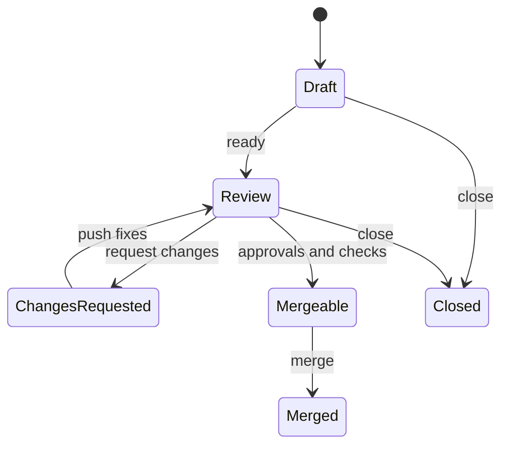

# 05. Pull Request, review와 merge gate

## 1. Pull Request는 무엇인가

PR은 head branch의 변경을 base branch에 통합하자는 제안이다. 단순히 코드를 서버로 보내는 상자가 아니다.

PR은 다음 정보를 하나의 검토 단위로 묶는다.

- base/head branch와 commit
- merge base 이후의 diff
- commit 목록
- 대화, inline comment, review 상태
- CI check와 status
- label, assignee, milestone
- merge 방법과 결과 commit

## 2. PR의 생명주기



실제 mergeability에는 conflict, conversation resolution, required review, CODEOWNERS, status check, deployment, merge queue, ruleset 등 repository 정책이 함께 작용한다.

## 3. 좋은 PR의 크기와 설명

좋은 PR은 reviewer가 다음을 독립적으로 판단할 수 있다.

1. 왜 필요한가?
2. 어떤 범위를 바꾸는가?
3. 사용자·운영·호환성 영향은 무엇인가?
4. 어떤 증거로 정상임을 확인했는가?
5. 문제가 생기면 어떻게 되돌리는가?

권장 본문:

```markdown
## 문제

## 변경

## 영향과 비변경 범위

## 검증

## 배포·롤백

## 리뷰 포인트
```

diff가 작아도 설계 영향이 크면 깊은 review가 필요하다. 반대로 generated file 수천 줄이 바뀌어도 source change는 작을 수 있다. line 수만으로 난이도를 판단하지 않는다.

## 4. Draft PR을 쓰는 경우

- 방향을 조기에 공유하고 싶다.
- CI를 먼저 연결하고 싶다.
- dependency PR이 아직 merge되지 않았다.
- 큰 작업을 stacked PR로 분해 중이다.

Draft는 품질이 낮아도 된다는 뜻이 아니다. “아직 merge 대상으로 간주하지 말라”는 상태 신호다. 무엇이 미완성인지 checklist로 명시한다.

## 5. Review의 세 층

### 5.1 설계와 요구사항

- 문제를 올바르게 풀었는가?
- 변경 경계와 책임이 적절한가?
- backward compatibility, migration, rollback이 가능한가?

### 5.2 구현 정확성

- edge case, error handling, concurrency, security 문제가 없는가?
- test가 실패 모드까지 검증하는가?
- 관측 가능성과 운영 control이 있는가?

### 5.3 유지보수성

- 이름과 abstraction이 의도를 드러내는가?
- 문서와 runbook이 갱신되었는가?
- 미래 변경 비용이 불필요하게 커지지 않았는가?

formatter가 잡을 문제에 reviewer 시간을 쓰지 않도록 style·lint는 CI로 자동화한다.

## 6. Comment와 review 상태

- comment: 질문이나 의견
- approve: 현재 diff를 승인
- request changes: merge 전에 해결해야 할 문제 제기
- conversation resolve: 해당 thread가 처리되었다는 상태

새 commit push 후 기존 approval을 무효화하도록 ruleset을 설정할 수 있다. 중요한 repository에서는 승인 이후 코드가 바뀌었는데 approval이 그대로 남는 문제를 막아야 한다.

## 7. Checks와 required checks

workflow가 성공했다는 것과 merge가 허용된다는 것은 별개다.

- check run: 특정 SHA에 대해 job/test 결과를 보고
- required status check: repository rule이 특정 check 성공을 merge 조건으로 강제
- optional check: 실패해도 policy상 merge 가능할 수 있음

check 이름을 workflow/job rename으로 바꾸면 branch rule이 기다리거나 예상치 못한 check를 요구할 수 있다. required check는 stable contract로 관리한다.

## 8. 세 가지 merge 방법

| 방법 | base에 남는 형태 | 장점 | 주의점 |
|---|---|---|---|
| Merge commit | 원 commit + merge commit | topology와 commit 보존 | history가 복잡해질 수 있음 |
| Squash merge | PR당 새 commit 하나 | revert와 history 탐색이 단순 | 개별 commit ID가 base에 그대로 남지 않음 |
| Rebase merge | commit들을 새 SHA로 선형 추가 | linear history와 commit 단위 보존 | commit 수가 많으면 base history가 산만 |

정책 예:

- 작은 feature/fix: squash merge
- 의미 있는 단계 commit이 있는 migration: rebase merge
- release branch 통합이나 topology가 중요한 작업: merge commit

## 9. Merge queue

PR A와 B가 각각 최신 main 기준으로 CI를 통과해도 둘을 연달아 합친 결과가 안전하다는 보장은 없다. merge queue는 base 최신 상태와 queue 내 선행 변경을 포함한 merge group을 만들어 required check를 다시 평가한다.

merge queue를 사용하면 Actions workflow가 `merge_group` event에도 반응하도록 구성해야 한다. 그렇지 않으면 required check가 보고되지 않아 queue가 진행되지 않을 수 있다.

## 10. PR을 merge하기 전 최종 질문

- base branch가 맞는가?
- scope 밖의 파일이 포함되지 않았는가?
- unresolved conversation이 없는가?
- required check가 현재 head SHA를 검사했는가?
- approval 후 중요한 코드 변경이 있었는가?
- migration 순서와 rollback이 준비되었는가?
- merge 방법이 repository history 정책에 맞는가?
- merge 후 자동 deployment가 시작되는가?

## 11. PR merge 후

```bash
git switch main
git fetch origin
git merge --ff-only origin/main
git branch -d feature/my-change
git fetch --prune origin
```

remote branch 자동 삭제를 켤 수 있지만 local branch는 별도다. 삭제 전에 merge 결과와 필요 commit이 base에 반영되었는지 확인한다.

PR은 merge로 끝나지만 delivery는 끝나지 않을 수 있다. release note, deployment, metric 확인, cleanup issue까지 이어지는지를 확인한다.
