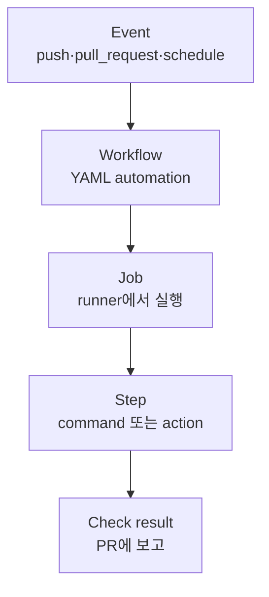

# 09. GitHub Actions와 Continuous Integration

## 1. CI가 해결하는 문제

개발자 laptop에서 test가 성공해도 다음은 다를 수 있다.

- dependency와 tool version
- clean checkout 여부
- OS와 architecture
- 환경 변수와 권한
- 다른 변경과 합친 결과

CI는 특정 commit SHA를 알려진 환경에서 자동 build/test하여 통합 전에 feedback을 준다. CI가 성공했다는 뜻은 **workflow에 정의된 검사가 그 실행 환경과 입력에서 성공했다**는 뜻이다. production 전체가 안전하다는 무제한 보증은 아니다.

## 2. Actions의 계층



- workflow: `.github/workflows/*.yml` 또는 `.yaml`
- event: workflow를 시작하는 trigger
- job: 하나의 runner에서 실행되는 step 묶음
- step: shell command 또는 reusable action 호출
- action: 재사용 가능한 자동화 unit
- runner: job을 실제 실행하는 machine/VM/container
- run: workflow의 한 실행 instance
- check suite/run: GitHub가 commit과 실행 결과를 연결하는 상태

## 3. 최소 workflow

이 저장소의 실제 예제는 [`.github/workflows/docs-ci.yml`](../../.github/workflows/docs-ci.yml)이다.

```yaml
name: docs-ci

on:
  pull_request:
  push:
    branches: [main]

permissions:
  contents: read

jobs:
  validate:
    runs-on: ubuntu-latest
    steps:
      - uses: actions/checkout@v7
      - uses: actions/setup-node@v7
        with:
          node-version: 24
          package-manager-cache: false
      - run: node tools/validate_markdown.mjs .
```

핵심:

- trigger 범위를 명시한다.
- `GITHUB_TOKEN` permission을 read-only로 제한한다.
- tool version을 고정한다.
- repository가 이미 제공하는 validator를 single source of truth로 호출한다.

## 4. Event 선택

| event | 일반 용도 | 주의점 |
|---|---|---|
| `pull_request` | PR code test | fork secret 제한, untrusted code로 취급 |
| `push` | main 통합 후 test/build | branch/tag filter 필요 |
| `merge_group` | merge queue 검증 | required check workflow에 포함 |
| `workflow_dispatch` | 수동 승인 입력 | 권한과 input 검증 |
| `workflow_call` | reusable workflow | caller와 permission/secret 계약 |
| `schedule` | 정기 scan/report | default branch의 workflow 사용 |
| `release` | release 자동화 | tag와 artifact 검증 필요 |

`pull_request_target`은 base branch context에서 실행되어 secret과 write permission을 가질 수 있다. PR의 신뢰하지 않은 code를 checkout하여 실행하면 위험하다. label/comment 같은 metadata 작업에 제한하고, untrusted head code 실행과 privileged token을 같은 job에 두지 않는다.

## 5. Job dependency와 output

```yaml
jobs:
  test:
    runs-on: ubuntu-latest
    steps:
      - run: ./scripts/test.sh

  package:
    needs: test
    runs-on: ubuntu-latest
    steps:
      - run: ./scripts/package.sh
```

job은 기본적으로 병렬 실행된다. `needs`가 있으면 dependency graph를 만든다. step 간에는 같은 runner filesystem이 유지되지만 job 간 filesystem은 자동 공유되지 않는다. 작은 값은 job output, 파일은 artifact를 사용한다.

## 6. Matrix

```yaml
strategy:
  fail-fast: false
  matrix:
    python: ["3.12", "3.13"]
    mode: ["default", "strict"]
```

지원 version과 configuration 조합을 병렬 검증한다. 조합 수가 곱으로 증가하므로 모든 PR에는 핵심 matrix, nightly에는 전체 matrix를 두는 식으로 비용을 통제한다.

## 7. Cache와 artifact의 차이

- cache: dependency 다운로드 등 다음 run의 속도를 높이는 최적화. 없어도 build가 정확해야 한다.
- artifact: 특정 run이 만든 test report, binary, rendered manifest 같은 결과물. job 간 전달과 보존·감사에 사용한다.

cache hit를 신뢰 경계로 사용하지 않는다. key에 lockfile hash와 toolchain을 포함하고, 민감 data를 cache하지 않는다.

## 8. Concurrency

같은 PR의 오래된 commit CI를 취소해 runner를 절약할 수 있다.

```yaml
concurrency:
  group: ci-${{ github.workflow }}-${{ github.ref }}
  cancel-in-progress: true
```

deployment는 환경별 concurrency로 동시 변경을 막되, 무조건 이전 deployment를 취소하는 것이 안전한지는 배포 시스템의 transactional 특성에 따라 판단한다.

## 9. Permission과 secret

```yaml
permissions:
  contents: read
```

필요한 job에만 더 좁게 부여한다.

```yaml
jobs:
  publish:
    permissions:
      contents: read
      id-token: write
```

- `GITHUB_TOKEN`은 run마다 제공되는 token이며 permission을 최소화한다.
- repository/organization/environment secret은 scope와 승인 규칙을 분리한다.
- secret을 command line, artifact, debug log에 출력하지 않는다.
- 장기 cloud key보다 OIDC federation으로 short-lived credential을 발급한다.
- `id-token: write`는 그 자체로 cloud write 권한이 아니라 OIDC token 요청 권한이다. 실제 권한은 cloud trust policy와 role이 결정한다.

## 10. Action dependency 보안

`uses: owner/action@ref`도 실행 코드 dependency다.

- 신뢰 가능한 publisher와 source를 검토한다.
- high-assurance workflow는 full commit SHA pinning을 고려한다.
- tag update는 Renovate/Dependabot 같은 검토 가능한 PR로 관리한다.
- workflow 파일과 action update를 CODEOWNERS 대상으로 둔다.
- reusable workflow도 caller에게 permission과 secret surface를 명시한다.

GitHub-owned action이라고 해도 runner compatibility와 major version breaking change를 release note에서 확인한다.

## 11. Self-hosted runner

장점:

- 폐쇄망 dependency와 내부 registry 접근
- GPU, 특수 architecture, 대형 resource 사용
- 사내 toolchain과 network policy 적용

위험:

- untrusted PR code가 내부 network와 persistent filesystem에 접근할 수 있음
- runner credential이나 이전 job residue 탈취
- toolchain drift와 patch 책임
- 장기 실행 runner의 격리 실패

권장:

- public fork PR을 민감한 self-hosted runner에서 실행하지 않는다.
- ephemeral runner를 선호한다.
- runner group으로 허용 repository/workflow를 제한한다.
- job마다 clean image와 least privilege identity를 사용한다.
- build runner와 production deploy runner를 분리한다.
- outbound network와 metadata service 접근을 제한한다.

## 12. 실패한 Actions run 읽기

다음 순서로 좁힌다.

1. event와 대상 SHA가 맞는가?
2. workflow가 trigger/filter 때문에 시작되지 않았는가?
3. 어느 job이 실패·skip·cancel되었는가?
4. 실패 job의 첫 번째 실패 step은 무엇인가?
5. command exit code와 stderr는 무엇인가?
6. runner image/tool version이 바뀌었는가?
7. permission, secret, environment approval 문제인가?
8. flaky인지 동일 SHA 재현 가능한지 확인했는가?

마지막 error line만 보지 않는다. 앞선 setup 실패 때문에 후속 command가 연쇄 실패할 수 있다.

## 13. Helm/Kubernetes CI 계약 예

```text
YAML syntax
  -> helm lint
  -> values schema validation
  -> helm template (대표 values matrix)
  -> manifest policy/schema validation
  -> golden diff 또는 snapshot
  -> ephemeral cluster smoke test
```

[학습용 Helm CI 예제](examples/ci-helm.yaml)는 active workflow가 아니며 조직 runner/toolchain에 맞게 복사·수정한다.

> 이 장의 본질: CI는 “초록 체크를 만드는 도구”가 아니라, **어떤 SHA를 어떤 환경과 계약으로 통합해도 되는지 반복 가능하게 판정하는 시스템**이다.
