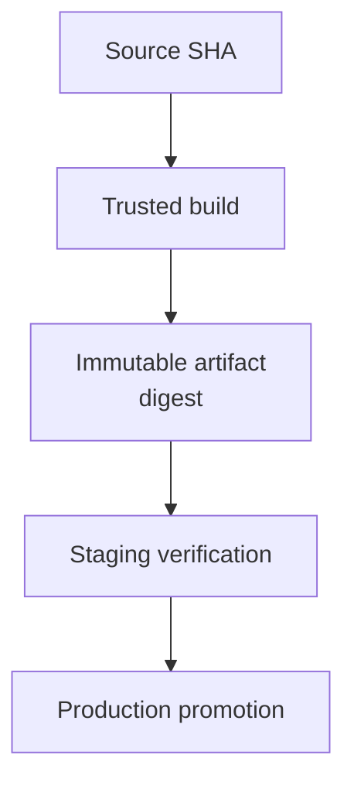

# 10. Delivery, release와 공급망 보안

## 1. CI와 CD의 경계

- Continuous Integration: 변경을 자주 통합하고 자동 검증한다.
- Continuous Delivery: 검증된 변경이 release 가능한 상태까지 자동 전달된다. production 반영은 사람 승인을 둘 수 있다.
- Continuous Deployment: 검증을 통과한 변경을 production까지 자동 반영한다.

조직이 “CD를 한다”고 말할 때 delivery인지 deployment인지 명확히 해야 권한과 rollback 책임이 정해진다.

## 2. Source, tag, release, artifact, deployment

| 대상 | 의미 |
|---|---|
| Commit SHA | source snapshot과 parent history 식별 |
| Git tag | 특정 Git object에 붙인 ref |
| GitHub Release | tag에 note와 asset을 연결한 GitHub 객체 |
| Build artifact | source로 만든 binary/package/image/chart |
| Artifact digest | artifact content의 불변 식별자 |
| Deployment | 특정 artifact를 특정 환경에 반영한 사건 |

“main 최신 버전을 배포했다”보다 “commit X에서 CI run Y가 만든 image digest Z를 production에 배포했다”가 재현 가능하다.

## 3. Build once, promote many

환경마다 source를 다시 build하면 dependency, time, network 결과가 달라질 수 있다. 한 번 만든 artifact를 동일 digest로 dev → staging → production에 승격한다.



configuration 차이는 별도 versioned config와 deployment metadata로 관리한다. artifact 자체를 환경마다 수정하지 않는다.

## 4. Tag와 version

```bash
git tag -a v1.4.0 -m "Release v1.4.0"
git push origin v1.4.0
```

Semantic Versioning을 사용한다면 일반 의미는 다음과 같다.

- MAJOR: 호환되지 않는 변경
- MINOR: backward-compatible 기능
- PATCH: backward-compatible fix

하지만 model config, Helm chart, application, API가 같은 version 축을 공유해야 하는지는 별도 설계다. 독립 lifecycle이면 독립 version이 더 명확할 수 있다.

보호해야 할 release tag는 tag ruleset과 immutable release 정책을 검토한다. tag를 재지정하면 같은 version 이름이 다른 source를 가리키는 심각한 provenance 문제가 생긴다.

## 5. GitHub Environment

environment는 deployment job에 다음 통제를 연결할 수 있다.

- required reviewer
- wait timer
- branch/tag 제한
- environment-specific secret와 variable
- deployment history

PR test job에 production secret을 주지 않고, merge 후 검증된 artifact를 배포하는 별도 job이 environment approval을 통과하게 한다.

## 6. OIDC와 짧은 수명의 credential

장기 cloud access key를 repository secret에 넣으면 유출 시 폐기 전까지 악용될 수 있다. OIDC federation은 workflow identity claim을 검증한 cloud/provider가 짧은 수명의 credential을 발급하게 한다.

trust policy에서 최소한 다음을 제한한다.

- repository/organization
- branch 또는 tag
- environment
- reusable workflow identity
- audience

workflow의 `id-token: write`만 보고 안전하다고 판단하지 않는다. provider 쪽 subject 조건과 실제 role permission이 핵심이다.

폐쇄망에서는 GitHub OIDC를 직접 쓸 수 없을 수 있다. 같은 원칙으로 내부 CI identity → Vault/Kubernetes workload identity → short-lived token 구조를 설계한다.

## 7. 공급망의 네 연결

1. 누가 source를 변경했는가: review, signature, branch rule
2. 어떤 source를 build했는가: commit SHA와 clean checkout
3. 어떤 dependency/tool을 사용했는가: lockfile, SBOM, pinned action/toolchain
4. 어떤 artifact가 배포되었는가: digest, provenance/attestation, deployment record

한 연결이라도 끊기면 source review가 완료되어도 다른 binary가 production에 갈 수 있다.

## 8. SBOM, provenance와 attestation

- SBOM: artifact에 포함된 component/dependency 목록
- provenance: 누가, 어디서, 어떤 source와 build process로 artifact를 만들었는지에 대한 metadata
- attestation: provenance나 다른 statement를 검증 가능한 방식으로 artifact와 연결

이들은 취약점이 없음을 보장하지 않는다. “무엇이 들어갔고 어떻게 만들어졌는지”를 검증 가능하게 하여 대응과 policy enforcement를 돕는다.

## 9. Release workflow의 신뢰 경계

release workflow는 보통 write permission과 registry credential을 가진다.

- fork PR event에서 실행하지 않는다.
- release tag 작성 권한을 제한한다.
- build와 publish를 job/runner 권한으로 분리한다.
- publish job은 검증된 artifact digest만 받는다.
- third-party action을 최소화하고 pinning한다.
- environment approval과 concurrency를 둔다.
- release note와 changelog 생성 source를 검토한다.

## 10. Rollback과 roll-forward

### Rollback

이전 known-good artifact digest로 배포를 되돌린다. database/schema가 backward-compatible하지 않으면 application만 되돌려도 복구되지 않을 수 있다.

### Roll-forward

새 fix artifact를 빠르게 build·검증·배포한다. data migration이 이미 진행되었거나 rollback 위험이 더 큰 경우 선택한다.

Git revert는 source history를 취소하는 작업이고 deployment rollback은 환경의 artifact를 바꾸는 작업이다. 둘은 연관되지만 동일하지 않다.

## 11. Release 전 체크리스트

[Release checklist 예제](examples/release-checklist.md)를 함께 사용한다.

- [ ] release source SHA와 tag가 승인된 main commit인가?
- [ ] required CI가 그 SHA 또는 merge group을 검사했는가?
- [ ] artifact digest와 SBOM/provenance가 생성되었는가?
- [ ] migration 순서와 backward compatibility를 검토했는가?
- [ ] staging에서 같은 digest를 검증했는가?
- [ ] production environment approval과 concurrency가 있는가?
- [ ] rollback target과 관측 지표가 정해졌는가?
- [ ] release note에 breaking change와 운영 조치가 있는가?

## 12. GitOps와의 연결

GitOps에서는 desired state 변경을 Git commit/PR로 review하고 controller가 cluster 실제 상태를 reconcile한다. Git이 곧 cluster는 아니다.

- Git commit: desired state 변경의 source
- CI: manifest render/schema/policy 검증
- artifact registry: image/chart의 immutable content
- GitOps controller: desired와 actual state reconcile
- cluster audit/observability: 실제 적용 결과

secret plaintext, mutable tag, environment-specific 수동 patch가 끼면 Git history만으로 실제 상태를 재현하기 어려워진다.

> 이 장의 본질: delivery의 목표는 “main을 배포하는 것”이 아니라, **검토된 source에서 만들어진 동일 artifact가 승인된 경로를 거쳐 특정 환경에 도달했음을 증명하는 것**이다.
