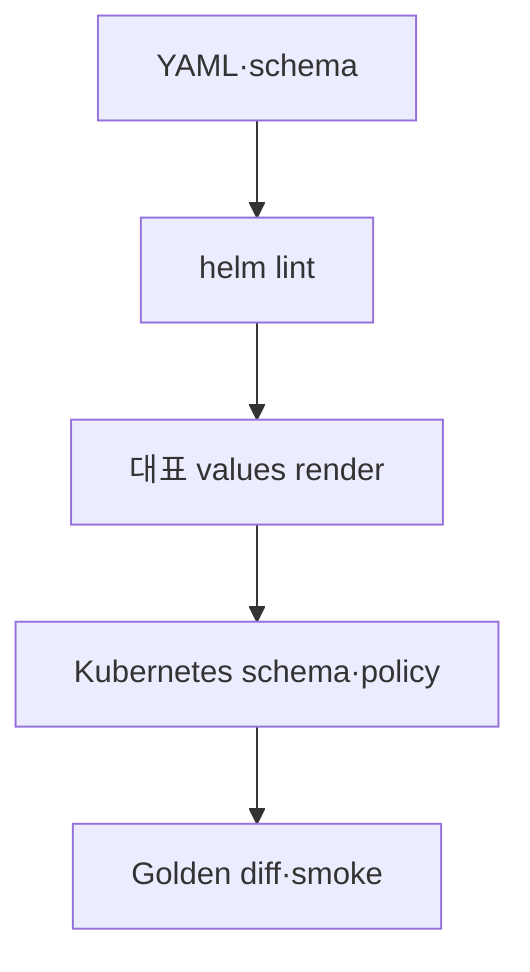

# 11. Platform Engineering 저장소 실전 playbook

## 1. 왜 platform repository는 더 엄격해야 하는가

application code의 bug는 한 service에 머물 수 있지만 platform repository의 작은 변경은 여러 workload, cluster, credential, routing 경로에 동시에 영향을 줄 수 있다.

대표적인 고위험 파일:

- `.github/workflows/*`
- Helm templates와 default values
- CRD, RBAC, NetworkPolicy
- admission/policy rule
- Terraform/OpenTofu module
- image build와 registry 설정
- deployment controller와 autoscaling policy

따라서 line 수가 작아도 blast radius 기준으로 review와 CI를 강화한다.

## 2. Helm chart 변경 workflow

예시 변경: Service selector를 label 기반으로 동적 제어한다.

### Commit/PR 분해

1. values/schema에 새 contract 추가
2. template 구현과 unit/golden test
3. migration·rollback 문서
4. 운영 적용 values는 별도 environment repository PR

한 PR에서 chart source와 모든 production instance 값을 동시에 바꾸면 library 변경과 rollout 위험을 분리해서 review하기 어렵다.

### CI 계약



검증 포인트:

- 기본 values에서도 render 가능한가?
- 기존 values가 backward-compatible한가?
- condition 조합마다 resource가 누락·중복되지 않는가?
- selector/label이 실제 pod와 일치하는가?
- immutable field 변경으로 in-place upgrade가 실패하지 않는가?
- generated manifest가 예상 범위만 바뀌는가?

## 3. Upstream custom repository

upstream release를 기반으로 회사 patch를 유지할 때 권장 graph:

```text
upstream tags: v1.0 ---- v1.1 ---- v1.2
company main:       \ C1 -- C2 ---- U1 -- C3
```

- `U1`: upstream v1.1 통합 commit 또는 명확한 rebase 경계
- `C1/C2/C3`: 회사 patch를 기능별로 분리

upgrade PR에는 다음을 포함한다.

- old/new upstream tag와 commit
- upstream changelog 중 영향 항목
- company patch별 적용 결과: 유지, upstream 대체, 수정, 폐기
- conflict resolution 근거
- chart/API/schema diff
- representative deployment render와 smoke result

모든 company patch를 하나의 거대한 commit으로 squash하면 다음 upstream update에서 patch별 의도를 추적하기 어렵다. 반면 일상 feature PR은 squash merge가 더 단순할 수 있다. repository 목적에 따라 history policy를 다르게 둔다.

## 4. Generated manifest 관리

generated output을 commit할지 결정 기준:

### Commit하는 경우

- offline review/배포에서 rendered 결과가 source of delivery인 경우
- diff 자체가 승인 대상인 경우
- controller가 generated directory를 직접 소비하는 경우

필수 조건:

- generator와 version 고정
- 재생성 command 문서화
- CI에서 재생성 후 `git diff --exit-code`
- source와 output을 같은 PR에 포함

### Commit하지 않는 경우

- CI/CD가 deterministic하게 항상 생성
- artifact로 보존하고 digest/provenance를 남김
- source, values, toolchain으로 재현 가능

## 5. Kubernetes 환경 분리

branch를 환경으로 직접 대응시키는 구조보다 다음 패턴이 추적하기 쉽다.

```text
apps/<app>/base
environments/dev
environments/staging
environments/prod
```

- source branch는 변경 통합에 사용
- environment directory는 desired state 차이를 표현
- promotion PR은 artifact digest와 config diff를 보여줌
- controller deployment record로 실제 반영 확인

mutable image tag `latest`보다 immutable digest를 쓴다.

## 6. 대형 변경의 stacked PR 예

P/D serving 구조를 추가한다고 가정한다.

| Stack | 변경 | 독립 검증 |
|---|---|---|
| PR A | 공통 values/schema와 helper refactor | 기존 chart render 동일 |
| PR B | prefill/decode workload template | template·schema test |
| PR C | router/service 연결 | endpoint contract·smoke |
| PR D | metrics, alert, runbook | query/test·문서 link |

각 PR이 아래 PR에 의존하지만 reviewer는 계층별로 집중할 수 있다. A가 squash merge되면 B를 `--onto` 또는 stack tool로 main 위에 정리한다.

## 7. 운영 사고 hotfix

### 권장 흐름

1. incident 식별자와 영향 범위를 기록한다.
2. known-good main에서 최소 fix branch를 만든다.
3. 재현 또는 실패를 포착하는 test를 먼저 둔다.
4. review/CI를 생략하지 않고 긴급 SLA로 수행한다.
5. merge 후 artifact와 deployment digest를 기록한다.
6. metric/log로 recovery를 확인한다.
7. 임시 우회는 follow-up issue와 제거 조건을 남긴다.

직접 production branch를 수정한 뒤 나중에 Git에 맞추는 방식은 audit gap과 drift를 만든다. 정말 break-glass가 필요하면 사용 권한, 사유, 만료, 사후 PR을 강제한다.

## 8. Configuration과 secret

- non-secret config는 diff와 review가 가능한 Git에 둔다.
- secret value는 secret manager에 두고 Git에는 reference만 둔다.
- encrypted secret을 Git에 둘 경우 key 관리, rotation, recipient 변경, break-glass 절차를 문서화한다.
- sample file에 실제 endpoint/token을 복사하지 않는다.
- secret scan이 잡았으면 commit 삭제보다 credential revoke/rotation이 먼저다.

## 9. Repository별 required check 예

| Repository | 필수 check |
|---|---|
| Go/Python controller | format, lint, unit, race/type, API compatibility |
| Helm chart | lint, schema, render matrix, kube schema, policy |
| GitOps config | render, policy, forbidden mutable tag, diff summary |
| Docs/study | link, fence, rendering, sensitive term scan |
| Container build | unit, vulnerability policy, SBOM, provenance |

검사가 무엇을 보장하지 않는지도 README에 적는다. 예를 들어 Helm render 성공은 실제 controller와 storage/network dependency의 정상 동작을 보장하지 않는다.

## 10. AI coding agent와 Git

agent가 repository를 수정할 때도 동일한 원칙을 적용한다.

- 시작 시 `status`, branch, remote, instructions 확인
- 기존 uncommitted 변경을 사용자 소유로 취급
- task별 branch와 명시적 file scope
- diff를 사람이 읽을 수 있는 단위로 작성
- formatter/test 결과 기록
- destructive reset/clean/force push 제한
- PR body에 agent가 수행한 검증과 미검증 범위 명시
- workflow나 permission 변경은 별도 보안 review

agent가 빠르게 코드를 생성할수록 branch rule과 CI가 더 중요해진다. 속도가 review와 검증의 대체물은 아니다.

## 11. 완료 정의

platform change가 “코드가 merge됨”에서 끝나지 않도록 Definition of Done을 둔다.

- [ ] source와 generated output 일치
- [ ] compatibility와 migration 검증
- [ ] observability와 alert 준비
- [ ] rollback/roll-forward 절차
- [ ] documentation/runbook 갱신
- [ ] artifact digest와 deployment trace
- [ ] 운영 결과 확인과 임시 flag cleanup 계획
