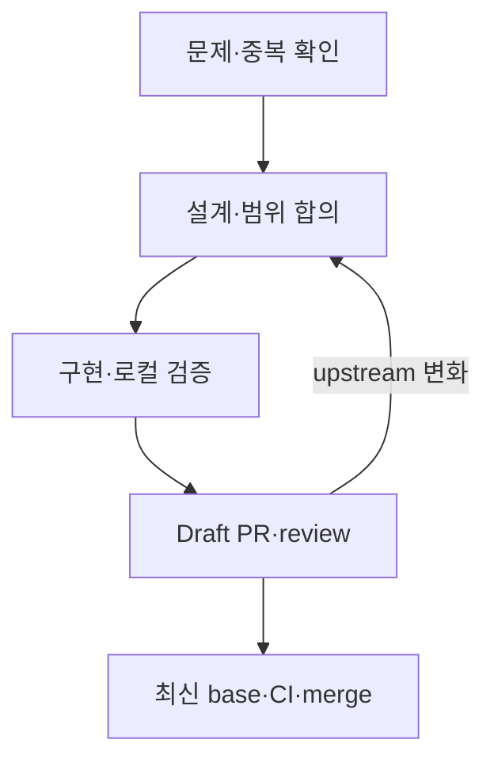
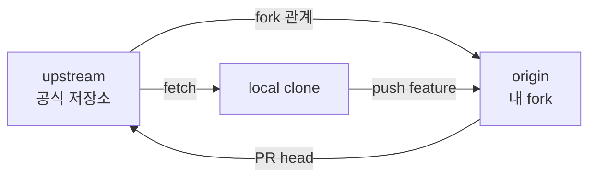

# 13. 초대형 Open Source 프로젝트 기여 생애주기

- 기준일: 2026-08-19
- 적용 대상: vLLM처럼 contributor, hardware backend, test matrix, CI 비용이 큰 프로젝트
- 목표: “fork해서 코드를 고치고 PR을 연다”를 넘어서, maintainer가 합칠 수 있는 **검증 가능한 변경**을 만든다.

## 1. 초대형 프로젝트에서 PR은 무엇인가

작은 저장소에서는 PR을 “내 branch의 diff를 보여 주는 화면”으로 느끼기 쉽다. 초대형 프로젝트에서 PR은 다음 다섯 가지가 묶인 검증 packet에 가깝다.

1. **문제 증거**: 실제 문제가 존재하며 아직 해결되지 않았는가?
2. **설계 근거**: 이 변경이 기존 architecture와 project 방향에 맞는가?
3. **구현**: 필요한 범위만 바꾸고 호환성과 실패 경로를 고려했는가?
4. **검증 증거**: 어떤 환경에서 어떤 command를 실행해 무엇이 통과했는가?
5. **협업 상태**: review 의견, upstream 변화, CI 결과를 현재 head commit에 맞게 관리했는가?

코드가 맞아도 중복 PR, 합의되지 않은 architecture, 불충분한 hardware 검증, 너무 큰 범위, 오래된 base 때문에 merge되지 않을 수 있다. 반대로 diff가 작아도 원인과 회귀 검증이 명확하면 빠르게 검토할 수 있다.



마지막 되돌림 화살표가 중요하다. 긴 PR은 단순히 기다리는 작업이 아니다. 기다리는 동안 전제와 주변 코드가 바뀌므로 설계와 범위를 다시 확인해야 한다.

## 2. 코드를 쓰기 전에 읽을 것

repository root에서 다음 순서로 조사한다. 파일 이름은 프로젝트마다 다르다.

| 우선순위 | 확인 대상 | 답해야 할 질문 |
|---:|---|---|
| 1 | `README`, documentation index | 프로젝트의 범위와 지원 대상은 무엇인가? |
| 2 | `CONTRIBUTING`, developer guide | 개발 환경, test, title, review 규칙은 무엇인가? |
| 3 | `AGENTS.md`와 하위 instruction | AI-assisted 작업과 directory별 추가 규칙은 무엇인가? |
| 4 | `SECURITY.md` | 공개 issue로 올리면 안 되는 취약점은 무엇인가? |
| 5 | `DCO`, CLA, license | commit sign-off나 별도 동의가 필요한가? |
| 6 | PR·issue template | maintainer가 요구하는 증거 형식은 무엇인가? |
| 7 | `CODEOWNERS` | 이 경로를 실제로 검토할 owner는 누구인가? |
| 8 | CI 설정과 최근 PR | 어떤 test가 자동/수동이고 실제 review 흐름은 어떠한가? |

`AGENTS.md`가 여러 directory에 있다면 변경 파일에 가장 가까운 instruction까지 확인한다. 상위 규칙과 하위 규칙이 함께 적용될 수 있다.

### Repository reconnaissance command

```bash
git status -sb
git remote -v
find .. -name AGENTS.md -print
find . -maxdepth 3 \
  \( -iname 'CONTRIBUTING*' -o -iname 'SECURITY*' -o -iname 'CODEOWNERS' \
     -o -iname '*PULL_REQUEST_TEMPLATE*' -o -iname 'DCO' \) -print
```

그다음 변경하려는 symbol과 인접 test를 찾는다.

```bash
rg 'TargetClass|target_function' .
rg 'TargetClass|target_function' tests
git log --oneline --all -- path/to/target.py
git blame -L <start>,<end> path/to/target.py
```

`blame`은 책임자를 찾는 도구가 아니라 해당 줄이 도입된 commit과 당시 의도를 찾는 출발점이다.

## 3. 첫 기여의 크기를 고르는 법

처음부터 core scheduler나 distributed runtime을 크게 바꾸는 것은 학습 효율이 낮다. 코드보다 project-specific invariant와 review network를 모르는 것이 더 큰 위험이기 때문이다.

### 권장 난이도 사다리

| 단계 | 기여 예 | 배우는 것 | 필요한 증거 |
|---:|---|---|---|
| 1 | 재현 가능한 문서 오류, test 보강 | 규칙, CI, review etiquette | 링크·재현·렌더링 또는 test 결과 |
| 2 | 기존 issue의 좁은 bugfix | call path, regression test | base 실패 → branch 성공 |
| 3 | 기존 pattern을 재사용한 model/backend 지원 | registry, compatibility, E2E | reference parity·model eval·hardware matrix |
| 4 | kernel·distributed·core architecture | 성능·정확도·동시성 invariant | RFC, benchmark, correctness, 여러 owner review |

“good first issue” label은 승인권이 아니라 탐색 비용이 비교적 낮다는 신호다. issue가 오래되었다면 현재 main에서도 유효한지 먼저 재현한다.

## 4. 중복 작업을 먼저 제거한다

초대형 프로젝트에서는 같은 문제를 여러 사람이 동시에 볼 가능성이 높다. 구현 전에 최소한 다음을 검색한다.

```bash
gh issue view <issue-number> --repo <upstream-owner>/<repo> --comments
gh pr list --repo <upstream-owner>/<repo> --state open \
  --search '<issue-number> in:body'
gh pr list --repo <upstream-owner>/<repo> --state open \
  --search '<component> <symptom>'
git log --all --oneline --grep='<keyword>'
```

검색 결과가 없었다는 사실도 PR에 짧게 남길 수 있다. 유사 PR이 있다면 새 PR을 여는 대신 다음 중 하나를 선택한다.

- 기존 PR의 재현·test·review를 돕는다.
- 접근법이 본질적으로 다른 이유를 issue에서 먼저 설명한다.
- 기존 author와 scope를 나눈다.
- 이미 main에서 해결되었다면 작업을 중단한다.

코드를 이미 많이 썼다는 이유는 중복 구현을 merge해야 할 이유가 아니다.

## 5. Issue와 RFC를 언제 먼저 여는가

다음 변경은 코드보다 합의가 먼저다.

- public API 또는 configuration contract 변경
- scheduler, cache, distributed protocol, model execution architecture 변경
- 여러 backend에 영향을 주는 abstraction
- 새 dependency나 build system 변화
- 큰 migration, deprecation, 보안 경계 변화
- 프로젝트가 정한 규모 기준을 넘는 변경

RFC에는 완성된 구현 설명보다 결정할 문제를 쓴다.

1. 현재 문제와 실제 use case
2. 성공·비성공 조건
3. 제안하는 contract와 invariant
4. 검토한 대안과 trade-off
5. compatibility와 migration
6. test·benchmark 계획
7. 의도적으로 제외한 범위

vLLM은 현재 kernel, data/config, test를 제외한 주요 architecture 변경이 500 LOC를 넘으면 GitHub issue RFC를 기대한다. 이 숫자를 모든 프로젝트의 보편 규칙으로 일반화하지 말고, 작업 시점의 공식 contributing guide를 다시 확인한다.

## 6. Fork와 remote를 정확히 구성한다

일반적인 외부 contributor 구조는 다음과 같다.



관례:

- `upstream`: 공식 프로젝트 repository, 보통 fetch 전용
- `origin`: 내 fork, feature branch를 push하는 곳
- local `main`: `upstream/main`을 그대로 추적하는 깨끗한 기준 branch
- local feature branch: 실제 commit을 만드는 곳

```bash
git clone https://github.com/<my-account>/<repo>.git
cd <repo>
git remote add upstream https://github.com/<upstream-owner>/<repo>.git
git remote -v

git fetch upstream --prune
git switch main
git merge --ff-only upstream/main
git push origin main

git switch -c fix/<short-topic>
```

local `main`에 직접 commit하지 않는다. 그래야 언제든 feature branch의 base와 upstream 상태를 분리해서 판단할 수 있다.

## 7. 개발 환경은 변경 유형에 맞게 최소화한다

큰 AI/infra repository의 모든 backend를 한 번에 설치하려 하면 시작도 전에 막힌다. 먼저 diff가 닿는 층을 분류한다.

| 변경 층 | 보통 필요한 환경 | 추가 검증 |
|---|---|---|
| 문서 | docs dependency, preview | link·render·example command |
| Python logic | editable install, lint, unit test | integration 또는 reference parity |
| C++/CUDA kernel | compiler, CUDA, incremental build | opcheck·correctness·benchmark·GPU arch |
| Rust/frontend | Rust toolchain, target test | Python/Rust boundary와 packaging |
| model support | model weight, GPU/CPU 조건 | HF/reference parity·distributed·eval |
| CI/build | container/build toolchain | 영향받는 image·platform matrix |

프로젝트가 권장하는 package manager와 interpreter path를 그대로 쓴다. “내 환경에서는 `pip install`이 됐다”보다 lock/requirements와 CI version을 맞추는 편이 재현 가능하다.

## 8. 구현 전에 baseline 증거를 고정한다

bugfix의 가장 강한 test는 변경 전에는 실패하고 변경 후에는 성공하는 test다.

```text
upstream/main + reproducer -> 기대한 방식으로 실패
feature branch + same reproducer -> 성공
feature branch + 인접 기존 test -> 회귀 없음
```

성능 변경은 네 가지를 고정한다.

- hardware와 driver/toolchain
- model, dtype, tensor shape, batch/context 조건
- warm-up, 반복 횟수, 측정 통계
- 동일 base에서 before/after 비교

baseline을 나중에 재구성하려 하지 말고 작업 시작 시 command와 결과를 기록한다. 긴 PR에서는 main이 움직이므로 “어느 SHA의 baseline인가”까지 적는다.

## 9. 작은 설계와 test를 먼저 만든다

구현 전에 한 문단으로 다음을 쓸 수 있어야 한다.

> 입력 조건 X에서 기존 경로 Y가 invariant Z를 깨뜨린다. A 위치에서 B contract를 보존하도록 바꾸며, C 경로는 의도적으로 변경하지 않는다. 회귀 test D와 통합 검증 E로 확인한다.

이 문장을 쓸 수 없다면 아직 call path나 범위가 불명확할 가능성이 높다.

### Test 선택 기준

1. 기존 suite와 fixture를 재사용한다.
2. 구현 세부보다 외부 behavior 또는 중요한 invariant를 검증한다.
3. bugfix test는 수정 전 실패를 확인한다.
4. GPU가 없어서 실행하지 못한 test는 “통과”라고 쓰지 않는다.
5. benchmark를 correctness test로 대신하지 않는다.
6. skipped test 수와 이유를 숨기지 않는다.

## 10. Commit은 review 가능한 논리 단위로 만든다

좋은 commit은 각각 다음 질문에 답한다.

- 왜 존재하는가?
- parent 상태에서 독립적으로 이해 가능한가?
- test와 구현의 관계가 보이는가?
- 되돌렸을 때 의미 있는 단위인가?

```bash
git add -p
git diff --cached --check
git diff --cached
git commit -s -m 'fix: preserve <invariant>'
```

vLLM처럼 DCO를 사용하는 프로젝트에서는 모든 commit에 `Signed-off-by` trailer가 필요하다. `git commit -s`는 “test를 통과했다”는 뜻이 아니라, 해당 프로젝트 DCO 조건에 동의한다는 sign-off를 commit message에 추가한다.

AI를 사용했다면 프로젝트 정책에 따라 사용 사실, 사람의 검토, test 책임을 공개한다. AI가 생성한 코드를 이해하지 못한 상태로 제출하거나, low-value cleanup을 대량 생성하는 것은 contributor와 maintainer 모두의 시간을 소비한다.

## 11. 로컬 검증을 test pyramid로 구성한다

비싼 검증부터 실행하지 않는다.

| 순서 | 검사 | 목적 |
|---:|---|---|
| 1 | diff·format·static check | 즉시 찾을 수 있는 오류 제거 |
| 2 | 변경 파일의 unit/regression test | 원인과 fix를 직접 검증 |
| 3 | component/integration test | 인접 contract 회귀 확인 |
| 4 | model/E2E/evaluation | 실제 user path 정확도 확인 |
| 5 | performance/hardware matrix | 특화 backend와 비기능 요구 검증 |
| 6 | repository CI | 공식 toolchain과 전체 gate 확인 |

PR 본문에는 “tests passed” 대신 실제 command, 환경, 결과, 실행하지 못한 범위를 쓴다.

```text
Base: upstream/main at <sha>
Environment: Python ..., CUDA ..., GPU ...
Command: ...
Result: 241 passed, 3 skipped in ...
Not run: multi-node test; hardware unavailable
```

## 12. Draft PR은 조기 설계 검증 장치다

Draft PR을 너무 이르게 열어 noise를 만들 필요는 없지만, 다음 상태라면 유용하다.

- 문제 재현과 접근법은 확인했다.
- maintainer에게 구조적 feedback이 필요하다.
- 변경이 여러 날 걸리거나 다른 PR에 의존한다.
- 아직 실행하지 못한 검증이 분명하다.

Draft 본문에도 빈 template만 두지 않는다.

1. 문제와 관련 issue/RFC
2. root cause 또는 현재 가설
3. 변경 범위와 non-goal
4. test plan과 현재 결과
5. 남은 작업
6. reviewer가 먼저 볼 설계 질문

## 13. PR을 “리뷰 비용이 낮은 형태”로 만든다

reviewer는 작성자의 머릿속을 볼 수 없다. 다음 구조가 탐색 시간을 줄인다.

### Purpose

- user-visible symptom 또는 engineering problem
- 관련 issue와 중복 검색 결과
- root cause

### Change

- file/component별 핵심 변경
- 유지되는 invariant
- 의도적으로 바꾸지 않는 범위

### Risk

- compatibility, numerical accuracy, performance, concurrency, security
- failure mode와 rollback 가능성

### Test plan and result

- 정확한 command
- base와 branch의 before/after
- hardware/toolchain/model 조건
- pass/fail/skip 수
- 미검증 영역

### Documentation and disclosure

- 문서 변경 여부와 이유
- AI assistance 또는 generated code 사용 사실

큰 log를 본문에 전부 붙이지 말고 핵심 결과와 artifact/link를 제공한다. 그러나 재현에 필요한 command와 조건은 본문에 남긴다.

## 14. Review를 받는 동안의 행동

review comment에는 세 가지 중 하나로 답한다.

1. **수용**: 어떤 commit에서 어떻게 바꿨고 어떤 test를 실행했는지 적는다.
2. **대안 제시**: 동의하지 않는 기술적 이유, invariant, 측정 결과를 설명한다.
3. **질문**: 요구사항이 불명확하면 임의 구현 전에 확인한다.

```text
반영했습니다.
- 변경: empty-local-candidate를 merge identity로 처리
- commit: <sha>
- test: <exact command> -> <result>
```

단순히 “done”이라고 쓰면 reviewer가 diff와 CI를 다시 추적해야 한다. 반대로 모든 comment마다 장문의 방어를 쓰는 것도 비용이다. 결정에 필요한 근거만 남긴다.

## 15. 기다리는 동안 해야 할 일

PR이 지연되면 무조건 매일 rebase하지 않는다. 다음 event가 있을 때 상태를 다시 평가한다.

- 의존하던 PR이 merge 또는 close됨
- 같은 component의 큰 refactor가 main에 들어감
- PR에 conflict 또는 `needs-rebase`가 표시됨
- reviewer가 최신 base 검증을 요청함
- approval/최종 CI 직전

평가 순서:

1. upstream 변화가 내 전제를 대체했는가?
2. 내 diff 중 이미 main에 들어간 부분은 무엇인가?
3. 남은 고유 가치가 여전히 있는가?
4. rebase, scope 축소, split, close 중 무엇이 맞는가?
5. 최신 head에서 어떤 test를 다시 실행해야 하는가?

구체적인 command와 복구 절차는 [장기 PR의 upstream 동기화](15-long-running-pr-upstream-sync.md)에서 다룬다.

## 16. Merge되지 않는 것도 정상적인 결과다

다음 이유로 좋은 시도도 merge되지 않을 수 있다.

- 다른 PR이 먼저 같은 문제를 해결함
- architecture 방향이 바뀜
- 유지 비용이 이득보다 큼
- 필요한 hardware 검증을 확보하지 못함
- issue 자체가 더 이상 재현되지 않음
- 범위를 나누는 편이 더 안전함

이때 sunk cost 때문에 불필요한 코드를 유지하지 않는다. reproducer, benchmark, review에서 확인한 invariant를 issue나 후속 PR에 남기면 기여 가치가 사라지는 것은 아니다.

## 17. 기여 준비 완료 checklist

- [ ] 공식 contribution/security/agent/DCO 규칙을 현재 main에서 읽었다.
- [ ] issue, open PR, recent commit에서 중복을 검색했다.
- [ ] base SHA와 실패 reproducer 또는 성능 baseline을 기록했다.
- [ ] 변경 contract, non-goal, 위험을 한 문단으로 설명할 수 있다.
- [ ] 기존 test suite와 CODEOWNERS를 확인했다.
- [ ] 필요한 RFC 또는 issue 합의를 먼저 받았다.
- [ ] 변경 유형에 맞는 최소 개발 환경을 구성했다.
- [ ] commit마다 sign-off와 project policy를 지켰다.
- [ ] 정확한 command·환경·결과·미검증 영역을 기록했다.
- [ ] PR의 head SHA와 test 결과가 같은 revision을 가리킨다.
- [ ] 기다리는 동안 upstream 변화와 중복 여부를 다시 확인한다.

> 이 장의 본질: 초대형 Open Source 기여는 “코드를 보내는 일”이 아니라, **문제부터 최신 head의 검증 결과까지 maintainer가 독립적으로 확인할 수 있게 만드는 일**이다.
