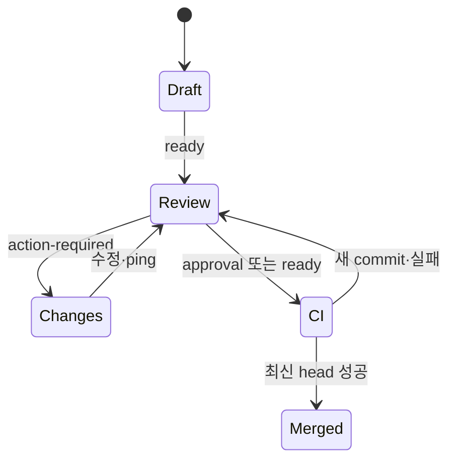

# 14. vLLM 기여 절차와 실제 PR 해부

- 확인일: 2026-08-19 UTC
- 기준 branch: `vllm-project/vllm`의 `main`
- 분석 대상: 공식 contribution 문서·agent 규칙·PR template·Mergify 설정과 실제 PR 공개 timeline

> vLLM은 변화가 매우 빠른 프로젝트다. 이 장은 원리를 설명하는 snapshot이다. 실제 작업 직전에는 반드시 [현재 contribution guide](https://docs.vllm.ai/en/latest/contributing/), [root `AGENTS.md`](https://github.com/vllm-project/vllm/blob/main/AGENTS.md), 변경 경로의 추가 guide, [PR template](https://github.com/vllm-project/vllm/blob/main/.github/PULL_REQUEST_TEMPLATE.md)을 다시 읽는다.

## 1. vLLM 기여가 어려운 이유

vLLM은 Python library 하나가 아니다. 같은 PR이 다음 경계를 건드릴 수 있다.

- Python API와 OpenAI-compatible frontend
- model registry와 Hugging Face compatibility
- scheduler, KV cache, distributed execution
- CUDA/ROCm/XPU/CPU 등 hardware backend
- Triton, C++/CUDA, CuTeDSL 같은 kernel
- Rust frontend와 Python/Rust packaging
- model correctness, numerical parity, serving performance
- 비용이 큰 GPU CI와 여러 architecture matrix

따라서 “unit test가 통과했다”는 사실만으로는 충분하지 않을 수 있다. 변경 층에 따라 model eval, reference parity, multi-GPU, kernel correctness, benchmark, packaging test가 추가된다.

## 2. 공식 규칙의 지도

| Source | 역할 | 기여자가 확인할 핵심 |
|---|---|---|
| [`CONTRIBUTING.md`](https://github.com/vllm-project/vllm/blob/main/CONTRIBUTING.md) | developer guide 진입점 | 최신 문서 위치 |
| [`docs/contributing/README.md`](https://github.com/vllm-project/vllm/blob/main/docs/contributing/README.md) | 일반 기여 contract | 환경, test, DCO, title, review, CI |
| [`AGENTS.md`](https://github.com/vllm-project/vllm/blob/main/AGENTS.md) | AI-assisted contribution contract | 중복 확인, 사람 책임, `uv`, test·eval, attribution |
| [`.github/PULL_REQUEST_TEMPLATE.md`](https://github.com/vllm-project/vllm/blob/main/.github/PULL_REQUEST_TEMPLATE.md) | PR 본문의 최소 형식 | Purpose, Test Plan, Test Result, 문서 |
| [`DCO`](https://github.com/vllm-project/vllm/blob/main/DCO) | contribution sign-off | 모든 commit의 `Signed-off-by` |
| [`.github/CODEOWNERS`](https://github.com/vllm-project/vllm/blob/main/.github/CODEOWNERS) | path ownership | 어떤 owner review가 필요한가 |
| [`.github/mergify.yml`](https://github.com/vllm-project/vllm/blob/main/.github/mergify.yml) | PR 자동화 정책 | label, conflict, `needs-rebase`, auto-update |
| [`SECURITY.md`](https://github.com/vllm-project/vllm/blob/main/SECURITY.md) | 취약점 보고 경로 | 공개 issue/PR로 노출하지 않을 정보 |

규칙은 한 파일에만 있지 않다. 예를 들어 general guide는 Python 3.12와 pre-commit을 권장하고, `AGENTS.md`는 AI-assisted 작업에서 bare `pip`와 system `python3`를 쓰지 말고 `uv`와 `.venv/bin/python`을 사용하도록 더 구체적으로 제한한다.

## 3. 시작할 일을 찾는다

공식 job board는 다음 진입점을 제공한다.

- [good first issues](https://github.com/vllm-project/vllm/issues?q=is%3Aissue%20state%3Aopen%20label%3A%22good%20first%20issue%22)
- [selected onboarding tasks](https://github.com/orgs/vllm-project/projects/6)
- [new-model requests](https://github.com/vllm-project/vllm/issues?q=is%3Aissue%20state%3Aopen%20label%3A%22new-model%22)
- [multimodal model project](https://github.com/orgs/vllm-project/projects/10)

그러나 label만 보고 바로 구현하지 않는다.

```bash
gh issue view <issue-number> --repo vllm-project/vllm --comments
gh pr list --repo vllm-project/vllm --state open \
  --search '<issue-number> in:body'
gh pr list --repo vllm-project/vllm --state open \
  --search '<short area keywords>'
```

현재 `AGENTS.md`는 AI-assisted contribution에 이 중복 확인을 의무화한다. 동일한 open PR이 있으면 새 PR을 만들지 않는다. 접근법이 본질적으로 다르다면 먼저 issue에서 차이를 설명한다.

### 좋은 첫 vLLM 기여의 조건

- 현재 main에서 재현할 수 있다.
- 한 component와 기존 test suite 안에서 범위를 제한할 수 있다.
- 필요한 hardware를 직접 쓰거나 검증 한계를 정직하게 밝힐 수 있다.
- maintainer가 이미 원하는 방향임을 issue 또는 기존 pattern으로 확인할 수 있다.
- model output을 바꾼다면 reference parity나 model eval 계획이 있다.

## 4. Fork와 branch를 만든다

GitHub에서 `vllm-project/vllm`을 fork한 뒤 내 fork를 clone했다고 가정한다.

```bash
git clone https://github.com/<my-account>/vllm.git
cd vllm
git remote add upstream https://github.com/vllm-project/vllm.git
git remote -v

git fetch upstream --prune
git switch main
git merge --ff-only upstream/main
git push origin main

git switch -c fix/<topic>
```

확인해야 할 mapping:

```text
upstream/main = 공식 vLLM의 마지막 fetch 시점 main
origin/main   = 내 fork의 main
HEAD          = 내 feature branch의 현재 commit
```

PR은 보통 `my-account:vllm/fix/<topic>`에서 `vllm-project/vllm:main`으로 연다.

## 5. 개발 환경을 변경 층에 맞춘다

### 공통 Python 환경

현재 vLLM은 Python 3.10–3.13과 호환되지만 기본 Dockerfile과 mypy를 제외한 CI는 Python 3.12를 사용하므로 3.12 개발 환경을 권장한다.

```bash
uv venv --python 3.12
source .venv/bin/activate
uv pip install -r requirements/lint.txt
pre-commit install
```

AI-assisted 작업에서는 project instruction에 따라 bare `python3`, bare `pip` 대신 `uv`와 `.venv/bin/python`을 사용한다.

### Python-only 변경

공식 general guide의 editable install:

```bash
VLLM_USE_PRECOMPILED=1 uv pip install -e .
```

현재 `AGENTS.md`의 AI-assisted workflow는 다음처럼 backend resolution을 명시한다.

```bash
VLLM_USE_PRECOMPILED=1 uv pip install -e . --torch-backend=auto
```

둘 사이에 차이가 생기면 작업 시점의 더 구체적인 instruction과 변경 hardware guide를 우선한다.

### Rust frontend만 다시 build

```bash
./build_rust.sh          # release build
./build_rust.sh --debug  # development용 빠른 build
```

### Python과 CUDA/C++ 변경

현재 general guide의 CUDA 예시는 먼저 PyTorch를 설치하고 build dependency에서 중복 torch를 제외한다.

```bash
uv pip install torch torchvision torchaudio \
  --extra-index-url https://download.pytorch.org/whl/cu129
grep -v '^torch==' requirements/build/cuda.txt | uv pip install -r -
uv pip install -e . --no-build-isolation
```

CUDA version과 hardware별 설치 경로는 자주 바뀔 수 있으므로 그대로 복사하기 전에 현재 source-build 문서를 확인한다.

kernel을 반복 수정한다면 [incremental compilation workflow](https://docs.vllm.ai/en/latest/contributing/incremental_build/)의 CMake preset, Ninja, ccache 구성을 사용한다. 매번 전체 wheel을 다시 만드는 것보다 영향받은 target만 build한다.

### 문서 변경

```bash
uv pip install -r requirements/docs.txt
API_AUTONAV_EXCLUDE=vllm mkdocs serve
```

API reference를 제외하면 공식 guide 기준 preview 시작 시간을 크게 줄일 수 있다. 최종 검증에서는 필요 시 전체 문서 build도 확인한다.

## 6. Test를 변경 유형에 연결한다

`AGENTS.md`의 핵심은 “test를 많이 만든다”가 아니라 **가장 싼 층에서 의도한 behavior를 잡는다**는 것이다.

| 변경 | 최소 검증 | 추가로 기대되는 증거 |
|---|---|---|
| bugfix | 기존 suite의 regression test | unmodified base에서 실패, branch에서 성공 |
| model | model test·registry test | HF/reference parity, model eval, TP/PP 또는 feature 조합 |
| output/accuracy | targeted correctness test | `tests/evals/` 또는 `vllm bench` 결과 |
| kernel | existing kernel pytest | op schema·meta-function·`torch.library.opcheck`, benchmark |
| performance | correctness test | 고정 hardware/shape의 before-after와 출력 동등성 |
| frontend | API/entrypoint test | compatibility, streaming/error path |
| build/Rust | package·Cargo test | wheel/Docker/platform별 version과 artifact behavior |
| docs | MkDocs preview/build | command와 example의 실행 가능성 |

test dependency와 exact command는 변경 당시 guide를 따른다. AI-assisted workflow 예:

```bash
uv pip install -r requirements/test/cuda.in
.venv/bin/python -m pytest tests/path/to/test_file.py -v
pre-commit run
```

전체 `pytest tests/`는 비용이 매우 크고 CPU에서는 모든 unit test가 통과하지 않을 수 있다. 먼저 targeted test와 인접 suite를 실행하고, 전체 matrix는 공식 CI와 hardware owner에게 연결한다.

## 7. Kernel 변경의 별도 contract

custom op을 추가하거나 바꿀 때 일반 Python test만으로는 부족하다.

- PyTorch custom op schema와 구현을 등록한다.
- Tensor를 반환하면 dynamic dimension을 다룰 meta-function을 Python에 등록한다.
- 등록과 meta-function을 `torch.library.opcheck()`로 검증한다.
- C++ signature를 바꾸면 schema도 함께 바꾼다.
- correctness test는 기존 `tests/kernels` pattern을 재사용한다.
- 일회성 performance benchmark를 `tests/`에 섞지 않고 kernel benchmark 위치를 따른다.
- performance 결과에는 GPU architecture, dtype, shape, warm-up, 반복 조건을 쓴다.

JIT kernel이면 [JIT kernel warmup guide](https://docs.vllm.ai/en/latest/contributing/jit_kernel_warmup/)도 확인한다. runtime path만 고치고 warmup specialization을 누락하면 첫 request 지연이나 compile-key 불일치가 생길 수 있다.

## 8. Commit과 DCO, AI disclosure

모든 commit은 DCO sign-off가 필요하다.

```bash
git add -p
git diff --cached
git commit -s -m '[Bugfix] preserve <invariant>'
```

이미 만든 local commit에 sign-off가 없다면, 아직 공유되지 않은 개인 branch라는 전제에서 interactive rebase로 각 commit message를 수정한다. 다른 사람이 쓰는 branch를 일방적으로 다시 쓰지 않는다.

AI가 non-trivial하게 코드를 생성·수정했다면 현재 정책은 다음을 요구한다.

- 사람이 모든 변경 줄을 검토하고 end-to-end 동작을 책임진다.
- pure-agent PR과 단발성 low-value busywork를 제출하지 않는다.
- PR 본문에 AI 사용을 명시한다.
- commit trailer로 attribution을 남긴다.
- duplicate check, 정확한 test command/result, 필요한 model evaluation을 포함한다.

예:

```text
[Bugfix] preserve image embedding scale

Co-authored-by: Agent Name
Signed-off-by: Contributor Name <contributor@example.com>
```

`Co-authored-by`의 정확한 identity와 project policy는 실제 사용한 도구와 조직 규칙에 맞춘다.

## 9. PR title 분류

현재 공식 guide가 요구하는 prefix:

| Prefix | 대상 |
|---|---|
| `[Bugfix]` | 버그 수정 |
| `[CI/Build]` | build 또는 CI 개선 |
| `[Doc]` | 문서 수정·개선 |
| `[Model]` | 새 model 또는 기존 model 개선; model 이름을 title에 포함 |
| `[Frontend]` | API server, `LLM` class 등 frontend |
| `[Kernel]` | CUDA 등 compute kernel |
| `[Core]` | engine, scheduler 등 core logic |
| `[Hardware][Vendor]` | vendor-specific 변경, 예: `[Hardware][AMD]` |
| `[Misc]` | 위에 맞지 않을 때만 제한적으로 사용 |

여러 범주에 걸치면 관련 prefix를 함께 쓴다. 실제 repository에는 역사적 title이나 더 세부적인 tag도 보이지만, 새 기여는 현재 guide를 따른다.

## 10. PR template의 최소값과 실무 권장값

현재 공식 template의 필수 골격은 단순하다.

```markdown
## Purpose

## Test Plan

## Test Result
```

checklist는 issue/purpose, test command, before-after 또는 E2E 결과, 필요한 문서 변경을 묻는다. template의 빈칸만 채우는 수준보다 아래 packet이 review에 유리하다.

```markdown
## Purpose

Fixes #12345.

Symptom:
Root cause:
Why this is not duplicate work:

## Change

- Changed:
- Preserved invariant:
- Non-goals:

## Test Plan

- Regression test that fails on base:
- Adjacent suite:
- Model/kernel evaluation:

## Test Result

Base SHA:
Environment:
Command and result:
Not run and why:

## Documentation

## AI assistance
```

## 11. Review와 CI 상태 기계



현재 공식 process:

- reviewer는 expertise와 availability에 따라 배정된다.
- 배정 후 2–3일마다 status update를 목표로 한다.
- 7일 동안 review가 없으면 reviewer 또는 team에 예의 있게 ping할 수 있다.
- contributor 변경이 필요하면 `action-required` label이 붙을 수 있다.
- comment를 반영한 뒤 무엇을 바꾸고 무엇을 검증했는지 적고 re-review를 요청한다.

### 비용이 큰 CI는 자동으로 전부 실행되지 않는다

vLLM은 계산 자원 때문에 모든 upstream CI를 모든 push에 자동 실행하지 않는다.

- PR이 아직 준비되기 전 CI signal이 필요하면 write access가 있는 reviewer 또는 configured trusted contributor가 `/ci run` 또는 `/amd-ci run`을 사용할 수 있다.
- approval을 받았거나 `ready` label이 있으면 author도 `/ci run`, `/ci retry`, `/ci cancel`과 AMD variant를 사용할 수 있다.
- 새 commit을 push해도 upstream CI가 자동으로 다시 시작되지 않는다.

따라서 CI 결과는 반드시 **어느 head SHA를 검사했는지** 확인한다. 오래된 초록 check는 최신 commit을 보증하지 않는다.

```text
local targeted tests
    -> review/approval or ready
    -> /ci run
    -> failure triage
    -> fix push
    -> local revalidation
    -> /ci run or /ci retry according to current head
```

`/ci retry`는 원인 분석 없이 flaky job을 계속 누르는 명령이 아니다. 동일 SHA에서의 failure인지, 새 head에 아직 build가 없는지, code failure인지 infra failure인지 먼저 확인한다.

## 12. 자동 label, conflict와 auto-update

현재 [Mergify 설정](https://github.com/vllm-project/vllm/blob/main/.github/mergify.yml)은 file path와 title에 따라 documentation, CI/build, frontend, Rust, model, hardware/vendor, performance, quantization, model family 등의 label을 자동으로 붙인다. 이것은 분류와 reviewer routing을 돕는다.

장기 PR에 직접 관련된 규칙:

- conflict가 생기면 `needs-rebase` label을 추가하고 author에게 rebase를 요청한다.
- conflict가 해결되면 `needs-rebase`를 제거한다.
- base가 `main`이고 `ready`, 최소 1 approval, check failure 없음, draft/conflict 아님, main보다 50 commit 이상 뒤처졌다는 조건을 모두 만족하면 auto-update를 수행하도록 설정되어 있다.

이 자동화에 의존해서 semantic compatibility가 해결되는 것은 아니다. bot은 graph를 update할 수 있지만, upstream의 contract 변화가 내 구현 전제를 깨뜨렸는지는 사람이 판단하고 test해야 한다.

## 13. Open PR 수와 review escalation

현재 write access가 없는 contributor의 open PR cap은 6이다. 여러 미완료 PR을 쌓기보다 review와 CI까지 끝낼 수 있는 수만 유지한다.

중요한 production/research 기여가 지연될 때 공식 guide는 verifiable company/university email로 `pr-review-request@vllm.ai`에 다음을 포함해 expedited review를 요청할 수 있다고 안내한다.

- production 또는 research use case
- 실제로 만난 문제
- contribution이 문제를 해결하는 방식

모든 PR에 사용하는 일반 독촉 경로가 아니다.

## 14. 실제 병합 PR 표본

아래는 2026-08-19에 공개 metadata, body, changed files, review/CI timeline을 확인한 표본이다. 통계적 전체 표본이 아니라 변경 유형별로 PR 설명과 검증 방식의 차이를 보기 위해 선택했다.

| PR | 열린 기간 | 최종 규모 | PR이 제공한 핵심 증거 |
|---|---:|---:|---|
| [#52692 PaliGemma scaling bugfix](https://github.com/vllm-project/vllm/pull/52692) | 약 11시간 22분 | 2 commits, 1 file, `+0/-2` | issue/root cause, base에서 실패하는 regression, branch 성공, changes-requested 뒤 설명과 승인 |
| [#51875 deterministic prefix-cache seed](https://github.com/vllm-project/vllm/pull/51875) | 약 7일 | 4 commits, 10 files, `+204/-77` | 역사적 이유와 새 security reasoning, P2P compatibility, docs, 241+89 tests |
| [#52217 sparse MLA mask load](https://github.com/vllm-project/vllm/pull/52217) | 약 5일 | 3 commits, 3 files, `+46/-11` | B200·shape·dtype 조건, 32-bit/128-bit 성능 표, 출력 일치, kernel test |
| [#52706 GraniteSWA/GraniteMoeSWA](https://github.com/vllm-project/vllm/pull/52706) | 약 20시간 | 7 commits, 7 files, `+186/-207` | 기존 PR을 supersede한 이유, 기존 model 재사용, HF parity, feature 조합, GSM8K |
| [#52593 Rust version propagation](https://github.com/vllm-project/vllm/pull/52593) | 약 22시간 | 6 commits, 24 files, `+135/-39` | output/build-path matrix, packaging invariant, Cargo 552 tests, Docker/build 검증 |
| [#46514 FlashMLA sparse DCP](https://github.com/vllm-project/vllm/pull/46514) | 약 56일 13시간 | 10 commits, 3 files, `+295/-34` | dependency가 main에 들어온 뒤 scope 축소, H200 correctness·performance·soak, 반복 rebase·CI |

숫자는 최종 PR metadata 기준이다. 중간 revision의 file 수와 diff는 더 컸을 수 있다.

## 15. 표본에서 보이는 PR 본문 pattern

### 15.1 작은 bugfix도 before/after가 강하다

[#52692](https://github.com/vllm-project/vllm/pull/52692)는 최종 diff가 두 줄 삭제뿐이지만 본문은 짧지 않다.

- Gemma embedding contract 변화와 PaliGemma의 stale scaling을 연결했다.
- scheduler, tokenizer, kernel 등 바꾸지 않는 범위를 명시했다.
- 같은 regression test가 unmodified baseline에서는 실패함을 확인했다.
- 실행 환경의 한계와 pre-commit 상태를 적었다.
- duplicate search command와 AI assistance를 공개했다.

reviewer가 처음에는 change를 의심해 changes requested를 남겼고, issue의 근거를 다시 확인한 뒤 승인했다. 작은 diff일수록 “너무 당연하다”고 생략하지 말고 causal chain을 명확히 해야 한다.

### 15.2 Core 변경은 과거 설계 이유까지 다시 검증한다

[#51875](https://github.com/vllm-project/vllm/pull/51875)는 `NONE_HASH`의 per-process random seed를 deterministic default로 바꿨다.

- 과거 built-in `hash()` collision 우려 때문에 random seed가 도입된 배경을 찾았다.
- 현재 default SHA-256과 `cache_salt` contract에서는 그 이유가 더 이상 유효하지 않다고 설명했다.
- shared FS, Mooncake, P2P handshake의 영향을 함께 다뤘다.
- implementation만 바꾸지 않고 user-facing docs를 갱신했다.
- model output을 바꾸지 않으므로 model eval이 불필요한 이유도 적었다.

“test하지 않았다”와 “적용 대상이 아니며 그 이유를 증명했다”는 다르다.

### 15.3 Kernel PR은 환경 없는 성능 숫자가 아니다

[#52217](https://github.com/vllm-project/vllm/pull/52217)은 mask word load를 vectorize했다.

- NVIDIA B200, BF16, head 수와 dimension, `num_splits`, mask 조건을 고정했다.
- unmasked baseline, 기존 32-bit mask, 새 128-bit mask의 latency와 overhead를 비교했다.
- arbitrary packed mask의 출력이 정확히 같음을 확인했다.
- 변경 경로와 인접 backend test 결과를 함께 제공했다.

성능 PR의 핵심은 “빨라졌다”가 아니라 같은 correctness contract에서 비교 조건을 재현할 수 있다는 점이다.

### 15.4 Model PR은 registry 한 줄 추가가 아니다

[#52706](https://github.com/vllm-project/vllm/pull/52706)은 별도 구현을 추가하기보다 existing Granite implementation에 SWA variant를 접었다.

- 기존 #48270을 supersede한다고 선언하고 차이를 설명했다.
- sink, sliding window, RoPE/NoPE, shared expert의 mapping을 적었다.
- 새 feature가 기본적으로 off라 기존 checkpoint에 영향이 없음을 명시했다.
- HF parity, precision, TP 조합과 GSM8K 결과를 제공했다.
- Transformers backend가 sink를 조용히 누락하는 known limitation을 경고했다.

model support는 “load된다”가 아니라 output correctness와 feature combination을 확인해야 한다.

### 15.5 Build PR은 surface와 build path를 matrix로 쓴다

[#52593](https://github.com/vllm-project/vllm/pull/52593)은 24개 파일을 바꿨지만 본문에서 두 matrix로 범위를 압축했다.

- `vllm-rs`, `vllm-bench`, HTTP version endpoint별 결과
- wheel, Docker, local script, direct Cargo build별 version source

device-specific Python suffix를 바꾸지 않는다는 invariant도 명시했다. 여러 build surface가 있는 변경은 파일 목록을 나열하기보다 input→output contract 표가 review에 유리하다.

## 16. 57일 장기 PR에서 배우는 것

[#46514](https://github.com/vllm-project/vllm/pull/46514)는 2026-06-23에 열려 2026-08-19에 merge되었다. 이 PR은 “오래 기다릴 때 무엇을 해야 하는가”의 실제 예다.

공개 timeline에서 확인되는 변화:

1. 초기에는 dependency PR #46076 위에 쌓였고 conflict로 rebase 요청을 받았다.
2. sparse-indexer machinery가 #46076과 후속 변경으로 main에 들어왔다.
3. author는 upstream에 이미 들어간 부분을 PR에서 제거하고 backend 쪽 고유 변경만 남겼다.
4. 최종 PR 본문은 현재 diff를 `flashmla_sparse.py`, `flashmla.py`, test file의 세 파일로 다시 설명했다.
5. 이전 revision의 union-indexer 설계와 성능 수치는 접힌 history로 분리하고 현재 diff에는 더 이상 해당하지 않는다고 표시했다.
6. main의 주변 refactor 뒤에 반복 rebase하고 최신 환경에서 test·production soak 근거를 추가했다.
7. approval 뒤 `/ci run`을 실행했지만 pre-commit failure가 발생해 수정했고, 새 head마다 CI를 다시 실행했다.
8. 최종 head에서 merge되었다.

이 과정의 핵심은 “conflict marker를 지웠다”가 아니다.

- upstream이 내 PR 일부를 대신하면 그 commit을 고집하지 않는다.
- current main의 abstraction을 재사용하도록 scope를 줄인다.
- PR 본문과 test 결과를 현재 diff에 맞춰 다시 쓴다.
- 오래된 review thread가 outdated가 되어도 중요한 결정 배경은 보존한다.
- final CI는 최신 head SHA에서 다시 실행한다.

### 장기 PR 본문 갱신 pattern

```markdown
## Current scope

현재 main에 이미 들어간 부분:
이 PR에 남은 고유 변경:
최종 changed files와 이유:

## Validation on current rebase

Base SHA:
Hardware/model/config:
Correctness:
Performance:

<details>
<summary>Superseded design/history</summary>

이전 revision이 왜 더 이상 current diff를 설명하지 않는지

</details>
```

## 17. 좋은 표본을 그대로 복사하면 안 되는 부분

실제 PR의 품질과 형식은 균일하지 않다. 다음은 표본에서 보였다고 무조건 따라 할 규칙이 아니다.

- test command가 `python`으로 적힌 과거/일반 PR이 있어도 현재 AI-assisted instruction은 `.venv/bin/python`을 요구할 수 있다.
- 빈 checklist가 남은 PR이 merge되었다고 template을 비워도 된다는 뜻이 아니다.
- production soak은 강한 추가 증거지만 unit/regression test를 대체하지 않는다.
- 큰 log를 본문에 붙이는 것보다 재현 command와 핵심 결과를 구조화하는 편이 낫다.
- reviewer ping 빈도는 urgency가 아니라 공식 review expectation과 새 정보가 있는지를 기준으로 한다.

실제 PR은 repository culture를 배우는 자료지만, current official guide가 우선이다.

## 18. vLLM PR 제출 전 checklist

- [ ] current `CONTRIBUTING`, `AGENTS.md`, domain guide, security policy를 읽었다.
- [ ] issue와 open PR을 issue number·component keyword로 검색했다.
- [ ] major architecture 변경이면 먼저 RFC를 열었다.
- [ ] Python 3.12·`uv`·`.venv`와 변경 backend에 맞는 환경을 사용했다.
- [ ] 기존 test suite와 fixture를 재사용했다.
- [ ] bugfix는 base failure, performance는 고정 조건의 before/after를 확인했다.
- [ ] model output 변경이면 reference parity와 model eval을 실행했다.
- [ ] kernel이면 schema, meta-function, opcheck, correctness, benchmark를 검토했다.
- [ ] pre-commit을 실행하고 모든 commit에 DCO sign-off를 넣었다.
- [ ] title prefix와 model/vendor name이 current guide에 맞는다.
- [ ] Purpose, Test Plan, Test Result를 실제 command와 수치로 채웠다.
- [ ] 문서 필요 여부와 AI assistance를 명시했다.
- [ ] PR head SHA와 보고한 test/CI revision이 일치한다.
- [ ] CI가 자동으로 재실행되지 않는다는 점을 알고 필요한 시점에만 요청한다.

실전용 한 장 checklist는 [vLLM contribution checklist](examples/vllm-contribution-checklist.md)를 사용한다.

> 이 장의 본질: vLLM PR은 변경 유형마다 **다른 종류의 증거**가 필요하며, 긴 PR에서는 코드뿐 아니라 범위·설명·검증 결과를 current main에 맞춰 계속 재정렬해야 한다.
