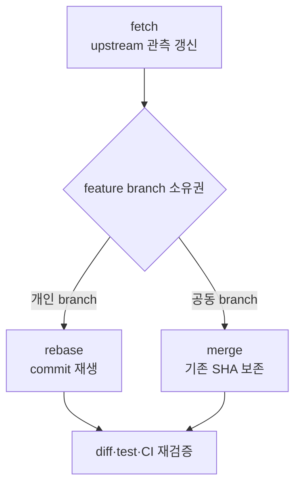

# 15. 장기 PR의 upstream 동기화와 재검증

- 기준일: 2026-08-19
- 핵심 상황: 내 PR이 review를 기다리는 동안 `main`과 의존 PR이 계속 바뀐다.
- 목표: commit 유실 없이 base를 갱신하고, current diff·review·CI를 같은 head SHA에 맞춘다.

## 1. 질문에 대한 가장 짧은 답

`branch-b`를 `main`에서 만들고 PR을 열었는데 다른 PR이 먼저 main에 합쳐졌다면:

```bash
git status -sb
git fetch upstream --prune
git switch branch-b
git branch backup/branch-b-before-rebase
git rebase upstream/main

# conflict 해결과 test 후
git push --force-with-lease origin branch-b
```

단, 이것이 항상 정답은 아니다.

- `branch-b`를 나 혼자 쓰면 rebase가 일반적으로 깔끔하다.
- 여러 사람이 같은 branch에 commit하면 `git merge upstream/main`이 더 안전하다.
- B가 A branch에서 파생되었고 A가 squash merge되었다면 단순 rebase 대신 `rebase --onto`가 필요할 수 있다.
- repository가 최신 base를 요구하지 않고 upstream 변화가 내 경로와 무관하면 즉시 동기화하지 않아도 된다.
- update 뒤에는 최신 head에서 test와 CI를 다시 확인해야 한다.

## 2. “코드베이스 업데이트”의 정확한 뜻

다음 네 작업은 서로 다르다.

| 작업 | 바뀌는 것 | 내 feature commit |
|---|---|---|
| `git fetch upstream` | `upstream/main`이라는 local 관측값 | 건드리지 않음 |
| `git merge upstream/main` | main을 parent로 하는 merge commit | 기존 SHA 보존 |
| `git rebase upstream/main` | feature patch를 새 base 위에 재생 | 새 SHA로 다시 생성 |
| GitHub PR base 변경 | 비교 대상 branch | commit 자체는 건드리지 않을 수 있음 |

`fetch`만 했다고 내 branch가 최신 main 위에 올라간 것은 아니다. 먼저 remote-tracking ref를 갱신한 뒤 merge 또는 rebase로 graph를 통합한다.



## 3. 먼저 상황을 분류한다

동기화 전에 다음 질문에 답한다.

1. PR head branch를 나만 사용하는가?
2. 다른 사람이 마지막 fetch 이후 새 commit을 push했는가?
3. repository는 linear history 또는 최신 base를 요구하는가?
4. upstream 변화가 내가 수정한 file/API/invariant와 겹치는가?
5. B가 A의 commit에 의존하는 stacked PR인가?
6. A는 merge commit, squash, rebase 중 어떤 방식으로 합쳐졌는가?
7. 현재 expensive CI나 active review가 진행 중인가?

이 분류 없이 습관적으로 `pull --rebase`를 실행하면 어떤 remote의 어떤 branch를 기준으로 이력을 썼는지 설명하기 어렵다.

## 4. Remote를 확인한다

외부 contributor의 표준 구조:

```bash
git remote -v
```

기대 형태:

```text
origin    https://github.com/<me>/<repo>.git (fetch/push)
upstream  https://github.com/<project>/<repo>.git (fetch)
```

공식 main은 `upstream/main`, 내 fork의 PR branch는 `origin/branch-b`다. 회사 내부 repository처럼 fork 없이 작업하면 `origin/main`이 공식 main일 수 있다. 이름을 외우지 말고 URL을 확인한다.

## 5. Rewrite 전 안전 점검

### 5.1 Working tree를 깨끗하게 만든다

```bash
git status -sb
git branch --show-current
git diff
git diff --cached
```

미완료 변경이 있으면 다음 중 하나를 선택한다.

- 논리적으로 완성되었다면 commit한다.
- 아직 commit할 수 없다면 별도 worktree나 명시적인 임시 stash를 사용한다.
- unrelated 변경이 섞였다면 먼저 분리한다.

```bash
git stash push -u -m 'wip before upstream sync'
```

stash를 만들었다면 rebase가 끝난 뒤 `git stash list`와 `git stash show -p`로 내용을 확인하고 적용한다. stash를 장기 backup으로 쓰지는 않는다.

### 5.2 양쪽 remote 상태를 갱신한다

```bash
git fetch upstream --prune
git fetch origin --prune
```

`origin`도 fetch해야 누군가 내 fork branch에 push했는지 `--force-with-lease`가 최신 정보로 판정할 수 있다.

### 5.3 현재 graph와 고유 patch를 본다

```bash
git switch branch-b
git log --graph --decorate --oneline --all -40
git merge-base upstream/main HEAD
git log --left-right --cherry-pick --oneline upstream/main...HEAD
git diff --stat upstream/main...HEAD
git diff upstream/main...HEAD
```

세 점 `upstream/main...HEAD` diff는 merge base부터 PR head까지의 변경을 보여 주므로 GitHub PR의 일반적인 file comparison을 이해하는 데 유용하다.

### 5.4 복구 ref를 만든다

```bash
git branch backup/branch-b-before-rebase HEAD
git rev-parse HEAD
git rev-parse origin/branch-b
```

backup branch는 local ref일 뿐 원격에 자동 공개되지 않는다. 민감하지 않은 개인 fork이고 장기 작업의 유실 위험이 크다면 별도 backup remote branch를 만드는 정책을 팀과 정할 수 있다.

## 6. 개인 feature branch를 rebase한다

```bash
git rebase upstream/main
```

rebase는 기존 commit을 물리적으로 옮기지 않는다. 각 commit의 patch를 `upstream/main` 위에 적용해 새 commit을 만든다.

```text
before
upstream/main: M0---M1---M2
                   \
branch-b:           B1---B2

after
upstream/main: M0---M1---M2---M3---M4
                               \
branch-b:                       B1'--B2'
```

`B1'`, `B2'`는 내용이 같아 보여도 parent가 달라져 SHA가 바뀐다.

### Conflict가 없더라도 끝난 것이 아니다

Git은 text를 자동 결합했을 뿐 semantic compatibility를 증명하지 않는다. 예:

- upstream이 함수 parameter 의미를 바꿨지만 이름은 유지함
- default configuration이 바뀜
- tensor shape contract가 달라짐
- test fixture가 새 path를 쓰지만 내 test는 옛 path만 확인함
- kernel dispatch priority가 바뀌어 내 구현이 더 이상 호출되지 않음

따라서 rebase 뒤에는 compile/test뿐 아니라 내 변경 경로가 실제로 선택되는지도 확인한다.

## 7. 공동 feature branch에는 main을 merge한다

여러 contributor가 같은 head branch를 사용하면 rebase는 모두의 commit SHA를 바꾼다. coordination 없이 강제 push하면 다른 사람의 local history와 review link가 깨진다.

```bash
git switch branch-b
git merge upstream/main

# conflict 해결과 test 후
git push origin branch-b
```

장점:

- 기존 feature commit SHA를 보존한다.
- 일반 push로 공유할 수 있다.
- 다른 contributor가 쉽게 fast-forward/pull할 수 있다.

비용:

- sync merge commit이 생긴다.
- repository의 linear-history rule과 맞지 않을 수 있다.
- 반복 merge로 graph가 복잡해질 수 있다.

공동 branch라도 project가 rebase를 강제하면 먼저 freeze 시간을 합의한다. 모든 contributor가 작업을 멈추고, 한 사람이 rebase/push한 뒤 나머지가 새 history로 local branch를 재정렬한다.

## 8. Conflict를 semantic하게 해결한다

### 8.1 상태와 세 version을 본다

```bash
git status
git diff --name-only --diff-filter=U
git ls-files -u
git diff --base -- path/to/file
git diff --ours -- path/to/file
git diff --theirs -- path/to/file
```

rebase에서 `ours`와 `theirs`는 일상 언어의 “내 것/상대 것”과 다르게 느껴질 수 있다. label만 믿지 말고 `git status`, 현재 replay 중인 commit, base version을 함께 확인한다.

### 8.2 결정을 문장으로 만든다

marker를 지우기 전에 다음을 적는다.

```text
upstream이 새로 보장하는 contract:
내 PR이 추가하려는 contract:
둘을 결합한 최종 invariant:
회귀를 잡을 test:
```

그다음 최종 파일을 편집한다.

```bash
rg '^(<<<<<<<|=======|>>>>>>>)' .
git diff --check
git add path/to/resolved-file
git rebase --continue
```

잘못된 방향이면 중단한다.

```bash
git rebase --abort
```

abort 뒤 backup branch와 graph를 다시 보고 merge, `--onto`, clean branch 중 다른 전략을 고른다.

### 8.3 Generated file은 재생성한다

lockfile, generated schema, compiled manifest conflict는 양쪽 text를 수동 조합하지 않는다.

1. source와 generator version의 conflict 해결
2. dependency/tool version 고정
3. 공식 command로 output 재생성
4. deterministic diff 확인
5. 관련 test 실행

## 9. Rebase 전후 patch를 비교한다

backup branch가 있으면 의도하지 않은 patch 유실을 찾을 수 있다.

먼저 old branch와 current upstream의 merge base를 기록한다.

```bash
git merge-base backup/branch-b-before-rebase upstream/main
```

출력 SHA를 `<OLD_BASE>`로 사용한다.

```bash
git range-diff \
  <OLD_BASE>..backup/branch-b-before-rebase \
  upstream/main..branch-b
```

`range-diff`는 commit SHA가 달라진 두 patch series를 비교한다. 다음을 확인한다.

- 모든 B 고유 patch가 대응되는가?
- upstream에 이미 들어가 의도적으로 사라진 patch는 무엇인가?
- conflict 해결 때문에 patch 내용이 달라진 곳은 어디인가?
- commit 순서와 분리가 review 가능한 상태인가?

PR 전체 diff도 다시 본다.

```bash
git diff --stat upstream/main...HEAD
git diff --check upstream/main...HEAD
git diff upstream/main...HEAD
```

## 10. Force push를 안전하게 한다

rebase 후 remote branch와 SHA가 달라졌으므로 일반 push는 non-fast-forward로 거절된다. 먼저 remote를 다시 fetch한다.

```bash
git fetch origin --prune
git log --oneline HEAD..origin/branch-b
```

마지막 command에 내가 모르는 remote-only commit이 보이면 push하지 않는다. author와 내용을 확인해 내 rebase에 포함한다.

문제가 없으면:

```bash
git push --force-with-lease origin HEAD:branch-b
```

`--force-with-lease`는 마지막으로 확인한 remote ref가 예상과 다르면 overwrite를 거부한다. 단순 `--force`보다 안전하지만 다음을 자동 보장하지는 않는다.

- shared branch rewrite에 모두 동의했는가?
- 내 마지막 fetch 이전에 알았던 다른 사람 commit을 의도치 않게 버렸는가?
- review와 CI가 새 SHA에 유효한가?
- semantic conflict resolution이 맞는가?

PR은 같은 head branch ref를 보고 있으므로 force push해도 보통 새 PR을 열 필요가 없다. 기존 PR의 head가 새 commit으로 갱신된다.

## 11. GitHub의 “Update branch”를 언제 쓰는가

GitHub PR 화면의 Update branch 기능은 repository 설정과 선택한 방식에 따라 base 변경을 merge하거나 rebase할 수 있다. 장점은 local command 없이 base를 갱신할 수 있다는 점이다.

하지만 다음 상황에서는 local update가 더 관찰 가능하다.

- conflict를 semantic하게 해결해야 함
- update 전 backup과 `range-diff`가 필요함
- expensive local test를 먼저 실행해야 함
- stacked PR의 commit 경계를 정리해야 함
- upstream이 내 구현 일부를 대체해 scope를 줄여야 함

button을 누르기 전에 resulting history 방식, approval dismissal, CI 재실행 정책을 확인한다. vLLM처럼 bot이 특정 조건에서 auto-update하는 repository도 있지만 사람의 correctness 판단을 대체하지 않는다.

## 12. B가 A branch에서 파생된 stacked PR인 경우

### 12.1 처음 graph

```text
main:      C0
branch A:  C0---A1---A2
branch B:             \---B1---B2
```

B PR이 A의 변경을 필요로 한다면 처음에는 B PR의 base를 `branch-a`로 설정해 B1/B2만 review하게 할 수 있다. A가 merge된 뒤 B를 main 기준으로 다시 정리한다.

### 12.2 A가 merge commit 또는 commit 보존 방식으로 합쳐짐

A1/A2가 main ancestry에 그대로 남으면 일반적으로 다음으로 B 고유 commit만 새 main 위에 재생할 수 있다.

```bash
git fetch upstream --prune
git switch branch-b
git branch backup/branch-b-before-a-integration
git rebase upstream/main
```

PR base도 `main`으로 바꾸고 Files changed에서 A diff가 사라졌는지 확인한다.

### 12.3 A가 squash merge됨

squash merge는 A1/A2의 combined diff를 새 commit `S`로 만든다.

```text
upstream/main: C0---S
                \
old B:           A1---A2---B1---B2
```

main에는 A1/A2가 ancestor로 존재하지 않는다. 단순 rebase가 patch equivalence로 일부를 skip할 수도 있지만, squash 내용이 조금 다르면 A patch를 다시 적용해 중복/conflict를 만들 수 있다.

의도가 가장 분명한 명령:

```bash
git fetch upstream --prune
git switch branch-b
git branch backup/branch-b-before-onto

# A2 이후의 B1/B2만 upstream/main 위에 재생
git rebase --onto upstream/main A2 branch-b
```

`A2`는 B history에 포함된 A 계층의 마지막 commit이다. 정확한 SHA를 graph에서 확인하고 placeholder를 실제 commit으로 바꾼다.

### 12.4 경계가 불확실하면 clean branch를 만든다

```bash
git switch -c branch-b-clean upstream/main
git cherry-pick B1 B2
```

새 branch에서 test한 뒤 기존 PR head branch를 이 history로 갱신할 수 있다. 먼저 기존 `branch-b`를 backup하고, PR diff에 B 고유 변경만 있는지 확인한다.

### 12.5 A가 merge되기 전에 A 자체가 rebase됨

B가 old A tip에 매달려 있고 A branch가 새 main 위로 rebase되면 old A와 new A의 commit SHA가 다르다. 이때 B 고유 범위를 old A tip 기준으로 잘라 new A tip 위에 올린다.

```bash
git rebase --onto <new-a-tip> <old-a-tip> branch-b
```

경계를 미리 기록하지 않았다면 guess하지 않는다. GitHub PR의 과거 commit, local reflog, backup ref에서 old tip을 찾는다.

## 13. Upstream이 내 PR 일부를 먼저 구현한 경우

장기 PR에서 흔한 네 가지 선택:

| 상태 | 선택 |
|---|---|
| upstream 구현이 완전히 대체 | PR close, 필요한 test/정보를 upstream issue에 남김 |
| 공통 기반만 upstream에 들어감 | 공통 commit 제거, 남은 고유 기능을 current API로 rebase |
| 서로 다른 접근법이 모두 가치 있음 | issue에서 차이와 trade-off 재합의 |
| PR이 여러 독립 문제를 포함 | 이미 해결된 부분 제거, 나머지를 작은 PR로 split |

commit을 제거하는 방법:

- dependency 경계가 명확하면 `rebase --onto`
- 몇 commit만 drop/edit하면 `git rebase -i upstream/main`
- history가 복잡하면 clean branch + 고유 commit cherry-pick
- current architecture와 맞지 않으면 새 design으로 다시 구현

코드뿐 아니라 PR 본문도 갱신한다.

- 더 이상 current diff에 없는 design 설명을 제거하거나 history로 접는다.
- “upstream에 들어간 부분”과 “이 PR의 남은 가치”를 명확히 구분한다.
- changed file·line 수와 test plan을 다시 계산한다.
- current rebase에서 다시 실행한 결과만 현재 결과로 표시한다.

vLLM [#46514](https://github.com/vllm-project/vllm/pull/46514)가 이 pattern을 보여 준다. dependency의 sparse-indexer machinery가 main에 들어간 뒤 PR은 backend-specific 세 파일로 축소되었고, 이전 revision 설명은 superseded history로 분리되었다.

## 14. 동기화 시점은 달력이 아니라 event로 정한다

매일 rebase하면 review diff와 CI를 불필요하게 무효화한다. 반대로 merge 직전까지 방치하면 큰 conflict와 semantic drift가 쌓인다.

| Event | 권장 행동 |
|---|---|
| main에 unrelated docs commit 몇 개 | 보통 대기 |
| 내가 수정한 component의 refactor merge | 영향 분석 후 rebase·test |
| dependency PR merge | 즉시 scope와 stack 경계 재정리 |
| `needs-rebase` 또는 merge conflict | reviewer와 조율해 rebase |
| reviewer가 active line review 중 | 급하지 않으면 review round 종료까지 대기 |
| expensive CI 실행 중 | 새 push가 꼭 필요한지 먼저 판단 |
| re-review 요청 직전 | current base와 diff 갱신 |
| final approval/CI 직전 | repository policy에 맞춰 최신화 |
| main이 수십 commit 앞서 bot auto-update 조건 접근 | semantic 영향 먼저 확인 |

정기적으로는 fetch와 read-only 비교만 해도 된다.

```bash
git fetch upstream --prune
git rev-list --left-right --count upstream/main...HEAD
git diff --name-only HEAD...upstream/main
git diff --name-only upstream/main...HEAD
```

첫 diff는 merge base 이후 upstream 쪽 변경 file, 둘째 diff는 feature 쪽 변경 file을 보여 준다. 두 목록이 겹쳐도 자동으로 conflict라는 뜻은 아니다. 실제 mergeability와 semantic impact를 추가 확인한다.

## 15. Rebase 뒤 review 상태를 확인한다

force push는 review context에도 영향을 준다.

- line comment가 outdated로 바뀔 수 있다.
- repository rule에 따라 approval이 dismiss될 수 있다.
- old commit URL은 남지만 current head에 포함되지 않을 수 있다.
- GitHub가 patch mapping에 성공하면 comment가 새 line에 유지될 수도 있다.
- unresolved thread가 current code와 무관해 보여도 자동으로 해결됐다고 단정할 수 없다.

PR 화면에서 확인:

1. base와 head branch
2. head SHA
3. Commits 목록에 내 고유 commit만 있는지
4. Files changed에 upstream의 이미 merge된 diff가 다시 보이지 않는지
5. outdated/unresolved review thread
6. approval 상태
7. check가 최신 head SHA에서 실행됐는지

PR comment 예:

```text
Rebased onto upstream/main at <base-sha>.

- Dropped: upstream에서 #...로 이미 merge된 공통 변경
- Retained: 이 PR 고유의 backend integration과 regression test
- Conflict resolution: 새 API contract에 맞게 ...로 변경
- Re-run: <commands and results>
- Current head: <head-sha>
```

reviewer에게 force push 사실만 알리는 것보다 무엇이 달라졌는지 알려 주는 편이 낫다.

## 16. CI 결과를 current head에 묶는다

PR check는 branch 이름이 아니라 특정 commit SHA의 결과다.

```bash
git rev-parse HEAD
```

GitHub PR의 head SHA와 CI run의 commit SHA가 같아야 한다. rebase나 conflict fix 후 old SHA의 성공 결과는 새 head를 보증하지 않는다.

### vLLM에서 특히 주의할 점

현재 vLLM은 새 commit이 upstream CI를 자동 시작하지 않는다.

1. pre-commit과 targeted test를 local에서 실행한다.
2. output/model/kernel 영향에 맞는 eval과 benchmark를 다시 실행한다.
3. approval 또는 `ready` 조건을 확인한다.
4. 필요한 권한과 시점에서 `/ci run`을 요청한다.
5. 실패하면 code, test expectation, infra/flaky를 분리한다.
6. fix push 뒤 새 head에서 다시 CI가 필요한지 확인한다.

`/ci retry`가 이전 head의 결과를 재사용한다고 가정하지 않는다. bot response와 build link에 표시된 SHA를 직접 확인한다.

## 17. Rebase가 반복되면 `rerere`를 고려한다

같은 conflict를 여러 번 풀 가능성이 높은 개인 환경에서는 recorded resolution reuse를 활성화할 수 있다.

```bash
git config rerere.enabled true
git config rerere.autoupdate false
```

`rerere`는 과거 conflict shape와 해결 결과를 기억해 재사용을 제안한다. `autoupdate false`이면 자동 stage 전에 결과를 직접 검토하기 쉽다.

주의:

- upstream contract가 달라졌는데 과거 해결을 그대로 재사용하면 semantic bug가 될 수 있다.
- 적용 결과를 항상 diff와 test로 확인한다.
- 동일 text conflict의 반복 비용을 줄일 뿐 설계 판단을 대신하지 않는다.

## 18. 긴 작업을 별도 worktree로 보호한다

현재 branch에 미완료 실험이 많아 sync를 방해한다면 같은 repository object database에 별도 working directory를 만들 수 있다. 같은 branch를 두 worktree에서 동시에 checkout할 수 없으므로 backup 또는 새 inspection branch를 지정한다.

```bash
git branch inspection/branch-b HEAD
git worktree add ../repo-sync-check inspection/branch-b
```

inspection worktree에서 upstream merge/rebase 가능성과 test를 탐색하고, 결론이 나면 본 branch에 명확한 절차로 적용한다. worktree는 copy-paste directory보다 branch/ref 관계가 명시적이다.

## 19. 실패와 복구

### Rebase 도중 판단이 틀림

```bash
git rebase --abort
```

### Rebase는 끝났지만 결과가 틀림

아직 새 history를 push하지 않았다면:

```bash
git reset --hard backup/branch-b-before-rebase
```

`reset --hard`는 working tree 변경을 버리므로 status와 backup ref를 먼저 확인해야 한다. 더 안전하게는 잘못된 branch를 보존하고 backup에서 새 branch를 만든다.

```bash
git branch investigation/bad-rebase HEAD
git switch -c branch-b-retry backup/branch-b-before-rebase
```

### Backup ref가 없음

```bash
git reflog -30
git show <candidate-old-tip>
git branch rescue/branch-b-old <candidate-old-tip>
```

### `--force-with-lease`가 거절됨

강제로 우회하지 않는다.

```bash
git fetch origin --prune
git log --graph --decorate --oneline HEAD origin/branch-b -30
git log --oneline HEAD..origin/branch-b
```

remote-only commit의 author와 의도를 확인한 뒤 rebase/cherry-pick/merge로 보존한다.

### Push 뒤 중요한 commit 유실을 발견

1. 추가 rewrite를 멈춘다.
2. reflog, backup, collaborator clone에서 old tip을 찾는다.
3. rescue branch를 만든다.
4. 관련 contributor에게 알린다.
5. 새 history에 commit을 의도적으로 복원한다.

## 20. 상황별 결정표

| 상황 | 기본 선택 | Push |
|---|---|---|
| 개인 PR, main의 relevant change | `rebase upstream/main` | `--force-with-lease` |
| 공동 PR branch | `merge upstream/main` | 일반 push |
| 최신 base rule만 충족하면 되고 conflict 없음 | project의 Update branch 정책 검토 | UI/automation 결과 확인 |
| B가 A에 의존, A regular merge | B를 `upstream/main`에 rebase | lease push |
| B가 A에 의존, A squash merge | `rebase --onto` 또는 clean branch | lease push |
| dependency 일부가 upstream에 merge | superseded commit drop, scope 축소 | lease push |
| upstream이 전체 변경 대체 | PR close 또는 test/document contribution 전환 | 불필요 |
| active review/CI 중 unrelated main 변화 | 당장 push하지 않고 fetch·분석만 | 없음 |
| conflict 경계·commit 범위 불명확 | abort, backup/reflog, graph 재구성 | 금지 |

## 21. vLLM 장기 PR 운영 routine

### 평소 read-only 점검

```bash
git fetch upstream --prune
git fetch origin --prune
git rev-list --left-right --count upstream/main...HEAD
git log --left-right --cherry-pick --oneline upstream/main...HEAD
```

### Relevant upstream change 또는 re-review 전

```bash
git status -sb
git branch backup/<topic>-before-rebase HEAD
git rebase upstream/main

pre-commit run --all-files
.venv/bin/python -m pytest tests/path/to/target_test.py -v
```

변경 유형에 따라 model eval, kernel test, benchmark, Rust/package test를 추가한다.

### Push 전

```bash
git diff --check upstream/main...HEAD
git diff --stat upstream/main...HEAD
git fetch origin --prune
git log --oneline HEAD..origin/<topic>
git push --force-with-lease origin HEAD:<topic>
```

### Push 후 PR 화면

- current scope와 superseded 부분을 본문에 갱신
- rebase base SHA와 head SHA 기록
- outdated review thread와 approval 확인
- local test/eval 결과 갱신
- approval/`ready`와 권한에 맞춰 최신 head에서 CI 실행
- CI link가 current head SHA를 가리키는지 확인

## 22. 최종 checklist

- [ ] `origin`과 `upstream` URL을 확인했다.
- [ ] working tree와 index가 안전한 상태다.
- [ ] origin/upstream을 모두 fetch했다.
- [ ] branch가 개인용인지 공동용인지 확인했다.
- [ ] rewrite 전에 backup ref와 old tip을 기록했다.
- [ ] stacked PR이면 A/B commit 경계와 A의 merge 방식을 확인했다.
- [ ] conflict를 text가 아니라 invariant 기준으로 해결했다.
- [ ] `range-diff`와 PR 전체 diff로 patch 유실·중복을 확인했다.
- [ ] upstream이 대체한 scope를 코드와 PR 본문에서 제거했다.
- [ ] remote-only commit이 없는지 확인했다.
- [ ] rebase push에는 `--force-with-lease`를 사용했다.
- [ ] review thread, approval, base/head, changed files를 다시 확인했다.
- [ ] current head SHA에서 필요한 test와 CI를 다시 실행했다.
- [ ] 문제가 생기면 abort, backup branch, reflog로 복구할 수 있다.

> 이 장의 본질: 장기 PR 동기화는 “main을 한 번 당겨오는 일”이 아니라, **upstream이 바꾼 전제 위에서 내 고유 patch를 다시 정의하고 그 새 head를 재검증하는 일**이다.
