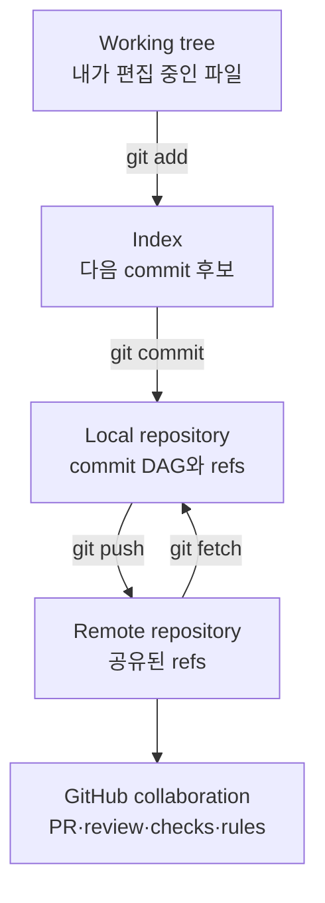

# Git & GitHub: 현업 협업과 자동화 학습 지도

- 작성일: 2026-08-19
- 분류: `study/git-github`
- 범위: Git 내부 모델, 로컬 작업, 브랜치와 통합, 원격 협업, Pull Request, 리뷰, 충돌, stacked PR, 복구, GitHub Actions, CI/CD, 저장소 통제, 릴리스와 공급망 보안

## 1. 이 학습 모듈의 목표

이 자료는 Git 명령어를 외우기 위한 치트시트가 아니다. 다음 세 층을 하나의 구조로 연결하는 것이 목표다.

1. **Git이 무엇을 저장하는가**: blob, tree, commit, tag, ref, `HEAD`, index와 commit DAG
2. **사람들이 어떻게 안전하게 합치는가**: branch, remote, Pull Request, review, merge/rebase, conflict, repository rule
3. **합쳐도 되는지를 어떻게 자동 판정하는가**: GitHub Actions, CI, required check, environment, release, provenance

Git을 현업 수준으로 쓴다는 것은 명령어를 많이 아는 것이 아니다. 다음 질문에 근거를 가지고 답할 수 있는 상태에 가깝다.

- 내 working tree, index, `HEAD`, `origin/main`은 각각 어떤 상태인가?
- `fetch`, `pull`, `merge`, `rebase`가 어떤 commit graph를 만드는가?
- 이 명령이 기존 commit을 보존하는가, 새 commit으로 복제하는가, ref만 옮기는가?
- 팀원이 이미 사용 중인 이력을 다시 써도 되는가?
- PR 화면의 변경 파일, check, approval, mergeability는 무엇을 기준으로 계산되는가?
- 실패했을 때 `restore`, `reset`, `revert`, `reflog` 중 무엇을 선택해야 하는가?
- CI가 통과했다는 것이 정확히 무엇을 보장하며, 무엇은 보장하지 않는가?
- production 배포 권한과 장기 secret을 workflow에 어떻게 노출하지 않을 것인가?

## 2. 가장 먼저 잡아야 할 전체 그림

여기서 Git과 GitHub를 분리해야 한다.

- **Git**은 분산 버전 관리 시스템이다. 파일 snapshot과 commit 관계를 로컬에서도 완전하게 관리한다.
- **GitHub**는 Git repository를 호스팅하고 PR, review, issue, Actions, ruleset, release 같은 협업·통제 기능을 제공한다.
- branch와 commit은 Git 개념이지만, Pull Request와 required review는 GitHub 개념이다.
- CI는 자동 검증 방식이고, GitHub Actions는 CI를 구현할 수 있는 자동화 플랫폼이다. 둘은 동의어가 아니다.

## 3. 권장 학습 순서

| 단계 | 문서 | 읽은 뒤 답할 수 있어야 하는 질문 |
|---:|---|---|
| 0 | [Git·GitHub 전체 구조](00-big-picture-and-mental-model.md) | Git, GitHub, working tree, repository, PR, CI는 어떻게 연결되는가? |
| 1 | [Git object와 commit DAG](01-git-object-model-and-dag.md) | commit, branch, `HEAD`의 정체는 무엇인가? |
| 2 | [로컬 작업과 index](02-local-workflow-and-index.md) | 수정·stage·commit 상태를 어떻게 읽고 원하는 조각만 기록하는가? |
| 3 | [Branch, merge, rebase](03-branches-merge-and-rebase.md) | merge와 rebase는 graph를 어떻게 다르게 바꾸는가? |
| 4 | [Remote, fork, 분산 협업](04-remotes-forks-and-collaboration.md) | `origin/main`은 무엇이며 fetch와 pull은 왜 다른가? |
| 5 | [Pull Request, review, merge](05-pull-requests-review-and-merge.md) | PR은 어떤 상태 전이와 품질 gate를 가지는가? |
| 6 | [동기화, 충돌, stacked PR](06-sync-conflicts-and-stacked-prs.md) | 기반 branch가 먼저 합쳐졌을 때 파생 PR을 어떻게 갱신하는가? |
| 7 | [되돌리기, 복구, 디버깅](07-undo-recovery-and-debugging.md) | 공개 이력을 안전하게 취소하고 잃어버린 commit을 어떻게 찾는가? |
| 8 | [팀 workflow와 저장소 통제](08-team-workflow-and-governance.md) | 작은 팀부터 production 저장소까지 어떤 규칙을 강제해야 하는가? |
| 9 | [GitHub Actions와 CI](09-github-actions-and-ci.md) | event, workflow, job, step, runner, check는 어떤 관계인가? |
| 10 | [CD, release, 공급망 보안](10-delivery-release-and-security.md) | build 결과를 어떻게 승인·배포·추적·복구하는가? |
| 11 | [Platform Engineering 실전](11-platform-engineering-playbook.md) | Helm·Kubernetes·upstream fork 저장소에 Git workflow를 어떻게 적용하는가? |
| 12 | [단계별 실습](12-hands-on-labs.md) | graph 생성, 충돌, rebase, 복구, PR/CI를 손으로 재현할 수 있는가? |
| 90 | [명령·사고 대응 runbook](90-command-and-incident-runbook.md) | 현재 상태에서 다음 안전한 명령을 빠르게 선택할 수 있는가? |
| 99 | [용어집과 공식 자료](99-glossary-and-references.md) | 낯선 용어를 정확한 원문 정의로 다시 확인할 수 있는가? |

처음에는 0→7을 순서대로 읽는다. 그다음 8→11로 팀 운영과 자동화를 연결하고, 12의 실습을 수행한다. 실제 사고 중에는 90에서 시작하되 명령을 실행하기 전에 반드시 `git status`, `git branch --show-current`, `git log --graph`로 현재 상태를 확인한다.

## 4. 이 자료의 안전 원칙

1. **상태를 확인한 뒤 변경한다.** `status → diff → log/graph → action` 순서를 기본으로 한다.
2. **공유된 이력은 새 commit으로 취소한다.** 이미 push되어 다른 사람이 사용할 수 있는 commit은 기본적으로 `revert`한다.
3. **개인 feature branch만 제한적으로 다시 쓴다.** rebase 후에는 `--force`가 아니라 `--force-with-lease`를 쓴다.
4. **`reset --hard`, `clean -fd`, 강제 push는 대상과 복구점을 확인하기 전에는 실행하지 않는다.**
5. **PR은 코드 전달 상자가 아니라 검증 가능한 변경 단위다.** 문제, 변경, 영향, 검증, rollback을 설명한다.
6. **CI 결과는 정의된 검사만 보장한다.** 테스트하지 않은 동작까지 안전하다고 해석하지 않는다.
7. **workflow는 실행 가능한 공급망 코드다.** 최소 권한, 고정된 dependency, 격리된 runner, 짧은 수명의 identity를 사용한다.

## 5. 완주 기준

아래 시나리오를 문서 없이 처리할 수 있으면 기본 실무 역량을 갖춘 것이다.

- 변경 파일 중 일부 hunk만 stage하여 의미 단위 commit을 만든다.
- 최신 `main`에서 feature branch를 만들고 draft PR을 연다.
- PR 도중 `main`이 변경되었을 때 merge 또는 rebase 정책에 맞게 동기화한다.
- A branch에서 파생한 B branch를 A의 squash merge 이후 `--onto`로 정리한다.
- conflict marker의 세 영역과 merge base를 확인하고 결과를 검증한다.
- 잘못 push한 commit을 `revert`하고, 잃어버린 local commit을 `reflog`로 복구한다.
- 실패한 GitHub Actions run에서 workflow → job → step → command 순으로 원인을 좁힌다.
- branch ruleset, CODEOWNERS, required checks가 각각 어떤 실패를 막는지 설명한다.
- tag, GitHub Release, build artifact, deployment record를 서로 구분한다.

> 이 모듈의 본질: Git은 파일을 저장하는 도구라기보다 **변경의 인과관계를 DAG로 기록하는 시스템**이고, GitHub 협업은 그 DAG에 어떤 변경을 연결해도 되는지 사람과 자동화가 함께 판정하는 과정이다.
