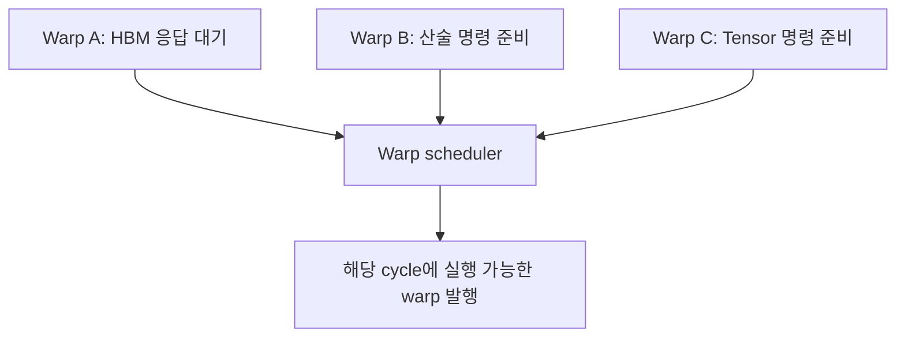
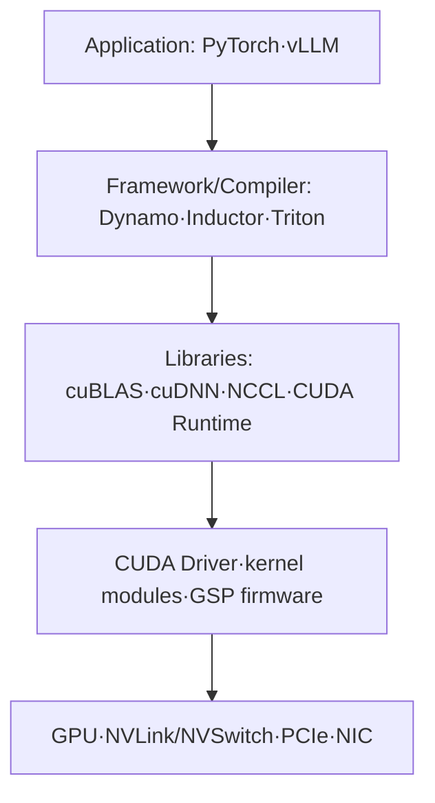

# 00. GPU를 보는 다섯 개의 축

작성일: 2026-08-18  
선행 지식: 없음  
다음 문서: [보드에서 SM까지](01-physical-anatomy-and-hierarchy.md)

## 1. GPU는 무엇을 위해 다르게 생겼는가

CPU와 GPU는 모두 명령을 실행하지만 최적화 목표가 다르다.

| 관점 | CPU | GPU |
|---|---|---|
| 우선 목표 | 한 thread의 낮은 latency와 복잡한 제어 | 많은 작업의 aggregate throughput |
| 실행 자원 | 적은 수의 강한 core | 많은 SM과 다수의 실행 lane |
| 지연 대응 | 큰 cache, branch prediction, out-of-order execution | 실행 가능한 다른 warp로 전환해 latency 은닉 |
| 잘 맞는 일 | 직렬 제어, OS, 복잡한 분기 | 같은 형태의 대량 연산, matrix/tensor, 병렬 simulation |
| 약점 | 대규모 동일 연산의 전력·면적 효율 | 작은 일, 불규칙 분기, 부족한 병렬성, 잦은 host 동기화 |

GPU가 개별 연산의 latency를 없애는 것은 아니다. HBM 접근은 여전히 느리다. 대신 한 warp가 데이터를 기다리는 동안 다른 warp의 명령을 발행해 처리 장치를 놀리지 않는 방식으로 지연을 숨긴다.

## 2. NVIDIA 제품명을 읽는 다섯 층

GPU 관련 대화에서 가장 많은 혼동은 서로 다른 층의 이름을 섞는 데서 시작한다.

| 층 | 뜻 | 예시 |
|---|---|---|
| Architecture | 한 세대의 명령·SM·메모리·인터커넥트 설계 계열 | Ampere, Ada Lovelace, Hopper, Blackwell |
| Silicon / GPU die | 실제 반도체 설계 코드명 | GA100, AD102, GH100 |
| Product / SKU | 판매되는 제품 | A100, L40S, H100, H200, B200 |
| Form factor | 서버에 꽂히는 물리 형태와 전력·배선 | PCIe add-in card, SXM, NVL |
| Platform / System | GPU, CPU, NVSwitch, NIC을 묶은 시스템 | HGX H200, DGX B200, GB200 NVL72 |

### 2.1 H100과 H200 예시

H100과 H200은 모두 Hopper, compute capability 9.0 계열이다. H200은 완전히 새로운 연산 아키텍처라기보다 더 크고 빠른 HBM3e 메모리 서브시스템을 결합한 제품이다. 그래서 같은 kernel 기능을 공유하면서도 큰 모델 수용량, KV cache 용량, memory-bound inference에서 차이가 커질 수 있다.

### 2.2 L40S와 H100 예시

L40S는 H100의 단순한 저가형이 아니다.

- L40S: Ada Lovelace, AD102 계열, GDDR6, PCIe, RT/NVENC/NVDEC 포함, visual computing과 AI를 함께 겨냥
- H100: Hopper, GH100 계열, HBM, SXM/HGX 중심, 대규모 AI/HPC와 고속 scale-up을 겨냥

두 제품 모두 FP8 Tensor Core 연산을 지원할 수 있지만 memory bandwidth, capacity, NVLink, FP64, MIG, media engine과 시스템 구성 철학이 다르다.

### 2.3 B200과 GB200 예시

`B200`은 Blackwell GPU 제품이다. `GB200`은 보통 Grace CPU와 Blackwell GPU를 NVLink-C2C로 결합한 Grace Blackwell Superchip 또는 이를 사용한 platform을 가리킨다. 이름에 G가 붙었다고 단순히 상위 GPU SKU라고 읽으면 안 된다.

## 3. GPU를 분석하는 다섯 질문

어떤 성능 문제든 다음 순서로 분해한다.

### 3.1 데이터는 어디에 있는가

- CPU DRAM
- GPU HBM/GDDR
- L2 cache
- SM의 L1/shared memory
- register
- 다른 GPU의 memory
- NIC 또는 storage 뒤의 원격 데이터

### 3.2 어떤 장치가 계산하는가

- CUDA FP/INT pipeline
- Tensor Core MMA pipeline
- SFU
- copy engine
- NVENC/NVDEC/JPEG/OFA/RT Core 같은 고정 기능 장치

### 3.3 일은 어떻게 쪼개지는가

- application request
- operator
- CUDA kernel
- grid
- block 또는 CTA
- warp
- thread 또는 lane

### 3.4 데이터는 어떤 경로로 움직이는가

- 같은 SM 내부 register/shared memory
- L2↔HBM
- CPU↔GPU PCIe DMA
- GPU↔GPU PCIe P2P 또는 NVLink
- GPU↔NIC GPUDirect RDMA
- node 간 InfiniBand, RoCE, Ethernet socket

### 3.5 다음 명령을 막는 것은 무엇인가

- data dependency
- HBM/cache latency
- branch divergence
- register/shared memory 부족으로 낮아진 residency
- kernel launch gap
- barrier 또는 collective synchronization
- PCIe/NVLink/network 전송
- power/thermal clock 제한

## 4. 하드웨어와 소프트웨어 stack

같은 H100이라도 software stack에 따라 다른 성능과 오류가 발생하는 이유다.

- framework는 어떤 operator와 batching을 만들지 결정한다.
- compiler와 library는 어떤 kernel과 instruction을 사용할지 결정한다.
- CUDA driver는 context, memory, kernel submission을 관리한다.
- kernel module과 IOMMU 설정은 device 접근과 DMA 경로에 관여한다.
- NCCL은 topology를 읽고 collective transport와 algorithm을 선택한다.
- Fabric Manager는 지원되는 NVSwitch system의 fabric을 초기화·관리한다.

## 5. 반드시 분리해서 읽어야 할 성능 단위

### 5.1 Latency

한 작업이 끝날 때까지 걸린 시간이다. 단위는 ns, us, ms, s 등이다.

### 5.2 Throughput

단위 시간에 완료한 일의 양이다. request/s, token/s, FLOP/s, byte/s가 될 수 있다.

### 5.3 Bandwidth

통신·메모리 경로가 단위 시간에 옮기는 데이터 양이다. GB/s, TB/s로 표현한다. latency가 낮다는 뜻과 동일하지 않다.

### 5.4 Capacity

저장하거나 동시에 유지할 수 있는 총량이다. HBM 141 GB, KV cache token capacity 등이 해당한다.

### 5.5 Utilization / Activity

관측 기간에 장치가 얼마나 활동했는지를 비율로 나타낸다. 어떤 분모와 어떤 활동을 정의했는지 확인하지 않으면 해석할 수 없다.

## 6. Peak FLOPS가 답이 아닌 이유

다음 두 GPU를 가정한다.

- GPU A: Tensor compute가 매우 크지만 memory bandwidth가 낮다.
- GPU B: Tensor compute는 작지만 memory bandwidth가 높다.

매 step마다 큰 weight를 다시 읽는 small-batch decode라면 GPU B가 유리할 수 있다. 반대로 같은 weight tile을 많은 token과 batch가 재사용하는 큰 GEMM이라면 GPU A의 Tensor compute가 빛난다.

LLM에서도 단계별 성격이 다르다.

| 단계 | 대표적 특성 | 자주 중요한 자원 |
|---|---|---|
| 긴 prompt prefill | 큰 GEMM과 attention, 높은 병렬성 | Tensor compute, HBM, attention kernel |
| 작은 batch decode | token마다 weight를 읽는 비율이 큼 | HBM bandwidth, kernel launch, batching |
| 긴 context decode | KV read가 증가 | HBM capacity/bandwidth, attention kernel |
| Tensor Parallel | layer마다 collective 발생 | NVLink/NVSwitch/PCIe, NCCL, synchronization |
| Expert Parallel | token routing과 all-to-all | network/NVLink, expert balance, dispatch kernel |

## 7. 자가 점검

1. Hopper와 H200은 같은 종류의 이름인가?
2. HBM 사용량이 95%면 memory bandwidth도 95% 사용 중인가?
3. FP8을 지원하는 GPU에서 BF16 checkpoint를 실행하면 자동으로 FP8 Tensor Core path가 사용되는가?
4. NVSwitch가 있는 서버라면 application이 아무 설정 없이 항상 모든 GPU memory를 하나처럼 사용할 수 있는가?
5. GPU Util 100%만 보고 compute-bound라고 결론 내릴 수 있는가?

### 답

1. 아니다. Hopper는 architecture, H200은 product/SKU다.
2. 아니다. 전자는 capacity allocation, 후자는 traffic activity/throughput 문제다.
3. 아니다. dtype, kernel, quantization/scaling, library와 shape 조건이 맞아야 한다.
4. 아니다. NVLink fabric은 빠른 peer path를 제공하지만 memory allocation과 parallel programming model은 application/framework가 다룬다.
5. 아니다. SM, Tensor, DRAM, timeline, application throughput을 함께 봐야 한다.

## 8. 주요 원문

- NVIDIA, [CUDA Programming Guide](https://docs.nvidia.com/cuda/cuda-programming-guide/)
- NVIDIA, [CUDA Best Practices Guide](https://docs.nvidia.com/cuda/cuda-c-best-practices-guide/)
- NVIDIA, [CUDA GPU Compute Capability](https://developer.nvidia.com/cuda/gpus)
- NVIDIA, [H100 GPU](https://www.nvidia.com/en-us/data-center/h100/)
- NVIDIA, [H200 GPU](https://www.nvidia.com/en-us/data-center/h200/)
- NVIDIA, [L40S GPU](https://www.nvidia.com/en-us/data-center/l40s/)
- NVIDIA, [Blackwell Architecture](https://www.nvidia.com/en-us/data-center/technologies/blackwell-architecture/)

> 본질: GPU 제품명을 이해하려면 먼저 **세대의 설계, 실제 칩, 판매 SKU, 물리 연결, 완성 시스템을 서로 다른 층으로 분리**해야 한다.

