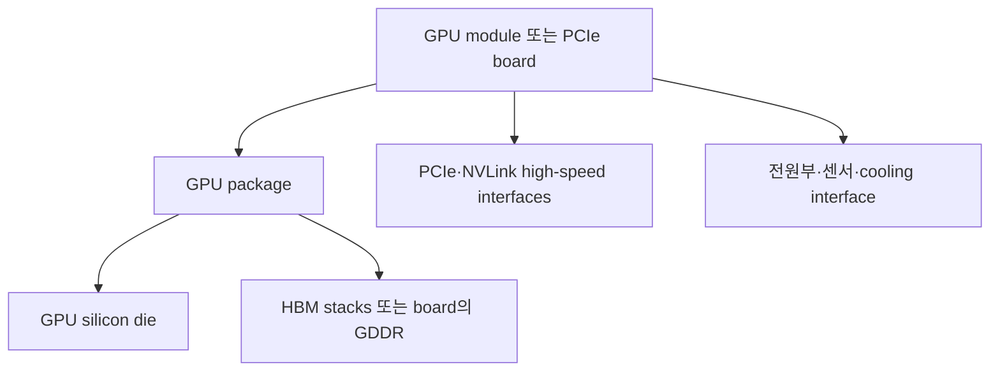
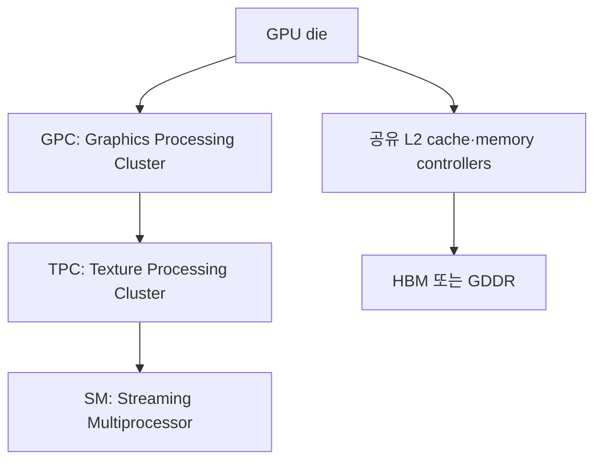
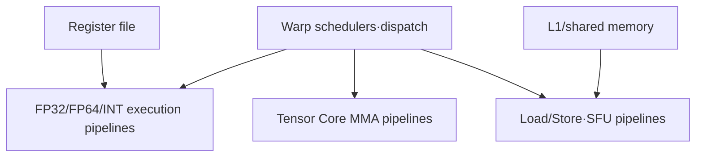
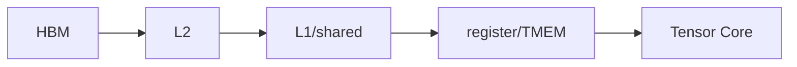

# 01. 보드에서 SM까지: GPU는 실제로 어떻게 생겼는가

작성일: 2026-08-18  
선행 문서: [GPU를 보는 다섯 개의 축](00-mental-model-and-terms.md)  
다음 문서: [CUDA 실행 모델과 SM](02-cuda-execution-model-and-sm.md)

## 1. 서버에서 보이는 GPU는 칩 하나가 아니다

GPU 제품은 여러 부품이 결합된 accelerator다.



대표 구성 요소는 다음과 같다.

| 구성 요소 | 역할 | 자주 생기는 오해 |
|---|---|---|
| GPU die | SM, cache, memory controller, link controller 등 실제 연산·제어 회로 | GPU 전체 제품과 die를 같은 말로 부름 |
| HBM/GDDR | model weight, activation, KV cache 등 device memory | 사용량과 bandwidth activity를 혼동 |
| Package | die와 HBM 등을 고속으로 연결해 실장 | board 전체와 package를 혼동 |
| PCIe interface | CPU, NIC, NVMe, 다른 GPU와 system I/O | PCIe 세대의 합산 양방향 수치를 단방향으로 오해 |
| NVLink | 지원 GPU 사이의 고속 point-to-point link | 모든 PCIe GPU에 당연히 있다고 생각 |
| NVSwitch | 여러 NVLink endpoint 사이를 연결하는 switch fabric | GPU memory를 자동으로 하나의 allocation으로 합친다고 생각 |
| VRM/power delivery | 높은 전력을 안정적으로 공급 | TDP와 항상 실제 소비전력이 같다고 생각 |
| thermal interface | air/liquid cooling system으로 열 전달 | 온도가 임계치 아래면 clock 제한이 없다고 단정 |

## 2. PCIe card와 SXM module

### 2.1 PCIe add-in card

- 표준 PCIe slot에 장착한다.
- CPU와의 주 I/O 경로가 PCIe다.
- passive dual-slot card가 흔하며 OEM chassis airflow가 중요하다.
- 제품에 따라 NVLink bridge가 없거나 제한적으로만 지원된다.
- L40S처럼 graphics/video engine과 display connector를 함께 가진 제품도 있다.

### 2.2 SXM

- NVIDIA의 고밀도 accelerator module form factor다.
- HGX baseboard에 장착되며 높은 power envelope와 많은 high-speed link를 제공한다.
- H100/H200 SXM은 8-GPU HGX에서 NVSwitch를 통해 full-bandwidth scale-up domain을 구성할 수 있다.
- SXM 자체가 NVSwitch는 아니다. module의 NVLink endpoint와 baseboard의 NVSwitch가 함께 topology를 만든다.

### 2.3 이름이 같아도 form factor가 중요하다

H100 SXM, H100 PCIe, H100 NVL은 memory, power, NVLink 구성과 성능 수치가 다르다. 따라서 `H100 몇 장`만으로 시스템 성능을 규정할 수 없다.

## 3. HBM과 GDDR

### 3.1 HBM

High Bandwidth Memory는 여러 DRAM die를 적층하고 매우 넓은 interface로 GPU package 가까이에 연결한다.

- 높은 aggregate bandwidth
- 큰 bus width와 낮은 energy per bit
- package와 cooling 설계가 복잡하고 비쌈
- 데이터센터 AI/HPC SKU에서 주로 사용

### 3.2 GDDR

GDDR은 board 위 개별 memory package를 비교적 좁고 빠른 interface로 연결한다.

- board 설계 유연성과 비용 측면의 장점
- graphics/visual computing SKU에 널리 사용
- HBM 기반 최상위 compute GPU보다 보통 bandwidth와 capacity가 작음

L40S의 48 GB GDDR6 864 GB/s와 H200의 141 GB HBM3e 4.8 TB/s는 단순한 메모리 용량 차이만이 아니다. 매 token step에서 weight와 KV를 읽는 workload에는 이 bandwidth 차이가 직접적인 성능 상한이 될 수 있다.

## 4. GPU die의 상위 계층

NVIDIA GPU의 세부 구성은 세대와 SKU마다 다르지만 compute 중심으로 다음 계층을 사용할 수 있다.



- GPC는 여러 TPC/SM과 상위 scheduling·raster 관련 자원을 묶는다.
- TPC는 일반적으로 복수 SM과 texture 관련 자원을 묶는다.
- SM은 CUDA thread block과 warp가 실제로 실행되는 핵심 compute unit이다.
- L2 cache는 SM들 사이에서 공유되는 on-chip cache다.
- memory controller가 L2와 외부 HBM/GDDR channel을 연결한다.

GPC/TPC 명칭은 graphics 유산도 포함한다. CUDA 개발자에게 직접 scheduling 단위로 가장 중요한 것은 SM, block, warp다.

## 5. SM 안에는 무엇이 있는가

SM은 단순한 CUDA core 묶음이 아니다.



| 자원 | 역할 | 성능상 의미 |
|---|---|---|
| Warp scheduler | 준비된 warp의 다음 instruction을 골라 발행 | eligible warp가 없으면 issue slot이 빈다 |
| CUDA cores / scalar pipelines | FP32, FP64, INT 등 일반 연산 | `CUDA core 수`만으로 전체 성능을 비교할 수 없음 |
| Tensor Cores | 작은 matrix tile의 MMA를 높은 throughput으로 수행 | dtype, layout, shape, library 지원이 필요 |
| Load/Store units | memory instruction과 address path 처리 | coalescing과 cache behavior에 영향 |
| SFU | reciprocal, square root, transcendental 등 특수 함수 | 특정 operator에서 병목 가능 |
| Register file | thread의 가장 가까운 operand 저장소 | 과다 사용하면 resident warp/block 수가 감소 |
| Shared memory | block이 명시적으로 관리하는 on-chip scratchpad | reuse와 tiling에 유리하지만 용량이 제한됨 |
| L1/texture cache | SM 가까운 hardware-managed cache | global/local memory access latency와 traffic 완화 |

Blackwell Ultra 공개 구조에는 SM당 Tensor Memory(TMEM)가 추가로 설명된다. 이는 Tensor Core 중간 결과를 보관하고 재사용하기 위한 warp-synchronous on-chip storage다. 모든 세대의 register/shared memory와 동일한 것으로 보면 안 된다.

## 6. CUDA core는 작은 CPU core가 아니다

마케팅 표의 `CUDA cores 18,176개`를 CPU 18,176 core처럼 해석하면 안 된다.

- CUDA core라는 수치는 특정 scalar execution lane의 수에 가깝다.
- instruction issue, warp scheduling, pipeline 조합, clock, register bandwidth가 함께 성능을 결정한다.
- Tensor Core 연산은 CUDA core 수와 다른 전용 datapath를 사용한다.
- memory-bound kernel은 CUDA core가 늘어도 HBM traffic 상한에 막힌다.
- 세대마다 `한 core`가 속한 SM 구조와 처리 방식이 다르므로 세대 간 core count 단순 비교는 위험하다.

## 7. 메모리 계층

아래 표의 속도는 절대 cycle 수가 아니라 일반적인 상대 관계다. 실제 latency와 bandwidth는 세대, access pattern, contention에 따라 달라진다.

| 계층 | 위치·범위 | 관리 | 용량 | 일반적 특성 |
|---|---|---|---|---|
| Register | SM, thread/warp operand | compiler/hardware | 매우 작음 | 가장 가까움, spill 시 비용 급증 |
| Shared memory | SM, thread block | programmer/kernel | 작음 | 빠른 명시적 reuse, bank conflict 주의 |
| L1/texture | SM | hardware + carveout 설정 | 작음 | 가까운 cache/coalescing buffer |
| L2 | GPU 전체 공유 | hardware + 일부 persistence control | 수십~백여 MB | SM 간 공유, HBM traffic 감소 |
| HBM/GDDR | GPU device memory | runtime/allocator | 수십~수백 GB | 큰 용량·높은 bandwidth, on-chip보다 긴 latency |
| CPU DRAM | host | OS/runtime | 수백 GB~TB | PCIe/NVLink-C2C 전송 필요 |
| 원격 GPU memory | peer GPU | CUDA/NCCL/framework | peer별 | NVLink/PCIe/network 경로에 좌우 |

중요한 예외가 `local memory`다. CUDA 용어에서 local memory는 thread 전용 주소 공간이지만 물리적으로 register 옆의 빠른 SRAM이라는 뜻이 아니다. register spill이나 큰 thread-local array는 device memory에 놓이고 cache를 거치므로 매우 비쌀 수 있다.

## 8. 하나의 연산에서 데이터가 움직이는 흐름

matrix multiplication tile을 단순화하면 다음과 같다.

1. weight와 activation이 HBM에 있다.
2. memory controller와 L2를 거쳐 SM으로 tile이 들어온다.
3. kernel이 shared memory/register로 tile을 배치한다.
4. Tensor Core가 MMA를 반복하며 accumulator를 갱신한다.
5. 결과를 register/shared memory에서 L2/HBM으로 기록한다.



이 흐름에서 성능을 높이는 핵심은 `HBM에서 가져온 byte를 연산 전에 얼마나 많이 재사용하는가`다. tiling, fusion, cache reuse가 arithmetic intensity를 높이는 이유다.

## 9. SM 밖의 전용 엔진

SKU에 따라 다음 장치가 있을 수 있다.

- Copy Engine: compute와 겹쳐 H2D/D2H 또는 peer copy를 수행
- NVENC/NVDEC: video encode/decode
- NVJPEG/JPEG decoder
- Optical Flow Accelerator
- RT Core: ray traversal과 intersection 가속
- GSP: 일부 GPU 관리·초기화 기능을 수행하는 firmware processor

H100 같은 compute 중심 GH100 제품과 L40S 같은 visual-compute 제품은 이 고정 기능 엔진 구성이 다르다. LLM text inference만 비교할 때 사용하지 않는 media/RT 자원을 CUDA core나 Tensor Core와 합산하면 안 된다.

## 10. 구조를 직접 확인하는 최소 명령

```bash
nvidia-smi -L
nvidia-smi --query-gpu=index,name,uuid,memory.total,compute_cap,pci.bus_id --format=csv
nvidia-smi topo -m
nvidia-smi -q -d MEMORY,PCIE,CLOCK,POWER,TEMPERATURE
lspci -nn | grep -i nvidia
```

이 명령으로 보이지 않는 die 내부 unit 수는 제품 whitepaper와 compute capability 문서를 확인한다. `nvidia-smi` 이름만 보고 form factor와 NVLink topology를 추측하지 않는다.

## 11. 자가 점검

1. SXM과 NVSwitch는 같은 것인가?
2. shared memory와 L2는 scope와 관리 방식이 어떻게 다른가?
3. local memory라는 이름만 보고 register처럼 빠르다고 판단해도 되는가?
4. CUDA core가 많으면 memory-bound kernel도 비례해 빨라지는가?
5. HBM capacity와 HBM bandwidth가 LLM에 각각 어떤 영향을 주는가?

## 12. 주요 원문

- NVIDIA, [CUDA Programming Guide — Programming Model](https://docs.nvidia.com/cuda/cuda-programming-guide/01-introduction/programming-model.html)
- NVIDIA, [Hopper Architecture In-Depth](https://developer.nvidia.com/blog/nvidia-hopper-architecture-in-depth/)
- NVIDIA, [Ampere Architecture In-Depth](https://developer.nvidia.com/blog/nvidia-ampere-architecture-in-depth/)
- NVIDIA, [Blackwell Tuning Guide](https://docs.nvidia.com/cuda/blackwell-tuning-guide/)
- NVIDIA, [Inside NVIDIA Blackwell Ultra](https://developer.nvidia.com/blog/inside-nvidia-blackwell-ultra-the-chip-powering-the-ai-factory-era/)
- NVIDIA, [L40S Specifications](https://www.nvidia.com/en-us/data-center/l40s/)

> 본질: GPU 성능은 `코어 개수`에서 나오지 않고, **SM의 실행 파이프가 가까운 메모리에서 충분한 operand를 지속적으로 공급받을 때** 나온다.
