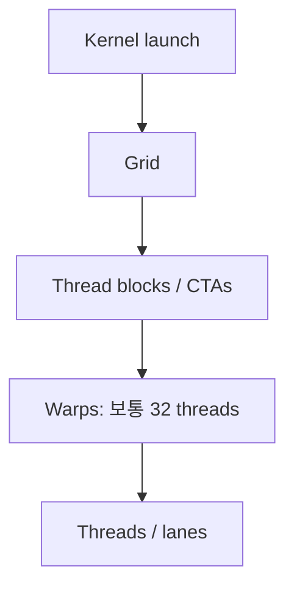
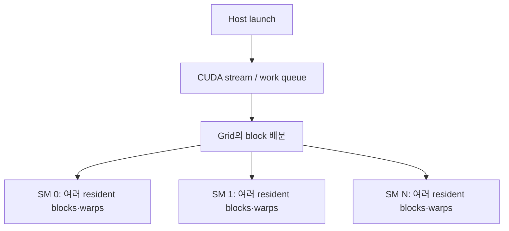
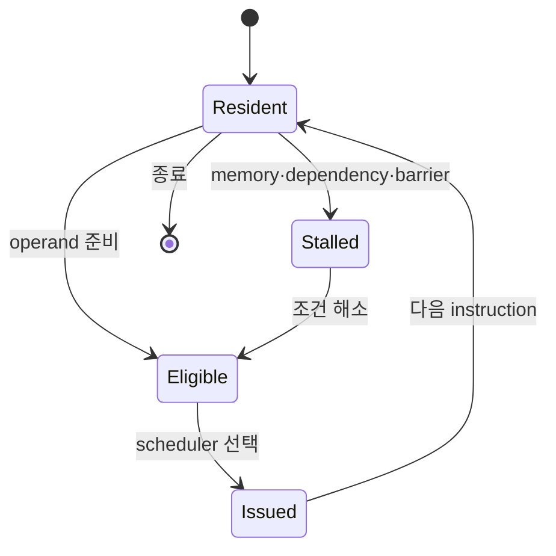

# 02. CUDA 실행 모델과 SM: thread가 실제 hardware에서 실행되는 법

작성일: 2026-08-18  
선행 문서: [보드에서 SM까지](01-physical-anatomy-and-hierarchy.md)  
다음 문서: [메모리와 데이터 이동](03-memory-and-data-movement.md)

## 1. CUDA가 제공하는 논리 구조

CUDA programmer는 GPU의 GPC나 TPC에 직접 일을 배치하지 않는다. kernel launch를 다음 논리 계층으로 표현한다.



- Kernel: GPU에서 실행할 함수
- Grid: 한 번의 kernel launch가 만드는 전체 block 집합
- Thread block 또는 CTA: 하나의 SM에 배치되는 협업 단위
- Warp: scheduler가 instruction을 발행하는 기본 thread 묶음
- Thread: 각 data element를 담당하는 논리 실행 주체

`CTA(Cooperative Thread Array)`는 NVIDIA 문서와 profiler에서 thread block을 가리키는 이름으로 자주 보인다.

## 2. 논리 구조가 물리 자원에 매핑되는 과정

1. CPU thread가 CUDA Runtime 또는 Driver API로 kernel을 launch한다.
2. command가 CUDA stream의 순서에 따라 GPU work queue에 제출된다.
3. GPU work distributor가 아직 시작하지 않은 block을 가용 SM에 배치한다.
4. 하나의 block은 실행 기간 동안 한 SM에 resident한다.
5. block의 thread들은 32개 단위 warp로 묶인다.
6. SM의 warp scheduler가 매 cycle 준비된 warp의 instruction을 pipeline에 발행한다.
7. 모든 block이 끝나면 kernel이 완료된다.



한 block의 thread는 shared memory와 block barrier를 공유할 수 있다. 서로 다른 block은 일반 kernel에서 이 locality와 동시 실행을 가정할 수 없다. Hopper가 도입한 thread block cluster는 여러 block의 co-scheduling과 distributed shared memory를 명시적으로 제공하는 별도 기능이다.

## 3. 가장 작은 kernel 예시

```cuda
__global__ void add(const float* a, const float* b, float* c, int n) {
    int i = blockIdx.x * blockDim.x + threadIdx.x;
    if (i < n) {
        c[i] = a[i] + b[i];
    }
}
```

```cuda
int threads = 256;
int blocks = (n + threads - 1) / threads;
add<<<blocks, threads>>>(a, b, c, n);
```

- `threadIdx.x`: block 안의 thread 번호
- `blockIdx.x`: grid 안의 block 번호
- `blockDim.x`: block당 thread 수
- `i`: 전체 array에서 이 thread가 담당할 element

연속된 thread가 연속된 주소를 읽기 때문에 memory coalescing에 유리하다. 하지만 이 kernel은 element마다 읽기 2회, 쓰기 1회, 덧셈 1회뿐이어서 arithmetic intensity가 낮고 HBM bandwidth에 막히기 쉽다.

## 4. SIMT와 warp

SIMT는 Single Instruction, Multiple Threads의 약자다. 같은 warp의 thread들은 같은 instruction 흐름을 함께 진행하지만 각자 register와 lane state를 가진다.

### 4.1 warp size

현재 여기서 다루는 NVIDIA CUDA GPU의 warp는 32 threads다. `thread 32개가 물리적으로 32개 CPU core에 영구 고정된다`는 뜻은 아니다. scheduler와 execution pipeline이 warp instruction을 세대별 microarchitecture에 맞춰 처리한다.

### 4.2 branch divergence

같은 warp의 lane들이 서로 다른 branch로 갈 경우 각 path를 mask를 바꿔 실행해야 한다.

```cuda
if (threadIdx.x % 2 == 0) {
    fast_path();
} else {
    slow_path();
}
```

한 warp 안에서 절반은 `fast_path`, 절반은 `slow_path`라면 두 path의 명령이 순차적으로 실행될 수 있다. 실행하지 않는 lane은 masked off되므로 유효 throughput이 줄어든다.

Volta 이후 Independent Thread Scheduling이 도입됐지만 warp divergence 비용이 사라진 것은 아니다. 오히려 과거의 암묵적 warp-synchronous 동작을 가정한 코드는 `__syncwarp()`와 `*_sync` primitive를 올바르게 써야 한다.

### 4.3 predication

짧은 branch는 compiler가 모든 instruction을 발행하되 lane별 predicate로 write나 operand evaluation을 막는 형태로 바꿀 수 있다. branch instruction을 없애도 실행 slot 비용 자체가 완전히 사라지는 것은 아니다.

## 5. Warp scheduler와 latency hiding

SM에는 여러 warp가 resident할 수 있다. 각 warp는 다음 상태 중 하나에 가깝다.

- Active/resident warp: SM 자원을 할당받아 아직 끝나지 않은 warp
- Eligible warp: 다음 instruction의 operand와 dependency가 준비돼 발행 가능한 warp
- Stalled warp: memory, dependency, barrier 등의 이유로 당장 발행 불가
- Issued warp: 해당 cycle에 scheduler가 선택해 instruction을 발행한 warp



GPU가 memory latency를 숨기려면 일부 warp가 기다릴 때 다른 eligible warp가 있어야 한다. `active warp가 많다`와 `eligible warp가 충분하다`는 같은 말이 아니다. 모든 active warp가 같은 HBM 응답이나 barrier를 기다리면 scheduler issue slot은 빈다.

## 6. Occupancy

Occupancy는 일반적으로 SM이 허용하는 최대 resident warp 수에 대한 실제 resident warp 수의 비율이다.

```math
Occupancy=
\frac{\text{active resident warps per SM}}
{\text{maximum warps per SM}}
```

resident block 수는 다음 자원 중 가장 먼저 한계에 닿는 항목으로 결정된다.

- threads 또는 warps per SM
- blocks per SM
- registers per SM과 thread당 register 사용량
- shared memory per SM과 block당 사용량
- thread block cluster 제약

### 6.1 register 제한 예시

가상의 SM이 65,536개의 32-bit register, 최대 64 warps를 지원한다고 하자.

- block당 256 threads = 8 warps
- thread당 64 registers
- block당 register = 256 × 64 = 16,384
- register만 보면 최대 4 blocks resident
- 4 × 8 = 32 resident warps
- occupancy 상한 = 32 / 64 = 50%

실제 compiler allocation granularity와 다른 자원 제한 때문에 결과는 달라질 수 있으므로 CUDA Occupancy API나 Nsight Compute를 사용한다.

### 6.2 높은 occupancy가 항상 빠르지 않다

- Tensor Core kernel은 큰 tile을 위해 register/shared memory를 많이 쓰고 낮은 occupancy에서도 높은 throughput을 낼 수 있다.
- register를 줄여 occupancy를 높였지만 spill이 생기면 오히려 느려질 수 있다.
- compute-bound kernel은 충분한 instruction-level parallelism이 있으면 최대 occupancy가 필요하지 않을 수 있다.
- memory-latency-bound kernel은 더 많은 warp가 latency hiding에 도움을 줄 수 있다.

따라서 occupancy는 목표가 아니라 `latency를 숨길 만큼의 실행 후보가 있는지`를 보는 수단이다.

## 7. SM Active와 Occupancy의 차이

| 상황 | SM Active | Occupancy | 의미 |
|---|---:|---:|---|
| SM마다 작은 block 하나가 계속 실행 | 높을 수 있음 | 낮을 수 있음 | GPU 전역에는 일이 있지만 SM당 resident warp가 적음 |
| 많은 warp가 resident하지만 모두 memory 대기 | 높음 | 높음 | activity는 높아도 issue/compute throughput은 낮을 수 있음 |
| 짧은 kernel 사이에 큰 launch gap | 낮음 | kernel 실행 중에는 높을 수 있음 | host launch 또는 synchronization 병목 가능 |
| 큰 GEMM이 Tensor pipe를 잘 채움 | 높음 | 중간이어도 됨 | 낮은 occupancy만으로 문제라 단정 금지 |

DCGM의 SM Active는 `적어도 한 warp가 active였던 시간`을 SM 전체에 평균한 값이다. 대기 중인 warp도 active로 계산될 수 있다.

## 8. CUDA stream과 비동기 실행

Stream은 GPU 작업의 순서를 표현하는 command sequence다.

- 같은 stream의 작업은 순서가 보장된다.
- 서로 다른 stream은 dependency와 자원이 허용하면 겹칠 수 있다.
- asynchronous copy와 compute를 겹치려면 pinned host memory, copy engine, 올바른 stream dependency가 필요하다.
- stream을 많이 만든다고 자동으로 concurrency가 생기는 것은 아니다.

명시적 또는 암묵적 synchronization은 pipeline을 비울 수 있다.

- `cudaDeviceSynchronize()`
- blocking D2H copy
- default stream semantics
- framework의 tensor 값 host read
- collective barrier

Nsight Systems에서 CPU API, kernel, memcpy, NCCL timeline을 함께 봐야 하는 이유다.

## 9. Kernel launch overhead와 CUDA Graphs

작은 kernel이 많은 workload는 각 kernel의 연산 시간보다 CPU submission, driver scheduling, dependency 처리 시간이 중요해질 수 있다.

CUDA Graph는 반복되는 operation graph를 한 번 정의·instantiate한 뒤 낮은 overhead로 재실행한다.

- 장점: CPU launch overhead와 kernel 사이 gap 감소
- 제약: 주소, shape, control flow가 안정적이어야 capture/replay가 쉽다.
- LLM serving: decode처럼 비슷한 kernel sequence가 반복될 때 특히 중요
- 주의: graph capture 성공 자체가 최적 성능을 보장하지 않으며 batch/shape별 graph 관리 비용이 있다.

## 10. 일반 CUDA pipeline과 Tensor Core

### 10.1 일반 pipeline

thread별 scalar/vector FP32, FP64, INT 연산을 처리한다. elementwise, indexing, reduction 일부, sampling, bookkeeping kernel 등이 사용한다.

### 10.2 Tensor Core pipeline

warp 또는 warpgroup이 matrix tile에 대한 MMA를 수행한다.

```math
D=A\times B+C
```

Tensor Core를 쓰려면 일반적으로 다음이 필요하다.

- 지원되는 input/accumulator dtype
- library 또는 compiler가 Tensor Core instruction을 선택
- 적절한 matrix shape와 alignment
- 데이터를 tile에 맞게 공급하는 register/shared memory pipeline
- 충분한 work와 reuse

GPU가 Tensor Core를 갖고 있다는 사실과 현재 kernel의 `PIPE_TENSOR_ACTIVE`가 높다는 사실은 별개다.

## 11. Compute Capability, PTX, cubin

Compute Capability(CC)는 GPU가 지원하는 instruction과 hardware feature 집합을 나타낸다.

- `compute_90`: PTX virtual architecture target
- `sm_90`: Hopper용 native cubin target
- `sm_100`: B200/GB200 계열 native target
- `sm_103`: B300/GB300 계열 native target

PTX는 driver가 해당 GPU용 machine code로 JIT compile할 수 있는 중간 표현이다. cubin은 특정 SM target의 native binary다.

중요한 운영 결론은 다음과 같다.

- major compute capability가 달라지면 기존 cubin이 그대로 실행되지 않을 수 있다.
- image에 미래 GPU가 이해할 수 있는 PTX가 포함돼 있으면 JIT fallback이 가능할 수 있다.
- custom CUDA extension, Triton kernel, FlashAttention, DeepGEMM은 지원 SM target과 compiler/CUDA 조합을 확인해야 한다.
- `GPU가 새롭다`와 `현재 wheel/image가 그 GPU를 지원한다`는 별개다.

## 12. 자가 점검

1. block과 warp 중 hardware scheduler의 기본 instruction 발행 단위는 무엇인가?
2. active warp가 많아도 issue slot이 비는 상황은 무엇인가?
3. occupancy를 100%로 만드는 것이 항상 최적화 목표인가?
4. 서로 다른 stream을 쓰면 kernel과 memcpy가 무조건 겹치는가?
5. `sm_90` cubin만 포함한 extension을 B200에서 바로 쓸 수 있다고 가정해도 되는가?

## 13. 주요 원문

- NVIDIA, [CUDA Programming Guide — Writing SIMT Kernels](https://docs.nvidia.com/cuda/cuda-programming-guide/02-basics/writing-cuda-kernels.html)
- NVIDIA, [CUDA Programming Guide — Advanced Kernel Programming](https://docs.nvidia.com/cuda/cuda-programming-guide/03-advanced/advanced-kernel-programming.html)
- NVIDIA, [CUDA Best Practices Guide](https://docs.nvidia.com/cuda/cuda-c-best-practices-guide/)
- NVIDIA, [Volta Tuning Guide](https://docs.nvidia.com/cuda/volta-tuning-guide/)
- NVIDIA, [Blackwell Compatibility Guide](https://docs.nvidia.com/cuda/blackwell-compatibility-guide/)
- NVIDIA, [NVCC Compiler Driver](https://docs.nvidia.com/cuda/cuda-compiler-driver-nvcc/)
- NVIDIA, [Nsight Compute Profiling Guide](https://docs.nvidia.com/nsight-compute/ProfilingGuide/)

> 본질: GPU의 병렬성은 thread 수 자체가 아니라, **각 cycle에 의존성이 풀린 warp를 계속 골라 실행 파이프에 공급할 수 있는가**에 달려 있다.

