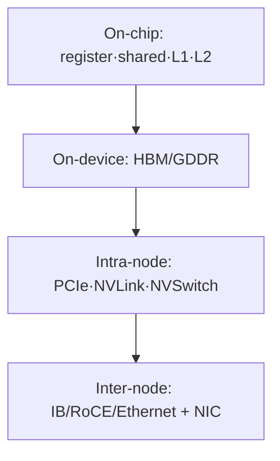
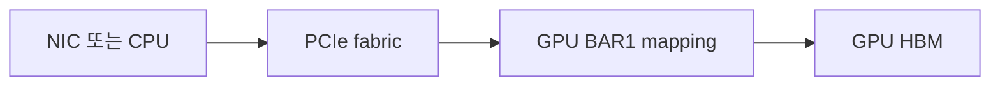
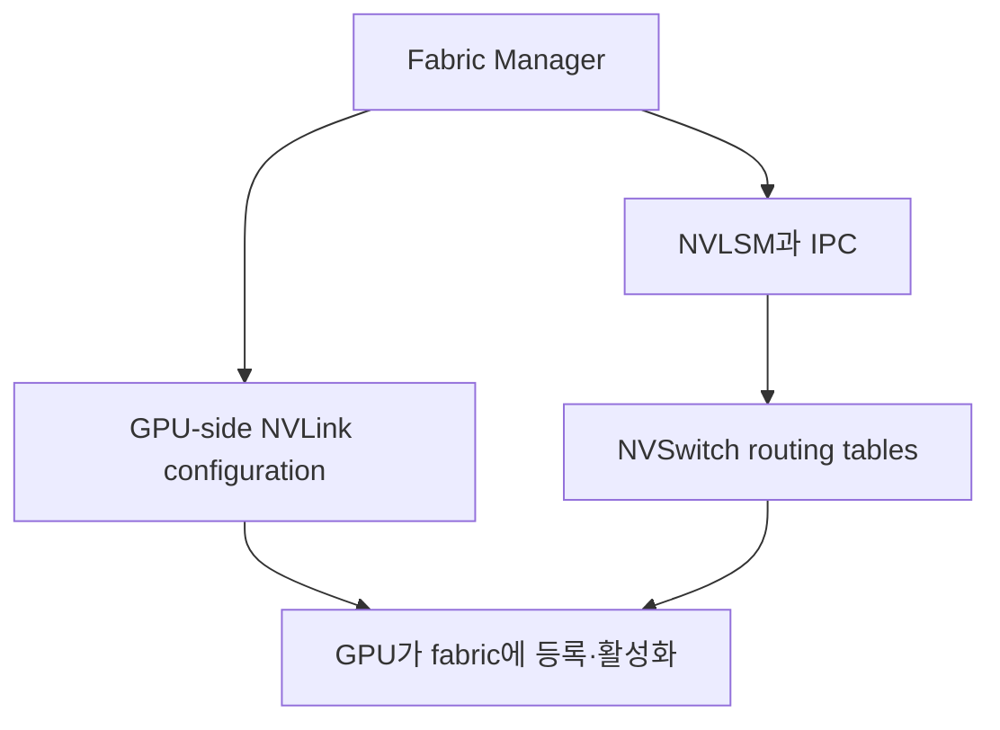
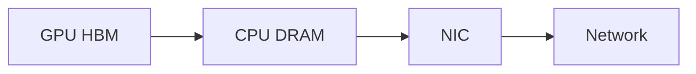
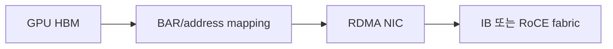

# 03. 메모리와 데이터 이동: HBM, PCIe, BAR1, NVLink, NVSwitch, GDRDMA

작성일: 2026-08-18  
선행 문서: [CUDA 실행 모델과 SM](02-cuda-execution-model-and-sm.md)  
다음 문서: [NVIDIA 세대와 주요 GPU 비교](04-nvidia-architecture-generations.md)

## 1. GPU 문제의 절반은 계산이 아니라 이동이다

GPU가 Tensor Core에서 매우 빠른 연산을 수행해도 operand가 제때 도착하지 않으면 pipeline은 빈다. 데이터 이동은 세 범위로 나눈다.



각 경로마다 capacity, bandwidth, latency, protocol, DMA 주체가 다르다.

## 2. Host memory의 종류와 H2D 전송

### 2.1 Pageable host memory

일반 `malloc`이나 대부분의 OS memory allocation은 pageable하다. GPU DMA가 안정적으로 접근하려면 전송 도중 page가 이동하지 않아야 하므로 runtime이 내부 pinned staging buffer를 사용할 수 있다.


이 추가 copy와 synchronization은 latency와 CPU overhead를 늘릴 수 있다.

### 2.2 Pinned host memory

Page-locked memory는 DMA 동안 물리 page가 고정된다.

- CPU↔GPU asynchronous DMA에 유리
- compute와 copy overlap에 필요할 수 있음
- 과도하게 pin하면 OS가 사용할 pageable memory가 줄어 system 성능을 해칠 수 있음
- `pinned`는 GPU memory가 아니라 CPU DRAM의 page-lock 상태를 말할 수도 있으므로 문맥을 확인해야 함

### 2.3 Device memory

`cudaMalloc` 등으로 GPU memory를 할당한다. model weight, activation, workspace, KV cache가 여기에 위치한다.

### 2.4 Unified / Managed memory

하나의 virtual address를 CPU와 GPU에서 사용할 수 있고 runtime/driver가 residency와 migration을 관리한다. programming은 편해지지만 page fault와 migration이 예측 불가능한 latency를 만들 수 있다. Grace Hopper/Blackwell의 coherent memory와 일반 x86+PCIe managed memory를 같은 성능 특성으로 보면 안 된다.

## 3. UVA와 주소 공간

Unified Virtual Addressing(UVA)은 지원되는 64-bit system에서 host와 여러 GPU memory를 하나의 virtual address space 체계로 표현할 수 있게 한다. 이는 다음을 뜻하지 않는다.

- 모든 memory가 물리적으로 한곳에 있다.
- 어떤 pointer든 같은 latency로 접근한다.
- allocation이 자동으로 모든 GPU에 복제된다.
- peer access가 자동으로 활성화된다.

주소가 통합돼도 실제 page location과 transport path는 별도로 존재한다.

## 4. DMA와 copy engine

Direct Memory Access(DMA)는 CPU core가 byte를 하나씩 복사하지 않고 device가 bus transaction을 수행하는 방식이다.

- CPU는 descriptor와 command를 준비한다.
- GPU copy engine 또는 peer device가 transfer를 수행한다.
- data path에서 CPU core를 우회해도 CPU가 control plane에 관여할 수 있다.
- asynchronous transfer가 compute와 실제로 겹치려면 독립 engine, pinned memory, stream dependency, resource 여유가 필요하다.

`CPU를 거치지 않는다`는 표현은 data plane이 CPU DRAM bounce buffer를 거치지 않는다는 뜻으로 사용해야 한다. 명령 제출과 memory registration까지 CPU가 전혀 관여하지 않는다는 뜻은 아니다.

## 5. PCIe bandwidth를 읽는 법

PCIe는 lane당 전송률과 lane 수로 link가 구성된다. GPU는 보통 x16 link를 사용하지만 실제 negotiated width와 generation은 system에 따라 낮아질 수 있다.

| Link | 이론 payload 전송률의 흔한 표기 | 읽는 법 |
|---|---:|---|
| PCIe Gen4 x16 | 약 32 GB/s per direction, 64 GB/s bidirectional | 합산 수치를 한 방향 성능으로 읽지 않음 |
| PCIe Gen5 x16 | 약 64 GB/s per direction, 128 GB/s bidirectional | protocol overhead와 topology로 실측은 낮음 |
| PCIe Gen6 x16 | 약 128 GB/s per direction, 256 GB/s bidirectional | 지원 GPU·CPU·switch·slot 전체가 맞아야 함 |

확인은 다음 항목을 함께 본다.

```bash
nvidia-smi --query-gpu=pci.bus_id,pcie.link.gen.current,pcie.link.gen.max,pcie.link.width.current,pcie.link.width.max --format=csv
nvidia-smi topo -m
lspci -vv -s <GPU_BDF>
```

idle power management 때문에 current generation이 낮게 보일 수 있다. 부하 중에도 max보다 낮으면 slot, BIOS, riser, PCIe switch, link training 문제를 조사한다.

## 6. BAR와 BAR1

PCI device는 Base Address Register(BAR)를 통해 host physical address space에 device resource window를 노출한다.

GPU에서 BAR1은 framebuffer, 즉 device memory의 일부를 CPU나 제3의 PCIe device가 직접 접근할 수 있도록 mapping하는 aperture다.

### BAR1에 대한 오해

- BAR1 크기는 GPU HBM 총용량과 같은 개념이 아니다.
- BAR1 used는 application이 실제로 읽고 쓰는 HBM byte 수가 아니다.
- 큰 BAR1 또는 Resizable BAR가 있다고 GPU 연산이 자동으로 빨라지지 않는다.
- GPUDirect RDMA와 peer mapping에서 중요한 addressability 자원이지만 registration/cache behavior도 함께 본다.



## 7. GPU↔GPU: PCIe P2P와 NVLink

### 7.1 PCIe P2P

두 GPU가 peer access를 지원하고 topology/IOMMU 정책이 허용하면 host memory bounce 없이 PCIe fabric을 통해 직접 전송할 수 있다.

경로 예시는 다음과 같다.

- 같은 PCIe switch 아래
- 같은 root complex 아래
- CPU socket 또는 root complex를 넘어가는 경로

거리가 멀수록 latency와 contention이 증가하고, 일부 system은 P2P를 지원하지 않거나 ACS/IOMMU 설정으로 redirect될 수 있다.

### 7.2 NVLink

NVLink는 GPU memory load/store와 peer transfer를 위한 NVIDIA의 고대역폭 link다.

- A100 NVLink 3: GPU당 최대 600 GB/s bidirectional 표기
- H100/H200 NVLink 4: GPU당 최대 900 GB/s bidirectional 표기
- B200/B300 NVLink 5: GPU당 최대 1.8 TB/s bidirectional 표기
- Rubin NVLink 6: 공개 preliminary 기준 GPU당 3.6 TB/s

H100/H200의 `900 GB/s`는 송신과 수신을 합친 marketing aggregate다. 한 방향 합계로 보면 약 450 GB/s 수준의 개념이다. 실제 application throughput은 packet/protocol, pattern, contention, collective algorithm에 따라 낮다.

NVLink가 존재해도 `cudaDeviceCanAccessPeer`, peer access, NCCL topology와 actual link state를 확인해야 한다.

## 8. NVSwitch와 Fabric Manager

### 8.1 NVSwitch

NVSwitch는 여러 GPU의 NVLink port를 switch fabric으로 연결한다.

- point-to-point cable 수를 폭발시키지 않고 다수 GPU를 full-bandwidth domain으로 연결
- GPU A에서 GPU B로 향하는 packet을 routing
- 세대에 따라 multicast, SHARP/in-network reduction 같은 기능 지원

NVSwitch는 HBM을 하나의 거대한 allocation으로 자동 병합하지 않는다. application은 여전히 device별 memory와 parallel strategy를 관리한다.

### 8.2 Fabric Manager

지원되는 NVSwitch system에서 Fabric Manager는 GPU-side routing, NVLink configuration, partition 관련 API 등을 관리한다. 최신 fabric에서는 NVLSM이 NVSwitch routing table을 담당하고 Fabric Manager와 협력한다.



Fabric Manager service가 떠 있다는 사실만으로 fabric이 healthy하다고 단정하지 않는다. GPU fabric registration state, clique ID, NVLink state, SXid/CRC/replay counter를 함께 본다.

## 9. GPU↔NIC: GPUDirect RDMA

일반 network 전송은 다음처럼 CPU memory를 staging으로 사용할 수 있다.



GPUDirect RDMA(GDRDMA)는 지원 NIC가 GPU memory를 PCIe peer로 직접 DMA하게 한다.



필요 조건의 큰 범주는 다음과 같다.

- 지원 GPU, NIC, driver와 RDMA stack
- GPU memory pin/registration과 peer-memory 또는 DMA-BUF 경로
- 올바른 PCIe topology
- IOMMU/ACS가 peer transaction을 방해하지 않는 구성
- container에 RDMA device와 필요한 library가 노출
- NCCL 또는 application이 GDR path를 실제 선택

전통적인 NVIDIA driver 경로에서는 `nvidia-peermem` module이 사용된다. 최신 kernel/driver 조합은 DMA-BUF 기반 경로도 사용할 수 있으므로 version과 distribution 문서를 확인한다.

### 9.1 InfiniBand와 Ethernet에 대한 정확한 구분

- GDRDMA는 `GPU와 RDMA NIC 사이의 direct DMA` 능력이다.
- InfiniBand는 RDMA를 기본 제공하는 network architecture다.
- RoCE는 Ethernet 위에서 RDMA semantics를 제공한다.
- 일반 TCP/IP Ethernet socket은 보통 GDRDMA path와 같지 않다.

따라서 `IB가 없으면 무조건 CPU를 거친다`도, `Ethernet이면 GDRDMA가 불가능하다`도 일반 명제로는 틀리다. RDMA-capable Ethernet/RoCE 구성인지, application transport가 무엇인지 확인해야 한다.

## 10. NCCL이 보는 transport

NCCL은 collective를 다음 transport 위에 배치할 수 있다.

- NVLink/NVSwitch
- PCIe P2P
- InfiniBand verbs
- RoCE
- IP socket

NCCL이 topology를 자동 탐색한다고 해서 모든 hardware 문제를 우회하거나 항상 최적 경로를 고르는 것은 아니다.

확인 항목:

```bash
NCCL_DEBUG=INFO NCCL_DEBUG_SUBSYS=INIT,GRAPH,NET <application>
nvidia-smi topo -m
ibdev2netdev
rdma link
lsmod | grep -E 'nvidia_peermem|nvidia'
```

로그에서 `GDRDMA`, HCA, channel 생성이 보인다는 사실은 control path 초기화 증거다. 실제 payload가 정상 전송되고 기대 bandwidth가 나오는지는 `nccl-tests`, interface counter, GPU/NIC telemetry로 검증해야 한다.

### 10.1 통신 심화 학습 경로

이 문서는 data movement의 전체 지도를 다룬다. multi-GPU·multi-node 통신은 다음 순서로 이어서 읽는다.

1. [GPU 통신을 보는 지도](09-gpu-communication-mental-model.md): 계층과 bandwidth 단위
2. [PCIe·NVLink·NVSwitch](10-pcie-nvlink-nvswitch.md): node 내부 hardware path
3. [RDMA와 GPUDirect RDMA](11-rdma-and-gpudirect-rdma.md): verbs, MR·QP·CQ와 GPU memory 등록
4. [InfiniBand·RoCE와 GPU network 하드웨어](12-infiniband-roce-and-hardware.md): HCA, switch, fabric control과 제품군
5. [NCCL·집단통신·관측 실습](13-nccl-collectives-observability-labs.md): collective algorithm, 측정식과 장애 격리

## 11. 경로별 비교

| 경로 | Data plane | CPU DRAM bounce | 대표 용도 | 주요 확인점 |
|---|---|---:|---|---|
| H2D pageable | CPU memory→staging→GPU | 보통 있음 | model/input upload | pinning, sync, PCIe |
| H2D pinned | pinned CPU memory→GPU DMA | 없음 | async input pipeline | copy overlap, NUMA |
| GPU P2P PCIe | GPU→PCIe→GPU | 없음 | local peer copy | ACS/IOMMU, root topology |
| GPU P2P NVLink | GPU→NVLink(/NVSwitch)→GPU | 없음 | TP/collective | link state, NCCL graph |
| Network staged | GPU→CPU DRAM→NIC | 있음 | socket 또는 non-GDR | CPU/NUMA/PCIe overhead |
| GDRDMA | GPU→PCIe peer NIC→RDMA fabric | 없음 | multi-node NCCL | peermem/DMA-BUF, NIC, fabric |

## 12. 자가 점검

1. BAR1 used와 HBM used는 같은 값인가?
2. H100의 NVLink 900 GB/s를 단방향 실효 bandwidth로 읽어도 되는가?
3. NVSwitch가 있으면 Fabric Manager 없이도 항상 P2P가 정상인가?
4. NCCL log에 HCA가 보이면 실제 GDRDMA payload 전송 성공까지 증명되는가?
5. Ethernet 위에서 GDRDMA가 가능한 경우는 무엇인가?

## 13. 주요 원문

- NVIDIA, [GPUDirect RDMA Documentation](https://docs.nvidia.com/cuda/gpudirect-rdma/)
- NVIDIA, [NVIDIA Fabric Manager User Guide](https://docs.nvidia.com/datacenter/tesla/fabric-manager-user-guide/)
- NVIDIA, [NCCL Overview](https://docs.nvidia.com/deeplearning/nccl/user-guide/docs/overview.html)
- NVIDIA, [NCCL GPU Troubleshooting](https://docs.nvidia.com/deeplearning/nccl/user-guide/docs/troubleshooting/gpu_troubleshooting.html)
- NVIDIA, [nvidia-smi Manual — BAR1](https://docs.nvidia.com/deploy/nvidia-smi/)
- NVIDIA, [Hopper Architecture In-Depth — NVLink](https://developer.nvidia.com/blog/nvidia-hopper-architecture-in-depth/)
- NVIDIA, [Blackwell Tuning Guide — NVLink](https://docs.nvidia.com/cuda/blackwell-tuning-guide/)

> 본질: GPU 통신을 이해한다는 것은 `NVLink가 있다`고 말하는 것이 아니라, **어느 device가 DMA를 일으키고 어떤 주소 창과 switch를 거쳐 어느 memory에 도착하는지 그릴 수 있는 것**이다.
