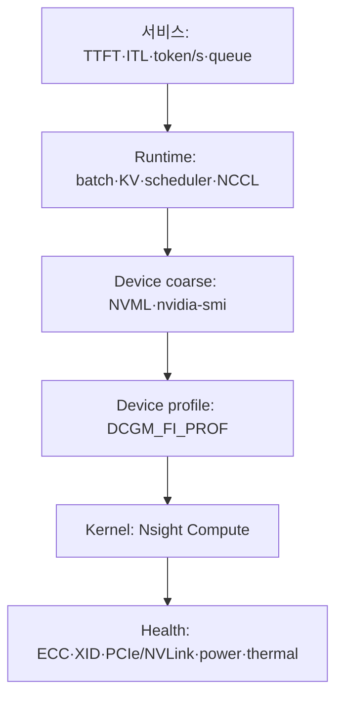
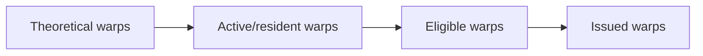

# 06. GPU 메트릭과 관측 도구: 숫자의 정확한 분모부터 읽기

작성일: 2026-08-18  
선행 문서: [Numerical Precision과 Tensor Core](05-numerical-precision-and-tensor-cores.md)  
다음 문서: [LLM Serving 병목 진단](07-llm-serving-bottleneck-diagnosis.md)

## 1. 메트릭은 여섯 층으로 나눈다



GPU 메트릭만으로 사용자가 느끼는 성능을 설명할 수 없다. 반대로 서비스 latency만으로 hardware 병목을 특정할 수도 없다. 같은 시간축에 여섯 층을 맞춰야 한다.

## 2. 도구별 역할

| 도구 | 관측 범위 | 강점 | 한계 |
|---|---|---|---|
| `nvidia-smi` / NVML | inventory, coarse util, memory, process, clock, power, health | 가장 빠른 1차 확인 | kernel 내부 병목을 설명하지 못함 |
| DCGM | production device telemetry, health, diagnostics, profiling fields | 낮은 overhead, fleet monitoring | field 지원·동시 수집 제약이 GPU 세대별로 다름 |
| DCGM Exporter | DCGM→Prometheus | Kubernetes label과 장기 시계열 | scrape/collection interval과 aggregation에 주의 |
| Nsight Systems | CPU·CUDA·NCCL·OS timeline | launch gap, synchronization, overlap 분석 | kernel 내부 instruction 병목은 제한적 |
| Nsight Compute | 개별 CUDA kernel hardware counter | Roofline, memory, scheduler, stall, source 분석 | overhead가 크고 production 상시 사용 부적합 |
| CUPTI / profiler API | programmatic trace/counter | custom observability | 구현 복잡도와 overhead 관리 필요 |
| Application metrics | request, token, batch, cache, queue | 사용자 가치와 직접 연결 | hardware 원인은 별도 분석 필요 |

권장 순서는 `서비스 지표 → DCGM/NVML → Nsight Systems → Nsight Compute`다. 처음부터 모든 kernel counter를 수집하는 것은 원인 탐색보다 noise를 늘릴 수 있다.

## 3. nvidia-smi의 utilization

NVML의 기본 utilization 정의는 다음과 같다.

### 3.1 GPU utilization

표본 기간 중 하나 이상의 kernel이 GPU에서 실행 중이었던 시간 비율이다.

이 값이 100%여도 다음일 수 있다.

- 작은 kernel이 쉬지 않고 실행됨
- warp 대부분이 memory를 기다림
- Tensor Core 대신 elementwise kernel이 실행됨
- GPU 일부 SM만 사용하는 kernel이 계속 실행됨

따라서 peak compute 대비 100%라는 뜻이 아니다.

### 3.2 Memory utilization

표본 기간 중 global device memory가 read 또는 write되고 있던 시간 비율이다. HBM의 이론 bandwidth 중 몇 %의 byte/s를 달성했다는 뜻과 완전히 같지 않다.

### 3.3 FB memory used

Framebuffer/device memory의 할당 용량이다.

- model weight
- KV cache reservation
- activation/workspace
- CUDA context와 library buffer
- allocator reserved pool

`FB_USED / FB_TOTAL`은 capacity pressure를 보여 주지만 bandwidth pressure를 보여 주지 않는다.

### 3.4 BAR1 used

GPU framebuffer를 CPU 또는 peer PCIe device가 접근하도록 mapping한 aperture 사용량이다. application의 총 HBM allocation이나 전송량이 아니다.

## 4. DCGM profiling metric의 정의

실제 지원 field와 동시에 수집 가능한 group은 GPU에서 확인한다. Ampere 및 이전 세대의 일부 subgroup은 같은 hardware resource를 공유해 동시에 watch할 수 없다. Hopper 이후 GPM 기반 GPU는 나열된 profiling group을 함께 수집할 수 있지만, 정적 가정보다 `profile --list` 결과를 기준으로 삼는다.

```bash
dcgmi profile --list --entity-id gpu:0
# 구버전 CLI에서는 다음 형태일 수 있다.
dcgmi profile -l -i 0
```

| Metric | Field / ID | 정확한 의미 | 단독 해석의 함정 |
|---|---|---|---|
| Graphics Engine Active | `DCGM_FI_PROF_GR_ENGINE_ACTIVE` / 1001 | graphics 또는 compute engine 일부가 active인 시간 비율 | 어떤 SM pipe가 일을 했는지 모름 |
| SM Active | `DCGM_FI_PROF_SM_ACTIVE` / 1002 | 적어도 한 warp가 active인 시간의 SM 평균 | memory 대기 warp도 active |
| SM Occupancy | `DCGM_FI_PROF_SM_OCCUPANCY` / 1003 | 최대 resident warp 대비 resident warp 비율 | 높다고 항상 빠르지 않음 |
| Tensor Active | `DCGM_FI_PROF_PIPE_TENSOR_ACTIVE` / 1004 | Tensor HMMA/IMMA pipe active cycle 비율 | phase와 SM 분포가 평균에 섞임 |
| DRAM Active | `DCGM_FI_PROF_DRAM_ACTIVE` / 1005 | device memory traffic이 있었던 cycle 비율 | achieved GB/s와 동일하지 않음 |
| FP64 Active | `DCGM_FI_PROF_PIPE_FP64_ACTIVE` / 1006 | FP64 pipe active cycle 비율 | 모든 compute를 대표하지 않음 |
| FP32 Active | `DCGM_FI_PROF_PIPE_FP32_ACTIVE` / 1007 | FP32/관련 FMA pipe active cycle 비율 | Tensor 연산은 별도 |
| FP16 Active | `DCGM_FI_PROF_PIPE_FP16_ACTIVE` / 1008 | non-Tensor FP16 pipe active cycle 비율 | FP16 Tensor path와 구분 |
| PCIe TX/RX | `DCGM_FI_PROF_PCIE_TX_BYTES` / 1009, `RX` / 1010 | 관측 구간 평균 PCIe byte/s | protocol header 포함, 방향 해석 주의 |
| NVLink TX/RX | `DCGM_FI_PROF_NVLINK_TX_BYTES` / 1011, `RX` / 1012 | protocol header 제외 NVLink data byte/s | link별 불균형과 topology가 aggregate에 가려질 수 있음 |

NVIDIA 문서상 SM Active 0.8 이상은 효율적 사용의 필요조건이 될 수 있지만 충분조건은 아니다. 0.5 미만은 낮은 활용 가능성을 시사하지만 작은 latency-sensitive workload에는 의도된 상태일 수 있다. 이 값을 universal alert threshold로 고정하지 않는다.

## 5. 핵심 조합을 읽는 법

| SM Active | Tensor Active | DRAM Active | 가능한 1차 가설 | 다음 확인 |
|---:|---:|---:|---|---|
| 낮음 | 낮음 | 낮음 | CPU launch gap, queue 부족, synchronization, 작은 workload | Nsight Systems, request/batch |
| 높음 | 높음 | 중간 | Tensor compute-heavy GEMM | token/s, achieved FLOPS, ncu SOL |
| 높음 | 낮음 | 높음 | memory-heavy 또는 non-Tensor kernel | achieved GB/s, cache hit, kernel list |
| 높음 | 낮음 | 낮음 | integer/FP32/control, barrier, dependency stall | FP pipe, scheduler, stall reason |
| 낮음 | 중간 | 중간 | GPU 일부만 짧게 사용 또는 burst가 평균에 희석 | sampling interval, timeline |
| 높음 | 높음 | 높음 | compute와 memory가 모두 강한 tiled workload | Roofline에서 실제 제한 확인 |

이 표는 결론이 아니라 profiling 방향이다. `DRAM Active가 높다 = memory-bound`도 충분하지 않다. compute도 동시에 포화됐거나 memory traffic은 자주 발생하지만 byte throughput이 낮을 수 있다.

## 6. Occupancy와 scheduler metric

Nsight Compute에서 다음 흐름으로 본다.



- Theoretical occupancy: launch configuration과 resource 사용으로 계산한 상한
- Achieved occupancy: 실행 중 실제 resident warp 비율
- Eligible warps per scheduler: 다음 instruction을 발행할 수 있는 warp 수
- Issued warps: scheduler가 실제로 발행한 수
- Skipped issue slots: eligible warp 부족의 신호

Warp stall reason은 issue가 제대로 되지 않을 때만 깊게 본다. stall은 모든 GPU kernel에 존재하며 비율이 높다는 이유만으로 최적화 대상이 되는 것은 아니다.

대표 stall 분류:

- long scoreboard: global/local memory dependency 대기 가능성
- short scoreboard: shared memory 또는 짧은 dependency
- barrier: block/warp synchronization
- not selected: eligible했지만 다른 warp가 선택됨; 충분한 parallelism의 결과일 수도 있음
- math pipe throttle: 특정 execution pipe contention
- memory throttle / MIO throttle: memory instruction path 압력

정확한 metric 이름과 정의는 GPU 세대와 Nsight 버전에서 확인한다.

## 7. Memory metric

### 7.1 Capacity

- `DCGM_FI_DEV_FB_USED`
- `DCGM_FI_DEV_FB_FREE`
- `DCGM_FI_DEV_FB_TOTAL`
- BAR1 total/used/free

### 7.2 Activity와 throughput

- `DCGM_FI_PROF_DRAM_ACTIVE`
- NVML memory utilization
- Nsight Compute DRAM read/write throughput
- L1/L2 hit rate와 sector/request efficiency

### 7.3 Effective bandwidth

application이 실제로 유용하게 사용한 byte 기준 bandwidth를 계산할 수 있다.

$$
B_{effective}=\frac{bytes_{useful\ read}+bytes_{useful\ written}}{time}
$$

requested byte와 DRAM에서 실제 전송된 byte가 다르면 coalescing, cache line, unused sector, writeback 때문에 효율 차이가 난다.

### 7.4 Cache hit가 높다고 항상 좋은가

- 동일 data reuse가 많아 hit가 높을 수 있음
- working set 자체가 작아 GPU를 충분히 쓰지 않아도 높을 수 있음
- hit rate가 낮아도 streaming workload가 peak HBM bandwidth에 가까우면 정상일 수 있음
- L2 hit가 높아도 L2 bandwidth 또는 serialization이 병목일 수 있음

## 8. Power, clock, temperature

| Metric | 의미 | 함께 볼 값 |
|---|---|---|
| Board power | 현재 또는 평균 GPU/module 소비전력 | enforced power limit, workload phase |
| SM clock | 현재 compute clock | max clock, P-state, event reasons |
| Memory clock | HBM/GDDR clock | generation, lock setting |
| GPU temperature | die 온도 | slowdown/shutdown threshold 또는 thermal margin |
| Memory temperature | HBM/GDDR 온도 | memory max operating temperature |
| P-state | P0가 최고 성능 state | P-state만으로 clock 보장 안 됨 |
| Clock event reasons | power, thermal, idle 등 clock 제한 원인 bitmask | 실제 clock과 power/temperature |

`온도가 낮다 = throttling이 없다`는 항상 참이 아니다. power limit, reliability voltage, application clock, workload power profile, idle 정책이 clock을 제한할 수 있다.

성능과 전력을 함께 본다.

$$
Energy\ per\ token=\frac{Power\ (J/s)}{output\ tokens/s}
$$

power가 낮다는 사실은 효율이 좋다는 뜻일 수도 있고 GPU에 일이 부족하다는 뜻일 수도 있다.

## 9. PCIe, NVLink, NVSwitch health

### 9.1 Traffic

- PCIe TX/RX bytes/s
- NVLink TX/RX bytes/s
- link별 throughput과 aggregate throughput

### 9.2 Error와 replay

- PCIe replay counter 증가율
- NVLink CRC flit/data error
- NVLink replay/recovery error
- NVSwitch link CRC/ECC error
- SXid fatal/non-fatal event
- link state down/degraded

누적 counter는 값이 0이 아닌 사실보다 `관측 구간에 증가했는가`가 중요하다. driver reload, exporter restart, GPU reset으로 counter가 초기화될 수 있다.

### 9.3 Fabric state

- Fabric Manager status/error
- fabric health summary
- fabric cluster UUID와 clique ID
- GPU fabric registration/completion state

GPU 8개가 `nvidia-smi`에 보이는 것과 NVSwitch fabric에 모두 정상 등록된 것은 다른 상태다.

## 10. ECC, row remap, XID

### 10.1 ECC

- SBE: single-bit error, 보통 corrected
- DBE: double-bit error, uncorrectable일 수 있음
- volatile count: 현재 driver/runtime period
- aggregate count: 지속 누적 성격

SBE 한 번과 DBE 증가를 같은 severity로 다루지 않는다. 위치가 device memory, L2, register, SRAM인지도 본다.

### 10.2 Page retirement와 row remapping

Ampere 이후에는 HBM row remapping health가 중요하다.

- remapped correctable/uncorrectable row count
- pending retirement/remap
- available spare row level
- row remap failed

`DCGM_FI_DEV_ROW_REMAP_FAILED=1` 또는 pending 상태는 단순 성능 metric이 아니라 hardware health와 node drain/reset 판단의 대상이다.

### 10.3 XID

XID는 NVIDIA driver가 보고하는 GPU error event 번호다. 번호만 보고 모든 세대에 같은 조치를 적용하지 않는다.

절차:

1. timestamp와 GPU UUID/BDF 확인
2. NVIDIA XID catalog에서 architecture별 의미 확인
3. contained/uncontained, application restart, GPU reset, node reboot 권고 구분
4. ECC, PCIe, NVLink, kernel log, application error와 상관 분석
5. 반복성과 workload 재현 여부 기록

## 11. Sampling과 Prometheus 해석

### 11.1 Sample interval

1초 평균은 10 ms burst를 희석한다. 100 ms 수집은 detail을 늘리지만 overhead와 series volume을 키운다. 구형 GPU에서는 incompatible profiling subgroup을 동시에 요청하는 문제도 sampling 간격과 별도로 확인해야 한다. workload timescale보다 너무 긴 interval을 쓰지 않는다.

### 11.2 DCGM watch와 Prometheus scrape

DCGM Exporter는 DCGM host engine의 cached sample을 읽는다. exporter scrape interval을 줄여도 DCGM watch cadence보다 새 data가 자주 생기지 않으면 같은 sample을 반복해서 읽는다.

### 11.3 Gauge와 counter

- Gauge: temperature, power, utilization, FB used
- Counter: total energy, ECC aggregate, replay/error total, cumulative bytes

Counter에는 `rate()` 또는 `increase()`를 사용하고 reset을 고려한다.

```promql
rate(DCGM_FI_DEV_TOTAL_ENERGY_CONSUMPTION[5m])
increase(DCGM_FI_DEV_PCIE_REPLAY_COUNTER[10m])
```

실제 exporter metric name은 사용 중인 collector CSV와 DCGM version에서 확인한다. field가 존재한다고 default collector가 반드시 노출하는 것은 아니다.

### 11.4 평균의 함정

- GPU 8개의 평균은 한 rank의 straggler를 숨긴다.
- p50은 짧은 thermal/power event를 숨긴다.
- pod label이 바뀌면 time series가 갈라질 수 있다.
- MIG/time-slicing은 process/container attribution 제약이 있다.
- DCGM profiling counter와 Nsight가 동시에 hardware counter를 요구하면 충돌할 수 있다.

## 12. 권장 production metric set

### Inventory

- GPU name, UUID, PCI bus ID
- driver version, VBIOS, compute capability
- MIG mode/profile
- NVLink/fabric identifiers

### Capacity

- FB used/free/total
- BAR1 used/free
- process/pod attribution

### Activity

- coarse GPU/memory utilization
- SM Active, SM Occupancy
- Tensor/FP32/FP16/FP64 Active
- DRAM Active
- PCIe/NVLink TX/RX

### Power/thermal

- board/module power와 enforced limit
- SM/memory clock
- clock event reasons
- GPU/memory temperature와 margin

### Reliability

- XID
- ECC SBE/DBE
- row remap/retired page
- PCIe replay
- NVLink CRC/replay/recovery
- SXid와 fabric health

### Application correlation

- input/output token/s
- TTFT, ITL/TPOT, end-to-end latency
- running/waiting request
- batch token/sequence 수
- KV usage와 prefix/cache hit
- NCCL/parallel rank별 step time

## 13. 자가 점검

1. `GPU Util=100%`의 정확한 분모는 무엇인가?
2. `SM Active=90%, Occupancy=25%`가 논리적으로 가능한가?
3. `DRAM Active=80%`는 H200에서 정확히 3.84 TB/s를 달성했다는 뜻인가?
4. 누적 PCIe replay counter가 10이라는 사실과 10분 동안 10 증가했다는 사실 중 어느 쪽이 더 중요한가?
5. DCGM scrape interval만 줄이면 hardware counter의 시간 해상도가 항상 높아지는가?

## 14. 주요 원문

- NVIDIA, [NVML Utilization Definition](https://docs.nvidia.com/deploy/nvml-api/structnvmlUtilization__t.html)
- NVIDIA, [nvidia-smi Manual](https://docs.nvidia.com/deploy/nvidia-smi/)
- NVIDIA, [DCGM Profiling Metrics](https://docs.nvidia.com/datacenter/dcgm/latest/learn/modules/profiling.html)
- NVIDIA, [DCGM Field Identifiers](https://docs.nvidia.com/datacenter/dcgm/latest/dcgm-api/dcgm-api-field-ids.html)
- NVIDIA, [DCGM Health Monitoring](https://docs.nvidia.com/datacenter/dcgm/latest/learn/modules/health-monitoring.html)
- NVIDIA, [XID Errors](https://docs.nvidia.com/deploy/xid-errors/latest/)
- NVIDIA, [Nsight Systems User Guide](https://docs.nvidia.com/nsight-systems/UserGuide/)
- NVIDIA, [Nsight Compute Profiling Guide](https://docs.nvidia.com/nsight-compute/ProfilingGuide/)

> 본질: 메트릭을 읽는다는 것은 숫자의 높고 낮음을 보는 일이 아니라, **무엇을 어떤 시간과 자원에 대해 나눈 값인지 복원하는 일**이다.
