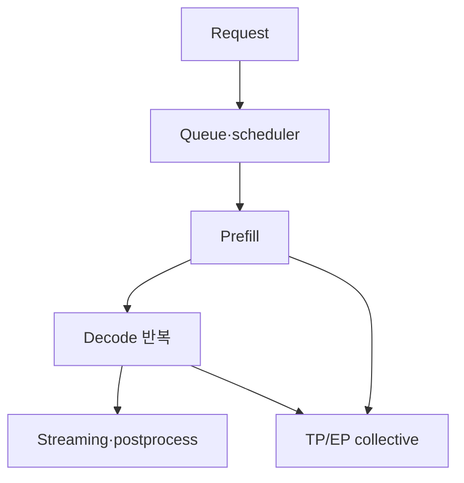
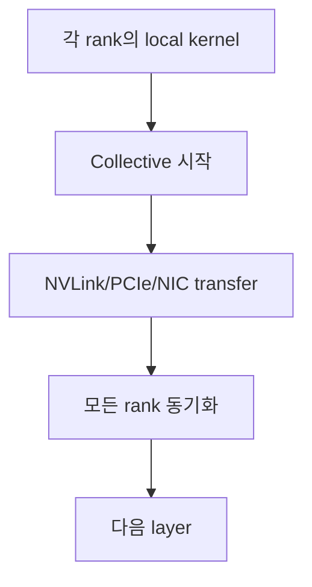
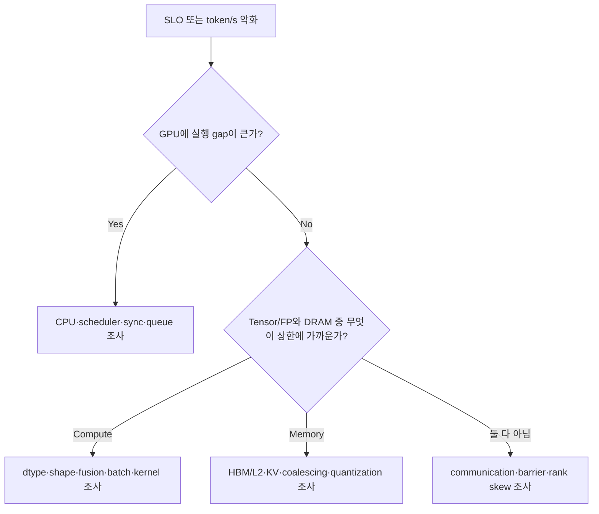

# 07. LLM Serving 병목 진단: GPU 구조와 vLLM 지표 연결

작성일: 2026-08-18  
선행 문서: [GPU 메트릭과 관측 도구](06-metrics-and-observability.md)  
다음 문서: [실습과 검증 절차](08-hands-on-labs.md)

## 1. 병목은 먼저 다섯 종류로 분류한다

| 병목 | 막히는 자원 | 대표 신호 |
|---|---|---|
| Capacity | HBM/GDDR, KV block, workspace | OOM, 낮은 concurrency limit, eviction/recompute |
| Compute | Tensor/FP/attention pipeline | 높은 SM/Tensor activity, 큰 GEMM, compute roof 접근 |
| Memory | HBM/L2/shared/register data supply | 높은 DRAM/L2 traffic, 낮은 arithmetic intensity |
| Launch/Scheduling | CPU submit, kernel gap, batch 형성, barrier | 낮은 SM activity, timeline gap, 작은 kernel 다수 |
| Communication | NVLink/PCIe/NIC/NCCL collective | collective duration, rank skew, link traffic/latency |

하나의 request 안에서도 phase마다 병목이 바뀐다.

## 2. Hardware metric보다 먼저 볼 application metric

GPU가 바쁘다는 사실은 서비스가 잘된다는 뜻이 아니다. 다음을 같은 timestamp에 확보한다.

### Request/SLO

- arrival rate와 completed request/s
- TTFT(Time To First Token)
- ITL(Inter-Token Latency) 또는 TPOT
- end-to-end latency
- error/cancel/timeout
- streaming과 non-streaming 분리

### Workload shape

- input/output token distribution
- concurrency
- model, reasoning mode, modality
- tool call 또는 structured output 여부
- prefix repetition/cacheability

### Engine state

- running/waiting/swapped request
- scheduled token과 sequence 수
- prefill/decode token throughput
- KV cache usage/capacity
- prefix/cache hit와 recompute
- batch size와 `max_num_batched_tokens`

GPU metric은 이 workload 조건을 고정한 뒤 해석한다.

## 3. Prefill의 하드웨어 성격

Prompt token 전체를 처리해 각 layer의 activation과 최종 KV를 만든다.

### 일반적 특성

- token dimension이 커 큰 GEMM을 만들기 쉬움
- Tensor Core 활용과 arithmetic intensity가 decode보다 높을 수 있음
- attention은 context length에 따라 memory와 compute 부담 증가
- chunked prefill은 큰 prompt를 여러 scheduler iteration으로 나눔

### 가능한 metric pattern

- SM Active 높음
- Tensor Active 높음
- DRAM Active도 중간~높음
- power와 clock이 지속적으로 높음
- TTFT가 prompt length와 강하게 증가

### 진단 포인트

- Tensor Active가 낮다면 shape, dtype, kernel fallback, 작은 chunk를 확인
- chunk를 너무 작게 하면 iteration/launch/scheduling overhead 증가
- 너무 크게 하면 decode request가 기다려 ITL tail이 악화될 수 있음
- long-context attention에서 KV read와 workspace가 커지면 memory pressure 증가

Prefill은 항상 순수 compute-bound가 아니다. attention implementation, sequence length, sparsity, MoE communication에 따라 memory/communication-bound가 될 수 있다.

## 4. Decode의 하드웨어 성격

Autoregressive decode는 sequence마다 보통 한 token씩 반복 생성한다.

### 작은 batch decode

- GEMM의 M dimension이 작음
- 같은 weight를 token step마다 다시 읽는 비율이 큼
- Tensor Core tile utilization과 arithmetic intensity가 낮아질 수 있음
- kernel launch와 sampling overhead가 상대적으로 커짐

이 때문에 `GPU Util 100%인데 Tensor Active는 낮고 token/s가 기대보다 낮은` 상황이 가능하다.

### Continuous batching

여러 request token을 같은 iteration에 모아 matrix dimension과 weight reuse를 높인다.

- aggregate token/s 증가
- request별 ITL은 batch scheduling과 queue 영향
- batch가 너무 크면 step latency가 늘어 p99 ITL 악화 가능

### Speculative decoding

한 target verification에서 여러 token을 commit하려 한다.

- 작은 batch에서 남는 compute를 활용할 수 있음
- draft와 verification token이 추가 capacity를 사용
- high concurrency에서는 rejected token이 batch/compute를 경쟁
- acceptance와 commit length를 hardware metric과 함께 봐야 함

## 5. KV cache 병목

KV cache에는 두 종류의 압력이 있다.

### 5.1 Capacity pressure

- 긴 context와 높은 concurrency로 block 소진
- waiting 증가 또는 preemption/recompute
- HBM used와 engine KV usage 상승
- max concurrency가 KV capacity로 제한

### 5.2 Bandwidth pressure

- decode attention이 과거 token의 KV를 반복 read
- context가 길수록 token당 읽는 byte 증가
- DRAM/L2 traffic 증가
- HBM capacity가 남아도 attention step latency가 증가

`KV 사용률이 60%뿐인데 처리량이 막혔다`는 모순이 아니다. capacity가 아니라 compute, memory bandwidth, communication이 먼저 포화될 수 있다.

### 5.3 Prefix cache와 external KV

- hit는 prefill compute를 줄일 수 있음
- external cache load는 network/storage/CPU/GPU copy 비용을 추가
- hit rate만 보지 말고 hit token, lookup latency, load bandwidth, recompute fallback을 본다.
- cache-aware routing은 hit 가능성과 queue/load 균형을 함께 최적화해야 한다.

## 6. Tensor Parallel 병목

TP는 matrix weight를 rank에 나누지만 layer마다 all-reduce, reduce-scatter, all-gather 같은 collective를 발생시킬 수 있다.

### TP를 늘릴 때 얻는 것

- rank당 weight와 compute 감소
- model capacity 확보
- 큰 GEMM의 wall time 감소 가능

### 잃는 것

- rank당 GEMM이 작아져 Tensor Core 효율 저하
- collective 횟수와 synchronization 증가
- 가장 느린 rank가 전체 step을 지연
- KV/cache layout과 communication buffer overhead

### TP4가 TP8보다 빠를 수 있는 이유

- TP4에서도 model과 KV가 충분히 들어감
- local GEMM이 더 커 compute efficiency가 좋음
- TP8의 통신 비용이 compute 절감보다 큼
- 8-GPU topology의 일부 link/rank가 느림

확인할 것:

- NCCL kernel duration과 비중
- NVLink/PCIe TX/RX
- rank별 compute/collective start time
- per-rank SM/Tensor activity
- TP 변경 전후 matrix shape와 batch
- aggregate token/s와 p99 ITL 모두

## 7. Expert Parallel과 MoE

MoE는 token마다 일부 expert만 활성화해 compute를 줄이지만 expert weight storage와 routing communication을 만든다.

### 병목 후보

- router/dispatch kernel
- token all-to-all
- 특정 expert로 token 집중
- rank별 token count imbalance
- 작은 expert GEMM
- combine/reduction
- expert weight load와 cache locality

### `전문가를 공유하니 GPU가 같이 막힌다`를 정교화하기

각 EP rank는 서로 다른 expert weight shard를 보유할 수 있다. 병목은 하나의 물리 expert layer를 모든 GPU가 동시에 계산해서라기보다 다음 조합으로 생긴다.

- token을 owner rank로 보내는 all-to-all
- 가장 많은 token을 받은 expert/rank가 만든 straggler
- local expert GEMM의 shape와 scheduling
- shared attention/dense layer의 TP/DP compute
- HBM bandwidth와 collective overlap 실패

따라서 GPU별 running sequence 수만으로 MoE compute capacity를 추정하지 않는다.

## 8. CPU와 launch 병목

다음 패턴이면 GPU가 원인이 아닐 수 있다.

- SM Active가 주기적으로 0에 가까워짐
- kernel 사이에 일정한 gap
- CPU core 하나가 포화
- tokenizer, JSON/tool parser, request logging이 비쌈
- Python event loop 또는 network backpressure
- GPU batch가 작고 waiting request가 있는데도 schedule이 늦음

Nsight Systems와 CPU profiler로 다음을 본다.

- CUDA API duration
- kernel launch gap
- synchronization call
- H2D/D2H copy
- Python/C++ thread state
- NCCL launch order
- CUDA Graph replay 여부

CUDA Graph capture가 decode 성능에 중요한 이유는 반복 kernel chain의 CPU submission 비용을 줄이기 때문이다.

## 9. Power와 thermal 병목

증상:

- 같은 workload에서 clock이 낮아짐
- power가 enforced limit에 붙음
- clock event reason에 power/thermal 표시
- temperature margin 감소
- token/s가 시간에 따라 하락

진단:

1. power usage, enforced limit, SM clock, temperature를 같은 graph에 표시
2. clock 감소와 token/s 감소 시점을 비교
3. GPU별 차이 확인
4. chassis airflow/cooling, power cap, workload profile 확인

전력 700 W에 붙어 있다고 반드시 나쁜 것은 아니다. 정상적인 compute-heavy workload일 수 있다. 중요한 것은 limit 때문에 clock/throughput이 기대보다 낮아졌는가다.

## 10. 단계별 1차 metric pattern

| Workload/phase | SM Active | Tensor Active | DRAM Active | Link traffic | 흔한 해석 |
|---|---:|---:|---:|---:|---|
| 큰 prefill GEMM | 높음 | 높음 | 중~높음 | TP면 높음 | compute 또는 balanced |
| small-batch decode | 높을 수 있음 | 낮~중 | 중~높음 | TP면 반복 | memory/launch/shape |
| long-context attention | 높음 | kernel별 변동 | 높음 | 구성별 | KV bandwidth/attention |
| TP collective 구간 | compute 감소 | 낮음 | 낮~중 | 높음 | communication/sync |
| EP all-to-all | rank별 불균형 | 낮~중 | 중 | 높음 | routing/imbalance |
| CPU launch gap | 낮음 | 낮음 | 낮음 | 낮음 | host/scheduler |
| power throttling | 높음 | workload별 | workload별 | workload별 | clock·power reason 확인 |

## 11. 진단 decision tree

실제로는 먼저 Nsight Systems로 phase와 kernel을 나누고, 그 뒤 특정 kernel을 Nsight Compute로 조사한다.

## 12. 자주 틀리는 진단

### 12.1 GPU Util이 높으니 GPU compute 포화다

틀릴 수 있다. kernel 실행 시간 비율일 뿐이다. SM/Tensor/DRAM과 application throughput을 본다.

### 12.2 HBM이 남으니 더 많은 request를 처리할 수 있다

틀릴 수 있다. compute, memory bandwidth, communication, step latency가 먼저 포화될 수 있다.

### 12.3 Occupancy가 낮으니 block size를 바꾸면 된다

틀릴 수 있다. Tensor kernel이 의도적으로 register/shared memory를 많이 쓰거나 spill 없는 낮은 occupancy가 최적일 수 있다.

### 12.4 NVLink traffic이 높으니 NVLink를 잘 쓰고 있다

높은 traffic이 productive overlap인지, 과도한 TP communication인지 구분해야 한다. collective time과 token/s를 함께 본다.

### 12.5 TTFT가 늘었으니 prefill kernel이 느려졌다

queueing, chunked-prefill scheduling, cache miss, request mix 변화일 수 있다. queue time과 actual prefill duration을 분리한다.

## 13. 검증 실험 설계

한 번에 하나의 축만 바꾼다.

### 고정할 것

- model checkpoint와 revision
- framework/container/driver/CUDA
- input/output token distribution
- concurrency와 arrival pattern
- sampling/temperature/reasoning option
- prefix cache warm/cold 상태
- GPU clock/power policy

### 바꿀 것 예시

- TP 2 vs 4
- `max_num_batched_tokens` 8K vs 32K
- KV dtype BF16 vs FP8
- CUDA Graph on/off
- speculative decoding on/off

### 동시에 수집할 것

- TTFT/ITL/E2E p50·p95·p99
- input/output token/s
- running/waiting과 actual batch
- KV usage와 cache hit
- SM/Tensor/DRAM/link/power/clock
- rank별 step/NCCL duration

결과는 `평균 성능이 올랐다`가 아니라 어느 phase와 어떤 자원 상한이 이동했는지 설명해야 한다.

## 14. 자가 점검

1. KV cache capacity가 남는데도 decode가 느릴 수 있는 이유를 세 가지 말할 수 있는가?
2. TP를 늘렸을 때 per-rank compute가 줄어도 전체가 느려질 수 있는 이유는 무엇인가?
3. long input workload에서 `max_num_batched_tokens`를 줄이면 TTFT와 ITL이 반대 방향으로 움직일 수 있는 이유는 무엇인가?
4. Expert Parallel의 straggler를 GPU 평균 utilization이 숨길 수 있는 이유는 무엇인가?
5. GPU metric과 request metric의 timestamp를 맞추지 않으면 어떤 오진이 생기는가?

## 15. 주요 원문

- NVIDIA, [CUDA Best Practices Guide](https://docs.nvidia.com/cuda/cuda-c-best-practices-guide/)
- NVIDIA, [Nsight Systems User Guide](https://docs.nvidia.com/nsight-systems/UserGuide/)
- NVIDIA, [Nsight Compute Profiling Guide](https://docs.nvidia.com/nsight-compute/ProfilingGuide/)
- NVIDIA, [DCGM Profiling Metrics](https://docs.nvidia.com/datacenter/dcgm/latest/learn/modules/profiling.html)
- NVIDIA, [NCCL User Guide](https://docs.nvidia.com/deeplearning/nccl/user-guide/docs/)
- vLLM, [Prometheus metrics](https://docs.vllm.ai/en/latest/api/vllm/v1/metrics/prometheus/)

> 본질: LLM serving 병목은 GPU 사용률 하나가 아니라, **request가 기다린 시간·kernel이 실행된 시간·데이터가 이동한 시간 중 어느 것이 다음 token을 늦췄는지 분리하는 문제**다.
