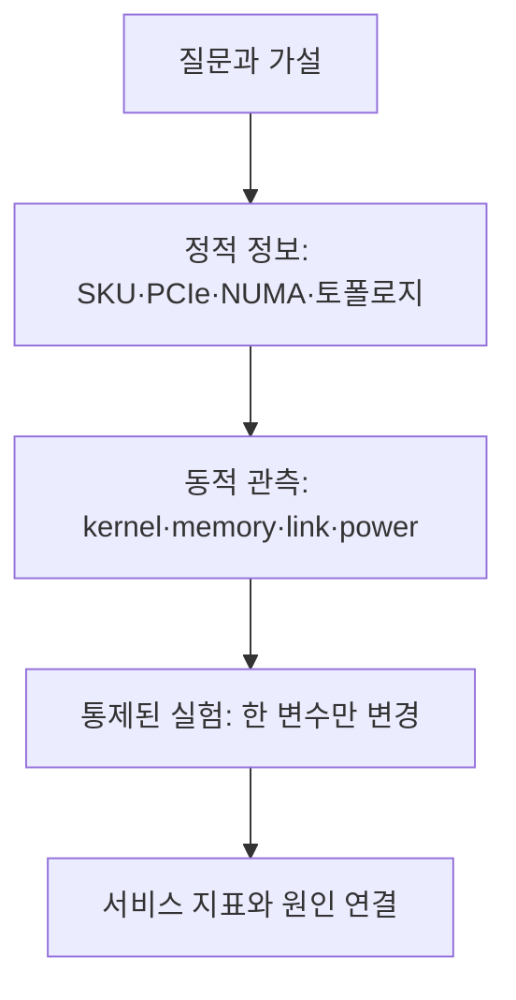
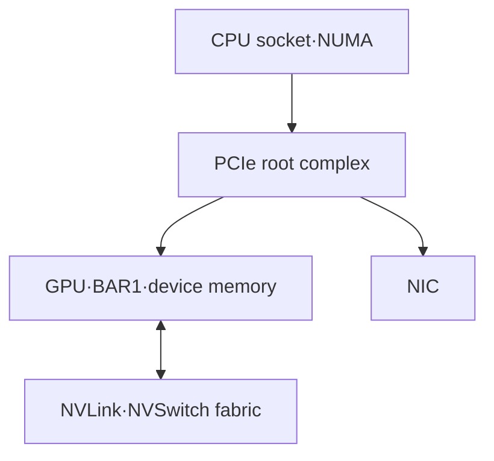

# 08. GPU 구조와 병목을 확인하는 실습

작성일: 2026-08-18  
분류: `study/gpu-architecture`  
대상: NVIDIA 데이터센터 GPU가 있는 Linux 노드

## 1. 실습 원칙

이 실습의 목적은 벤치마크 숫자를 수집하는 것이 아니라 다음 연결을 직접 확인하는 것이다.



먼저 읽기 전용 관측을 하고, 부하를 만드는 실험은 격리된 개발·정비 노드에서만 수행한다. `ncu`, 큰 NCCL buffer, GPU 진단 도구는 kernel을 반복 실행하거나 GPU 메모리와 링크를 점유할 수 있다. 운영 트래픽이 있는 노드에서는 실행하지 않는다.

## 2. 실습 전 기록할 환경

결과를 비교하려면 아래 정보를 같은 파일에 남긴다. 호스트명, 주소, 조직명 같은 민감정보는 제거한다.

```bash
date -u
nvidia-smi --query-gpu=index,name,uuid,compute_cap,memory.total,power.limit,driver_version --format=csv
nvidia-smi topo -m
lspci -Dnn | grep -i -E 'nvidia|vga|3d controller'
uname -r
```

가능하면 다음도 기록한다.

- GPU form factor: SXM, PCIe, NVL 등
- CUDA runtime과 framework 버전
- workload/container 이미지 식별자
- GPU power limit과 application clock 설정
- CPU socket, NUMA node, NIC의 PCIe 위치
- MIG 활성화 여부와 partition 구성

`UUID`는 결과를 로컬에서 GPU별로 연결할 때 유용하지만 외부에 게시할 때는 가린다.

## 3. Lab 0 — 제품명에서 실행 가능성까지 확인

### 질문

이 노드의 제품명, compute capability, driver가 실행할 수 있는 code path는 무엇인가?

### 관측

```bash
nvidia-smi -L
nvidia-smi --query-gpu=name,compute_cap,driver_version,vbios_version --format=csv
nvcc --version
```

CUDA Samples가 설치돼 있다면 `deviceQuery`를 실행한다.

```bash
./deviceQuery
```

### 해석

1. 제품명은 SKU를 알려 주지만 architecture 전체를 뜻하지 않는다.
2. compute capability는 CUDA 명령과 기능의 호환성 경계다.
3. `nvcc`가 보여 주는 toolkit 버전과 `nvidia-smi`의 driver 버전은 서로 다른 구성요소다.
4. framework wheel이 포함한 cubin/PTX와 driver가 해당 GPU를 지원해야 실제 kernel이 실행된다.

### 완료 조건

`GPU SKU → architecture → compute capability → 사용할 수 있는 정밀도·기능`을 한 줄로 설명할 수 있다.

## 4. Lab 1 — PCIe·NUMA·GPU 연결 지도를 만든다

### 질문

CPU memory, GPU, NIC 사이의 실제 데이터 경로는 무엇인가?

### 관측

```bash
nvidia-smi topo -m
nvidia-smi topo -p2p r
nvidia-smi topo -p2p w
lspci -tv
numactl --hardware
```

특정 장치의 PCIe link를 확인할 때는 먼저 `lspci -D`로 BDF를 찾은 뒤 명시적으로 조회한다.

```bash
lspci -s 0000:00:00.0 -vv
```

위 BDF는 예시다. 실제 장치 주소로 바꿔야 한다.

### 작성할 지도



각 edge에 실제 연결 종류와 negotiated width/speed를 적는다. `PIX`, `PXB`, `PHB`, `NODE`, `SYS`, `NV#` 같은 `topo -m` 표기는 동일한 물리 거리를 뜻하지 않는다.

### 완료 조건

- GPU↔GPU P2P가 NVLink인지 PCIe인지 구분한다.
- GPU↔NIC가 같은 PCIe switch/root complex/NUMA에 있는지 설명한다.
- BAR1이 HBM의 별도 복사본이 아니라 framebuffer 일부를 다른 장치 주소 공간에 매핑하는 창임을 설명한다.

## 5. Lab 2 — utilization 용어를 실제로 분리한다

### 질문

`GPU Util`, `SM Active`, `SM Occupancy`, `Tensor Active`, `DRAM Active`는 같은 workload에서 어떻게 다르게 움직이는가?

### 저비용 관측

```bash
nvidia-smi dmon -s pucvmet
```

DCGM이 구성된 환경에서는 지원 가능한 profiling field를 먼저 확인한다.

```bash
dcgmi profile --list
dcgmi dmon -e 1001,1002,1003,1004,1005,1009,1010,1011,1012
```

DCGM 버전에 따라 명령 옵션과 지원 field가 다를 수 있으므로 `dcgmi dmon --help`를 함께 확인한다.

### 세 가지 작은 workload

가능한 framework로 다음 세 workload를 각각 30초 이상 반복한다.

| workload | 의도 | 예상 관측 |
|---|---|---|
| 큰 GEMM | Tensor Core와 data reuse | Tensor/SM activity 상승, shape가 좋으면 높은 연산 처리량 |
| elementwise copy/add | 낮은 arithmetic intensity | DRAM activity가 상대적으로 높고 Tensor activity는 낮음 |
| 작은 kernel 반복 | launch·dispatch 민감 | GPU Util은 높을 수 있으나 SM/Tensor 사용은 낮을 수 있음 |

예상값은 합격 기준이 아니다. GPU 세대, clock, shape, framework 구현에 따라 달라진다.

### 완료 조건

GPU Util이 100%인데 Tensor Core peak와 멀 수 있는 사례를 측정값으로 설명한다.

## 6. Lab 3 — 메모리 대역폭과 P2P 경로를 확인한다

CUDA Samples가 제공되면 다음 도구를 사용한다.

```bash
./bandwidthTest
./p2pBandwidthLatencyTest
```

### 반드시 분리할 경로

| 경로 | 주된 제한 요소 | 함께 볼 정보 |
|---|---|---|
| pageable host → device | staging copy와 PCIe | CPU memory, NUMA, PCIe generation |
| pinned host → device | DMA와 PCIe | negotiated link, NUMA affinity |
| device → device, P2P off | host staging 가능성 | topology, copy path |
| device → device, P2P on | NVLink 또는 PCIe P2P | peer access, topology |
| kernel 내부 HBM access | HBM·cache·access pattern | achieved GB/s, DRAM activity |

제품표의 HBM bandwidth와 `bandwidthTest`의 host↔device 값은 비교 대상이 아니다. 전자는 GPU device memory 경로이고 후자는 주로 PCIe/NVLink-C2C 같은 host link 경로다.

### 측정 기록

$$
B_{effective} = \frac{bytes\ transferred}{elapsed\ time}
$$

양방향 결과는 도구가 두 방향의 합을 표시하는지 방향별 수치를 표시하는지 확인한 후 기록한다.

## 7. Lab 4 — NVLink·NVSwitch·fabric 상태를 확인한다

### 관측

```bash
nvidia-smi topo -m
nvidia-smi nvlink --status
nvidia-smi -q
```

NVSwitch 기반 시스템이고 운영 권한이 있다면 Fabric Manager와 fabric 등록 상태를 확인한다. 배포 방식에 따라 systemd service 이름이나 관리 절차가 다를 수 있다.

```bash
systemctl status nvidia-fabricmanager
```

### 구분할 상태

- 링크가 물리적으로 존재한다.
- 링크가 active 상태다.
- GPU가 fabric에 등록됐다.
- P2P와 collective가 그 경로를 실제 사용한다.
- link error 또는 replay가 증가하지 않는다.

한 조건이 참이라고 나머지가 자동으로 참인 것은 아니다.

## 8. Lab 5 — NCCL collective를 topology와 연결한다

`nccl-tests`를 격리된 노드에서만 실행한다. buffer가 커질수록 GPU memory와 fabric을 많이 사용한다.

RDMA/InfiniBand baseline, `algbw`·`busbw` 식, single-node→multi-node 격리 절차는 [NCCL·집단통신·관측 실습](13-nccl-collectives-observability-labs.md)에서 단계별로 다룬다.

```bash
./build/all_reduce_perf -b 8M -e 1G -f 2 -g 8
```

GPU 수와 최대 buffer는 실험 노드에 맞게 줄인다.

### 기록할 것

- message size별 latency, algorithm bandwidth, bus bandwidth
- GPU 수와 rank mapping
- `NCCL_DEBUG=INFO`에서 선택된 network와 collective algorithm
- GPU↔GPU/NIC topology
- NVLink/PCIe/NIC TX·RX throughput과 error

### 해석 순서

1. 작은 message가 느리면 고정 latency와 launch/synchronization 비중을 의심한다.
2. 큰 message가 plateau에 도달하면 링크와 collective algorithm의 대역폭 상한을 본다.
3. rank 하나만 느리면 평균이 아니라 rank별 CPU affinity, PCIe path, GPU clock, error를 비교한다.
4. `algbw`와 `busbw`는 같은 값이 아니다. `busbw`는 collective별 데이터 이동량을 반영해 정규화한 지표다.

## 9. Lab 6 — 서비스 지표와 GPU 지표를 같은 시간축에 놓는다

### 최소 대시보드

| 층 | 지표 |
|---|---|
| 요청 | request rate, TTFT, ITL/TPOT, E2E latency, error |
| 스케줄러 | running, waiting, actual batch, preemptions |
| KV cache | capacity usage, allocation failure, prefix-cache hit |
| 실행 | GPU Util, SM Active, Tensor Active, DRAM Active |
| 통신 | PCIe/NVLink/NIC TX·RX, NCCL duration |
| 안정성 | power, temperature, clocks, throttle reason, XID/ECC |

모든 exporter와 서비스가 같은 clock source를 사용하도록 하고 scrape interval, aggregation window, missing sample을 기록한다. 1초 평균 GPU metric과 요청별 microsecond trace를 그대로 비교하지 않는다.

### 상관관계가 인과관계가 아닌 예

`DRAM Active`와 ITL이 동시에 올랐어도 원인은 KV cache 읽기 증가가 아니라 batch/sequence mix 변화일 수 있다. input/output token distribution을 고정한 대조 실험이 필요하다.

## 10. Lab 7 — Nsight로 기다림의 위치를 찾는다

### Nsight Systems: 전체 시간축

비운영 환경에서 짧고 대표적인 구간만 캡처한다.

```bash
nsys profile --trace=cuda,nvtx,osrt,cublas,cudnn --output=gpu-timeline your-command
```

확인할 것:

- CPU launch 사이의 빈 구간
- host↔device copy와 kernel overlap
- stream 간 동시 실행
- NCCL collective 전후의 rank 대기
- CUDA Graph replay 여부

### Nsight Compute: 선택한 kernel 내부

```bash
ncu --set full --kernel-name regex:target_kernel --launch-count 1 your-command
```

`--set full`은 overhead가 크다. 먼저 Systems에서 target kernel을 좁히고, 짧은 재현 workload에서 최소 launch만 수집한다. 확인할 축은 achieved occupancy, warp stall reason, memory throughput, cache hit, tensor/FP pipe utilization이다.

DCGM과 Nsight가 같은 profiling counter를 요구하는 환경에서는 관리자와 조율한 뒤 host engine 전체의 profiling 수집을 일시 중지하고, 분석 직후 반드시 복구한다.

```bash
dcgmi profile --pause
# 짧은 Nsight Compute 분석 실행
dcgmi profile --resume
```

`pause`는 선택한 GPU 하나가 아니라 host engine 전체에 영향을 준다.

### 완료 조건

느린 요청을 `CPU/launch`, `kernel compute`, `memory`, `collective`, `idle/queue` 시간으로 나누어 설명한다.

## 11. Lab 8 — vLLM 병목 가설을 한 변수 실험으로 검증한다

### 실험 행렬 예시

| 실험 | 고정 | 변경 | 주 관측 |
|---|---|---|---|
| prefill batching | model, prompt mix, concurrency | batched-token limit | TTFT, queue, Tensor/SM activity |
| TP scale | model, request mix, precision | TP 1→2→4 | token/s, ITL, NCCL, link |
| KV precision | model, request mix | BF16↔FP8 KV | capacity, ITL, DRAM activity, accuracy |
| CUDA Graph | batch/shape set | on↔off | CPU gaps, launch count, ITL |
| speculative decoding | target, traffic | off↔on | accepted tokens, target calls, ITL |

### 실험 기록 템플릿

```text
질문:
가설:
변경한 한 변수:
고정한 조건:
요청 분포:
측정 구간과 warm-up:
request 결과:
GPU·link 결과:
반증되는 관측:
결론:
다음 실험:
```

평균만 기록하지 말고 p50·p95·p99와 time series를 남긴다. 처리량이 증가했지만 p99 ITL이 악화됐다면 두 결과를 모두 보존한다.

## 12. 장애 대응 시 최소 순서

1. 서비스 영향과 시작 시각을 고정한다.
2. GPU별 XID, ECC, row-remap, power, temperature, clock을 확인한다.
3. topology와 fabric/link 상태 변화가 있는지 본다.
4. 같은 시간축의 request, scheduler, GPU, NCCL 지표를 비교한다.
5. 특정 GPU/rank/node에 국한되는지 범위를 줄인다.
6. 재현 가능한 최소 workload를 만든다.
7. 그 뒤에만 profiler 또는 부하 도구를 사용한다.

## 13. 실습 결과의 합격 기준

다음 산출물이 있으면 실습을 완료한 것이다.

- 장치명 대신 구조가 표시된 GPU·CPU·NIC·fabric 연결도
- compute capability와 사용할 code path의 대응표
- compute-heavy, memory-heavy, launch-heavy workload의 지표 비교표
- host/device, P2P, collective 경로별 bandwidth·latency 결과
- 한 요청을 queue·compute·memory·communication으로 분해한 timeline
- 한 변수 실험으로 지지되거나 반증된 병목 가설 하나

## 14. 주요 원문

- NVIDIA, [CUDA Samples](https://github.com/NVIDIA/cuda-samples)
- NVIDIA, [CUDA Best Practices Guide](https://docs.nvidia.com/cuda/cuda-c-best-practices-guide/)
- NVIDIA, [DCGM Profiling Metrics](https://docs.nvidia.com/datacenter/dcgm/latest/learn/modules/profiling.html)
- NVIDIA, [NVIDIA System Management Interface](https://docs.nvidia.com/deploy/nvidia-smi/)
- NVIDIA, [Nsight Systems User Guide](https://docs.nvidia.com/nsight-systems/UserGuide/)
- NVIDIA, [Nsight Compute Profiling Guide](https://docs.nvidia.com/nsight-compute/ProfilingGuide/)
- NVIDIA, [NCCL Tests](https://github.com/NVIDIA/nccl-tests)
- vLLM, [Prometheus metrics](https://docs.vllm.ai/en/latest/api/vllm/v1/metrics/prometheus/)

> 본질: 좋은 GPU 실습은 가장 큰 숫자를 만드는 작업이 아니라, **관측한 숫자가 어느 물리 경로와 실행 단계에서 생겼는지 재현 가능하게 증명하는 작업**이다.
