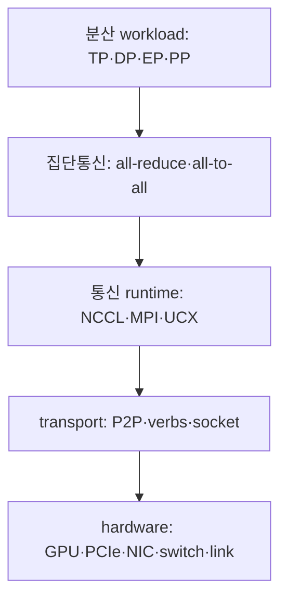
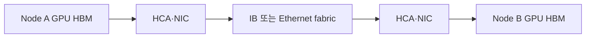
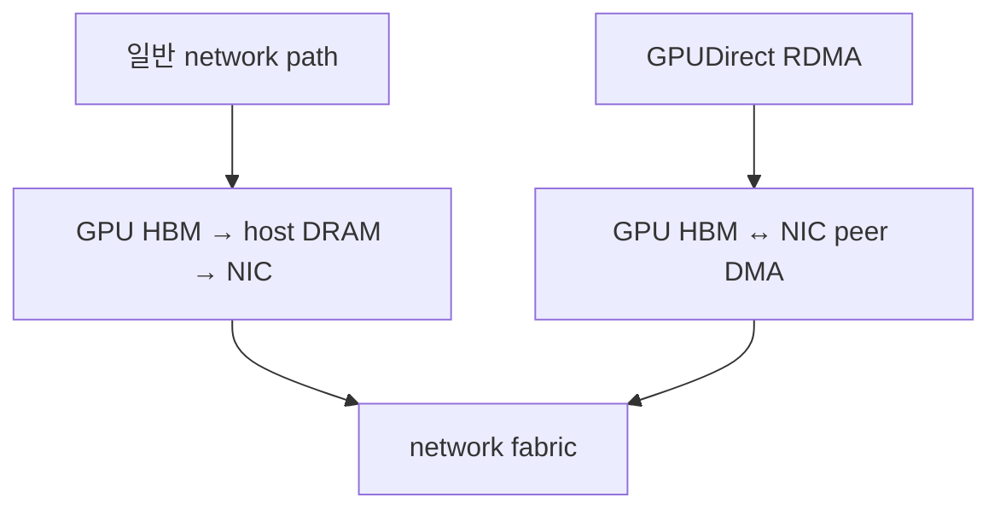

# 09. GPU 통신을 보는 지도: endpoint에서 collective까지

작성일: 2026-08-18  
선행 문서: [메모리와 데이터 이동](03-memory-and-data-movement.md)  
다음 문서: [PCIe·NVLink·NVSwitch](10-pcie-nvlink-nvswitch.md)

## 1. 통신 기술 이름보다 먼저 경로를 그린다

GPU 통신 문제는 여러 계층의 이름이 한 문장에 섞이면서 어려워진다. `NVLink`, `InfiniBand`, `RDMA`, `GPUDirect RDMA`, `NCCL`은 서로 대체 관계가 아니다.

| 질문 | 답을 주는 계층 | 대표 용어 |
|---|---|---|
| 어느 메모리에서 어느 메모리로 가는가? | endpoint·memory | GPU HBM, host DRAM, NIC buffer |
| 누가 전송을 시작하고 진행하는가? | execution·DMA | CPU core, GPU copy engine, NIC DMA engine |
| 장치가 어떤 물리 경로로 연결되는가? | local interconnect·fabric | PCIe, NVLink, NVSwitch, InfiniBand, Ethernet |
| 원격 메모리를 어떻게 지정하고 보호하는가? | transport·memory semantics | verbs, MR, key, QP, RDMA Read/Write |
| 여러 rank의 데이터를 어떤 패턴으로 합치는가? | communication library | NCCL, MPI, UCX, NVSHMEM |
| 실제 workload가 어떤 집단 연산을 요구하는가? | distributed algorithm | all-reduce, all-gather, reduce-scatter, all-to-all |

장애를 볼 때는 아래에서 위로 확인하고, 성능을 설계할 때는 위에서 아래로 내려간다.

## 2. 먼저 세 범위를 분리한다

### 2.1 GPU 내부

SM이 register, shared memory, L2, HBM 사이에서 데이터를 이동한다. 주된 관측값은 cache hit, memory throughput, warp stall이다. 이것은 보통 `GPU 간 통신`이라고 부르지 않는다.

### 2.2 노드 내부 GPU↔GPU·GPU↔NIC

- GPU↔GPU: NVLink/NVSwitch 또는 PCIe P2P
- GPU↔NIC: PCIe peer path와 GPUDirect RDMA
- GPU↔CPU memory: PCIe 또는 coherent C2C link

같은 서버 안에서도 GPU와 NIC가 다른 PCIe root complex나 NUMA node에 있으면 경로가 길어진다.

### 2.3 노드 간

NIC에서 나온 packet이 InfiniBand 또는 Ethernet fabric을 거쳐 원격 NIC에 도착한다. GPU buffer를 직접 등록했다면 양쪽 NIC가 GPU memory를 DMA할 수 있고, 그렇지 않으면 host memory staging이 들어갈 수 있다.

이 그림의 GPU↔NIC 구간은 PCIe/C2C topology 문제이고, NIC↔NIC 구간은 network fabric 문제다. 한쪽만 빠르다고 전체 경로가 빠른 것은 아니다.

## 3. CPU를 우회한다는 말의 정확한 뜻

`CPU를 거치지 않는다`는 표현은 다음 셋을 분리해야 한다.

| 구분 | 우회 가능 여부 | 설명 |
|---|---|---|
| CPU core가 byte를 직접 복사 | DMA로 우회 가능 | device engine이 data movement를 진행한다. |
| CPU DRAM bounce buffer | P2P/GDRDMA로 우회 가능 | payload가 host memory에 중간 복사되지 않는다. |
| CPU가 control plane에 관여 | 보통 여전히 관여 | allocation, registration, QP setup, kernel launch를 host가 준비할 수 있다. |

따라서 GPUDirect RDMA도 일반적으로 host software가 memory registration과 connection setup을 수행한다. 다만 data plane의 payload가 GPU HBM↔NIC 사이에서 직접 움직인다. NCCL device API나 GPUNetIO 같은 GPU-initiated 방식은 control path 일부도 GPU 쪽으로 옮기지만, 별도 기능·버전·프로그래밍 모델이다.

## 4. 다섯 가지 데이터 경로

### 4.1 CPU copy

CPU core가 source를 읽고 destination에 쓴다. 작은 control data에는 충분하지만 큰 tensor의 주 경로로 쓰면 CPU cycle과 memory bandwidth를 소모한다.

### 4.2 DMA

CPU는 descriptor를 준비하고 device DMA engine이 전송한다. `DMA`는 원격 네트워크 기술이 아니라 device가 memory bus transaction을 수행하는 일반 메커니즘이다.

### 4.3 PCIe P2P

한 PCIe endpoint가 다른 endpoint의 BAR로 transaction을 보낸다. GPU↔GPU 또는 GPU↔NIC가 host DRAM을 staging하지 않을 수 있다. 같은 switch/root topology, ACS, IOMMU, platform 지원이 중요하다.

### 4.4 RDMA

원격 NIC가 등록된 memory region을 network를 통해 읽거나 쓴다. kernel bypass, zero-copy, one-sided operation은 RDMA가 제공할 수 있는 서로 다른 특성이지 항상 같은 말은 아니다.

### 4.5 GPUDirect RDMA

RDMA의 local/remote registered buffer가 GPU memory이고 NIC가 그 memory를 PCIe peer로 DMA하는 NVIDIA 경로다. `RDMA`와 `GPU P2P`가 만나는 지점으로 이해하면 된다.

## 5. endpoint, link, switch, protocol, API를 구분한다

예를 들어 `ConnectX-7 InfiniBand로 NCCL all-reduce를 한다`는 문장을 풀면 다음과 같다.

| 범주 | 실제 항목 |
|---|---|
| source/destination endpoint | GPU memory와 ConnectX HCA |
| local attachment | GPU와 HCA를 연결한 PCIe topology |
| network link | NDR InfiniBand link |
| switch fabric | Quantum 계열 IB switch와 cable/optics |
| transport/API | IB verbs, RC QP 등 |
| GPU direct path | DMA-BUF 또는 `nvidia-peermem` 기반 GDRDMA |
| collective runtime | NCCL |
| operation | all-reduce |

어느 항목 하나가 빠지면 software fallback이나 staging이 생길 수 있다.

## 6. 대역폭 숫자를 읽는 공통 규칙

### 6.1 bit/s와 byte/s

network port는 보통 decimal bit/s, application은 GB/s 또는 GiB/s를 사용한다.

$$
400\ \text{Gb/s} \div 8 = 50\ \text{GB/s}
$$

$$
800\ \text{Gb/s} \div 8 = 100\ \text{GB/s}
$$

이는 encoding, packet header, link management, flow control, software overhead를 빼기 전 line-rate 환산이다. `400 Gb/s NIC이므로 GPU buffer에서 50 GB/s가 나와야 한다`는 결론은 성립하지 않는다.

### 6.2 decimal과 binary

- 1 GB = $10^9$ bytes
- 1 GiB = $2^{30}$ bytes

도구가 어느 단위를 쓰는지 확인하지 않으면 약 7.4% 차이를 성능 손실로 오해할 수 있다.

### 6.3 방향과 집계 범위

| 표기 | 반드시 물을 질문 |
|---|---|
| per direction | 송신과 수신 중 어느 방향인가? |
| bidirectional | 두 방향을 동시에 더한 값인가? |
| per port | port 하나인가, adapter 전체인가? |
| aggregate | 모든 port/link/GPU의 합인가? |
| per rank | 각 rank 결과인가, 평균·최솟값인가? |

NVLink의 GPU당 `bidirectional aggregate`, switch의 `aggregate switching capacity`, NIC product family의 `up to`를 한 rank의 단방향 payload 처리량과 직접 비교하지 않는다.

### 6.4 latency와 bandwidth의 관계

단순 모델은 다음과 같다.

$$
T(S) \approx T_{fixed} + \frac{S}{B_{effective}}
$$

- 작은 message: setup, kernel launch, doorbell, synchronization 같은 $T_{fixed}$가 지배
- 큰 message: $B_{effective}$가 지배

그래서 8 B ping-pong의 latency가 좋은 장치와 1 GiB collective의 throughput이 좋은 구성이 반드시 같지 않다.

## 7. collective에서 byte 수는 tensor 크기와 같지 않다

AllReduce는 rank별 input $S$ byte를 한 번 보내는 작업이 아니다. ring 방식의 이상적인 rank당 이동량은 대략 다음과 같다.

$$
V_{rank} = 2S\frac{n-1}{n}
$$

따라서 NCCL tests는 다음 두 값을 구분한다.

- `algbw`: 사용자 관점의 $S/t$
- `busbw`: collective별 실제 이동량 계수를 적용한 정규화 bandwidth

정확한 식과 실습은 [NCCL·집단통신·관측 실습](13-nccl-collectives-observability-labs.md)에서 다룬다.

## 8. LLM parallelism과 통신 패턴

| 병렬화 | 자주 나타나는 통신 | 성능 민감점 |
|---|---|---|
| Tensor Parallelism | all-reduce, all-gather, reduce-scatter | layer마다 반복되는 작은/중간 collective latency와 bandwidth |
| Data Parallelism | gradient all-reduce/reduce-scatter | 큰 message throughput, compute overlap |
| Expert Parallelism | all-to-all | 불균형한 token 분배, many-to-many incast, tail rank |
| Pipeline Parallelism | point-to-point activation send/recv | stage bubble, message latency, rank 배치 |
| Disaggregated serving | KV/activation transfer | GPU memory direct path, request별 tail latency |

같은 총 byte라도 all-to-all은 모든 rank가 서로 다른 destination과 통신하므로 all-reduce와 switch·routing·queueing 요구가 다르다.

## 9. Scale-up과 scale-out

| 범위 | 의미 | 대표 기술 |
|---|---|---|
| Scale-up | 하나의 고대역폭 GPU domain을 크게 만든다 | NVLink, NVSwitch, NVLink Switch system |
| Scale-out | 여러 node/rack을 network로 연결한다 | InfiniBand, RoCE Ethernet, HCA, network switch |

최근 rack-scale NVLink 시스템은 server 경계를 넘어 하나의 NVLink domain을 만들 수 있어 `intra-node = scale-up`이라는 등식이 더는 항상 맞지 않는다. 경계는 chassis가 아니라 실제 fabric과 memory-access semantics로 정한다.

## 10. 문제를 계층별로 분리하는 질문

1. 어떤 collective 또는 point-to-point operation이 느린가?
2. message size와 rank 수는 얼마인가?
3. source/destination buffer는 GPU HBM인가 host DRAM인가?
4. GPU↔GPU, GPU↔NIC topology는 `NVL/PIX/PXB/PHB/SYS` 중 무엇인가?
5. NCCL이 P2P, SHM, IB/RoCE, socket 중 무엇을 선택했는가?
6. GDRDMA가 실제 payload에 사용됐는가?
7. link가 기대 속도와 폭으로 올라왔는가?
8. retry, CRC, symbol error, congestion, pause/ECN counter가 증가하는가?
9. 평균이 아니라 특정 rank·port·message size만 느린가?
10. workload compute와 communication이 overlap되는가?

## 11. 자가 점검

1. RDMA와 DMA는 같은 말인가?
2. GPUDirect RDMA가 CPU를 완전히 제거한다는 설명은 왜 부정확한가?
3. 800 Gb/s를 100 GB/s로 바꾼 뒤 추가로 확인할 조건은 무엇인가?
4. NVLink와 NCCL은 어느 계층의 기술인가?
5. TP와 EP가 같은 fabric에서도 서로 다른 병목을 만드는 이유는 무엇인가?

## 12. 주요 원문

- NVIDIA, [NCCL Overview](https://docs.nvidia.com/deeplearning/nccl/user-guide/docs/overview.html)
- NVIDIA, [GPUDirect RDMA Documentation](https://docs.nvidia.com/cuda/gpudirect-rdma/)
- NVIDIA, [NCCL Tests Performance](https://github.com/NVIDIA/nccl-tests/blob/master/doc/PERFORMANCE.md)
- NVIDIA, [NVLink and NVLink Switch](https://www.nvidia.com/en-us/data-center/nvlink/)
- linux-rdma, [rdma-core](https://github.com/linux-rdma/rdma-core)

> 본질: GPU 통신을 이해하는 첫 단계는 제품명을 외우는 것이 아니라, **source memory → local interconnect → NIC·switch → remote interconnect → destination memory의 경로와 각 계층의 책임을 분리하는 것**이다.
