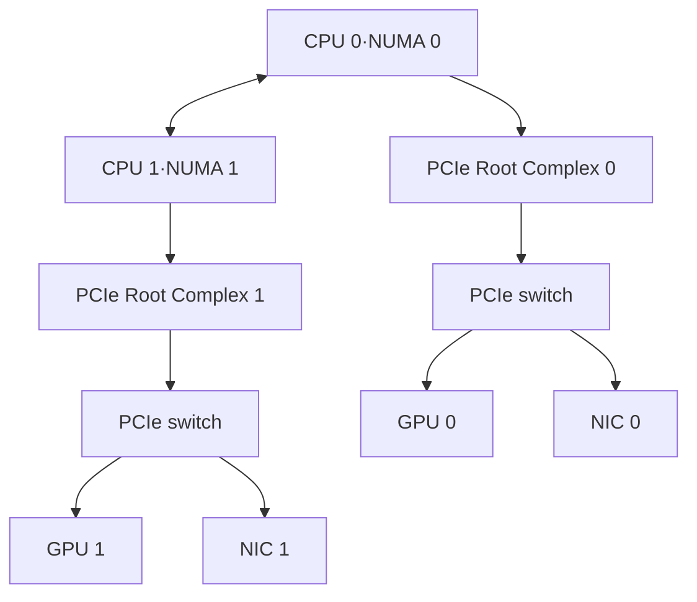
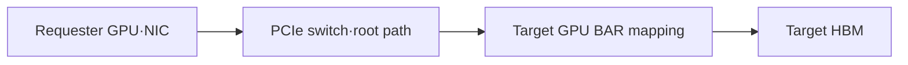
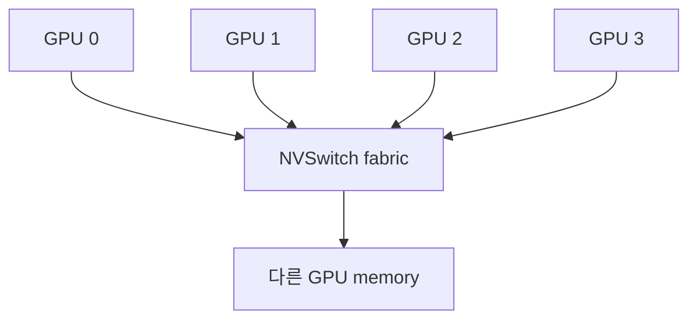

# 10. 노드 내부 통신: PCIe, NVLink, NVSwitch와 하드웨어 구성

작성일: 2026-08-18  
선행 문서: [GPU 통신을 보는 지도](09-gpu-communication-mental-model.md)  
다음 문서: [RDMA와 GPUDirect RDMA](11-rdma-and-gpudirect-rdma.md)

## 1. 같은 GPU를 사도 시스템 구조가 다르면 통신이 달라진다

GPU SKU는 연산기와 memory 특성을 설명하지만 GPU 간 통신은 form factor와 system wiring이 결정한다.

- PCIe card 여러 장을 CPU root complex에 연결한 서버
- PCIe switch 아래 GPU와 NIC를 묶은 서버
- HGX baseboard처럼 GPU들을 NVSwitch로 연결한 서버
- Grace CPU와 GPU를 coherent NVLink-C2C로 묶은 Superchip
- NVL72처럼 여러 compute tray를 NVLink Switch로 묶은 rack-scale system

따라서 `H100을 사용한다`만으로 NVLink, NVSwitch, GPU↔NIC topology를 알 수 없다. H100 PCIe와 H100 SXM 기반 HGX 시스템은 같은 칩 세대라도 통신 구조가 다르다.

## 2. 전형적인 dual-socket PCIe 구조



GPU 0↔NIC 0은 같은 PCIe switch 아래라 짧지만 GPU 0↔NIC 1은 host bridge와 CPU inter-socket link를 건널 수 있다. `NIC 총대역폭`이 충분해도 rank와 NIC를 잘못 대응하면 remote NUMA path가 병목이 된다.

## 3. PCIe를 구성하는 하드웨어

| 구성요소 | 역할 | GPU 통신에서 보는 항목 |
|---|---|---|
| Endpoint | GPU, NIC, NVMe 같은 장치 | 지원 generation, lane width, BAR, P2P 기능 |
| Root Complex | CPU/SoC memory system과 PCIe를 연결 | 어느 socket·NUMA에 속하는가 |
| PCIe switch | 여러 endpoint를 fan-out·route | peer path, uplink oversubscription, hop 수 |
| Retimer/riser/backplane | 고속 신호를 물리적으로 전달 | link downtraining, lane error, signal integrity |
| IOMMU | device DMA 주소 변환·격리 | peer mapping과 translation mode |
| ACS | PCIe traffic의 접근·routing 정책 | P2P를 upstream root로 redirect하는가 |

### 3.1 link generation과 width

한 방향 raw/payload 근사 상한은 generation과 lane 수로 정해진다.

| PCIe link | x16 한 방향 근사 | 양방향 합계 근사 |
|---|---:|---:|
| Gen4 x16 | 약 32 GB/s | 약 64 GB/s |
| Gen5 x16 | 약 64 GB/s | 약 128 GB/s |
| Gen6 x16 | 약 128 GB/s | 약 256 GB/s |

Gen6는 PAM4와 FLIT mode 등 이전 세대와 다른 encoding/forward-error-correction을 사용한다. 표는 비교용 상한이며 application payload는 더 낮다. GPU, CPU, switch, slot, retimer가 모두 같은 세대를 지원해야 하고 실제 negotiated width/speed를 확인해야 한다.

### 3.2 switch bandwidth와 oversubscription

endpoint가 각각 x16이어도 switch uplink가 endpoint 합보다 좁으면 동시에 통신할 때 경합한다.

$$
Oversubscription = \frac{\sum endpoint\ downlink\ capacity}{uplink\ capacity}
$$

P2P가 switch 내부에서 끝나는 traffic과 host memory로 올라가는 traffic은 병목 위치가 다르다. block diagram과 실제 traffic matrix를 함께 봐야 한다.

## 4. PCIe P2P transaction과 BAR1

PCIe P2P에서 requester는 peer 장치의 BAR에 매핑된 주소로 Memory Read/Write transaction을 보낸다. GPU memory 전체가 CPU 주소 공간에 항상 평면적으로 보이는 것은 아니며 driver가 필요한 page를 pin하고 BAR aperture에 mapping할 수 있다.



### BAR1을 읽을 때 주의할 점

- BAR1 total은 HBM capacity와 다르다.
- BAR1 used는 전송된 byte counter가 아니다.
- Resizable BAR는 addressable aperture 조건을 개선할 수 있지만 P2P 성능을 자동 보장하지 않는다.
- mapping과 pinning은 비용이 있으므로 registration cache가 중요할 수 있다.

## 5. ACS와 IOMMU가 경로를 바꾸는 방식

### 5.1 ACS

PCI Access Control Services는 장치 간 traffic을 분리하고 upstream으로 redirect할 수 있다. 보안·가상화에는 유용하지만, 같은 switch 아래 peer transaction도 root complex로 올라가게 해 P2P/GDRDMA 성능 저하 또는 hang을 만들 수 있다.

읽기 전용 확인 예시는 다음과 같다.

```bash
lspci -vvv | grep -E 'ACSCap|ACSCtl'
```

`SrcValid+` 같은 값 하나만 보고 무조건 끄지 않는다. platform vendor의 validated configuration, virtualization/isolation 요구, IOMMU mode를 함께 검토해야 한다.

### 5.2 IOMMU

IOMMU는 device-visible I/O virtual address를 physical address로 변환하고 isolation을 제공한다. peer-memory 지원, address translation mode, bare-metal/VM passthrough 여부에 따라 P2P 가능성이 달라진다. `iommu=off`를 범용 처방처럼 적용하면 isolation과 운영 안정성을 해칠 수 있다.

## 6. `nvidia-smi topo -m`의 거리 표기

| 표기 | 대략적인 경로 | 해석 |
|---|---|---|
| `NV#` | NVLink #개 | GPU 사이 active NVLink 연결 |
| `PIX` | PCIe switch 하나 | 가장 가까운 PCIe peer 범주 |
| `PXB` | 여러 PCIe bridge/switch | host bridge 전의 여러 hop |
| `PHB` | PCIe host bridge | CPU root complex를 통과 |
| `NODE` | host bridge를 지나지만 같은 NUMA node | platform 내부 host path |
| `SYS` | NUMA/SMP interconnect까지 통과 | 보통 가장 먼 local path |
| `X` | 자기 자신 | 비교 대상 없음 |

이 표기는 latency나 GB/s를 직접 뜻하지 않는다. 같은 `PXB`라도 switch 세대, uplink, 경쟁 traffic이 다를 수 있다. `nvidia-smi topo -m`의 NIC 열과 CPU/NUMA affinity도 함께 읽는다.

## 7. NVLink는 무엇을 바꾸는가

NVLink는 NVIDIA GPU/CPU endpoint 사이의 고대역폭 interconnect다. PCIe를 완전히 없애는 기술이 아니라 GPU P2P와 scale-up fabric에 더 넓은 경로와 GPU memory semantics를 제공한다.

| 세대 | 대표 GPU/system | GPU당 공개 bidirectional aggregate | 주의점 |
|---|---|---:|---|
| NVLink 2 | V100 SXM | 최대 300 GB/s | form factor와 link 수에 따라 다름 |
| NVLink 3 | A100 SXM | 최대 600 GB/s | PCIe SKU와 동일시하지 않음 |
| NVLink 4 | H100/H200 SXM | 최대 900 GB/s | 한 방향은 aggregate의 절반 개념 |
| NVLink 5 | B200/B300, GB200/GB300 | 최대 1.8 TB/s | NVLink Switch domain 구성에 따라 범위가 달라짐 |
| NVLink 6 | Rubin platform | 공개 기준 최대 3.6 TB/s | 2026 공개 플랫폼 수치, 실제 SKU 검증 필요 |

모두 marketing aggregate다. `GPU당 최대`이지 임의의 GPU pair가 한 방향으로 그 값을 달성한다는 뜻이 아니다. protocol overhead, routing, operation, concurrency와 collective algorithm이 실효값을 결정한다.

## 8. NVSwitch는 왜 필요한가

GPU $n$개를 모든 pair로 직접 연결하면 필요한 edge 수가 $n(n-1)/2$로 증가한다. NVSwitch는 각 GPU의 NVLink를 switch fabric에 연결해 다수 GPU 간 all-to-all path를 만든다.



NVSwitch가 제공하는 것은 다음이다.

- 여러 GPU endpoint 사이의 routing
- point-to-point wiring 폭발 억제
- collective용 multicast·reduction 기능을 지원하는 세대의 in-network engine
- 균일한 scale-up domain을 만들 수 있는 system building block

NVSwitch가 HBM allocation을 자동으로 하나로 합치지는 않는다. CUDA/NCCL/application은 여전히 rank와 device memory ownership을 관리한다.

## 9. NVLink SHARP와 InfiniBand SHARP를 구분한다

둘 다 reduction을 fabric 안에서 가속하지만 물리 domain이 다르다.

| 이름 | 동작 위치 | 대표 범위 | NCCL 관련 이름 |
|---|---|---|---|
| NVLink SHARP | NVSwitch/NVLink domain | scale-up GPU domain | NVLS |
| InfiniBand SHARP | Quantum 계열 IB switch fabric | node 간 scale-out | SHARP plugin/network offload |

Hopper 이후 3세대 NVSwitch 시스템에서 NCCL은 NVLS를 활용할 수 있다. multi-node collective는 node 내부 NVLS와 node 간 IB SHARP/tree를 계층적으로 조합할 수 있다. 두 기능을 `NVSwitch가 InfiniBand packet을 reduce한다`고 설명하면 계층이 섞인다.

## 10. NVLink-C2C는 GPU↔GPU NVLink와 목적이 다르다

NVLink-C2C는 package/module 수준에서 NVIDIA CPU와 GPU 또는 die 사이를 coherent하게 연결한다.

| 경로 | 주 목적 | memory 관점 |
|---|---|---|
| PCIe | 범용 peripheral I/O | 명시적 copy·DMA 중심, platform coherence는 별도 |
| GPU↔GPU NVLink | GPU P2P·scale-up | peer memory access와 collective |
| NVLink-C2C | CPU↔GPU coherent coupling | unified addressability/coherence를 강화 |

Grace Hopper/Grace Blackwell은 CPU LPDDR과 GPU HBM 사이의 coherent path를 제공한다. 그렇다고 두 memory가 latency와 bandwidth가 동일한 하나의 물리 memory가 되는 것은 아니다. data placement와 remote access cost는 여전히 존재한다.

## 11. 하드웨어 제품·아키텍처를 어떻게 선택하는가

| 하드웨어 형태 | 노드 내부 GPU 통신 | host 연결 | scale-out 연결 | 적합한 상황 |
|---|---|---|---|---|
| 범용 PCIe GPU 서버 | PCIe P2P, topology 의존 | PCIe | 별도 HCA/NIC | 독립 inference, 비용·구성 유연성 |
| HGX 8-GPU baseboard | NVLink + NVSwitch | CPU와 PCIe | OEM이 HCA/NIC 구성 | 높은 TP·학습 scale-up |
| DGX system | HGX 계열 GPU fabric을 완성 시스템으로 제공 | 검증된 CPU·PCIe topology | 모델별 ConnectX/BlueField | 검증된 통합 구성 필요 |
| Grace Hopper/Blackwell Superchip | 구성에 따라 GPU fabric | CPU↔GPU NVLink-C2C | 별도 scale-out fabric | coherent CPU-GPU memory path 필요 |
| GB200/GB300 NVL72 | rack-scale NVLink Switch domain | compute tray 내부 C2C/PCIe | 별도 IB/Ethernet로 rack 간 확장 | 매우 큰 model parallel domain |

제품명만으로 결정하지 말고 다음을 block diagram에서 확인한다.

1. GPU form factor와 GPU당 active NVLink 수
2. NVSwitch 세대와 non-blocking 범위
3. CPU socket별 PCIe lane과 root complex
4. GPU↔NIC pairing, adapter port 수, rail 구성
5. PCIe switch uplink oversubscription
6. rack-scale NVLink domain과 scale-out network의 경계
7. 전력·냉각이 sustained clock을 유지할 수 있는지

## 12. topology 확인 명령

```bash
nvidia-smi topo -m
nvidia-smi topo -p2p p
nvidia-smi topo -p2p n
nvidia-smi nvlink --status
lspci -tv
lspci -Dnn
numactl --hardware
```

특정 GPU의 negotiated PCIe 상태는 실제 BDF를 넣어 확인한다.

```bash
lspci -vv -s <GPU_BDF>
nvidia-smi --query-gpu=pci.bus_id,pcie.link.gen.current,pcie.link.gen.max,pcie.link.width.current,pcie.link.width.max --format=csv
```

idle일 때 power management로 current speed가 낮을 수 있으므로 부하 중 재확인한다.

## 13. topology를 바꿔 검증하는 실험

| 실험 | 고정 | 비교 | 해석 |
|---|---|---|---|
| GPU pair P2P | message size, clock | NVLink pair vs PCIe pair | local interconnect 차이 |
| GPU↔NIC | NIC/port, buffer | PIX/PXB vs PHB/SYS GPU | GDR topology 영향 |
| rank ordering | workload, GPU 수 | topology-aware vs 순차 mapping | collective route와 contention |
| P2P on/off | GPU pair | CUDA P2P vs host staging | direct path 이득 |

CUDA Samples의 `p2pBandwidthLatencyTest`는 기능과 상대 비교에 유용하지만 NCCL collective나 실서비스 pattern 전체를 대표하지 않는다.

## 14. 흔한 오판

| 오판 | 실제 확인할 것 |
|---|---|
| NVLink 지원 GPU면 NVLink가 연결돼 있다 | SKU·form factor·system wiring, link state |
| NVSwitch가 있으면 모든 GPU memory가 한 pool이다 | device별 allocation과 UVA/peer mapping |
| `PIX`면 항상 최대 성능이다 | switch generation, uplink, ACS, 경쟁 traffic |
| BAR1이 크면 P2P가 빠르다 | peer support, registration, topology, workload |
| bidirectional 900 GB/s는 한 방향 900 GB/s다 | 방향별 합계와 operation pattern |
| PCIe Gen5 GPU가 Gen5 속도로 동작한다 | negotiated generation·width와 slot wiring |

## 15. 자가 점검

1. H100 PCIe와 H100 SXM 시스템의 GPU 간 통신은 왜 다를 수 있는가?
2. `PXB`와 `PHB`의 물리 경로 차이는 무엇인가?
3. NVSwitch와 PCIe switch는 각각 어떤 fabric을 switch하는가?
4. NVLink-C2C의 coherence가 동일 latency를 뜻하지 않는 이유는 무엇인가?
5. NVLS와 IB SHARP를 어떻게 구분하는가?

## 16. 주요 원문

- NVIDIA, [NVIDIA System Management Interface](https://docs.nvidia.com/deploy/nvidia-smi/)
- NVIDIA, [NCCL GPU Troubleshooting](https://docs.nvidia.com/deeplearning/nccl/user-guide/docs/troubleshooting/gpu_troubleshooting.html)
- NVIDIA, [NVLink and NVLink Switch](https://www.nvidia.com/en-us/data-center/nvlink/)
- NVIDIA, [Hopper Architecture In-Depth](https://developer.nvidia.com/blog/nvidia-hopper-architecture-in-depth/)
- NVIDIA, [Inside NVIDIA Blackwell Ultra](https://developer.nvidia.com/blog/inside-nvidia-blackwell-ultra-the-chip-powering-the-ai-factory-era/)
- NVIDIA, [Inside the NVIDIA Vera Rubin Platform](https://developer.nvidia.com/blog/inside-the-nvidia-rubin-platform-six-new-chips-one-ai-supercomputer/)
- NVIDIA, [Fabric Manager User Guide](https://docs.nvidia.com/datacenter/tesla/fabric-manager-user-guide/)

> 본질: 노드 내부 GPU 통신 성능은 GPU 칩 이름이 아니라, **endpoint가 어느 link와 switch를 몇 번 거쳐 연결됐는지, 그 경로가 실제로 peer transaction을 허용하는지**가 결정한다.
