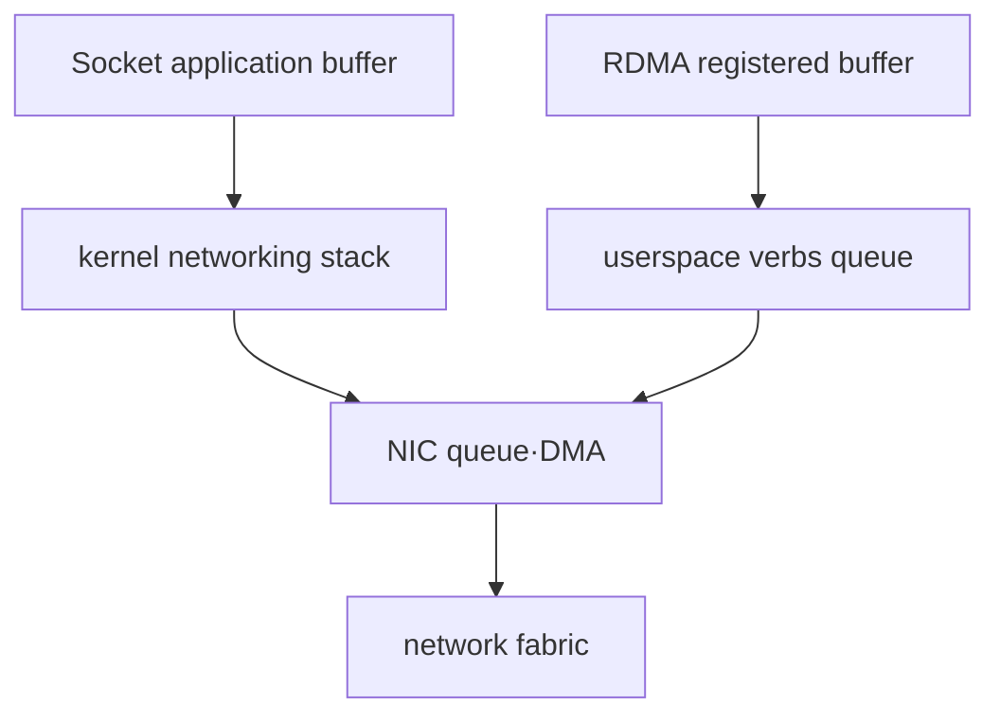
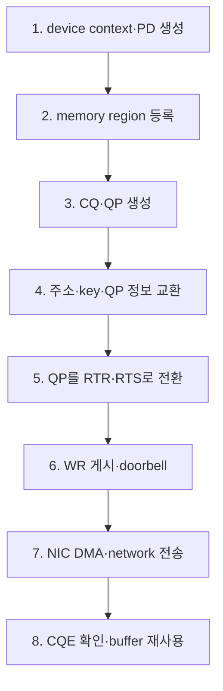
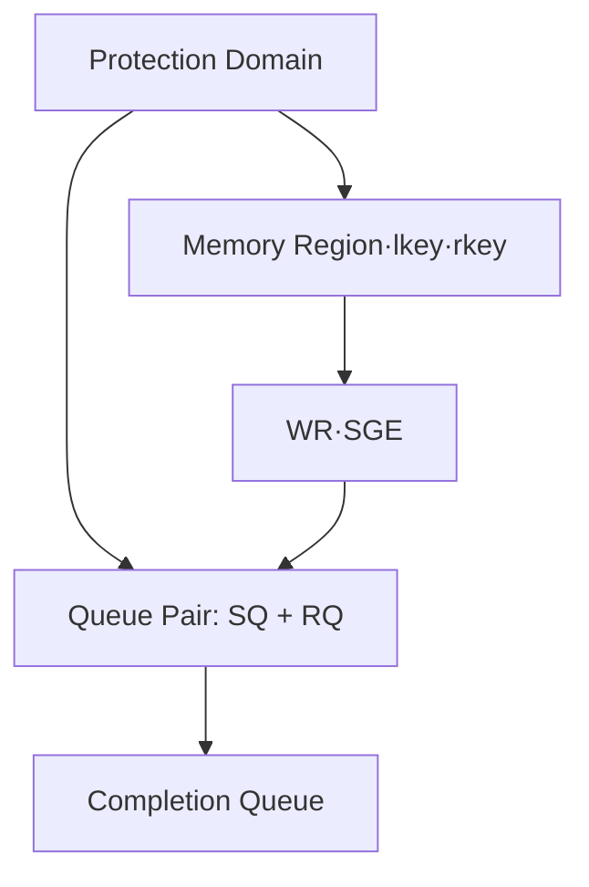
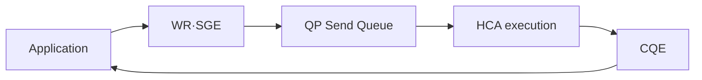
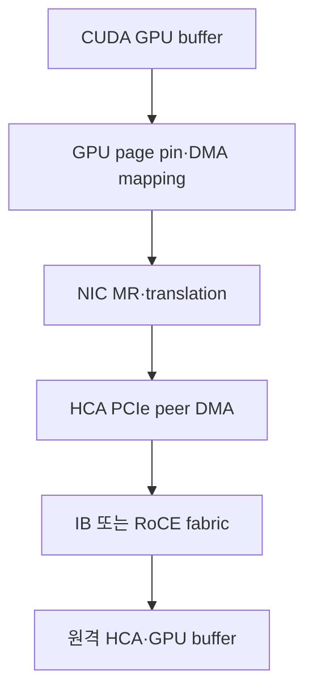
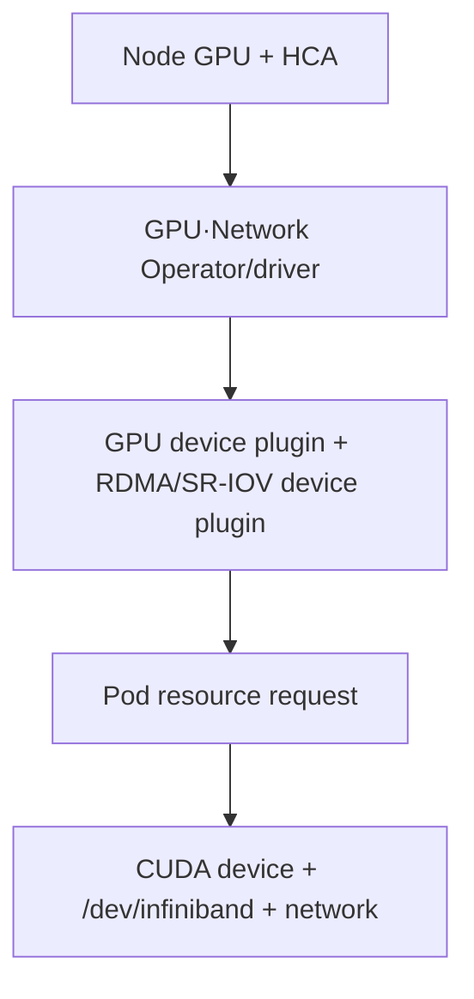

# 11. RDMA와 GPUDirect RDMA: verbs에서 GPU HBM까지

작성일: 2026-08-18  
선행 문서: [PCIe·NVLink·NVSwitch](10-pcie-nvlink-nvswitch.md)  
다음 문서: [InfiniBand·RoCE와 하드웨어](12-infiniband-roce-and-hardware.md)

## 1. RDMA는 network 이름이 아니라 memory-access 모델이다

Remote Direct Memory Access(RDMA)는 한 host의 memory와 다른 host의 memory 사이 data movement를 NIC hardware가 수행하도록 하는 기술군이다.

- CPU core가 payload를 반복 복사하지 않게 할 수 있다.
- application buffer를 NIC가 직접 DMA하도록 등록할 수 있다.
- userspace가 NIC queue에 work를 게시하는 kernel-bypass data path를 제공할 수 있다.
- remote CPU가 operation마다 `recv()`를 호출하지 않는 one-sided access가 가능하다.

그러나 이 네 특성은 구분해야 한다.

| 표현 | 정확한 의미 | 자동 보장되지 않는 것 |
|---|---|---|
| Direct Memory Access | NIC가 memory bus transaction을 수행 | 원격 통신, GPU memory 지원 |
| Kernel bypass | steady-state data path에서 syscall을 줄임 | control plane까지 kernel 불필요 |
| Zero-copy | application staging copy를 줄임 | NIC 내부 buffer까지 물리적 copy가 0 |
| One-sided | remote CPU의 operation별 개입 없이 remote memory 접근 | remote application의 동기화·프로토콜 불필요 |

## 2. 일반 socket path와 RDMA path

아래 그림은 개념을 단순화한 것이다. OS와 NIC의 실제 implementation에는 batching, offload, page cache, copy avoidance가 추가될 수 있다.



RDMA의 장점은 protocol processing을 모두 없애는 것이 아니라 NIC와 userspace queue가 많은 data-plane 작업을 맡아 CPU overhead와 copy를 줄이는 데 있다.

## 3. RDMA가 동작하는 전체 순서



RDMA CM을 쓰면 address resolution과 connection setup 일부를 추상화할 수 있다. 실제 data transfer는 `libibverbs`와 provider driver가 queue를 통해 수행한다.

## 4. verbs의 핵심 객체

| 객체 | 원문 | 역할 |
|---|---|---|
| Device/Context | RDMA device context | HCA를 열고 capability와 resource에 접근 |
| PD | Protection Domain | QP와 MR을 하나의 보호 범위로 묶음 |
| MR | Memory Region | NIC가 DMA할 memory range, access permission, key |
| CQ | Completion Queue | 완료된 work의 CQE를 application에 전달 |
| QP | Queue Pair | Send Queue와 Receive Queue의 쌍 |
| WR/WQE | Work Request/Queue Element | 수행할 send/read/write 등의 descriptor |
| SGE | Scatter/Gather Element | local buffer 주소, 길이, local key |
| AH | Address Handle | datagram destination path 정보 |
| SRQ | Shared Receive Queue | 여러 QP가 receive buffer pool을 공유 |

관계를 그리면 다음과 같다.



## 5. memory registration과 key

NIC는 임의의 virtual address에 DMA하지 못한다. application은 buffer를 MR로 등록하고 NIC/driver는 다음을 준비한다.

- virtual page를 DMA 중 안정적으로 사용할 수 있게 pin 또는 map
- NIC가 이해할 address translation 정보
- local access용 `lkey`
- remote access를 허용할 때 상대에게 전달할 `rkey`
- read, write, atomic 같은 access permission

### 5.1 `lkey`와 `rkey`

- `lkey`: local NIC가 SGE의 local buffer를 검증할 때 사용
- `rkey`: remote requester가 원격 MR에 접근할 권한을 증명할 때 사용

`rkey`는 암호학적 종단간 보안 토큰으로 간주하면 안 된다. connection isolation, P_Key/VLAN, host security, key lifetime과 memory permission을 함께 설계한다. 사용이 끝난 MR/key를 오래 공유하지 않는다.

### 5.2 registration cache가 필요한 이유

page pinning, GPU page table mapping, NIC translation table 준비는 비쌀 수 있다. GPU memory pinning은 millisecond 단위 비용이 될 수 있어 매 message마다 등록·해제하면 low-latency 이득을 잃는다.

일반적인 최적화는 다음과 같다.

- 장수 buffer pool 사용
- MR registration cache
- lazy unpin
- allocator와 registration lifetime 정렬

대신 application이 buffer를 free/reuse할 때 stale mapping을 사용하지 않도록 invalidation과 callback을 정확히 처리해야 한다.

## 6. QP와 work queue

QP는 Send Queue(SQ)와 Receive Queue(RQ)의 쌍이다. application은 WR을 queue에 게시하고 NIC에 doorbell을 알린다.



### 6.1 completion을 해석하는 법

local CQE는 해당 buffer를 local 관점에서 재사용해도 되는 시점을 알려 주지만, operation과 transport에 따라 다음을 뜻하지 않을 수 있다.

- remote application이 data를 처리했다.
- remote GPU kernel이 새 값을 관측했다.
- 상대 process의 higher-level protocol이 완료됐다.

memory visibility와 application notification은 별도 handshake, Write with Immediate, Send/Recv, fence 또는 library protocol로 해결한다.

### 6.2 polling과 interrupt

- busy polling: latency가 낮지만 CPU core를 지속 사용
- event/interrupt: CPU 효율은 좋지만 wake-up latency가 추가될 수 있음
- moderation/batching: throughput과 CPU 효율을 높이지만 tail latency가 늘 수 있음

성능 목표에 따라 CQ polling 정책을 정한다.

## 7. two-sided와 one-sided operation

| operation | remote가 미리 해야 할 일 | data movement | 흔한 용도 |
|---|---|---|---|
| Send/Recv | Receive WR 게시 | sender buffer→receiver buffer | message passing, notification |
| RDMA Write | remote address와 rkey 공유 | local buffer→remote MR | push, parameter/KV placement |
| RDMA Read | remote address와 rkey 공유 | remote MR→local buffer | pull, remote lookup |
| Atomic | atomic 허용 MR와 key 공유 | remote read-modify-write | counter·coordination, 제한된 자료형 |
| Write with Immediate | receive credit와 notification 처리 | Write + small immediate value | data placement와 알림 결합 |

### 7.1 Send/Recv가 two-sided인 이유

sender가 Send WR을 게시하고 receiver도 buffer를 준비해 Receive WR을 게시해야 한다. receive credit가 부족하면 RNR(Receiver Not Ready)와 retry 또는 error가 발생할 수 있다.

### 7.2 RDMA Read/Write가 one-sided인 이유

remote application은 address와 key를 미리 공유한 뒤 각 operation마다 CPU로 data movement를 실행하지 않는다. 하지만 buffer lifetime, producer/consumer ordering, completion notification을 위한 higher-level protocol은 여전히 필요하다.

## 8. QP transport type

| 유형 | 연결 | 전달 보장 | 주요 특성 |
|---|---|---|---|
| RC | connected | reliable, ordered | Send/Recv, Read/Write, atomic을 폭넓게 지원 |
| UC | connected | unreliable | retry 없는 connected path, 지원 operation 제한 |
| UD | datagram | unreliable datagram | connection state가 가볍고 message/MTU 제약, one-sided RDMA 아님 |
| Raw Packet | packet queue | protocol이 결정 | Ethernet frame을 직접 다루는 특수 용도 |

정확한 opcode, maximum SGE, inline size, atomic capability는 HCA와 provider capability를 조회해야 한다. `RDMA = RC`도, `verbs = InfiniBand만 지원`도 아니다.

## 9. RDMA가 흐를 수 있는 network

| transport | wire/fabric | routing 범위 | 특징 |
|---|---|---|---|
| InfiniBand | IB native | IB subnet/router | fabric-native SM, credit flow control, verbs |
| RoCEv1 | Ethernet L2 | 같은 L2 domain 중심 | IP routing 없이 Ethernet frame 사용 |
| RoCEv2 | UDP/IP over Ethernet | L3 routable | ECMP·IP fabric과 결합 가능 |
| iWARP | TCP/IP over Ethernet | IP routable | TCP를 hardware offload해 RDMA semantics 제공 |

같은 `libibverbs` application이 여러 provider에서 동작할 수 있지만 wire protocol과 fabric 운영 방식은 달라진다.

## 10. GPUDirect RDMA의 실제 경로

일반 host-memory RDMA의 MR을 CUDA device memory MR로 바꾸려면 GPU driver, NIC driver, OS DMA mapping이 협력해야 한다.



### 10.1 send와 receive 방향

- GPU→network: NIC가 GPU memory를 PCIe Read한 뒤 packet을 송신
- network→GPU: NIC가 받은 payload를 GPU memory에 PCIe Write

PCIe Read와 Write는 platform마다 효율과 ordering/visibility 요구가 다르다. `GDRDMA가 켜졌다`만으로 양방향 성능이 같다고 가정하지 않는다.

### 10.2 두 kernel 지원 경로

현행 NVIDIA GPU Operator 문서는 다음 두 경로를 구분하고 DMA-BUF 사용을 권장한다.

| 경로 | 개념 | 확인할 조건 |
|---|---|---|
| DMA-BUF | Linux 표준 buffer sharing/export 경로 | 지원 kernel, open GPU kernel module, NIC driver, CUDA/NCCL 조합 |
| `nvidia-peermem` | NVIDIA peer-memory kernel module | NVIDIA driver와 OFED/provider 호환, module load |

NCCL은 지원 환경에서 DMA-BUF를 감지하며 `NCCL_DMABUF_ENABLE`로 제어할 수 있다. 그렇지 않은 조합은 `nvidia-peermem`을 사용할 수 있다. 설치 지침을 섞지 말고 OS·driver·CUDA·NCCL·NIC stack의 validated matrix를 기준으로 하나의 정상 경로를 확인한다.

## 11. GPU↔NIC topology가 중요한 이유

NVIDIA GPUDirect RDMA 문서의 기본 제약은 GPU와 peer device가 호환되는 upstream PCIe root complex를 공유하는 것이다. 최신 platform은 C2C나 다른 경로를 지원할 수 있으므로 제품별 검증이 필요하다.

NCCL은 GDR 허용 거리를 문자열로 표현한다.

| `NCCL_NET_GDR_LEVEL` | GPU↔NIC 거리 |
|---|---|
| `LOC` | GDRDMA 사용 안 함 |
| `PIX` | 같은 PCIe switch |
| `PXB` | 여러 PCIe switch/bridge를 통과 |
| `PHB` | 같은 NUMA node의 host bridge 경로 |
| `SYS` | NUMA/SMP interconnect를 넘는 경로까지 허용 |

legacy 숫자 값은 의미가 바뀔 수 있어 문자열 사용이 권장된다. 기본 자동 선택을 먼저 신뢰하고, 이 변수는 실험 또는 원인 격리에 제한해 사용한다. `PHB`에서 traffic이 CPU I/O path를 지난다는 말은 CPU DRAM bounce copy가 반드시 생긴다는 뜻과 다르다.

## 12. GPUDirect RDMA가 성립하는 조건표

| 계층 | 필요 조건 | 실패 시 흔한 결과 |
|---|---|---|
| GPU | 지원 GPU·driver, 등록 가능한 allocation | registration 실패, host staging |
| NIC/HCA | peer-memory/DMA-BUF 지원 provider | verbs는 되지만 GPU MR 실패 |
| PCIe | 지원 root topology, 충분한 link width | 낮은 bandwidth, P2P 불가 |
| IOMMU/ACS | peer transaction 허용 구성 | redirect, timeout, hang |
| OS/kernel | 호환 DMA mapping/module | symbol/version mismatch |
| userspace | CUDA, verbs, NCCL/library 호환 | plugin load 실패, fallback |
| container | GPU와 `/dev/infiniband`·library 노출 | host에서는 성공, pod에서는 실패 |
| application | GPU buffer 등록과 GDR transport 선택 | RDMA는 되지만 host buffer 사용 |

## 13. Kubernetes에서의 하드웨어 노출

Kubernetes가 RDMA를 만들어 주는 것은 아니다. node의 HCA와 GPU를 workload에 안전하게 할당·노출한다.



대표 방식은 다음과 같다.

- Shared HCA: 여러 pod가 RDMA device를 공유, isolation·QoS를 별도 설계
- SR-IOV VF: PF에서 VF를 만들어 pod/VM에 할당, 격리와 자원 관리 강화
- Multus/secondary network: RDMA용 data network를 기본 pod network와 분리
- topology-aware scheduling: 가까운 GPU·HCA·NUMA 자원을 같은 workload에 배치

HCA가 pod에 보인다는 것과 GDRDMA가 실제로 선택됐다는 것은 별도 검증 항목이다.

## 14. BlueField DPU와 ConnectX HCA의 차이

| 장치 | 핵심 구성 | RDMA에서의 역할 |
|---|---|---|
| ConnectX HCA/SuperNIC | NIC ASIC, PCIe, network ports | verbs, DMA, transport offload |
| BlueField DPU | ConnectX 계열 network 기능 + Arm cores + memory/accelerators | RDMA에 더해 infrastructure control/security/storage를 offload |

BlueField가 있어야 GPUDirect RDMA가 가능한 것은 아니다. 지원 ConnectX HCA만으로도 GDRDMA를 구성할 수 있다. DPU는 host isolation, virtual networking, security/storage service를 NIC 쪽에서 실행해야 할 때 선택한다.

## 15. GPU-initiated 통신은 별도 단계다

전통적인 GDRDMA에서는 host가 WR을 게시하고 NIC가 GPU buffer를 DMA한다. 더 발전된 모델은 GPU kernel이 communication을 직접 촉발한다.

| 기술 | 추상화 | 위치 |
|---|---|---|
| NCCL device API | CUDA kernel 안에서 NCCL communication primitive | NCCL 2.28 이후, 버전별 지원 확인 |
| NVSHMEM | GPU-accessible PGAS와 one-sided operation | multi-GPU/multi-node programming model |
| DOCA GPUNetIO | GPU-centric packet/network queue 제어 | 지원 NIC·GPU·DOCA 구성 필요 |

이는 `GDRDMA가 지원되면 자동 활성화`되는 기능이 아니다. code 변경, symmetric memory 또는 특수 queue, hardware/software compatibility가 필요하다.

## 16. 읽기 전용 점검 순서

```bash
rdma link show
ibv_devices
ibv_devinfo
ibdev2netdev
nvidia-smi topo -m
lspci -tv
lsmod | grep -E 'nvidia_peermem|mlx5_ib|ib_core'
```

확인할 질문:

1. HCA port의 link layer가 InfiniBand인가 Ethernet인가?
2. port가 Active/Up이고 기대 rate/width인가?
3. GPU와 HCA의 topology distance는 무엇인가?
4. DMA-BUF 또는 `nvidia_peermem` 중 어느 경로를 쓰는가?
5. container에서도 같은 RDMA device와 CUDA/NCCL library가 보이는가?

## 17. perftest로 host RDMA와 GPU RDMA를 분리한다

`linux-rdma/perftest`는 server와 client 두 쪽에서 같은 device, port, connection type, message size를 맞춰 실행한다. 정확한 option은 설치 버전의 `--help`를 우선한다.

Host buffer baseline 예시:

```bash
# server
ib_write_bw -d <HCA_DEVICE>

# client
ib_write_bw -d <HCA_DEVICE> <SERVER_ADDRESS>
```

GPU buffer 예시:

```bash
# server
ib_write_bw -d <HCA_DEVICE> --use_cuda=<GPU_INDEX>

# client
ib_write_bw -d <HCA_DEVICE> --use_cuda=<GPU_INDEX> <SERVER_ADDRESS>
```

운영 fabric에서 bandwidth test는 port와 switch queue를 포화시킬 수 있으므로 격리된 시간·node·QoS에서만 실행한다.

비교할 항목:

- host MR은 성공하고 GPU MR만 실패하는가?
- GPU Read와 Write 방향 중 하나만 느린가?
- 작은 message latency와 큰 message bandwidth가 어디서 갈리는가?
- GPU/HCA를 가까운 pair로 바꾸면 개선되는가?
- retry/error counter가 테스트 중 증가하는가?

## 18. 흔한 실패와 원인

| 증상 | 우선 의심 | 다음 확인 |
|---|---|---|
| `ibv_devinfo`도 실패 | RDMA device/driver 노출 | device node, provider, port state |
| host RDMA 성공, GPU MR 등록 실패 | GDR kernel path | DMA-BUF/peermem, allocation, version matrix |
| GPU MR 성공, bandwidth 낮음 | PCIe topology·Read 효율 | PIX/PXB/PHB, link width, NUMA |
| NCCL이 socket 사용 | IB/RoCE transport 선택 실패 | `NCCL_DEBUG`, HCA filter, library/plugin |
| 특정 pod만 실패 | device plugin/CNI/library | resource request, `/dev/infiniband`, mount |
| 큰 message에서 hang | CQ/QP error, fabric loss/retry | completion status, timeout, port counter |
| 처음만 매우 느림 | registration·connection warm-up | MR cache, QP setup, warm-up 분리 |

## 19. 자가 점검

1. MR을 등록하는 이유와 `lkey`·`rkey` 차이는 무엇인가?
2. RDMA Write 완료가 remote GPU kernel의 data 소비 완료를 뜻하지 않는 이유는 무엇인가?
3. Send/Recv와 RDMA Read/Write는 어느 쪽이 two-sided인가?
4. GDRDMA에서 NIC가 GPU memory를 읽는 방향과 쓰는 방향은 각각 언제인가?
5. BlueField DPU가 GDRDMA의 필수 조건이 아닌 이유는 무엇인가?

## 20. 주요 원문

- NVIDIA, [GPUDirect RDMA Documentation](https://docs.nvidia.com/cuda/gpudirect-rdma/)
- NVIDIA, [GPU Operator — GPUDirect RDMA and GPUDirect Storage](https://docs.nvidia.com/datacenter/cloud-native/gpu-operator/latest/gpu-operator-rdma.html)
- NVIDIA, [DOCA RDMA Verbs](https://networking-docs.nvidia.com/doca/archive/3-4-0/doca-rdma-verbs)
- NVIDIA, [NCCL Environment Variables](https://docs.nvidia.com/deeplearning/nccl/user-guide/docs/env.html)
- NVIDIA, [NCCL Device-Initiated Communication](https://docs.nvidia.com/deeplearning/nccl/user-guide/docs/usage/deviceapi.html)
- linux-rdma, [rdma-core](https://github.com/linux-rdma/rdma-core)
- linux-rdma, [perftest](https://github.com/linux-rdma/perftest)

> 본질: RDMA를 이해한다는 것은 `빠른 network`라고 부르는 것이 아니라, **등록된 memory, key, queue, completion과 NIC DMA가 어떤 순서로 remote memory operation을 완성하는지 설명하는 것**이다.
