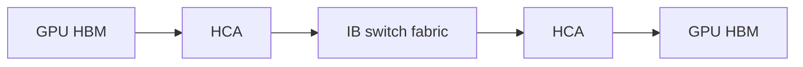
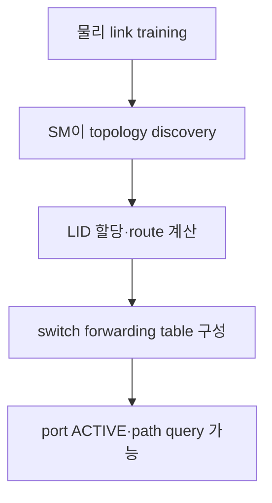
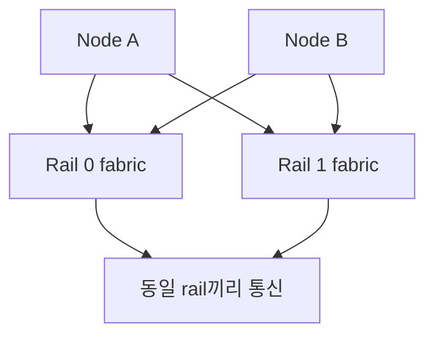
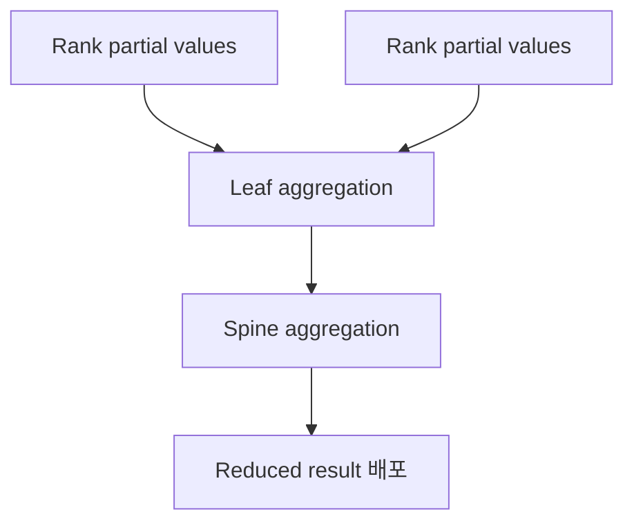

# 12. InfiniBand, RoCE와 GPU network 하드웨어

작성일: 2026-08-18  
선행 문서: [RDMA와 GPUDirect RDMA](11-rdma-and-gpudirect-rdma.md)  
다음 문서: [NCCL·집단통신·관측 실습](13-nccl-collectives-observability-labs.md)

## 1. InfiniBand는 `빠른 케이블`이 아니라 fabric architecture다

InfiniBand(IB)는 link, packet, routing, transport, subnet management, QoS, verbs programming model을 함께 정의하는 interconnect architecture다. GPU cluster에서는 GPU가 IB packet을 직접 송수신하는 것이 아니라 HCA가 GPU memory를 DMA하고 IB fabric에 packet을 보낸다.



GPU↔HCA는 PCIe/GDRDMA 문제이고 HCA↔HCA는 InfiniBand fabric 문제다.

## 2. InfiniBand fabric 구성요소

| 구성요소 | 원문 | 역할 |
|---|---|---|
| HCA | Host Channel Adapter | host의 PCIe endpoint, verbs queue·DMA·IB port 제공 |
| Switch | InfiniBand switch | LID 기반으로 subnet 내부 packet forwarding |
| Router | InfiniBand router | 서로 다른 IB subnet 사이 연결 |
| SM | Subnet Manager | topology 탐색, LID 할당, route와 port 설정 |
| SA | Subnet Administrator | path record와 service 정보 질의 제공 |
| SMA | Subnet Management Agent | HCA/switch에서 management attribute 처리 |
| UFM | Unified Fabric Manager | SM, telemetry, monitoring, automation을 통합한 관리 제품 |
| OpenSM | Open Subnet Manager | host 또는 appliance에서 실행할 수 있는 SM implementation |

한 IB subnet에는 active SM이 필요하다. redundancy를 위해 여러 SM을 둘 수 있지만 master 하나가 subnet을 관리하고 나머지는 standby 상태가 된다.

## 3. port가 Active가 되기까지



케이블과 signal이 정상이어도 SM이 없으면 port가 `INIT`에 머물 수 있다. 반대로 port가 `ACTIVE`여도 route imbalance, congestion, error counter 때문에 application 성능이 나쁠 수 있다.

## 4. InfiniBand의 식별자와 격리

| 항목 | 범위 | 역할 |
|---|---|---|
| GUID | device/port 고유 식별 | node·port를 안정적으로 식별 |
| LID | subnet-local | switch forwarding에 쓰는 local address |
| GID | global identifier | subnet 간 식별, RoCE에서는 IP/VLAN과 연계 |
| P_Key | partition key | IB partition membership과 access 제어 |
| QPN | queue pair number | destination QP 식별 |
| SL | Service Level | packet의 QoS class 표시 |
| VL | Virtual Lane | link 위의 독립 flow-control queue |

P_Key는 VLAN과 비슷한 격리 목적이 있지만 wire architecture와 membership semantics가 다르다. 보안 설계에서는 P_Key만으로 모든 host/application 격리가 해결된다고 가정하지 않는다.

## 5. SL, VL과 credit flow control

InfiniBand packet은 0–15의 Service Level을 표시할 수 있고 switch는 ingress/egress 조건에 따라 SL을 output Virtual Lane으로 mapping한다.

- VL0–VL14: data traffic에 사용할 수 있는 virtual lane 범위
- VL15: subnet management traffic용
- 구현은 지원하는 data VL 수가 더 적을 수 있음
- VL별 arbitration과 buffer/credit로 traffic class를 분리

Receiver가 buffer credit을 광고하고 sender는 credit가 있을 때 전송한다. 이 link-level credit flow control이 일반적인 buffer overflow loss를 방지하지만 congestion 자체를 제거하지는 않는다. 여러 flow가 같은 egress를 요구하면 queueing과 `PortXmitWait`가 증가할 수 있다.

## 6. MTU와 message segmentation

IB path MTU는 port와 path record가 허용하는 값으로 결정되며 일반적으로 256 B에서 4096 B 범위의 discrete 값이다. application의 1 GiB tensor가 하나의 packet이 되는 것은 아니다. HCA가 transport message를 MTU 크기의 packet으로 나누고 수신 쪽에서 처리한다.

작은 MTU는 header 비중과 packet rate를 높이고, 큰 MTU는 효율을 높일 수 있지만 path의 모든 hop이 지원해야 한다. `ibv_devinfo`의 active MTU와 subnet policy를 함께 본다.

## 7. InfiniBand 세대와 port rate

아래 값은 흔히 말하는 4-lane port class의 nominal line rate다. encoding과 protocol overhead를 뺀 application payload는 더 낮다.

| 세대 | 흔한 port class | byte/s 단순 환산 | 대표 시기·제품군 |
|---|---:|---:|---|
| SDR | 10 Gb/s | 1.25 GB/s | 초기 IB |
| DDR | 20 Gb/s | 2.5 GB/s | 초기 HPC |
| QDR | 40 Gb/s | 5 GB/s | 구형 cluster |
| FDR | 56 Gb/s | 7 GB/s | ConnectX-3 세대 |
| EDR | 100 Gb/s | 12.5 GB/s | ConnectX-4/5 범주 |
| HDR | 200 Gb/s | 25 GB/s | ConnectX-6 범주 |
| NDR | 400 Gb/s | 50 GB/s | ConnectX-7·Quantum-2 |
| XDR | 800 Gb/s | 100 GB/s | ConnectX-8/9·Quantum-X800 |

`NDR200`, port split, lane 수가 다른 구성도 있다. adapter card aggregate, port별 rate, cable lane breakout을 제품 OPN과 실제 `active_speed/active_width`로 확인한다.

## 8. RoCE는 Ethernet 위의 RDMA transport다

RoCE(RDMA over Converged Ethernet)는 Ethernet NIC와 switch fabric 위에 RDMA semantics를 제공한다.

| 버전 | network encapsulation | routing |
|---|---|---|
| RoCEv1 | Ethernet L2 frame | 같은 L2 broadcast domain 중심 |
| RoCEv2 | UDP/IP | L3 routing과 ECMP 가능 |

RoCEv2에서 application이 사용하는 GID는 NIC의 IP, VLAN, address family와 연결된다. NIC port가 `Ethernet` link layer로 보이면서도 verbs와 GDRDMA를 사용할 수 있다.

## 9. InfiniBand와 RoCE를 비교한다

| 축 | InfiniBand | RoCEv2 Ethernet |
|---|---|---|
| fabric control | SM/SA가 subnet을 구성 | Ethernet control plane과 IP routing |
| forwarding identifier | LID 중심 | MAC/IP/UDP flow 중심 |
| flow control | IB credit 기반 | Ethernet PFC·ECN·queue/QoS 조합 가능 |
| congestion control | IB adaptive routing·CC 기능 | ECN/CNP/DCQCN 계열, vendor telemetry·routing |
| isolation | P_Key, SL/VL 등 | VLAN/VRF/ACL/DSCP/priority 등 |
| operations | verbs/RDMA | 같은 verbs abstraction 가능 |
| fabric skill set | 전용 IB 운영 모델 | 기존 Ethernet/IP와 통합 가능 |
| 흔한 GPU 제품 | Quantum + ConnectX | Spectrum-X + SuperNIC/ConnectX/BlueField |

어느 쪽이 절대적으로 빠르다는 표가 아니다. topology, radix, oversubscription, congestion control, message pattern, software stack, 운영 역량을 함께 비교해야 한다.

## 10. RoCE에서 loss와 congestion을 다루는 방법

### 10.1 PFC

Priority Flow Control은 특정 Ethernet priority에 pause를 적용해 buffer overflow loss를 줄인다. 잘못 설계하면 pause propagation, head-of-line blocking, deadlock risk를 만들 수 있다.

### 10.2 ECN과 CNP

switch가 queue congestion을 ECN으로 mark하고 receiver/NIC가 Congestion Notification Packet을 보내면 sender가 rate를 조절한다. DCQCN 계열이 대표적인 RoCE congestion-control 방식이다.

### 10.3 `RoCE에는 PFC가 필수`라는 절대 명제

모든 RoCE 구현에서 PFC가 protocol상 절대 필수인 것은 아니다. 최신 NIC/switch의 retry, ECN, telemetry와 validated lossy-RoCE design을 사용할 수 있다. 그러나 임의의 일반 Ethernet에 RoCE를 켜는 것과 검증된 AI Ethernet fabric은 다르다.

설계 시 확인할 것:

- NIC/switch vendor의 validated reference
- end-to-end MTU, DSCP/priority mapping
- PFC 적용 priority와 buffer headroom
- ECN marking threshold와 congestion-control parameter
- ECMP hash entropy와 flowlet/adaptive routing
- pause, discard, ECN mark, CNP counter의 상관관계

## 11. native verbs, IPoIB, TCP를 구분한다

- native IB verbs: HCA QP와 IB transport를 직접 사용
- IP over InfiniBand(IPoIB): IB link 위에 IP interface 제공
- TCP socket over IPoIB: IP/TCP stack을 사용하는 socket traffic

IB interface로 `ping`이 성공해도 native verbs, GDRDMA 또는 NCCL bandwidth가 정상임을 증명하지 않는다. `ib_write_bw` 같은 verbs test와 NCCL test를 별도로 수행한다.

## 12. GPU fabric용 adapter 제품군

공개 제품군 기준의 방향을 보는 표다. 정확한 port 수, PCIe generation, form factor, crypto/offload는 card OPN과 datasheet를 다시 확인한다.

| 제품군 | 공개 network class | host interface·특징 | 적합한 fabric |
|---|---:|---|---|
| ConnectX-7 | 최대 400 Gb/s | PCIe Gen4/5 구성, VPI 제품은 IB/Ethernet 지원, Socket Direct 선택지 | NDR IB 또는 400G RoCE |
| ConnectX-8 | 최대 800 Gb/s | PCIe Gen5/6 구성, Socket Direct로 host bandwidth 분산 가능 | XDR IB 또는 800G Ethernet/RoCE |
| ConnectX-9 portfolio | 최대 1.6 Tb/s 제품군 표기 | card/port별 실제 end-to-end rate와 PCIe 구성을 OPN으로 확인 | 차세대 XDR scale-out |
| BlueField-3 DPU | 최대 400 Gb/s 범주 | Arm cores와 infrastructure accelerator 포함 | network/security/storage offload + RDMA |
| BlueField-4 DPU | 최대 800 Gb/s 범주 | 차세대 DPU platform | 800G infrastructure offload |

### HCA, SuperNIC, DPU

| 이름 | 핵심 초점 |
|---|---|
| HCA | InfiniBand/RDMA host adapter 역할 |
| NIC/SuperNIC | Ethernet/RoCE와 AI network offload·isolation 최적화 |
| DPU | NIC 기능에 programmable infrastructure compute를 추가 |

마케팅 이름보다 `IB/Ethernet link layer`, supported rate, GDRDMA, PCIe lane budget, port topology를 확인한다.

## 13. switch·fabric 제품군

| 제품군 | network | 공개 구성 예 | 특징 |
|---|---|---|---|
| Quantum-2 | NDR InfiniBand | 64×400G 또는 128×200G class | 51.2 Tb/s bidirectional aggregate 표기, SHARPv3 |
| Quantum-X800 | XDR InfiniBand | 최대 144×800G class | SHARPv4, adaptive routing·telemetry, scale-out AI fabric |
| Spectrum-X | Ethernet/RoCE | Spectrum switch + SuperNIC/DPU | RoCE congestion control, adaptive routing, telemetry를 통합한 AI Ethernet platform |

switch port rate를 GPU당 bandwidth로 나누는 계산은 불충분하다. host당 NIC 수, rail, leaf uplink, spine stage, blocking ratio, collective traffic matrix가 실제 bisection bandwidth를 결정한다.

## 14. cable, transceiver와 port split도 architecture 일부다

GPU cluster의 고속 link는 다음 물리 부품에 의존한다.

- passive/active copper cable
- optical transceiver와 fiber
- co-packaged 또는 silicon-photonics 계열 구성
- OSFP/QSFP 계열 module
- 800G→2×400G 같은 breakout

확인 항목:

1. switch와 HCA 양쪽이 같은 rate·lane mode를 지원하는가?
2. cable/transceiver reach와 FEC가 platform validation에 맞는가?
3. breakout 후 port mapping과 rail 배치가 의도와 같은가?
4. symbol/physical error가 온도·시간에 따라 증가하는가?
5. firmware가 module을 지원하는가?

`LinkUp`만으로 signal margin과 sustained error-free operation을 보장하지 않는다.

## 15. Clos/fat-tree와 rail-optimized topology

### 15.1 Clos/fat-tree

leaf switch가 host를 수용하고 spine이 leaf 사이 bandwidth를 제공한다. non-blocking에 가깝게 만들려면 leaf downlink 합과 uplink 합을 맞추지만 비용과 cable 수가 증가한다.

$$
Blocking\ ratio = \frac{leaf\ host-facing\ bandwidth}{leaf\ spine-facing\ bandwidth}
$$

1:1이면 해당 stage에서 nominal non-blocking이며 2:1이면 모든 host가 동시에 외부로 보낼 때 최대 절반 수준의 uplink share가 될 수 있다.

### 15.2 multi-rail

각 node의 여러 HCA/NIC를 서로 다른 switch plane에 연결해 bandwidth와 fault domain을 분리한다.



NCCL rank와 NIC를 rail에 맞추지 않으면 중간 inter-rail path나 특정 switch에 traffic이 몰릴 수 있다. `NCCL_CROSS_NIC`와 HCA 선택은 topology를 이해한 뒤 실험한다.

## 16. SHARP: switch 안에서 collective를 부분 계산한다

Scalable Hierarchical Aggregation and Reduction Protocol(SHARP)은 reduction tree의 중간 aggregation을 IB network에 offload한다.



각 rank의 원본 전체가 root까지 반복 이동하는 대신 switch의 aggregation node에 도달할수록 traffic을 줄일 수 있다. 모든 datatype, operation, message size, communicator가 자동 offload되는 것은 아니며 SHARP manager, library/plugin, switch resource와 NCCL/MPI support가 필요하다.

## 17. InfiniBand 점검 명령

### 17.1 host와 port

```bash
ibstat
ibv_devinfo
ibdev2netdev
rdma link show
```

확인할 필드:

- HCA device와 physical port mapping
- State `Active`, Physical state `LinkUp`
- active speed와 width
- LID, GID, active MTU
- link layer `InfiniBand` 또는 `Ethernet`

### 17.2 fabric topology와 상태

아래 도구는 fabric 규모와 권한에 따라 많은 management packet을 만들 수 있다. 운영 절차와 관리자 권한을 확인한다.

```bash
iblinkinfo
ibnetdiscover
ibqueryerrors
perfquery
ibdiagnet
```

| 도구 | 질문 |
|---|---|
| `iblinkinfo` | 각 node/port가 어떤 rate와 width로 연결됐는가? |
| `ibnetdiscover` | 전체 topology와 endpoint 연결은 무엇인가? |
| `ibqueryerrors` | threshold를 넘는 port error가 어디에 있는가? |
| `perfquery` | 특정 port의 traffic/error counter는 무엇인가? |
| `ibdiagnet` | topology, link, configuration의 fabric-wide 이상은 무엇인가? |

counter를 clear하는 option이나 port state를 바꾸는 도구는 이 자료의 읽기 전용 절차에 포함하지 않는다.

## 18. 주요 IB counter 읽기

| counter 범주 | 의미 | 해석 원칙 |
|---|---|---|
| PortXmitData/PortRcvData | 송수신 traffic | 단위와 counter width를 확인하고 시간 차분으로 rate 계산 |
| Symbol/physical error | signal·lane 오류 | cable/module/port/FEC와 연계 |
| LinkErrorRecovery/LinkDowned | link 복구·down event | 증가 시 물리 계층 또는 reset 조사 |
| PortRcvErrors | receive packet 오류 | remote physical error와 함께 양쪽 port 확인 |
| PortXmitDiscards | 송신 drop | port state, congestion, buffer 원인 분리 |
| PortXmitWait | credit 부족으로 송신 대기 | congestion 가능성, 높은 traffic과 함께 해석 |
| VL15Dropped | management lane drop | SM traffic·fabric 관리 이상 조사 |

누적값이 0이 아니라는 사실만으로 현재 장애라고 단정하지 않는다. baseline 이후 증가율, workload 시간축, link peer 양쪽 값을 비교한다.

## 19. RoCE 점검 축

```bash
rdma link show
ibv_devinfo
ibdev2netdev
ip -d link show <NETDEV>
ethtool <NETDEV>
ethtool -S <NETDEV>
```

확인할 항목:

- IP/VLAN/MTU와 GID index가 의도한 network에 대응하는가?
- PFC pause frame이 특정 priority에서 지속 증가하는가?
- ECN mark와 CNP가 정상적인 congestion 반응인가, 과도한가?
- RX/TX discard, FEC corrected/uncorrected, symbol error가 증가하는가?
- ECMP가 여러 path를 사용하며 특정 link만 hot하지 않은가?

counter 이름은 driver와 switch OS별로 다르므로 vendor documentation의 정의와 unit를 확인한다.

## 20. 하드웨어 선택 체크리스트

| 질문 | 왜 필요한가 |
|---|---|
| GPU당 scale-out byte/s와 message pattern은? | NIC port 수·rate 결정 |
| all-reduce 중심인가 all-to-all 중심인가? | bisection, incast, routing 요구가 다름 |
| node당 GPU와 NIC 비율은? | GPU↔NIC oversubscription 계산 |
| PCIe lane과 root topology는 충분한가? | 800G NIC도 host interface에 막힐 수 있음 |
| IB 전용 운영과 Ethernet 통합 중 무엇이 맞는가? | fabric control과 운영 skill 결정 |
| non-blocking 범위가 rack인가 cluster 전체인가? | leaf/spine 수와 uplink 예산 결정 |
| SHARP를 사용할 software가 있는가? | switch 기능의 실제 가치 판단 |
| cable reach·전력·냉각 예산은? | link reliability와 rack 배치 결정 |
| 장애 domain과 dual-rail 요구는? | adapter·switch·cable redundancy 결정 |

## 21. 자가 점검

1. InfiniBand port가 물리적으로 LinkUp인데 Active가 아닐 수 있는 이유는 무엇인가?
2. LID, GID, P_Key, SL, VL은 각각 어떤 범위의 식별·격리·QoS를 담당하는가?
3. RoCEv2와 native InfiniBand는 같은 verbs를 쓸 수 있는데 무엇이 다른가?
4. PFC를 무조건 켜는 것이 안전한 설계가 아닌 이유는 무엇인가?
5. 144×800G switch가 GPU당 100 GB/s application bandwidth를 보장하지 않는 이유는 무엇인가?
6. ConnectX와 BlueField의 선택 기준은 무엇인가?

## 22. 주요 원문

- NVIDIA, [Security in InfiniBand](https://networking-docs.nvidia.com/nvidiainfinibandsecurityoverviewandguidelines/security-in-infiniband)
- NVIDIA, [OpenSM](https://networking-docs.nvidia.com/mlnxofedswum/585112lts/opensm)
- NVIDIA, [InfiniBand QoS](https://networking-docs.nvidia.com/doca/archive/3-4-0/infiniband-qos)
- NVIDIA, [InfiniBand Adapters](https://www.nvidia.com/en-us/networking/infiniband-adapters/)
- NVIDIA, [ConnectX-7 User Manual](https://networking-docs.nvidia.com/connectx7hw/introduction)
- NVIDIA, [ConnectX-8 User Manual](https://networking-docs.nvidia.com/connectx8hw/introduction)
- NVIDIA, [ConnectX-9 User Manual](https://networking-docs.nvidia.com/connectx9hw/introduction)
- NVIDIA, [Quantum-2 InfiniBand](https://www.nvidia.com/en-us/networking/quantum2/)
- NVIDIA, [Quantum-X800 InfiniBand](https://www.nvidia.com/en-us/networking/products/infiniband/quantum-x800/)
- NVIDIA, [Spectrum-X Ethernet](https://www.nvidia.com/en-us/networking/spectrumx/)
- NVIDIA, [BlueField DPU](https://www.nvidia.com/en-us/networking/products/data-processing-unit/)
- NVIDIA, [SHARP User Manual](https://networking-docs.nvidia.com/sharpum/3150)

> 본질: InfiniBand와 RoCE를 이해한다는 것은 port rate를 비교하는 일이 아니라, **HCA·switch·routing·flow control·congestion control·topology가 GPU traffic을 끝까지 어떻게 운반하는지 설명하는 것**이다.
