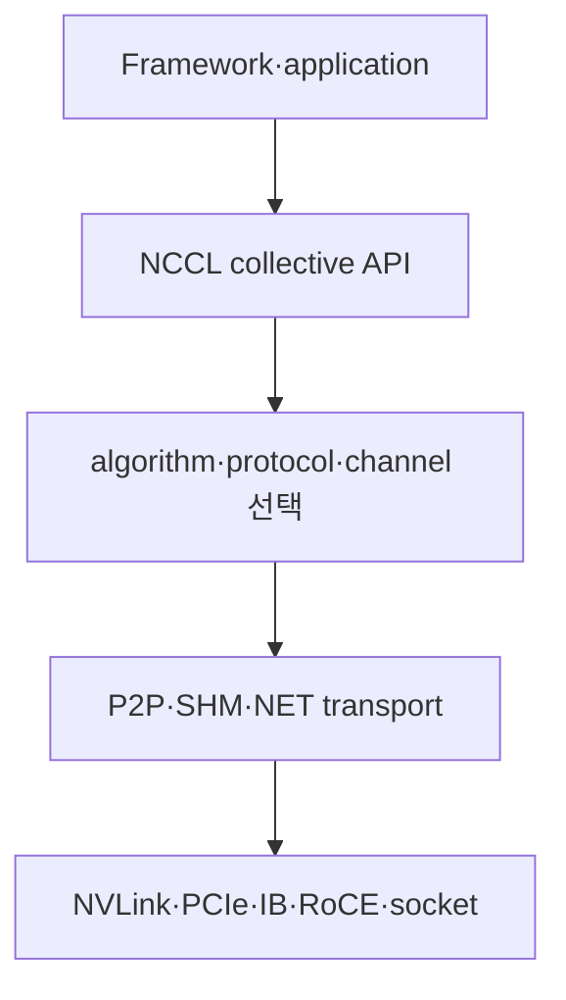
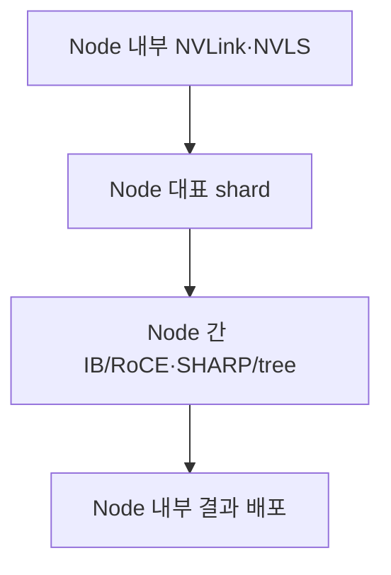
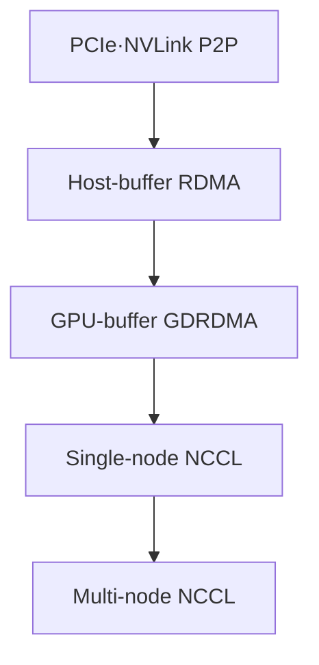
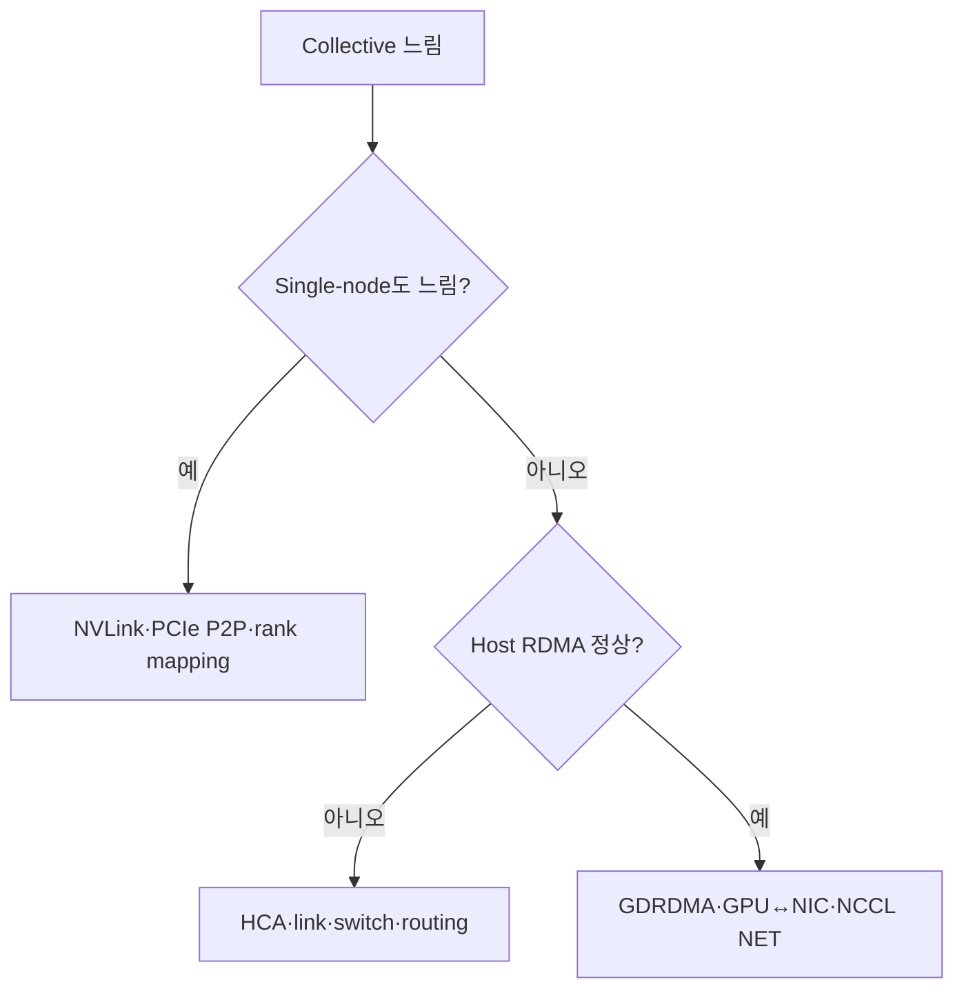

# 13. NCCL, 집단통신과 GPU network 관측 실습

작성일: 2026-08-18  
선행 문서: [InfiniBand·RoCE와 GPU network 하드웨어](12-infiniband-roce-and-hardware.md)  
연계 문서: [GPU 구조와 병목을 확인하는 실습](08-hands-on-labs.md)

## 1. NCCL은 topology-aware communication library다

NCCL(NVIDIA Collective Communications Library)은 CUDA GPU 사이의 collective와 point-to-point communication primitive를 제공한다. NCCL은 network 자체도, distributed training framework 전체도 아니다.



하나의 NCCL kernel은 communication, reduction, synchronization 일부를 함께 처리할 수 있다. 그래서 GPU SM 자원, memory bandwidth, local link, network가 동시에 collective 성능에 관여한다.

## 2. rank와 communicator

- Rank: communicator 안에서 0부터 $n-1$까지 번호를 가진 participant
- Communicator: 함께 통신하는 rank 집합과 topology·connection state
- 일반적인 GPU workload: rank 하나가 GPU 하나를 담당
- Multi-process: process마다 한 개 또는 여러 rank
- Multi-thread: thread마다 rank를 관리할 수도 있으나 thread safety와 launch ordering 확인 필요

`rank 0 = GPU 0`은 관례일 뿐 보장이 아니다. scheduler의 device visibility, process local rank, CUDA device selection, container mapping을 확인한다.

## 3. collective semantics

| operation | input→output | 대표 workload |
|---|---|---|
| Broadcast | root의 $S$가 모든 rank에 복제 | parameter·metadata 배포 |
| Reduce | 모든 rank 값을 reduce해 root에 저장 | root 집계 |
| AllReduce | reduce 결과를 모든 rank가 가짐 | TP partial sum, DP gradient |
| AllGather | rank별 shard를 모아 모든 rank가 전체를 가짐 | tensor/parameter shard 복원 |
| ReduceScatter | reduce한 뒤 결과 shard를 rank별 분배 | sharded gradient·TP sequence parallel |
| AllToAll | 각 rank가 모든 rank에 서로 다른 shard 전송 | MoE expert token dispatch |
| Gather/Scatter | root가 모으거나 나눔 | root-centric data movement |
| Send/Recv | 두 rank 사이 point-to-point | pipeline stage, custom schedule |

operation 이름이 같아도 message layout, datatype, rank 수, in-place 여부가 다르면 traffic과 kernel이 달라진다.

## 4. AllReduce를 두 단계로 본다

AllReduce는 논리적으로 다음과 같이 분해할 수 있다.

$$
AllReduce = ReduceScatter + AllGather
$$

ring AllReduce에서는 $n$개 rank가 tensor shard를 돌리며 reduce-scatter를 수행하고, 완성된 shard를 다시 돌려 all-gather한다. 각 rank의 이상적 전송량은 다음과 같다.

$$
V_{rank} = 2S\frac{n-1}{n}
$$

여기서 $S$는 rank 하나의 input tensor 크기다. 그래서 rank 수가 커질수록 사용자 tensor $S$보다 network에서 처리해야 할 byte가 많아진다.

## 5. 대표 collective algorithm

### 5.1 Ring

각 rank가 neighbor와 shard를 pipeline한다.

- 큰 message에서 link bandwidth를 고르게 쓰기 좋음
- 단계 수가 rank 수에 비례해 작은 message latency에 불리할 수 있음
- physical topology와 ring ordering이 맞지 않으면 link가 중복 사용됨

### 5.2 Tree

tree를 따라 reduce하고 반대 방향으로 broadcast한다.

- 단계 수가 대략 $O(\log n)$이라 latency에 유리
- root 근처 edge와 topology mapping이 중요
- 큰 message에서 ring보다 link utilization이 낮을 수 있으나 구현에 따라 다름

### 5.3 Hierarchical

node 내부와 node 간 알고리즘을 분리한다.



node 내부 NVSwitch domain과 node 간 HCA fabric의 bandwidth/latency가 크게 다르기 때문에 대규모 GPU cluster에서 핵심적인 방식이다.

### 5.4 NVLS와 SHARP

- NVLS: NVLink SHARP를 사용해 NVSwitch domain의 collective를 가속
- IB SHARP: InfiniBand switch가 node 간 reduction을 부분 수행

NCCL과 network plugin은 두 계층을 조합할 수 있다. 둘 다 지원된다는 사실과 실제 operation이 offload됐다는 사실을 로그와 성능으로 분리해 확인한다.

### 5.5 알고리즘 이름은 버전별 기능이다

현행 NCCL은 Ring, Tree, NVLS 계열, CollNet 계열, PAT 계열 등 여러 algorithm을 노출할 수 있다. 모든 build·GPU·operation에서 전부 지원되는 것은 아니다. `NCCL_ALGO`를 고정하면 새 버전의 자동 tuning을 막을 수 있으므로 원인 격리 실험 외에는 기본 선택을 우선한다.

## 6. NCCL protocol과 channel

NCCL은 message size와 topology에 따라 Simple, LL, LL128 같은 protocol과 여러 communication channel을 선택할 수 있다.

- 작은 message: fixed latency와 synchronization을 줄이는 protocol이 중요
- 큰 message: payload 효율과 channel parallelism이 중요
- channel 증가: link를 더 잘 채울 수 있지만 GPU CTA/SM, buffer, CPU proxy 자원을 더 사용

따라서 channel 수를 늘리면 항상 빨라지는 것이 아니다. communication이 compute와 overlap될 때 NCCL kernel이 너무 많은 SM을 점유하면 application kernel 성능이 낮아질 수 있다.

## 7. transport 선택

| NCCL transport 범주 | 대표 경로 | fallback 의미 |
|---|---|---|
| P2P | NVLink 또는 PCIe peer access | GPU끼리 direct access |
| SHM | host shared memory | P2P 불가 시 같은 node에서 staging 가능 |
| NET/IB | InfiniBand verbs 또는 RoCE verbs | HCA network, GDRDMA 가능 |
| NET/Socket | TCP/IP socket | verbs 사용 불가/비활성 시 network fallback |

`IB`라는 NCCL 이름은 native InfiniBand뿐 아니라 RoCE verbs path도 포함할 수 있다. NIC port의 link layer와 GID/network 설정을 확인한다.

## 8. NCCL, MPI, UCX, NVSHMEM의 역할

| software | 주 역할 | GPU workload에서의 관계 |
|---|---|---|
| NCCL | GPU collective와 P2P | framework의 tensor communication |
| MPI | process launch, rank 관리, message passing·collective | NCCL multi-node test를 launch하거나 CPU/control 통신 |
| UCX | 여러 transport를 추상화하는 communication framework | MPI/SHMEM/framework backend가 사용 가능 |
| NVSHMEM | GPU-accessible PGAS와 one-sided communication | CUDA kernel 주도 irregular communication |
| libibverbs | RDMA queue와 memory operation API | NCCL network plugin 아래의 low-level path |

`MPI로 실행했다`가 payload를 MPI가 운반했다는 뜻은 아니다. `nccl-tests`에서 MPI는 process를 배치하고 NCCL rank를 시작하는 데 쓰이며 tensor payload는 NCCL transport가 처리한다.

## 9. 관측해야 할 네 시간축

| 층 | 지표·증거 | 질문 |
|---|---|---|
| Application | collective call duration, TTFT/ITL, step time | 통신이 사용자 latency를 얼마나 차지하는가? |
| NCCL/GPU | algorithm, protocol, channels, kernel timeline | 어느 알고리즘과 GPU 자원을 쓰는가? |
| GPU local fabric | NVLink/PCIe throughput·error, topology | node 내부 edge가 포화·오류 상태인가? |
| Network fabric | HCA port bytes, wait/retry/error, switch queue | node 간 link와 path가 병목인가? |

서로 다른 scrape interval과 누적 counter를 같은 순간값처럼 비교하지 않는다. 시작·종료 시각을 고정하고 counter delta를 test duration으로 나눈다.

## 10. `nccl-tests` 결과의 정확한 의미

`nccl-tests`는 평균 operation time과 algorithm bandwidth, bus bandwidth를 보고한다.

### 10.1 Algorithm bandwidth

$$
algbw = \frac{S}{t}
$$

- $S$: test가 정의한 operation size
- $t$: 평균 operation time

사용자 관점에서 큰 operation에 걸릴 시간을 근사하는 데 유용하다.

### 10.2 Bus bandwidth

collective별 data movement를 반영하도록 `algbw`에 보정 계수를 곱한다.

| operation | `busbw` 보정식 | $S$ 해석 주의 |
|---|---:|---|
| AllReduce | $algbw \times 2(n-1)/n$ | rank당 input array size |
| ReduceScatter | $algbw \times (n-1)/n$ | 전체 input array size |
| AllGather | $algbw \times (n-1)/n$ | 전체 output array size |
| AllToAll | $algbw \times (n-1)/n$ | test 정의의 전체 transfer size |
| Broadcast | $algbw$ | root bottleneck 기준 |
| Reduce | $algbw$ | root bottleneck 기준 |

`busbw`는 rank 수와 collective를 넘어 hardware utilization을 비교하기 위한 정규화 값이다. 실제 특정 cable에서 측정한 byte/s와 동일한 counter가 아니다.

### 10.3 latency를 볼 message와 bandwidth를 볼 message

$$
t(S) \approx t_{fixed} + S/B
$$

- 수 byte–수 KiB: launch, synchronization, network round trip 같은 fixed cost 관측
- 큰 MiB–GiB: link·memory bandwidth plateau 관측
- 중간 크기: algorithm/protocol threshold 변화가 보일 수 있음

하나의 1 GiB 결과만으로 latency-sensitive serving 통신을 평가하지 않는다.

## 11. hardware 상한과 비교하는 방법

먼저 예상 병목의 **같은 방향·같은 범위** 상한을 계산한다.

예를 들어 node당 400 Gb/s port 두 개가 독립 rail로 동작한다면 단순 line-rate 합은 다음과 같다.

$$
2 \times 400\ \text{Gb/s} / 8 = 100\ \text{GB/s}
$$

그 다음에 protocol payload, PCIe limit, GPU↔NIC topology, collective traffic pattern을 반영한다.

$$
Efficiency = \frac{measured\ comparable\ bandwidth}{estimated\ payload\ ceiling}
$$

분모에 switch 전체 aggregate나 NVLink bidirectional marketing 수치를 넣지 않는다. multi-node hierarchical collective의 `busbw`는 NVLink와 network를 모두 포함하므로 어느 한 port 상한과만 비교하면 잘못된 결론이 날 수 있다.

## 12. 실습 0 — 재현 조건 고정

운영 traffic이 없는 검증 환경에서 수행한다. 결과 파일에는 host명·IP·GPU UUID를 공개용 alias로 바꾼다.

기록할 것:

```bash
date -u
uname -r
nvidia-smi --query-gpu=index,name,compute_cap,driver_version,memory.total --format=csv
nvidia-smi topo -m
ibv_devinfo
rdma link show
```

추가 메타데이터:

- CUDA, NCCL, MPI, rdma-core/OFED 버전
- HCA firmware, link layer, active rate/width, MTU
- GPU·HCA BDF와 NUMA affinity
- container image와 device mapping
- switch topology, rail, oversubscription
- GPU/application clock과 power limit

## 13. 실습 1 — 아래 계층부터 baseline을 만든다



이 순서를 지키면 `NCCL이 느리다`를 local P2P, HCA fabric, GDR path, collective algorithm 중 어디까지 정상인지 분리할 수 있다.

### 13.1 local P2P

```bash
nvidia-smi topo -p2p p
nvidia-smi topo -p2p n
./p2pBandwidthLatencyTest
```

### 13.2 host-buffer RDMA

[RDMA와 GPUDirect RDMA](11-rdma-and-gpudirect-rdma.md)의 `ib_write_bw`, `ib_read_bw`, `ib_send_bw` 실습으로 fabric baseline을 만든다.

### 13.3 GPU-buffer RDMA

같은 HCA, message size, direction에서 perftest의 GPU buffer option을 사용한다. host는 정상인데 GPU buffer만 느리면 PCIe/GDRDMA 계층으로 범위를 줄인다.

## 14. 실습 2 — single-node NCCL

CUDA device 수에 맞춰 `-g`를 설정한다.

```bash
./build/all_reduce_perf -b 8 -e 1G -f 2 -g <GPUS_PER_NODE>
./build/all_gather_perf -b 8 -e 1G -f 2 -g <GPUS_PER_NODE>
./build/reduce_scatter_perf -b 8 -e 1G -f 2 -g <GPUS_PER_NODE>
./build/alltoall_perf -b 8 -e 1G -f 2 -g <GPUS_PER_NODE>
```

GPU memory가 부족하면 maximum size를 줄인다. `nccl-tests`는 input/output buffer와 rank별 allocation을 사용하므로 `-e 1G`가 GPU당 정확히 1 GiB만 소비한다는 뜻이 아니다.

확인할 것:

- NVLink pair와 PCIe pair의 차이
- operation별 작은 message latency와 큰 message plateau
- 모든 rank의 correctness error가 0인지
- out-of-place와 in-place 결과 차이
- NVLS 사용 가능 system에서 off/on 비교

## 15. 실습 3 — multi-node NCCL

`nccl-tests`를 MPI support로 build한 뒤 일반적인 rank 배치는 GPU당 process 하나다.

```bash
mpirun -np <TOTAL_RANKS> -N <RANKS_PER_NODE> \
  ./build/all_reduce_perf -b 8 -e 1G -f 2 -g 1
```

MPI implementation과 scheduler마다 host 지정, environment 전달, CPU binding option이 다르므로 해당 배포 문서를 따른다.

### 비교 행렬

| 변화 | 비교 목적 |
|---|---|
| 1 node→2 node→여러 node | scale-out가 시작되는 지점 |
| rank/node 고정, node 수 증가 | network bisection과 algorithm scaling |
| GPU/HCA 가까운 mapping vs 먼 mapping | GDR topology 영향 |
| all-reduce vs all-to-all | reduction-friendly fabric과 bisection 차이 |
| 한 rail vs 여러 rail | NIC aggregation과 rail alignment |

node 수만 바꿀 때 total rank, rank당 message와 global data size 중 무엇을 고정했는지 명시한다. strong scaling과 weak scaling을 섞지 않는다.

## 16. NCCL 진단 로그

일반적인 1차 진단:

```bash
NCCL_DEBUG=INFO \
NCCL_DEBUG_SUBSYS=INIT,GRAPH,NET,TUNING,ENV \
NCCL_DEBUG_FILE=/tmp/nccl.%h.%p.log \
<APPLICATION>
```

현재 NCCL은 subsystem별 logging을 제공한다.

| subsystem | 확인할 내용 |
|---|---|
| `INIT` | rank·communicator와 connection 초기화 |
| `GRAPH` | topology detection과 channel graph |
| `NET` | HCA/socket 선택, network transport |
| `TUNING` | algorithm·protocol 선택 |
| `P2P`/`SHM` | node 내부 transport |
| `NVLS` | NVLink SHARP path |
| `ENV` | 적용된 환경 변수 |

`TRACE`는 출력량과 overhead가 크므로 짧은 최소 재현에서만 사용한다. 로그는 hostname, interface, topology를 포함할 수 있어 외부 공유 전 가린다.

## 17. topology dump

```bash
NCCL_TOPO_DUMP_FILE=/tmp/nccl-topology.xml <APPLICATION>
```

dump에서 확인할 것:

- GPU와 NIC의 PCI BDF, link width/speed
- CPU/NUMA 연결
- GPU P2P/NVLink path
- NIC bandwidth와 port mapping
- NCCL이 감지한 virtual topology

`NCCL_TOPO_FILE`로 임의 topology를 강제하는 것은 진단 마지막 단계다. 실제 hardware 감지를 숨길 수 있고 multi-node NVLink system에는 별도 제약이 있다.

## 18. 진단용 환경 변수 지도

| 변수 | 진단 질문 | 주의 |
|---|---|---|
| `NCCL_P2P_DISABLE=1` | local P2P 문제가 원인인가? | SHM/network fallback으로 느려짐 |
| `NCCL_P2P_LEVEL` | 어느 topology 거리까지 P2P인가? | 문자열 `NVL/PIX/PXB/PHB/SYS` 사용 |
| `NCCL_IB_DISABLE=1` | verbs path가 문제인가? | socket fallback은 성능 비교용 기준일 뿐 |
| `NCCL_IB_HCA` | 원하는 HCA·port를 쓰는가? | exact match에 `=` prefix 권장 |
| `NCCL_NET_GDR_LEVEL` | 어느 GPU↔NIC 거리까지 GDR인가? | 기본 자동 선택 우선 |
| `NCCL_DMABUF_ENABLE` | DMA-BUF path 영향은? | unsupported 조합에서는 자동 비활성 가능 |
| `NCCL_NVLS_ENABLE` | NVLS가 원인/이득인가? | hardware·version·resource 지원 필요 |
| `NCCL_IB_MERGE_NICS` | dual-port NIC aggregation 영향은? | rail 설계와 함께 봄 |
| `NCCL_CROSS_NIC` | ring/tree가 rail을 넘는가? | fabric topology를 모르면 악화 가능 |
| `NCCL_ALGO`/`NCCL_PROTO` | 특정 선택의 영향은? | 장기 production 고정 금지 |

NCCL 공식 문서는 debug/tuning 변수를 production에 영구 고정하면 새 version의 자동 선택을 막고 기능을 깨뜨릴 수 있다고 경고한다. 실험 후 모두 제거하고 기본값으로 재검증한다.

## 19. HCA를 정확히 선택한다

현행 `NCCL_IB_HCA`는 HCA, port, rail, plane을 지정할 수 있다. 단순 prefix match는 `mlx5_1`이 `mlx5_10`도 선택할 수 있으므로 exact prefix를 사용한다.

```bash
NCCL_IB_HCA='=mlx5_0:1,mlx5_1:1' <APPLICATION>
```

이 예시 이름을 그대로 복사하지 말고 `ibv_devices`, `ibdev2netdev`, topology로 실제 port를 확인한다. HCA를 강제하기 전 기본 자동 선택 로그를 보존한다.

## 20. counter를 test와 같은 구간에서 측정한다

### 20.1 InfiniBand

test 전후에 `perfquery` 또는 관리 telemetry를 읽어 delta를 계산한다.

$$
Rate = \frac{Counter_{after} - Counter_{before}}{t_{after}-t_{before}}
$$

traffic counter의 hardware unit가 byte인지 word 단위인지 도구 문서에서 확인한다. `PortXmitWait`, error, link recovery가 test 중 증가하는지도 본다.

### 20.2 RoCE Ethernet

`ethtool -S`, switch telemetry, RDMA congestion counter에서 다음을 같은 시간축에 둔다.

- TX/RX payload와 packet rate
- pause/PFC duration·frame
- ECN marked packet과 CNP
- discard와 buffer drop
- FEC corrected/uncorrected, symbol error
- per-priority queue occupancy

### 20.3 GPU local fabric

- NVLink throughput과 link error/replay
- PCIe TX/RX throughput과 negotiated state
- GPU memory throughput
- NCCL kernel의 SM occupancy·duration

NIC port가 idle인데 NCCL call이 길면 local path, synchronization, wrong interface 또는 socket fallback을 먼저 의심한다. NIC가 line rate인데 `algbw`가 낮으면 collective data volume, rail imbalance, slow rank를 본다.

## 21. ablation은 한 변수씩 한다

| 실험 | 변경 한 가지 | 결론 가능 범위 |
|---|---|---|
| P2P disable | `NCCL_P2P_DISABLE` | local P2P path 영향 |
| IB disable | `NCCL_IB_DISABLE` | verbs와 socket path 상대 차이 |
| GDR cutoff | `NCCL_NET_GDR_LEVEL` | GPU↔NIC direct path 영향 |
| HCA selection | `NCCL_IB_HCA` | port/rail mapping 영향 |
| NVLS disable | `NCCL_NVLS_ENABLE` | NVSwitch offload 영향 |
| rank mapping | process↔GPU만 변경 | topology ordering 영향 |

두 변수를 동시에 바꾸면 fallback 경로와 실제 원인을 구분하기 어렵다. 매 실험마다 NCCL log, topology, counter, command line을 함께 저장한다.

## 22. 증상 기반 진단표

| 증상 | 가장 먼저 분리할 계층 | 우선 실험 |
|---|---|---|
| communicator init hang | rank launch·interface·firewall·QP setup | rank별 로그, 최소 2 rank |
| 작은 message만 느림 | launch·sync·tree/protocol | size sweep, CPU binding |
| 큰 message plateau가 낮음 | link·PCIe·rail·oversubscription | perftest, port delta, topology |
| host RDMA 정상, GPU RDMA 느림 | GDR registration·PCIe Read/Write | GPU perftest, 가까운 GPU/HCA pair |
| single-node 정상, multi-node 느림 | HCA/fabric/NCCL NET | IB/RoCE counter와 `NET` log |
| all-reduce 정상, all-to-all 느림 | bisection·incast·EP imbalance | alltoall test, switch queue |
| 한 rank만 느림 | local topology·clock·error | rank별 timing, BDF/NUMA 비교 |
| 간헐 timeout | link error·congestion·QP timeout | time-correlated port error/retry |
| 두 번째 실행부터 빨라짐 | registration/QP/JIT warm-up | warm-up 분리, buffer reuse |
| GPU Util 높고 token/s 낮음 | NCCL wait·memory traffic | Nsight timeline, NCCL duration |

## 23. 최소 의사결정 흐름



이후 message size, operation, 특정 rank로 범위를 더 줄인다.

## 24. LLM serving에 연결하는 법

### Tensor Parallelism

- layer마다 all-reduce/all-gather/reduce-scatter가 반복될 수 있음
- decode의 작은 batch에서는 collective latency가 ITL을 지배할 수 있음
- 큰 prefill에서는 bandwidth와 compute overlap이 중요

### Expert Parallelism

- all-to-all과 token imbalance가 핵심
- 평균 byte가 같아도 특정 expert/rank에 traffic이 몰림
- switch bisection과 tail queue가 p99 ITL을 악화시킬 수 있음

### Pipeline Parallelism

- stage 사이 send/recv latency와 bubble을 분리
- rank가 먼 NUMA/rail에 배치되면 activation transfer가 길어짐

### KV transfer·disaggregated serving

- point-to-point GPU buffer transfer와 registration lifetime이 중요
- 평균 bandwidth보다 request-sized message의 latency와 tail을 측정
- transport initialization을 요청 경로에서 매번 수행하지 않는지 확인

## 25. profiler로 communication overlap을 본다

Nsight Systems에서 다음을 같은 timeline에 둔다.

- application compute kernel
- NCCL kernel
- CUDA memcpy
- CPU proxy/polling thread
- stream dependency와 synchronization

질문:

1. communication이 compute와 실제 overlap되는가?
2. 모든 rank가 collective에 동시에 도착하는가?
3. 한 rank가 늦게 도착해 나머지가 기다리는가?
4. NCCL kernel이 SM을 과도하게 점유해 compute를 밀어내는가?
5. 많은 작은 collective가 launch gap을 만드는가?

network가 빨라도 rank arrival skew가 크면 collective duration이 길다. 이 경우 fabric 증설보다 load balance와 compute scheduling이 먼저다.

## 26. 실험 결과 템플릿

```text
질문:
collective / datatype / reduction op:
rank 수 / node 수 / rank mapping:
message size 정의:
GPU↔GPU·GPU↔NIC topology:
NCCL/CUDA/driver/RDMA stack 버전:
변경한 한 변수:
고정한 조건:
warm-up / iteration / 반복 횟수:
time / algbw / busbw / correctness:
NIC·NVLink·PCIe counter delta:
error·wait·congestion counter delta:
rank별 편차:
가설을 지지하는 관측:
가설을 반증하는 관측:
결론과 다음 실험:
```

## 27. 운영 안전

- `nccl-tests`, perftest는 GPU memory와 network를 포화시킬 수 있으므로 운영 traffic과 격리한다.
- fabric-wide diagnostic은 관리 packet과 switch resource를 사용할 수 있으므로 운영 절차를 따른다.
- counter를 clear하거나 port state를 바꾸지 않고 먼저 snapshot·delta를 사용한다.
- debug log와 topology dump의 hostname, address, BDF, UUID를 외부 공유 전에 비식별화한다.
- 실험용 NCCL 환경 변수는 shell·container spec·ConfigMap에서 제거하고 기본값으로 재시험한다.
- 평균뿐 아니라 p50/p95/p99, rank별 최소/최대, 반복 간 분산을 남긴다.

## 28. 학습 완료 기준

다음을 만들 수 있으면 GPU 통신 기초를 통과한 것이다.

1. GPU HBM에서 원격 GPU HBM까지의 endpoint·link·switch 지도
2. verbs의 PD·MR·QP·CQ와 GDRDMA 관계 설명
3. IB와 RoCE의 control/flow-congestion 차이표
4. node당 NIC/PCIe/NVLink theoretical ceiling 계산
5. `nccl-tests`의 time·algbw·busbw 해석
6. host RDMA→GPU RDMA→single-node→multi-node로 이어지는 baseline
7. 한 rank의 지연을 topology·counter·timeline으로 설명한 사례
8. TP/EP/PP 중 하나의 서비스 지표와 collective 병목 연결

## 29. 주요 원문

- NVIDIA, [NCCL Overview](https://docs.nvidia.com/deeplearning/nccl/user-guide/docs/overview.html)
- NVIDIA, [NCCL Collective Operations](https://docs.nvidia.com/deeplearning/nccl/user-guide/docs/usage/collectives.html)
- NVIDIA, [NCCL Environment Variables](https://docs.nvidia.com/deeplearning/nccl/user-guide/docs/env.html)
- NVIDIA, [NCCL Logging](https://docs.nvidia.com/deeplearning/nccl/user-guide/docs/troubleshooting/logging.html)
- NVIDIA, [NCCL GPU Troubleshooting](https://docs.nvidia.com/deeplearning/nccl/user-guide/docs/troubleshooting/gpu_troubleshooting.html)
- NVIDIA, [NCCL Tests](https://github.com/NVIDIA/nccl-tests)
- NVIDIA, [NCCL Tests Performance](https://github.com/NVIDIA/nccl-tests/blob/master/doc/PERFORMANCE.md)
- NVIDIA, [SHARP User Manual](https://networking-docs.nvidia.com/sharpum/3150)
- linux-rdma, [perftest](https://github.com/linux-rdma/perftest)

> 본질: NCCL 성능을 이해한다는 것은 `all-reduce가 느리다`고 말하는 것이 아니라, **operation의 실제 byte 수, 선택된 algorithm·transport, slow rank와 물리 link counter를 같은 시간축에서 연결하는 것**이다.
