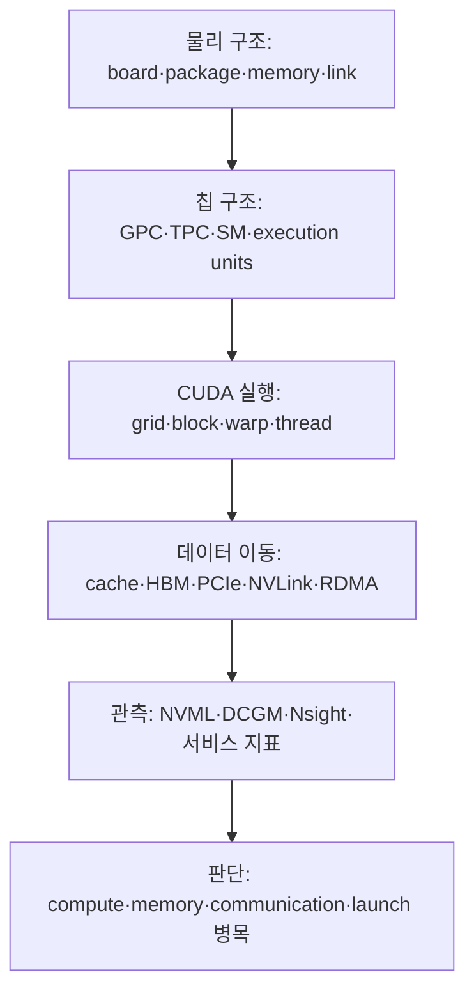

# GPU Architecture: 구조에서 LLM Serving 병목까지

작성일: 2026-08-18  
분류: `study/gpu-architecture`  
기준: NVIDIA CUDA GPU, 데이터센터 추론·학습·운영  
공식 자료 확인일: 2026-08-18

## 1. 이 학습 모듈의 목표

이 자료는 GPU 제품 스펙을 외우기 위한 문서가 아니다. 다음 질문에 스스로 답할 수 있는 구조적 이해를 만드는 것이 목표다.

1. GPU 보드와 칩 안에는 무엇이 있으며 서로 어떻게 연결되는가?
2. CUDA의 thread, warp, block은 실제 SM에서 어떻게 실행되는가?
3. tensor가 HBM에서 연산기로 이동하고 다시 저장될 때 어떤 경로를 지나는가?
4. Volta, Turing, Ampere, Ada, Hopper, Blackwell은 무엇이 달라졌는가?
5. H100, H200, L40S처럼 제품명이 다른 GPU의 차이를 어떤 기준으로 읽어야 하는가?
6. `GPU Util 100%`, `HBM 95% 사용`, `SM Active 60%`가 각각 무엇을 뜻하는가?
7. vLLM의 prefill, decode, TP, EP, KV cache 병목이 하드웨어 메트릭에 어떻게 나타나는가?
8. PCIe, NVLink, NVSwitch, RDMA, GDRDMA, InfiniBand, RoCE, NCCL은 어느 계층의 기술인가?
9. RDMA의 MR, QP, CQ, key와 one-sided operation은 실제로 어떻게 동작하는가?
10. ConnectX, BlueField, Quantum, Spectrum-X는 각각 어떤 하드웨어 역할을 맡는가?
11. GPU HBM에서 원격 GPU HBM까지 byte가 어떤 device와 switch를 거치는가?
12. `nccl-tests`의 latency, `algbw`, `busbw`와 HCA counter를 어떻게 함께 읽는가?



## 2. 권장 학습 순서

| 단계 | 문서 | 읽은 뒤 답할 수 있어야 하는 질문 |
|---:|---|---|
| 0 | [GPU를 보는 다섯 개의 축](00-mental-model-and-terms.md) | architecture, chip, SKU, form factor, system은 어떻게 다른가? |
| 1 | [보드에서 SM까지](01-physical-anatomy-and-hierarchy.md) | HBM, L2, SM, Tensor Core는 물리적으로 어떤 관계인가? |
| 2 | [CUDA 실행 모델과 SM](02-cuda-execution-model-and-sm.md) | kernel이 block과 warp로 나뉘어 실제 어디서 실행되는가? |
| 3 | [메모리와 데이터 이동](03-memory-and-data-movement.md) | PCIe, BAR1, DMA, NVLink, NVSwitch, GDRDMA는 각각 무슨 역할인가? |
| 4 | [NVIDIA 세대와 주요 GPU 비교](04-nvidia-architecture-generations.md) | A100, L40S, H100, H200, B200, B300은 왜 다른가? |
| 5 | [정밀도와 Tensor Core](05-numerical-precision-and-tensor-cores.md) | BF16, FP8, FP4 지원이 실제 성능 향상을 보장하지 않는 이유는 무엇인가? |
| 6 | [GPU 메트릭과 관측 도구](06-metrics-and-observability.md) | GPU Util, SM Active, Occupancy, DRAM Active를 어떻게 함께 읽는가? |
| 7 | [LLM Serving 병목 진단](07-llm-serving-bottleneck-diagnosis.md) | prefill·decode·TP·EP·KV cache 병목을 어떻게 구분하는가? |
| 8 | [실습과 검증 절차](08-hands-on-labs.md) | 실제 노드에서 구조를 확인하고 가설을 검증하는 최소 절차는 무엇인가? |
| 9 | [GPU 통신을 보는 지도](09-gpu-communication-mental-model.md) | DMA·RDMA·GDRDMA·fabric·collective의 계층을 어떻게 분리하는가? |
| 10 | [PCIe·NVLink·NVSwitch](10-pcie-nvlink-nvswitch.md) | GPU와 NIC가 노드 안에서 어떤 link·switch·root를 거치는가? |
| 11 | [RDMA와 GPUDirect RDMA](11-rdma-and-gpudirect-rdma.md) | verbs 객체와 NIC DMA가 GPU memory transfer를 어떻게 완성하는가? |
| 12 | [InfiniBand·RoCE와 GPU network 하드웨어](12-infiniband-roce-and-hardware.md) | IB/RoCE fabric과 ConnectX·BlueField·Quantum·Spectrum-X의 역할은 무엇인가? |
| 13 | [NCCL·집단통신·관측 실습](13-nccl-collectives-observability-labs.md) | collective의 실제 byte 수와 slow rank·link counter를 어떻게 연결하는가? |
| 부록 | [용어집](glossary.md) | 주요 원문 용어, 한국어 의미, 발음을 빠르게 찾을 수 있는가? |

GPU 자체 구조를 먼저 익힐 때는 0→8 순서로 읽는다. multi-GPU와 cluster 통신까지 이해하려면 이어서 9→13을 읽는다. 통신 장애를 조사할 때는 13의 현상에서 시작해 12→11→10 순서로 아래 계층을 격리한다.

## 3. 이 문서 전체를 관통하는 네 가지 구분

### 3.1 용량과 활동량은 다르다

- HBM 사용량 95%: 메모리 **용량**을 많이 할당했다.
- DRAM Active 80%: 관측 구간 중 메모리 장치가 **전송에 관여한 비율**이 높다.
- 4.8 TB/s: 제품이 제공하는 이론 또는 명시된 **대역폭 상한**이다.
- 실제 GB/s: workload가 달성한 **처리량**이다.

이 네 값을 같은 의미로 읽으면 GPU 진단이 거의 항상 틀어진다.

### 3.2 실행 중과 유효 연산 중은 다르다

`nvidia-smi`의 GPU utilization은 표본 구간에 kernel이 실행 중이었던 시간 비율이다. warp가 메모리를 기다리거나, 아주 작은 kernel이 끊임없이 실행돼도 높게 보일 수 있다. 따라서 GPU Util 100%는 Tensor Core 또는 SM 산술 파이프가 100% 성능을 냈다는 뜻이 아니다.

### 3.3 기능 지원과 실제 사용은 다르다

GPU가 FP8, NVLink, MIG를 지원해도 다음 조건이 맞지 않으면 효과가 없다.

- kernel과 library가 해당 명령을 실제 사용해야 한다.
- tensor shape, alignment, layout이 최적 경로에 맞아야 한다.
- 보드와 시스템 토폴로지가 그 인터커넥트를 실제 배선해야 한다.
- driver, CUDA, library, framework가 해당 compute capability를 지원해야 한다.
- 정확도 요구와 checkpoint 형식이 해당 정밀도를 허용해야 한다.

### 3.4 이론 peak와 운영 성능은 다르다

제품표의 peak FLOPS는 특정 정밀도, operand shape, clock, 때로는 structured sparsity를 전제로 한다. LLM 서비스의 token/s는 kernel 조합, batch, sequence length, cache hit, 통신, 스케줄링, CPU launch, 전력·열 상태가 함께 결정한다.

## 4. 성능을 보는 가장 작은 식

한 kernel의 성능 상한은 단순화하면 다음 둘 중 작은 쪽이다.

```math
P_{attainable}
=
\min\left(
P_{compute\ peak},
I \times B_{memory}
\right)
```

- $P_{compute\ peak}$: 해당 정밀도 연산기의 peak throughput
- $I$: arithmetic intensity, 이동한 byte당 수행한 연산 수
- $B_{memory}$: 사용한 메모리 계층의 달성 가능한 bandwidth

이것이 Roofline model의 핵심이다. 연산기를 더 빠르게 만들어도 매번 HBM에서 데이터를 가져와야 하는 workload는 메모리 지붕에 막힌다. 반대로 데이터 재사용이 충분한 큰 GEMM은 Tensor Core 계산 지붕에 가까워질 수 있다.

## 5. 자료의 범위와 경계

- 데이터센터 AI/HPC GPU를 중심으로 하며 graphics pipeline은 구조 이해에 필요한 정도만 다룬다.
- NVIDIA가 공개한 구조만 다룬다. 공개되지 않은 내부 배선이나 microarchitecture는 추측하지 않는다.
- Blackwell Ultra와 Vera Rubin 정보는 2026-08-18 공개 자료 기준이다. Rubin 수치는 preliminary이며 변경될 수 있다.
- 제품 스펙은 대표 form factor 기준이다. 같은 이름이라도 SXM, PCIe, NVL, OEM power setting에 따라 달라진다.
- 내부 인프라의 호스트명, 주소, 자산 수량, 조직명은 기록하지 않는다.

## 6. 공식 자료 읽는 순서

1. [CUDA Programming Guide](https://docs.nvidia.com/cuda/cuda-programming-guide/): 실행·메모리 모델의 기준
2. [CUDA Best Practices Guide](https://docs.nvidia.com/cuda/cuda-c-best-practices-guide/): 성능 원리와 최적화 기준
3. 세대별 tuning guide와 architecture whitepaper: 세대 특화 기능
4. 제품 페이지와 datasheet: SKU·form factor별 실제 스펙
5. [DCGM Documentation](https://docs.nvidia.com/datacenter/dcgm/latest/): 운영 관측과 진단
6. [Nsight Systems](https://docs.nvidia.com/nsight-systems/UserGuide/)와 [Nsight Compute](https://docs.nvidia.com/nsight-compute/ProfilingGuide/): timeline과 kernel 내부 분석
7. [GPUDirect RDMA Documentation](https://docs.nvidia.com/cuda/gpudirect-rdma/): GPU memory peer DMA와 pinning·BAR 기준
8. [NCCL User Guide](https://docs.nvidia.com/deeplearning/nccl/user-guide/docs/): collective, topology, transport와 진단 기준
9. NVIDIA Networking의 [InfiniBand Software Documentation](https://networking-docs.nvidia.com/): HCA, SM, QoS, fabric와 hardware 기준

> 이 모듈의 본질: GPU를 이해한다는 것은 코어 개수를 외우는 일이 아니라, **일이 어떻게 쪼개지고 데이터가 어디에 머물며 무엇을 기다리는지 설명할 수 있게 되는 것**이다.
