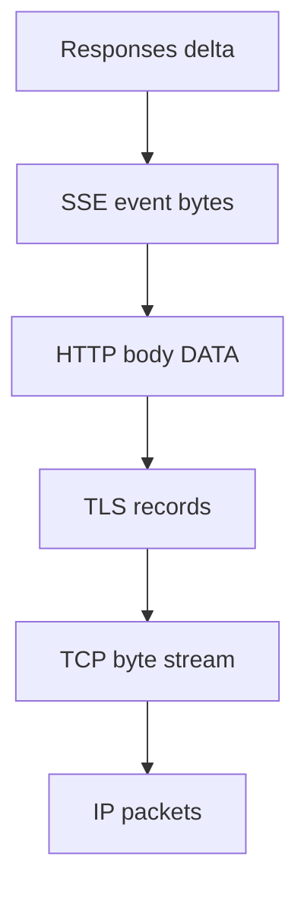

# Protocol Stack과 경계

업데이트: 2026-09-02

## 1. HTTP, SSE, WebSocket은 동급 개념이 아니다

| 이름 | 주된 계층/역할 | 경계 단위 | 방향성 | 연결과의 관계 |
|---|---|---|---|---|
| IP | network packet 전달 | IP packet | 양방향 | route 가능한 host/interface 사이 |
| TCP | reliable ordered byte stream | byte stream, segment는 구현 세부 | 양방향 | 4-tuple 기반 connection |
| QUIC | UDP 위 encrypted multiplexed transport | packet/frame/stream | 양방향 | HTTP/3 transport |
| TLS | 기밀성·무결성·peer authentication | TLS record | 양방향 | TCP 또는 QUIC과 결합 |
| HTTP | request/response semantics | HTTP message | request 후 response | H1은 보통 TCP, H2는 multiplexed TCP, H3는 QUIC |
| SSE | HTTP response body의 event text format | 빈 줄로 끝나는 event | server → client | 하나의 HTTP response를 오래 연다 |
| WebSocket | persistent message-oriented protocol | message/frame | full-duplex | HTTP handshake 후 WebSocket framing 사용 |
| Responses API | LLM application contract | response item/event | API에 따라 다름 | HTTP JSON, SSE, WebSocket에 실릴 수 있음 |

따라서 “HTTP냐 SSE냐 WebSocket이냐”라는 질문은 엄밀히는 다음 질문들의 묶음이다.

- HTTP request에 결과 JSON 하나를 담아 끝낼 것인가?
- 같은 HTTP response body를 열어 두고 SSE event를 연속 전송할 것인가?
- HTTP로 handshake한 뒤 WebSocket message channel로 전환할 것인가?

## 2. 같은 text가 여러 경계로 포장된다

예를 들어 application이 다음 SSE event를 만든다고 하자.

```text
event: response.output_text.delta
data: {"delta":"hello"}

```

wire에서는 이 event가 다음처럼 전달될 수 있다.



중요한 불변식은 **상위 계층의 경계가 하위 계층의 경계와 일치할 필요가 없다는 것**이다.

- SSE event 하나가 여러 HTTP/2 DATA frame 또는 TCP read로 쪼개질 수 있다.
- 여러 SSE event가 한 번의 socket read에서 함께 도착할 수 있다.
- TLS record, TCP segment, IP packet 크기는 LLM token이나 JSON object와 무관하다.
- proxy buffering, compression, coalescing은 flush 시점과 chunk shape를 바꿀 수 있다.

client parser는 `read()` 한 번을 event 하나로 해석해서는 안 된다. byte를 누적하고 상위 protocol delimiter/framing을 기준으로 복원해야 한다.

## 3. “온라인 호출” 안에도 세 종류의 수명이 있다

### 3.1 Connection lifetime

TCP/QUIC/WebSocket connection이 살아 있는 기간이다. HTTP keep-alive에서는 여러 HTTP request가 같은 TCP connection을 재사용한다.

### 3.2 Request lifetime

HTTP request 하나가 시작되어 response가 완료될 때까지다. non-stream은 response body를 한 번에 소비하는 것처럼 보이고, SSE는 같은 response가 수초~수분 열려 있을 수 있다.

### 3.3 Application operation lifetime

model generation, tool 실행, background job, conversation turn 같은 논리 작업의 수명이다. client connection이 끊겨도 server 작업이 계속될 수 있고, 반대로 connection은 살아 있어도 operation 하나는 이미 끝났을 수 있다.

| 사건 | connection | HTTP request | application operation |
|---|---|---|---|
| non-stream response 완료 | 재사용 가능 | 완료 | 보통 완료 |
| SSE terminal event | 재사용 또는 종료 | 완료 | 보통 완료 |
| client가 SSE 중 disconnect | 끊김/재연결 | 중단 | 취소될 수도, 계속될 수도 있음 |
| WebSocket turn 완료 | 계속 유지 가능 | handshake는 과거에 완료 | turn만 완료 |
| tool side effect 후 network loss | 불명 | client 관점 실패 | side effect는 이미 완료됐을 수 있음 |

이 구분 때문에 network timeout을 곧바로 operation 실패로 간주하고 POST 전체를 재시도하면 중복 tool 실행이 가능하다.

## 4. 주소와 identity도 층마다 다르다

| 계층 | 예시 identity | 사용 목적 |
|---|---|---|
| L3/L4 | source/destination IP, port, protocol | connection routing, conntrack |
| TLS | SNI, certificate identity | TLS endpoint 선택·검증 |
| HTTP | authority/Host, method, path, header | virtual host와 L7 route |
| API | model, response ID, conversation ID | model·state·application routing |
| LLM runtime | engine ID, Pod UID, KV block location | replica/cache-aware routing |

`previous_response_id`를 처리할 수 있다는 사실은 올바른 vLLM Pod를 고르는 능력과 다르다. state identity는 Agentic tier가 resolve하고, model/engine identity는 routing tier가 별도로 다룬다.

## 5. 판단 원칙

1. **semantic boundary**와 **transport boundary**를 분리한다.
2. timeout, retry, load balancing 정책은 endpoint 이름만이 아니라 connection/request/operation 수명을 기준으로 설계한다.
3. L4는 encrypted HTTP body를 볼 수 없고, 일반 L7 Gateway도 JSON body의 LLM 의미를 자동 이해하지 않는다.
4. stream parser는 arbitrary fragmentation/coalescing을 견뎌야 한다.
5. long-lived connection이 load balancing, rollout, drain에 미치는 영향을 별도로 검증한다.

공식 기준은 [HTTP Semantics RFC 9110](https://www.rfc-editor.org/rfc/rfc9110.html), [HTTP/1.1 RFC 9112](https://www.rfc-editor.org/rfc/rfc9112.html), [HTTP/2 RFC 9113](https://www.rfc-editor.org/rfc/rfc9113.html), [HTTP/3 RFC 9114](https://www.rfc-editor.org/rfc/rfc9114.html), [WebSocket RFC 6455](https://www.rfc-editor.org/rfc/rfc6455.html)을 따른다.
