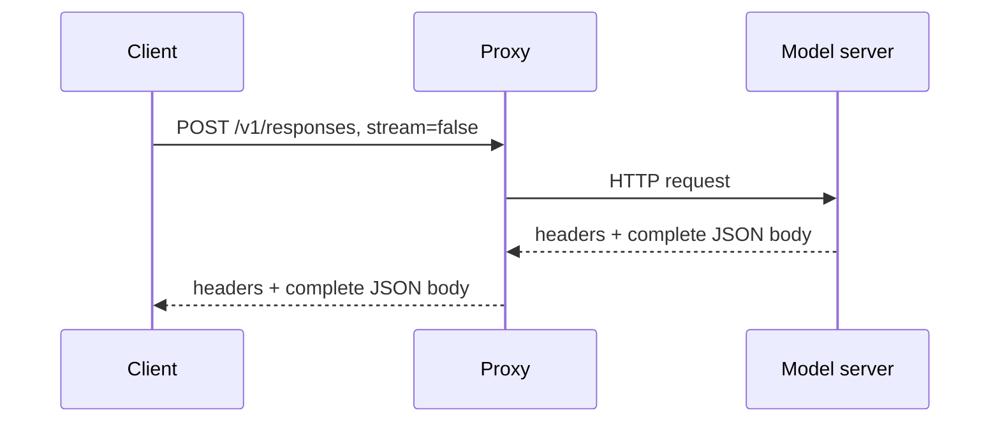
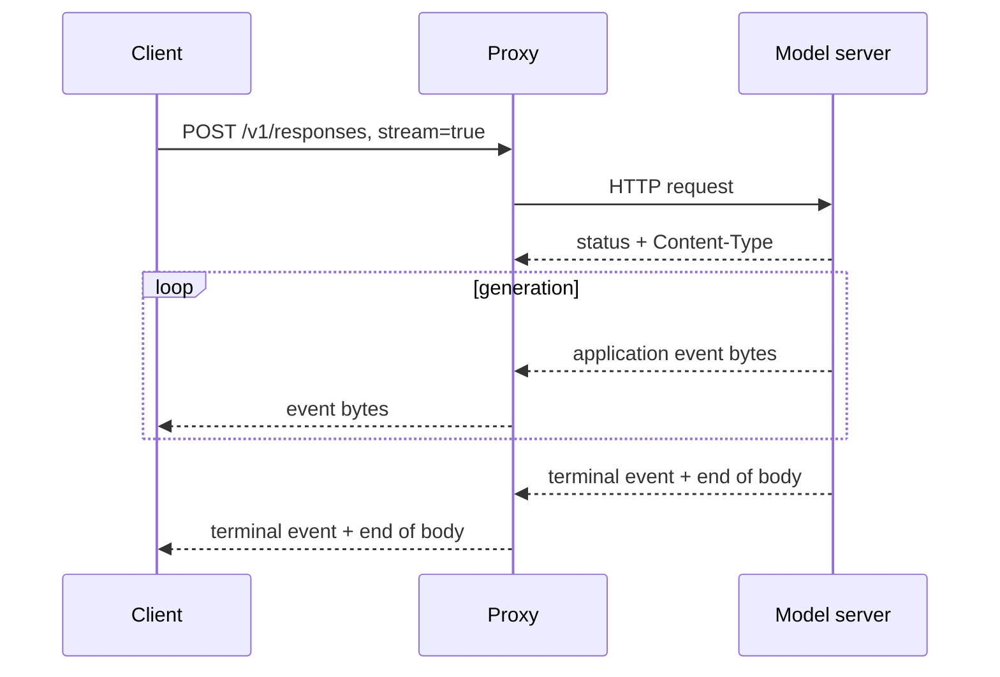

# HTTP Request/Response와 Streaming

업데이트: 2026-09-02

## 1. HTTP의 기본 semantic

HTTP는 client가 request message를 보내고 server가 response message를 반환하는 application protocol이다. request와 response는 각각 start-line/pseudo-header, header fields, 선택적인 content로 구성된다. HTTP 자체는 stateless semantic이지만, authentication cookie, response ID, application DB가 상태를 추가할 수 있다.

`stream=false`와 `stream=true` 모두 보통 **HTTP request 하나와 HTTP response 하나**다. 차이는 response content를 언제, 어떤 application framing으로 노출하는가에 있다.

## 2. LLM non-streaming flow



model server 내부에서는 token이 점진적으로 생성돼도 client에게는 terminal JSON object만 보인다. 이때도 response bytes는 network에서 여러 frame/segment로 나뉠 수 있다. “non-stream”은 physical packet이 하나라는 뜻이 아니라 **application이 partial result를 public contract로 노출하지 않는다는 뜻**이다.

### latency

- TTFT는 client-visible metric이 되기 어렵고 전체 response latency에 포함된다.
- client는 첫 semantic output을 generation 완료 뒤에 받는다.
- proxy는 body size 제한, buffering, JSON parsing/rewriting을 적용하기 쉽다.

## 3. LLM HTTP streaming flow



response status/header는 보통 한 번 전송되고 response body가 열린 채로 유지된다. server는 생성 중간 결과를 SSE 같은 application format으로 flush한다.

### HTTP version별 운반 방식

| HTTP version | body 전달 | multiplexing | streaming 주의점 |
|---|---|---|---|
| HTTP/1.1 | Content-Length를 모르거나 점진 전송이면 chunked transfer coding 또는 connection close | connection당 직렬화가 기본 | proxy buffering, head-of-line, connection pool 영향 |
| HTTP/2 | DATA frame이 stream ID별로 전달 | 한 TCP connection에 여러 HTTP stream | TCP loss가 connection의 여러 stream에 영향, flow control 존재 |
| HTTP/3 | QUIC stream frame | QUIC stream별 multiplexing | transport-level stream independence가 개선되지만 application retry는 별도 |

SSE는 HTTP/1.1 chunked transfer coding과 동의어가 아니다. HTTP/2/3에서도 SSE media format을 사용할 수 있고, H2/H3에는 H1의 `Transfer-Encoding: chunked`가 없다.

## 4. 네 개의 chunk를 구분한다

| 흔히 “chunk”라 부르는 것 | 실제 의미 | 누가 경계를 결정하는가? |
|---|---|---|
| LLM delta | text/reasoning/tool argument의 application increment | model serving/API implementation |
| SSE event | `event:`/`data:` lines와 빈 줄 delimiter | SSE encoder |
| HTTP/1.1 chunk | transfer coding의 hex length-prefixed block | HTTP server/proxy |
| socket/TCP read chunk | 현재 read buffer에 도착한 byte 묶음 | kernel, TLS, runtime, network timing |

이들은 1:1이 아니다. 다음 모두 정상이다.

- delta 하나의 JSON이 두 번의 socket read에 나뉜다.
- SSE event 세 개가 한 번에 read된다.
- proxy가 upstream event를 잠시 모아 큰 HTTP DATA frame으로 보낸다.
- tool-call JSON arguments가 여러 semantic delta에 걸쳐 도착한다.

## 5. Persistent connection과 load balancing

HTTP/1.1 keep-alive client가 proxy/Service에 connection 하나를 열고 request 100개를 순차 전송하면 L4 load balancer 관점에서는 **flow 하나**다. HTTP/2는 request 100개를 한 TCP connection의 서로 다른 stream으로 동시에 보낼 수도 있다.

따라서 Kubernetes Service가 `sessionAffinity: None`이어도 다음 현상이 가능하다.

```text
100 HTTP requests
  -> 1 persistent TCP connection
  -> kube-proxy backend selection 1회
  -> same Pod
```

`sessionAffinity: None`은 새 connection마다 ClientIP sticky rule을 만들지 않는다는 뜻이지, HTTP request마다 다른 Pod를 고른다는 뜻이 아니다.

## 6. Backpressure와 flow control

client가 느리면 byte가 다음 계층에 누적된다.

```text
application queue
  -> HTTP runtime buffer
  -> TLS/socket send buffer
  -> proxy buffer
  -> TCP/QUIC flow control
  -> client receive/parser queue
```

무제한 queue는 memory 증가와 늦은 취소 감지를 만든다. 측정해야 할 항목은 다음과 같다.

- upstream generation rate와 downstream consumption rate
- per-connection buffered bytes
- write/flush latency
- disconnect 전달 시간
- HTTP/2 connection/stream flow-control stall
- proxy high-water mark와 maximum response duration

## 7. Timeout을 하나로 두면 안 되는 이유

| timeout | 보호 대상 | LLM에서의 의미 |
|---|---|---|
| connect timeout | backend 연결 실패 | unavailable Pod/route 빠른 실패 |
| request header timeout | 느리거나 비정상 client | request 수신 보호 |
| upstream response-header timeout | TTFT 전 무응답 | queue + prefill을 고려해야 함 |
| idle/read timeout | byte가 오지 않는 구간 | reasoning/prefill이 길면 false timeout 가능 |
| total request timeout | 전체 resource 점유 | long generation/background와 충돌 |
| drain timeout | rollout 시 기존 connection | SSE/WS를 얼마나 기다릴지 결정 |

SSE/WS에는 일반 REST endpoint보다 긴 idle/drain 정책 또는 heartbeat가 필요할 수 있다. 반면 무한 timeout은 zombie connection과 자원 누수를 감춘다.

## 8. Retry와 idempotency

HTTP connection이 끊겼다는 사실만으로 server operation이 실행되지 않았다고 판단할 수 없다.

```text
POST /v1/responses
  -> model output
  -> tool side effect
  -> state commit
  -> response bytes 일부 전송
  -> connection loss
```

outer proxy가 POST 전체를 blind retry하면 tool 또는 state transition이 중복될 수 있다. 안전한 정책은 다음을 구분한다.

1. request bytes를 upstream에 전혀 보내기 전 connect failure
2. upstream이 request를 받았지만 response header 전 disconnect
3. SSE event 일부를 client가 받은 뒤 disconnect
4. tool side effect 또는 state commit 여부를 확인할 수 있는 경우

stateful/agentic endpoint는 idempotency key, operation status 조회, explicit resume/cancel 같은 application contract 없이 자동 replay하지 않는다.

## 9. Proxy 검증 체크리스트

- `Content-Type`, status, error body, request ID를 보존하는가?
- SSE buffering과 response compression이 latency/event parsing에 미치는 영향은?
- upstream disconnect가 downstream terminal error로 어떻게 보이는가?
- downstream disconnect가 upstream cancel로 전달되는가?
- `Connection`, `Transfer-Encoding` 같은 hop-by-hop header를 올바르게 처리하는가?
- HTTP/1.1과 HTTP/2 각각 connection pool 분산은 어떤가?
- retry가 path/method/partial-response 상태별로 분리됐는가?
- large reconstructed body와 large tool schema의 request size limit은 충분한가?
